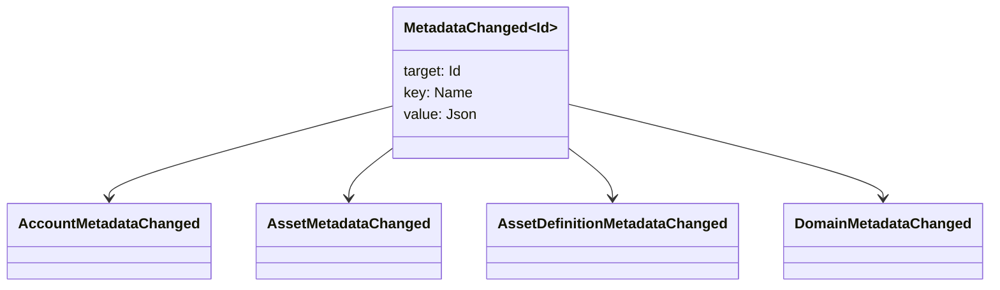

# Metama’lumotlar {#metadata}

Metama’lumot — reyestr obyektiga biriktiriladigan tekshirilgan kalit-qiymat xaritasi. Kalitlar `Name` qiymatlari, qiymatlar esa JSON (`Json`) foydali yuklaridir.

Quyidagi obyektlar metama’lumot olib yurishi mumkin:

- domenlar
- hisoblar
- aktivlar
- aktiv ta’riflari
- NFTs
- RWAs
- triggerlar
- tranzaksiyalar

Reyestr holatida saqlanishi lozim bo‘lgan kichik tavsifiy yoki indekslash maydonlari uchun metama’lumotdan foydalaning. Katta foydali yuklarni WSV tashqarisida saqlang va ularga dayjest, URI yoki SoraFS yo‘li orqali murojaat qiling.

Metama’lumotlar, aktivlar, NFTs, RWAs yoki zanjirdan tashqari saqlash usulini tanlash bo‘yicha [Metama’lumotlar va reyestrda saqlash variantlari](/uz/guide/configure/metadata-and-store-assets.md) bo‘limiga qarang.

## Taira da sinab ko‘rish {#try-it-on-taira}

Metama’lumotlar odatiy resurs o‘qishlarida ko‘rinadi. Bu buyruq hozir metama’lumotga ega Taira aktiv ta’riflarini sanaydi:

```bash
curl -fsS 'https://taira.sora.org/v1/assets/definitions?limit=100' \
  | jq '.items[]
    | select((.metadata | length) > 0)
    | {id, name, metadata}'
```

Domenlar va hisoblar uchun ayni usuldan foydalaning:

```bash
curl -fsS 'https://taira.sora.org/v1/domains?limit=20' \
  | jq '.items[] | select((.metadata // {} | length) > 0)'

curl -fsS 'https://taira.sora.org/v1/accounts?limit=20' \
  | jq '.items[] | select((.metadata // {} | length) > 0)'
```

Bo‘sh natijani yaroqli deb hisoblang. Bu Taira obyektlarining joriy sahifasida metama’lumot yo‘qligini bildiradi, so‘nggi nuqta ishlamaganini emas.

## Metama’lumotlarni yangilash {#updating-metadata}

Metama’lumotlar Iroha maxsus ko‘rsatmalari bilan o‘zgartiriladi:

- [`SetKeyValue`](/uz/blockchain/instructions.md#setkeyvalue-removekeyvalue) kalitni kiritadi yoki almashtiradi
- [`RemoveKeyValue`](/uz/blockchain/instructions.md#setkeyvalue-removekeyvalue) kalitni olib tashlaydi

Tranzaksiyani yuborayotgan vakolat faol bajarish muhiti tekshiruvchisi talab qiladigan ruxsatga ega bo‘lishi shart. Standart ruxsatlar interfeysi uchun [Ruxsat tokenlari](/uz/reference/permissions.md) bo‘limiga qarang.

## Hodisalar {#events}

Metama’lumot o‘zgarganda ma’lumotlar hodisasi chiqariladi. Umumiy hodisa foydali yuki — `MetadataChanged<Id>`:



Integratsiya uchun muhim obyekt turi yoki identifikatoriga oid metama’lumot hodisalarigagina obuna bo‘lish uchun [ma’lumotlar hodisasi filtrlaridan](/uz/blockchain/filters.md#data-event-filters) foydalaning.

## So'rovlar {#queries}

Metama’lumotlar so‘ralgan obyektning bir qismi sifatida qaytariladi. Masalan, [`FindAccountById`](/uz/reference/queries.md#accounts-and-permissions), [`FindDomainById`](/uz/reference/queries.md#domains-and-peers) yoki [`FindAssetDefinitionById`](/uz/reference/queries.md#assets-nfts-and-rwas) dan foydalaning. NFTs uchun [`FindNfts`](/uz/reference/queries.md#assets-nfts-and-rwas) yoki [`FindNftsByAccountId`](/uz/reference/queries.md#assets-nfts-and-rwas), RWA partiyalari uchun esa [`FindRwas`](/uz/reference/queries.md#assets-nfts-and-rwas) dan foydalaning. Keyin obyektning metama’lumot maydonini o‘qing. NFT so‘rovi javoblari NFT `content` xaritasini yozuv metama’lumoti sifatida ko‘rsatadi.

Metama’lumot kalitlari reyestr holatining bir qismidir. Ularni barqaror saqlang; versiyani JSON qiymatining o‘zida aniq ko‘rsatish mumkin bo‘lsa, ilovaga xos versiya almashishini kalit nomiga kodlamang.
