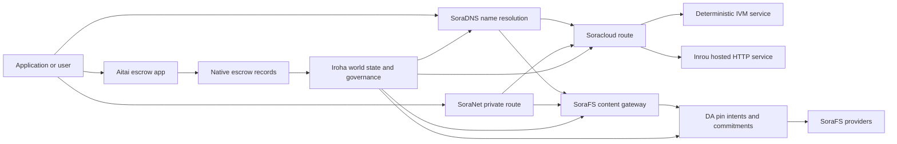

# SORA Nexus Xizmat {#sora-nexus-services}

SORA Nexus atrofdagi xizmat samolyotlarini qo'shadi Iroha 3. Ushbu xizmatlar
ular alohida hisobotlar emas, balki Iroha jahon davlat, Norito
manifestlar, boshqaruv yozuvlari va Torii yo'nalish oilalari.

Foydalanish nod qurilishi va tarmoq profilidan bog'liq.
[`/openapi`](/uz/reference/torii-endpoints.md#app-and-sora-route-families) to ' g'risida
yo'nalishlarning vakolatli ro'yxati sifatida maqsadli nod.

## Komponentlar xaritasi {#component-map}

| Komponent              | O'rin                                                                                                                                        | Asosiy yuzalar                                                                            |
| ---------------------- | ------------------------------------------------------------------------------------------------------------------------------------------- | ---------------------------------------------------------------------------------------- |
| Soracloud              | Dasturlarni ishga tushirish, uyushtirilgan xizmatlar, xususiy model / ish vaqti holati va xizmatning hayot davri nazoratini.                                        | `/v1/soracloud/*`, `/api/*`, `iroha app soracloud ...`                                   |
| Inrou                  | Soracloud uyushtirilgan HTTP xizmatlarni qayta ko'rib chiqish uchun jonli vaqt HTTP samolyot.                                                            | Soracloud ishga tushirish vaqti konfiguratsiyasi, xost imkoniyatlari e'lonlari, replika ishga tushirish vaqt holati                 |
| SoraNet                | Dasturlar uchun maxfiylik va transport qoplamalari, relay harakatlanishi, VPN, O'tirishlarni ulash va yo'nalishlarni tarqating.                                     | `/v1/connect/*`, `/v1/vpn/*`, SoraNet yo'nalish metadatalari                                     |
| Ma'lumotlar mavjudligi (DA) | O'z ichiga oluvchi yuklar uchun mavjudlik, majburiyat va maqsad qatlamlari; Nexus yo'llar, SoraFS ko'rinadi va dalillar oqib boradi. | `/v1/da/*`, `FindDaPinIntent*`, `[sumeragi.da]`                                          |
| SoraFS                 | Manifestolar uchun tarkibiy manzillarga ega saqlash matolari, CAR faydali yuklar, to'xtatilgan tarkib, darvozalarni olib tashlash va qayta tiklanishi mumkinligini tasdiqlash oqimlari.           | `/v1/sorafs/*`, `/sorafs/*`, `FindSorafsProviderOwner`                                   |
| SoraDNS                | Deterministik nomlashtirish va resolver-atestatsiya qatlamlari SORA-xosting qilinadigan xizmatlar va tarkib.                                                   | `/v1/soradns/*`, `/soradns/*`, resolver direktoriyasi hodisalari                                 |
| Aitai                  | Foydalanuvchi darajasidagi fiat va aktivlar to'lovlari koridori, alohida hisob qaydnomadan emas, balki mahalliy depozit hujjatlari bilan ta'minlanadi.                                     | `OpenAssetEscrow`, `FindAssetEscrow*`, `EscrowEventFilter`, Kotodama `escrow_*` qurilmalar |



## Oddiy oqimlar {#common-flows}

### Oʻzaro aloqasi {#hosted-split-application}

Oddiy qarama-qarshi dastur barcha qismlarni birgalikda ishlatadi:

1. Statik frontend aktivlari toʻplanadi va oʻtkazib yuboriladi SoraFS.
2. Masalan, ommaviy uy egasi `<app>.sora`, ro'yxatdan o'tgan
   SoraDNS.
3. Soracloud yo'nalishlar `/api/v1/search` yoki `/api/v1/stream` Inrouga HTTP
   xizmat ko'rsatish.
4. Soracloud yo'nalishlar `/api/auth` va `/api/v1/user` deterministik IVM
   ishchilar.
5. Maxfiylikka muhtoj mijozlar bir xil tarkibga yoki API yo'nalish
   a orqali SoraNet aylanmasi.

| Yoʻl              | Tushkun samolyot         | Nima uchun ?                                               |
| ----------------- | --------------------- | ------------------------------------------------- |
| `/`               | SoraFS statik tarkib | Tekislanadigan tarkibning ildiz va darvozalar saqlanishi     |
| `/assets/*`       | SoraFS statik tarkib | tarkibiy manzilga ega bo'lgan aktivlar va ochiq dalillar      |
| `/api/auth*`      | Soracloud IVM         | Qayta oʻynash xavfsizligi va portfeli muammosi holati       |
| `/api/v1/user*`   | Soracloud IVM         | Boshqaruvga taalluqli davlat mutatsiyalari              |
| `/api/v1/search*` | Soracloud Inrou       | Hayotda HTTP xizmat ko'rsatish, oldindan saqlash; SSE, yoki to'lovchi davlat |

### Mundarija nashriyot {#content-publication}

SoraFS nashrlarga nom ko'rsatilmaguncha uzoq muddatli artefaktlarni ishlab chiqaradi:

1. Faydali yuk yoki direktoriyani yaratish.
2. Uni bir CAR arxiv va qismlar rejasi.
3. Oʻrnatish Norito "Pin" siyosati va boshqaruv ma'lumotlari bilan manifest.
4. Manifestoni Torii.
5. A-ni yozib oling DA maqsadga erishish uchun belgilangan maqsadda yoki mavjudlik majburiyati
   profil aniq dalillarni talab qiladi.
6. Manifesti a bilan bog'lash SoraDNS nom yoki Soracloud statik oldingi yo'nalish.

### Xususiy transport yoki yo'nalish {#private-fetch-or-streaming-route}

SoraNet oldinda o'tirib SoraFS yoki Soracloud:

1. Mijoz nom yoki manifestni hal qiladi.
2. Qo'riqchi direktoriyasi yoki yo'nalish manifestida kirish va chiqish relaylari tanlanadi.
3. Yo'l-yo'l toʻplanib, yo ' nalish orqali yuboriladi. SoraNet aylanmasi.
4. Chiqish relaylari SoraFS darvoza, Torii oqim yoki Soracloud
   yo'nalish.

## Aitai {#aitai}

Aitai SORA bozor uslubidagi kelishuvlar uchun dastur koridori
xaridor va sotuvchi o'zaro aloqadan tashqari to'lovni muvofiqlashtiradi, Iroha nazorat qiladi
zanjirdagi aktivlarni saqlab qolish.
yangi raqamli aktivlar uchun kontraktga egalik qiluvchi depozit hisob raqami o'rniga
oqib ketadi.

Asosiy garovda katta qog'ozlar saqlanadi. Sotuvchi
`OpenAssetEscrow`, xaridor ro'yxatdan o'tmagan to'lovni qabul qiladi va belgilaydi
`AcceptAssetEscrow` va `MarkEscrowPaymentSent`, va sotuvchi
bilan `ReleaseAssetEscrow` yoki to'lov belgilab qo'yilganidan oldin bekor qiladi.
sotuvchi rozi bo'lmasa, har bir taraf nizo ochishi va hal qiluvchisi bilan
`CanResolveEscrowDispute` cheklangan miqdorni bo'lish mumkin.

To'liq hayot davri uchun, umumiy aktivlar qulflari, anonim depozit, so'rovlar,
hodisalar va Rust misollar, qarang
[Asosiy aktivlar eskorovi](/uz/blockchain/escrow.md).

| Aitai yuzi                                                                                                                                                 | Undan foydalanish                                                                                |
| ------------------------------------------------------------------------------------------------------------------------------------------------------------- | ----------------------------------------------------------------------------------------- |
| `OpenAssetEscrow`, `AcceptAssetEscrow`, `MarkEscrowPaymentSent`, `ReleaseAssetEscrow`, `CancelAssetEscrow`                                                    | Transparent raqamli aktivlar takliflari, shu jumladan XOR-nominal qaror chiqarish oqimlari.             |
| `OpenAnonymousAssetEscrow`, `AcceptAnonymousAssetEscrow`, `MarkAnonymousEscrowPaymentSent`, `ReleaseAnonymousAssetEscrow`, `CancelAnonymousAssetEscrow`       | Moliyalashtirish va yakunlash harakatlari dalillar bilan bog'liq bo'lgan himoyalangan takliflar. |
| `OpenEscrowDispute`, `ResolveEscrowDispute`, `OpenAnonymousEscrowDispute`, `ResolveAnonymousEscrowDispute`                                                    | nizolarni hal etish va sud usulidagi hal qilish.                                                 |
| `FindAssetEscrowById`, `FindAssetEscrowsBySeller`, `FindAssetEscrowsByBuyer`, `FindAssetEscrowsByStatus`                                                      | Ilovalar holati sahifalari, kelishuv ishlari va qo'llab-quvvatlash vositasi.                               |
| `EscrowEventFilter`                                                                                                                                           | O'z navbatida, o'zingizning hisobingiz bilan ko'rishingiz mumkin. |
| Kotodama `escrow_open_offer`, `escrow_accept`, `escrow_mark_payment_sent`, `escrow_release`, `escrow_cancel`, `escrow_open_dispute`, `escrow_resolve_dispute` | Kotodama kontrakt qo'ng'iroqlari V1 Syscall-ni depozitga olish.                                 |

Jamoat uchun Taira yoki Minamoto foydalanish, zanjirdan tashqaridagi to'lov temir yo'nalishini davolash va
ariza siyosati sifatida har qanday qo'llab-quvvatlash yoki sud ish oqimi. Iroha yozuvlar
saqlov holati, hayot davri hodisalari, dalillar hashlari va oxirgi aktivlarning harakatlanishi;
u o'z-o'zi fiat to'lovlarini tekshirmaydi.

## Maqsad noti tekshirib koʻring {#check-a-target-node}

Ushbu sahifadagi misollardan foydalanishdan oldin yo'nalish oilasi mavjudligini tasdiqlang
nishonlayotgan nodda:

```bash
export TORII_URL=https://taira.sora.org

curl -fsS "$TORII_URL/openapi.json" \
  | jq '.paths | keys[] | select(test("^/v1/(soracloud|sorafs|soradns|connect|vpn|da)/"))'

curl -fsS "$TORII_URL/status" | jq .
```

Agar `/openapi.json` profil tomonidan ko'rsatilmagan, sinab ko'ring `/openapi`. Toʻgʻri
Yo'nalishning mavjudligi qurilish xususiyatlariga va tarmoq konfiguratsiyasiga bog'liq.

### Taira Faqatgina oʻqish uchun cheklar {#taira-read-only-smoke-checks}

Jamoat Taira oxirgi nuqta o'qish tomonini tekshirish uchun foydali, ammo undan foydalanmang
mutatsiya qiluvchi misollar uchun , agar siz vakolatli hisob qaydnomangizni ishlatmasangiz va
jonli holatni o'zgartirish niyatida.

```bash
export TORII_URL=https://taira.sora.org

curl -fsS "$TORII_URL/status" \
  | jq '{version: .build.version, peers, blocks, lanes: (.teu_lane_commit | length)}'

curl -fsS "$TORII_URL/v1/connect/status" | jq '{enabled, sessions_active}'

curl -fsS "$TORII_URL/v1/vpn/profile" \
  | jq '{available, relay_endpoint, supported_exit_classes}'

curl -fsS "$TORII_URL/v1/sorafs/storage/state" \
  | jq '{bytes_capacity, bytes_used, pin_queue_depth, por_inflight}'

curl -fsS -H 'Accept: application/json' "$TORII_URL/v1/soracloud/status" \
  | jq '.control_plane | {service_count, services: [.services[] | {service_name, current_version}]}'
```

Taira joylashtirish uchun maxsus boshqaruv samolyotlari yo'nalishlarini ko'rsatishi mumkin, ular
ro'yxatga olingan OpenAPI Yo'l xaritasi. `/openapi` ishlab chiqarilgan birinchi
API shartnoma tuzish, so'ngra ishga tushirishga doir har qanday yo'nalishni to'g'ridan-to'g'ri tasdiqlash
uni jonli ravishda hujjatlashtirish.

## Soracloud {#soracloud}

Soracloud bu SORA qo'llanma boshqaruv tekisligi.
paketlar, xizmatlarni qayta ko'rib chiqish, yo'naltirish, ishga tushirish holati, vakolatli konfiguratsiya
yozuvlar, shifrlangan xizmat sirlari, model reyestr hujjatlari, xususiy
xulosalar yig'ilishlari va ish vaqti bilan qabul qilingan hujjatlar.

Soracloud ikki ta'sirchan samolyotdan foydalanadi:

| O'tkazib yuborish rejasi        | Ish vaqti | Undan foydalanish                                                                                   |
| ---------------------- | ------- | -------------------------------------------------------------------------------------------- |
| `DeterministicService` | `Ivm`   | Muallif, ombor holati, sertifikatlangan o'qishlar, pochta qutisi boshqaruvchilari, boshqaruvga qodir mutatsiyalar |
| `HttpService`          | `Inrou` | Hayotda HTTP APIs, ko'pchilik bilan ishlash, oldindan saqlanadigan xizmatlar; SSE, brauzer yordamida oqimlar     |

Boshqaruv samolyotining ta'siri yuqori.
maxfiy, model va holat buyruqlari orqali yuborish Torii va o'qishni amalga oshiradi
xalqaro davlat; ular alohida davlatga tayanmaydilar CLI- Mahalliy ko'zgu.
yo'nalish eng uzun prefiksga asoslangan, shuning uchun bitta ro'yxatdan o'tgan uy egasi trafikni bo'linishi mumkin
uylanuvchilar o'rtasida HTTP yo'nalishlar va deterministik API yo'nalishlar.

### Oʻzgartirilgan dasturni joylashtiring {#scaffold-a-split-app}

Sharqlashtirilgan dastur namunalari statik frontendni va bir jonli uyushtirilgan API
va bir deterministik qopqoq/API xizmat:

```bash
iroha app soracloud app init \
  --template split-app \
  --app-name solswap_indexer \
  --app-version 0.1.0 \
  --public-host solswap-indexer.sora \
  --output-dir ./apps/solswap-indexer

iroha app soracloud app local-plan \
  --manifest ./apps/solswap-indexer/app_manifest.json

iroha app soracloud app doctor \
  --manifest ./apps/solswap-indexer/app_manifest.json
```

`local-plan` yo'nalish bo'linishi, bolalarga xizmat ko'rsatish manifestlari, ish maydonini bosib chiqaradi
skript yo'nalishlari va kutilayotgan frontend nashr usuli. `doctor`
siz ishtirok etishdan oldin mahalliy ozodlik shartnomasini tasdiqlaydi Torii.

### Dasturni ishga tushirish va tekshirish holati {#deploy-and-inspect-app-state}

```bash
export SORACLOUD_TORII_URL=https://<soracloud-enabled-torii>

iroha app soracloud app deploy \
  --manifest ./apps/solswap-indexer/app_manifest.json \
  --torii-url "$SORACLOUD_TORII_URL"

iroha app soracloud app status \
  --manifest ./apps/solswap-indexer/app_manifest.json \
  --torii-url "$SORACLOUD_TORII_URL"
```

Ishlab chiqarilgan xizmat uchun xizmat ko'rsatkichlari bo'yicha buyruqlardan foydalaning:

```bash
iroha app soracloud status \
  --service-name solswap_indexer_live \
  --torii-url "$SORACLOUD_TORII_URL"

iroha app soracloud rollback \
  --service-name solswap_indexer_live \
  --target-version 0.1.0 \
  --torii-url "$SORACLOUD_TORII_URL"
```

### Sirli va sirli materiallar {#config-and-secret-material}

Soracloud konfig va sirli yozuvlar vakolatli joylashtirishning bir qismi hisoblanadi
O'rnatish, yangilash va qaytish kerak bo'lganda yopilmaydi
sirli bog'lanishlar mavjud emas yoki faol manifestlar bilan mos kelmaydi.

```bash
iroha app soracloud config-set \
  --service-name solswap_indexer_live \
  --config-name indexer/public_config \
  --value-file ./config/public-config.json \
  --torii-url "$SORACLOUD_TORII_URL"

iroha app soracloud secret-set \
  --service-name solswap_indexer_live \
  --secret-name indexer/api_key \
  --secret-file ./secrets/api-key.envelope.json \
  --torii-url "$SORACLOUD_TORII_URL"
```

Foydalanish CLI profilingiz uchun talab qilingan aniq ma'lumot belgilari uchun yordam:

```bash
iroha app soracloud config-set --help
iroha app soracloud secret-set --help
```

## Inrou {#inrou}

Inrou - uy egasi HTTP ishlatiladigan ish vaqti Soracloud. Oʻzbekiston Respublikasi Iroha toʻplam bilan
o'rnatilgan Soracloud Ish vaqti loyihalari qabul qilindi Soracloud davlat tomonidan mahalliy
materiallashtirish rejasi, loopback sifatida berilgan xosting-xizmat nusxalarini boshlaydi
xizmatlarini, va hisobotlar replika ishga tushirish vaqti davlatga qaytish
model.

Toʻgʻridan-toʻgʻri ish yuklari uchun Inroudan foydalaning HTTP yuzasi, masalan:
to'plamchilar uchun og'ir APIs, SSE oqimlar, oldindan saqlangan boshqaruvchilar yoki
brauzer yordamidagi xizmatlar.

### Ish vaqti talablari {#runtime-requirements}

- Konteyner manifisti ishga tushirish vaqti `Inrou`.
- Xizmat manifesini bajarish samolyotlari `HttpService`.
- `HttpService + Inrou` aynan bitta talab qiladi `PersistentRootLeaseVolume`
  ustida o'rnatilgan `/`.
- Inrou-ning takrorlangan xizmatlari ham umumiy xizmat yoki maxfiy ijara shartnomasiga muhtoj
  saqlanishda o'zgaruvchan umumiy holatni saqlab qolganda.
- Ishlab chiqarish xosting nodlari real Inrou quvvat reklama qilish kerak
  faqat nomzod sifatida ishlaydi.

### Koʻrinib turgan parchalari {#manifest-fragment}

Quyidagi misol ikki manifestning shaklini ko'rsatadi.
to'liq ishga tushirish to'plami emas.

```jsonc
// container_manifest.json
{
  "schema_version": 1,
  "runtime": { "runtime": "Inrou", "value": null },
  "bundle_path": "/bundles/solswap-indexer.inrou",
  "entrypoint": "/app/bin/launch-indexer.sh",
  "args": [],
  "env": {
    "RUST_LOG": "info",
  },
  "inrou": {
    "schema_version": 1,
    "guest_os": { "guest_os": "DebianSlim", "value": null },
    "guest_images": {
      "x86_64": {
        "kernel_image_path": "/inrou/x86_64/vmlinux",
        "rootfs_image_path": "/inrou/x86_64/rootfs.ext4",
        "initrd_image_path": null,
      },
      "aarch64": {
        "kernel_image_path": "/inrou/aarch64/vmlinux",
        "rootfs_image_path": "/inrou/aarch64/rootfs.ext4",
        "initrd_image_path": null,
      },
    },
  },
  "lifecycle": {
    "start_grace_secs": 60,
    "stop_grace_secs": 30,
    "healthcheck_path": "/api/indexer/v1/health",
  },
}
```

```jsonc
// service_manifest.json
{
  "schema_version": 1,
  "service_name": "solswap_indexer_live",
  "service_version": "0.1.0",
  "execution_plane": { "execution_plane": "HttpService", "value": null },
  "replicas": 2,
  "route": {
    "host": "solswap-indexer.sora",
    "path_prefix": "/api/v1/search",
    "service_port": 8080,
    "visibility": { "visibility": "Public", "value": null },
    "tls_mode": { "tls": "Required", "value": null },
  },
  "lease_volumes": [
    {
      "volume_name": "root_disk",
      "kind": {
        "lease_volume": "PersistentRootLeaseVolume",
        "value": null,
      },
      "storage_class": { "storage_class": "Warm", "value": null },
      "mount_path": "/",
      "max_total_bytes": 8589934592,
    },
    {
      "volume_name": "index_state",
      "kind": { "lease_volume": "ServiceLeaseVolume", "value": null },
      "storage_class": { "storage_class": "Warm", "value": null },
      "mount_path": "/var/lib/solswap-indexer",
      "max_total_bytes": 1073741824,
    },
  ],
}
```

Ish paytida, har bir o'rnatilgan ijara hajmi atrof muhit orqali aniqlanadi
Joriy nomdan kelib chiqqan o'zgaruvchilar:

```text
SORACLOUD_LEASE_VOLUME_ROOT_DISK_DIR
SORACLOUD_LEASE_VOLUME_ROOT_DISK_MOUNT_PATH
SORACLOUD_LEASE_VOLUME_INDEX_STATE_DIR
SORACLOUD_LEASE_VOLUME_INDEX_STATE_MOUNT_PATH
```

## SoraNet {#soranet}

SoraNet - maxfiylik va transport qoplamasi.
yo'nalishlar, ular maqsadli darvoza bilan to'g'ridan-to'g'ri bog'lanmasligi kerak
Transport dizaynida kirish, o'rta va chiqish relay rollaridan foydalaniladi;
QUIC transport, shovqinga asoslangan hibrid qo'l to'shish, imkoniyatlarni muzokara qilish;
relay direktoriyasi metadatalari va qat'iy o'lchamli to'plamli hujayralar.

Oʻz ichiga Nexus joylashtirish; SoraNet tarkibni olish, darvoza trafikini olib borishi mumkin,
VPN yoki "Connect" seanslari va Norito yo'nalishlar. direktoriya kirishlari mumkin
belgi bu qo'llab-quvvatlashni uzatadi `norito-stream`, mijozlarga yoʻnalishlarni afzal koʻrsatishga imkon beradi
uchun mos Torii RPC yoki trafikni uzatish.

### Oʻtkazib yuborish konfiguratsiyasi {#streaming-configuration}

O ' zbekiston Respublikasi Nexus profilni qoʻllash SoraNet Streaming yo'nalishlari uchun ta'minot:

```toml
[streaming]
feature_bits = 0b11

[streaming.soranet]
enabled = true
exit_multiaddr = "/dns/torii/udp/9443/quic"
padding_budget_ms = 25
access_kind = "authenticated"
provision_spool_dir = "./storage/streaming/soranet_routes"
provision_spool_max_bytes = 0
provision_window_segments = 4
provision_queue_capacity = 256
```

Foydalanish `access_kind = "read-only"` tarkib yo'nalishlari uchun talab qilinmaydigan
ko'rguvchining haqiqiyligini tasdiqlash `authenticated` chiqish relayini qo'llash kerak bo'lganda
chiptalar yoki tomoshabinning shaxsini ko'rishdan oldin Torii yoki uyushtirilgan xizmat.

### SoraNet- Bilaman. SoraFS O'tkazib yuboring {#soranet-aware-sorafs-fetch}

O ' zbekiston Respublikasi SoraFS olib kelish CLI mahalliy proxy manifest va spool chiqarish mumkin SoraNet
brauzerlar kengaytmalari uchun yo'nalish metadatalari yoki SDK adapterlar:

```bash
sorafs_cli fetch \
  --plan artifacts/payload_plan.json \
  --manifest-id 7bb2...9d31 \
  --provider name=alpha,provider-id=9f5c...73aa,base-url=https://gw-alpha.example.org/,stream-token="$(cat alpha.token)" \
  --output artifacts/payload.bin \
  --json-out artifacts/fetch_summary.json \
  --local-proxy-manifest-out artifacts/proxy_manifest.json \
  --local-proxy-mode bridge \
  --local-proxy-norito-spool storage/streaming/soranet_routes \
  --local-proxy-kaigi-spool storage/streaming/soranet_routes \
  --local-proxy-kaigi-policy authenticated \
  --max-peers=2 \
  --retry-budget=4
```

Qisqa ma'lumotlar provayderlarining hisobotlari, qisqacha rasmga olishlar, mahalliy proxy metadatalari,
va to'lov uchun qo'llaniladigan samarali yo'nalish moslamalari.

## Ma'lumotlar mavjudligi (DA) {#data-availability-da}

DA juda katta bo'lgan yuklar uchun ham mavjudligi-dalil qatlamidir
maxfiylikka nisbatan haddan tashqari ehtiyotkor bo'lgan yoki dunyoga to'g'ridan-to'g'ri joylashtirish uchun juda xizmatga mos
U deterministik majburiyatlar va tiklash majburiyatlarini qayd etadi
tasdiqlashchilar, darvozalar va mijozlar qaysi baytlarga va'da qilinganligi haqida kelishuvga erishishlari mumkin.
qaysi siyosat qo'llaniladi va qanday dalillar kuzatildi.

DA o'rnini bosmaydi Kura yoki SoraFS:

- Kura yakuniy blok oqimi va konsensusni tiklash ma'lumotlarini saqlaydi.
- SoraFS tarkibiy manzillarga ega bo'lgan baytlarni saqlash va xizmat ko'rsatish, CAR foydali yuklar va
  ko'rsatmalar.
- DA majburiyatlarni, dalillar siyosatini, dalillar ochilishlarini va pin niyatlarini qayd etish
  bu bytlarni jadvalga qo'yish, audit qilish va katta kitob bilan bog'lanish
  Davlat.

Foydalanish DA ariza yoki Nexus yo'nalish katta kitob ko'rinadigan va'da kerak
bu yerda bo'lmagan ma'lumotlar qayta tiklanishi mumkin.
hisob-kitob oqimlari uchun foydali yuk majburiyatlari, SoraFS nashr etilgan bo'lgan pin niyatlar
tarkib, keyinchalik tekshirish uchun saqlanishi kerak bo'lgan dalillar to'plamlari va
qo'llanma artefaktlari, ularning ommaviy holati
to'liq yuk.

### Hayot davri {#lifecycle}

| Sahna      | Yozib olingan narsalar                                                                                                                                      |
| ---------- | ----------------------------------------------------------------------------------------------------------------------------------------------------- |
| Niyat     | Chipta, manifest ma'lumoti, alias, yo'nalish/epoch/sequence ma'lumotnomasi, saqlanish siyosati yoki nusxalashtirish maqsadi.                                          |
| Bandlik | Manifesti, yo'nalish yukini, dalillar to'plamini yoki tarkibni katta kitobga ko'rinadigan rekord bilan bog'laydigan materialni o'zlashtiring.                                    |
| Ko'rsatmalar   | Bo'lish imkoniyatiga doir ovoz berish, dalillarni ochish, provayderlarning attestatsiyalari yoki maqsadli tarmoq tomonidan qabul qilingan boshqa profilga oid dalillar.                         |
| Savol      | Oʻrinli koʻriklar `FindDaPinIntentByTicket`, `FindDaPinIntentByManifest`, `FindDaPinIntentByAlias`, yoki `FindDaPinIntentByLaneEpochSequence`. |

Oddiy DA- qo'llab-quvvatlanadigan nashrlar oqimi:

1. Tovarni o'z ichiga olmaydigan WSV, masalan a SoraFS CAR
   fayl yoki Nexus yo'nalishdagi yuk.
2. Hash va foydali yukni Norito manifest yoki yo'nalishga oid
   O'z majburiyatlari to'g'risidagi hisobot.
3. Manifesti, pin niyati yoki majburiyat orqali taqdim etish `/v1/da/*` qachon
   yo'nalish oilasi qo'llanilgan yoki tarmoqning imzolangan
   Transaksiya yo'li.
4. Talab qilingan dalillarni tasdiqlash uchun sertifikatlashtiruvchi yoki mavjudlik provayderlari to'plashlari kerak
   faol isbot siyosati bilan.
5. Nomzodni targ'ib qilishdan oldin natijali pin niyatini yoki majburiyatini so'rang,
   to'lov guvohnomasi yoki fayzli yukga bog'liq bo'lgan darvoza yo'li.

### Algoritmik model {#algorithmic-model}

DA foydali yukni imzolangan, takrorlash bilan himoyalangan, blok indeksasi bo'lgan majburiyatga aylantiradi.
Muhim algoritmlar deterministik, shuning uchun validatorlar va darvozalar
Xuddi shu bytlardan bir xil o'lchovlarni qayta hisoblash.

1. **Taqdim etilgan yukni kanonlashtirish.** Torii iste'mol qilish so'rovini
   `(lane_id, epoch, sequence)`, Fayl yuklangan bytlar, siqish metadatalari, qism
   o'lcham, o'chirish profili, saqlab qolish siyosati va jo'natuvchi imzosi.
   talab qilinganida gzip, deflate yoki Zstandard faydali yuklarni yopishtiradi, keyin
   kanonik bayt uzunligi tengligini tasdiqlaydi `total_size`.
2. **Yo'nalish va qism parametrlarini tasdiqlash.** Yo'l yo'nalishi Nexus
   Yo'nalish katalogini. `chunk_size` ikki, kamida ikkita bo'lgan nolsiz quvvatga ega bo'lishi kerak
   o'chirib tashlash profilining
   ma'lumotlar sharti va kamida ikki parity sharti o'rnatiladi.
   ko'rsatkichlar rejimi, `merkle_sha256` yoki `kzg_bls12_381`.
3. **Tarmoq siyosatini amalga oshirish.** Bog ' ning konfiguratsiyalangan nusxasi va
   blob sinf uchun saqlanish boshlang'ich sohasi. Ochiq metadotlar oddiy matn bo'lib qolishi kerak;
   faqat boshqaruv uchun metadotlar nodning konfiguratsiya qilingan boshqaruv bilan shafrlangan
   matn tarkibiga yozilishidan oldin metadata kalit.
4. **Bir-birini qisqartirib qo'yish.** Kanonik faydali yuk toʻgʻri oʻlchamli
   profildan olingan `chunk_size`. Torii foydali yukni o'chirishni hisoblaydi,
   ma'lumotlar to'plamlari
   yuklab olish BLAKE3 o'z baytlariga nisbatan majburiyatlar.
5. **O'chirish majburiyatlarini qo'shing.** Chiqindilar
   `data_shards`. So'nggi chiziqdagi yo'qolgan hujayralar tenglik uchun nol bilan to'ldirilgan
   hisob-kitob. RS(16) parity qator/jahon parity shards yaratadi;
   `row_parity_stripes` matriks bo'ylab ustun uslubidagi chiziq pariteti qo'shish.
   Paritet shard majburiyatlari BLAKE3 Kichik o'simliklarning haligi `u16` ramzlar.
6. **Manifestoni yarating.** `DaManifestV1` yo'nalish, davr, blob sinfini qayd etadi;
   kodek, foydali yukni o'chirish, qismlar ildizlari, qismlar hajmi, silish profillari, saqlash
   siyosat, ijara stavkalari, to'plamdagi majburiyatlar, fakultativ IPA bandlik, metadotlar,
   saqlash chipta deterministik: nod birinchi hash a
   bo'sh chipta bilan manifest namuna, so'ngra bu barmoq izini qaytarib
   yakuniy `storage_ticket`.
7. **Takrorlash to'qnashuvlarini rad eting.** Takrorlash kalitlari
   `(lane_id, epoch, sequence, manifest_fingerprint)`. Doppellik bilan
   bir xil barmoq izlari idempotent bo'ladi.
   turlicha barmoq izlari rad etiladi.
8. **Imzolangan arfextalarni yuboring.** Torii a hisoblaydi PDP va'da, a
   `DaIngestReceipt`, bir `DaCommitmentRecord`, va koʻchma-koʻcha asarlar yozadi .
   Ogohlantiruvchilar uchun. PDP majburiyat, majburiyatlarning ro'yxati, majburiyatlar jadvali;
   Pinar niyati, rasim fayli va rasim log. Rasim kursori oldinga
   bir martalik `(lane_id, epoch)`.

Bandlik to'plami bloklar bilan bog'liq.

- yo'nalish, davr va jadval
- qoʻngʻiroq qiluvchi blob ID va kanonik manifest hash
- yo'nalishlarda ishlov berish sxemasi
- chunk ildiz
- ko'rsatkich KZG majburiyat uchun KZG yo'nalishlar
- PDP/proof digest
- saqlanish sinfi va saqlash varaqasi
- Torii DA tan olish imzosi

Blokni oʻrnatishdan oldin DA yozuvlar, blok yig'ilish yo'li to'plamni tasdiqlaydi:

- `(lane_id, epoch, sequence)` to'plam ichida noyob bo'lishi kerak.
- Manifest hashlar to'plam ichida nol bo'lmagan va noyob bo'lishi kerak.
- O'yin-kulgilarni tekshirish sxemasi konfiguratsiya qilingan yo'nalish siyosatiga mos kelishi kerak.
- Merkle yo'llari rad etiladi KZG majburiyatlar; KZG yo'nalishlarda nol bo'lmagan KZG
  va'da berish.
- Pin niyatlari kanonikalashtirilgan, sinflash va yo'nalish bo'yicha filtrlanadi.
  saqlash varaqasi, egasining hisob raqami va alias-to'qnashish qoidalari.

Blok sarlavhasi hashlarni saqlash uchun DA dalillar siyosati, majburiyatlari va pin
a'zolik dalillari uchun, majburiyat to'plamida Merkle
barglari kanonik hashlar bo'lgan ildiz Norito-kodlangan
`DaCommitmentRecord` Oilaviy nodlar chap va
to'g'ri bolalar; begona barg o'zgarmasdan keyingi qatnaga ko'tarilgan.

### Isbotlarni tekshirish {#proof-verification}

`/v1/da/commitments/prove` blokda bitta majburiyatni tasdiqlashi mumkin.
Dasturda majburiyat, blok balandligi, paketdagi indeks, paket mavjud
hash, to'plam uzunligi, Merkle ildiz va singil yo'l. Tekshirish tekshiruvlari:

1. Ko'rsatkichlar to'plami hash blok sarlavhasi bilan mos keladi DA va'dalash hash.
2. Ko'rsatkich blokining balandligi referensiya qilingan blok sarlavhasi bilan mos keladi.
3. Indeks chegarada va majburiyat ushbu
   indeks.
4. Yo'l-yo'riqdan dalolat beruvchi siyosat majburiyatni qabul qiladi.
5. Imkoniyat varaqasidan bir-biriga o'xshash yo'lni qoplash ta'minlangan
   ildiz.
6. Tiklangan ildiz to'plam ildizga teng.

Bu aniq mavjudlik majburiyati
blok fayzli yuklama; bu har bir nusxa hozirda onlayn ekanligini isbotlamaydi.
O ' zgarish mumkinligini alohida tekshirish orqali SoraFS provayderlar olib kelishi, PDP/PoTR
tekshiruvlar yoki profilga mos ravishda mavjudlik to'g'risidagi dalillar.

### Konsens interaksiyasi {#consensus-interaction}

DA bilan bog'liq Sumeragi Ishonchli etkazib berish orqali (RBC), ammo bu
ikkinchi yakuniylik protokoli. RBC taklifdagi foydali yuklarni tarqatadi va qaytaradi:
taklif qiluvchi majlisni e'lon qiladi `(height, view, payload_hash)`, tengdoshlar
almashtirish qismlari va `READY`/`DELIVER` signallar yetarliligi to'g'risida tekshiruv olib boradi
xuddi shu yukni kuzatdi.

Oʻz ichiga Iroha 3, bir tengdosh blokning kutilayotgan foydali yukini quyidagi hollarda mavjud deb hisoblaydi:

- mahalliy to'liq blok hashni kutilayotgan fayzli yukga hash bilan taqqoslaydi; yoki
- RBC blok hash, balandligi, ko'rinishi va
  Faydali yuk hash.

Agar hech bir shartda amal qilmasa, tengdoshlar ro'yxatlari `missing_local_data`, harakat qiladi
yordamchi yukni to'ldirish uchun RBC yoki blok sinxronizatsiyasini olib tashlash va DA kirish darvozalari
Hozirgi amalga oshirilishida ushbu DA signallar
yakuniyligi bo'yicha maslahat: commit sertifikatidan blok hali ham yakunlanadi
moslashadigan mahalliy fayzli yuk, alohida DA Quorum sertifikati.

DA vaqt o'tkazish tiklash oynalarini kengaytiradi. DA quorum muddati chiqariladi
konfiguratsiya qilingan blokdan va commit vaqtlarini ko'paytirish, keyin
`sumeragi.advanced.da.quorum_timeout_multiplier`. Bo ' yicha vaqt ajratish muddati:
`max(quorum_timeout, availability_timeout_floor_ms) * availability_timeout_multiplier`.
Ushbu mavjudlik muddati tugashidan oldin, nod foydali yukni tiklashni va
muddatidan oldin qayta rejalashtirishdan qochadi; uning muddati tugagandan so'ng, normal tiklanish va
ko'rinishni o'zgartirish yo'llari davom etishi mumkin.

### Operatorlarning notlari {#operator-notes}

Iroha 3 konsensus profillari RBC-tashkil etilgan foydali yuk tarqatilishi, manifest
qo'riqchilar, DA to'plam tasdiqlash va tiklash telemetriyasi.
modellashtirish `[sumeragi.da]` O'z navbatida:
blok, qo'shimcha `[sumeragi.advanced.da]` quorum uchun vaqtni ko'paytiruvchilar va
Ushbu sozlamalarni bir xilda validatorlar bo'ylab mos saqlang
tarmoq profili.

Yo'nalishlarni aniqlash uchun nodning OpenAPI hujjat:

```bash
curl -fsS "$TORII_URL/openapi.json" \
  | jq '.paths | keys[] | select(startswith("/v1/da/"))'
```

Foydalanish
[so'rov ma'lumotlari](/uz/reference/queries.md#nexus-data-availability-and-packages)
joriy uchun DA so'rov nomlari va
[Tengdoshlar konfiguratsiyasi namunalari](/uz/reference/peer-config/) mahalliy
`[sumeragi.da]` Bu sizning qurilmangiz tomonidan ko'rsatilgan tugmalar.

## SoraFS {#sorafs}

SoraFS bu markazlashtirilgan tarkibga ega bo'lgan saqlash matoidir.
baytlar deterministik bo'laklarga, CAR arxivlar va Norito ko'rsatadi
tarkibning ildizlarini bog'lash, parchalanish profillari, pin siyosati va boshqaruv
attestatsiyalar. saqlash provayderlari quvvat va tarkibni reklama qilishadi
mavjudligi, darvozalar oldin manifestlar va to'liq majburiyatlarni tekshiradi
tarkibni xizmat ko'rsatadi.

Oddiy SoraFS qo'llanmalar statik dastur aktivlarini, hujjatlarni o'z ichiga oladi
qurilish, zonalar to'plamlari, model yoki artefaktga oid ma'lumotlar va boshqaruv hujjati
to'plamlar. Iroha ma'lumotlar modelining ko'rinishi SoraFS Gateway tadbirlari va
[`FindSorafsProviderOwner`](/uz/reference/queries.md#nexus-data-availability-and-packages)
provayder mulkchilikni hal qilish uchun so'rov.

### To'plash, ko'rsatish, imzolash va taqdim etish {#pack-manifest-sign-and-submit}

```bash
cargo run -p sorafs_car --features cli --bin sorafs_cli -- \
  car pack \
  --input ./dist \
  --car-out artifacts/site.car \
  --plan-out artifacts/site.chunk-plan.json \
  --summary-out artifacts/site.car-summary.json

cargo run -p sorafs_car --features cli --bin sorafs_cli -- \
  manifest build \
  --summary artifacts/site.car-summary.json \
  --manifest-out artifacts/site.manifest.to \
  --manifest-json-out artifacts/site.manifest.json \
  --pin-min-replicas=3 \
  --pin-storage-class=warm \
  --pin-retention-epoch=42

SIGSTORE_ID_TOKEN=$(oidc-client fetch-token) \
cargo run -p sorafs_car --features cli --bin sorafs_cli -- \
  manifest sign \
  --manifest artifacts/site.manifest.to \
  --bundle-out artifacts/site.manifest.bundle.json \
  --signature-out artifacts/site.manifest.sig

cargo run -p sorafs_car --features cli --bin sorafs_cli -- \
  manifest submit \
  --manifest artifacts/site.manifest.to \
  --chunk-plan artifacts/site.chunk-plan.json \
  --torii-url "$TORII_URL" \
  --resolve-submitted-epoch=true \
  --authority=<i105-account-id> \
  --private-key-file ./secrets/authority.ed25519 \
  --summary-out artifacts/site.manifest.submit.json \
  --response-out artifacts/site.manifest.submit.body
```

Agar `/v1/sorafs/pin/register` maqsadli nodga yo'naltirilmagan, CLI qondirish
imzolangan hujjatga qaytish `/transaction` taqdim etish va terminalni kutish
quvurlar holati.

### Tekshirish va olib kelish {#verify-and-fetch}

```bash
cargo run -p sorafs_car --features cli --bin sorafs_cli -- \
  proof verify \
  --manifest artifacts/site.manifest.to \
  --car artifacts/site.car \
  --chunk-plan artifacts/site.chunk-plan.json \
  --summary-out artifacts/site.verify.json

sorafs_cli fetch \
  --plan artifacts/site.chunk-plan.json \
  --manifest-id <manifest-digest-hex> \
  --provider name=primary,provider-id=<provider-id-hex>,base-url=https://gateway.example.org/,stream-token="$(cat provider.token)" \
  --output artifacts/site.fetch.tar \
  --json-out artifacts/site.fetch.json
```

### Qaytarib olinishi mumkinligini tasdiqlovchi tekshiruvlar {#proof-of-retrievability-checks}

Operatorlar saqlash provayderlari uchun tekshiruvlarni o'tkazish va tekshirishni boshlashlari mumkin:

```bash
sorafs_cli por status \
  --torii-url "$TORII_URL" \
  --manifest <manifest-digest-hex> \
  --status=failed \
  --limit=20

sorafs_cli por trigger \
  --torii-url "$TORII_URL" \
  --manifest <manifest-digest-hex> \
  --provider <provider-id-hex> \
  --reason=latency_probe \
  --samples=48 \
  --auth-token artifacts/challenge_token.to
```

## SoraDNS {#soradns}

SoraDNS uchun deterministik nomlash qatlamidir SORA xizmatlar va tarkib.
nomlarni normallashtiradi , koʻrsatkichlarni yangilashni anchor qiladi Iroha, va
imzolangan zona yoki resolver toʻplamlarini tarqatadi SoraFS. Yechimlar va
Gateways kashfiyotga ishonch hosil qilishdan oldin resolver attestatsiyasi hujjatlarini tekshiradi
Metadatalar.

Brauzerga kirish uchun, SoraDNS Gateway hostslarni ro'yxatdan o'tkazadi FQDN.
Ro'yxatdan o'tgan befoydalik uy egasi kanonik qo'llanma kelib chiqishi bo'lib qoladi,
ishga tushirilgan darvoza profillari brauzer va Torii bu yo'nalish uchun to'sqinlik qilish yo'llari
kelib chiqishi.

### Qonaqchi shakllari {#host-forms}

| shakl | Misol | Maqsad |
| --- | --- | --- |
| Vaffolik kelib chiqishi | `https://<fqdn>/<path>` | Canonical dasturi URL Manifestolarda va chiqarilish yozuvlarida qayd etilgan |
| Taira brauzer darvozalari | `https://<fqdn>.mon.taira.sora.net/<path>` | Aktiv alias uchun ommaviy brauzer darvozasi |
| Torii orqaga qaytish yo'li | `https://taira.sora.org/soradns/<fqdn>/<path>` | Torii faol alias uchun debug va fallback yo'li |
| Kanonik hash darvozalari | `<base32(blake3(name))>.gw.sora.id` | Deterministik darvoza kimligi va GAR tekshiruvi |

O ' zbekiston Respublikasi `/soradns/<alias>/...` O'tish - bu odamlar uchun afzal bo'lmagan narsa URL.
Qurilmalar, dasturlar manifestlari va frontend konfiguratsiyasi behudalikni afzal ko'rish kerak
uy egasi o'zi. Agar alias faol emas Taira, brauzer darvozasi yoki
orqaga qaytish yo'li qaytarilishi mumkin `404` yoki muvaffaqiyatsizlikka uchraydi TLS dasturni yo'naltirishdan oldin
boshlanadi.

### Oʻrinli darvoza xostlari {#derive-gateway-hosts}

```ts
import {
  deriveSoradnsGatewayHosts,
  hostPatternsCoverDerivedHosts,
} from '@iroha/iroha-js'

const derived = deriveSoradnsGatewayHosts('docs.sora')
console.log(derived.canonicalHost)
console.log(derived.prettyHost)

const taira = deriveSoradnsGatewayHosts('solswap-indexer.sora', {
  prettySuffix: 'mon.taira.sora.net',
})
console.log(taira.prettyHost)

const patterns = [
  derived.canonicalHost,
  derived.canonicalWildcard,
  derived.prettyHost,
]
console.log(hostPatternsCoverDerivedHosts(patterns, derived))
```

GAR foydali yuklar kanonik hash host, kanonik wildcardni qamrab olishi kerak,
va tanlangan go'zal uy egasi.

### Resolver direktoriyasi fotosuratini olish {#fetch-a-resolver-directory-snapshot}

```bash
curl -i "$TORII_URL/v1/soradns/directory/latest"

soradns_resolver directory fetch \
  --record-url "$TORII_URL/v1/soradns/directory/latest" \
  --directory-url https://gateway.example.org/soradns/directory/latest.car \
  --output ./state/soradns-directory

soradns_resolver rad verify \
  --rad ./state/soradns-directory/rad/resolver-a.norito
```

Gateways , resolverni tasdiqlovchi hujjat
yo'qolgan, muddati o'tgan, imzolanmagan yoki Merkle ko'rsatkichining eng so'nggi qismida mustahkamlanmagan
Root. Hattoki hech qanday resolver direktoriyasi chop etilmagan tarmoqda,
`/v1/soradns/directory/latest` qaytishi mumkin `404` Garchi yo'l
qo'llanilgan.

### Umumiy DNS Delegatsiya {#public-dns-delegation}

SoraDNS xost chizig'i odatdagi internetni almashtirmaydi DNS delegatsiya.
Agar jamoatchilik DNS nom a SoraDNS darvoza:

- kichik domenlar uchun CNAME tanlangan chiroyli uy egasiga
- nomlar uchun qo'llash ALIAS/ANAME yoki AAAA darvozaga yozib qoʻyilgan
  IPs
- kanonik hash hostini SoraDNS uchun darvoza domeni GAR
  cheklar

## FHE va UAID {#fhe-and-uaid}

FHE- bog'liq yuzalar Nexus xizmatlarga quyidagilar kiradi:

- `iroha_crypto::fhe_bfv` deterministik amalga oshiradi BFV skalar uchun qo'llab-quvvatlash
  kod matnini baholash. identifikator rezolyutsiyasini ishlatish
  `BfvIdentifierPublicParameters` va `BfvIdentifierCiphertext`, qaerda slot
  0 kirish byte uzunligini saqlaydi va keyinchalik slotlar bitta shifrlangan bytni saqlashadi
  Har biri.
- Soracloud Davlat va ish joylari sxemasi modeli FHE kodlangan matn ish yuklari
  Boshqaruv boshqaruv parametrlari to'plamlari, ijro siyosati, kod matni
  majburiyatlar, so'rov quvurlari va oshkor qilish talablari.

O ' zbekiston Respublikasi BFV ro'yxatdan o'tish uchun identifikator yo'li ishlatiladi.
kodlangan identifikatorni Torii Yechimchi. Yechimchi
uni faol identifikator siyosati asosida baholaydi,
`OpaqueAccountId`, va to'lovni yuboradi. `ClaimIdentifier` keyin uni bogʻlaydi
qabul qilish UAID maqsadli hisob raqamiga ilova qilingan.

O ' zbekiston Respublikasi UAID bu oqim atrofida kimlik va qobiliyat qutiladi.
ma'lumotlar modeli, `UniversalAccountId` hash bilan ta'minlangan va quyidagicha ko'rsatiladi:
`uaid:<hash>`. Parserlar hammasini qabul qiladi `uaid:<hash>` yoki xom 64-hex
Hujum qilish. `Account` va `NewAccount` ixtiyoriy boʻlishi `uaid` va `opaque_ids`
yo'nalishlarini ro'yxatdan o'tkazish bir-bir UAID-hisobga ko'rsatkich,
ikkilamchi yoki to'qnashgan shaffof identifikatorlarni rad etadi va shaffoflikni rad etadi
identifikatorlar UAID. Har qachon UAID hisobni bog'lovchi o'zgarishlar,
ish vaqti uchun Space direktoriya ma'lumotlar bazasi bog'lashlarni qayta tiklaydi UAID.

Kosmik direktoriya manifestlari qo'shish imkoniyatlarini UAID. Oʻzbekiston Respublikasi
`AssetPermissionManifest` nomlari UAID, ma'lumotlar maydonlari, faollashtirish va
Ma'lumotlar maydonidan kelib chiqqan holda ruxsat berish / rad etish yo'nalishlarining ko'rsatkichlari;
dastur, usul, aktiv va AMX baholash - bu inkor-qudrat: birinchi
moslashishni rad etish so'rovni rad etadi, aks holda eng so'nggi moslashish ruxsat beradi
nomzod har qanday miqdor chekloviga qarshi tekshirilgan.
ushbu manifestlarni bekor qilish `CanPublishSpaceDirectoryManifest`.

uchun Soracloud FHE davlat tomonidan amalga oshirilgan sxemalar:

| Shema                                    | U nimalarni nazorat qiladi                                                                                                            |
| ----------------------------------------- | --------------------------------------------------------------------------------------------------------------------------- |
| `SoraStateBindingV1` bilan `FheCiphertext` | Davlat kalitining prefiksi ostida qiymatlarning FHE kodlangan matnlar.                                                          |
| `FheParamSetV1`                           | Shema, orqa tomoni, modullar zanjirasi, ko'plik darajasi, slotlar soni, xavfsizlik maqsadlari, hayot davri va parametrlarni o'chirish nomlari.  |
| `FheExecutionPolicyV1`                    | Chifr matnining o'lchamini, oddiy matnning o'lchamini, kirish/ishlab chiqarish sonini, ko'paytirish chuqurligini, aylanishni, ishga tushirishni va yuvilish rejimini chegaralaydi. |
| `FheGovernanceBundleV1`                   | Qabul qilishni tasdiqlash uchun bitta parametrni bitta ijro etish siyosati bilan to'ldiradi.                                               |
| `FheJobSpecV1`                            | Deterministik tasvirlaydi `Add`, `Multiply`, `RotateLeft`, yoki `Bootstrap` kodlangan matn davlat kalitlari va majburiyatlari bo'yicha ishlash.    |
| `CiphertextQuerySpecV1`                   | So'rovlar faqat kodli matn bo'yicha xizmat, bog'lash, kalit prefiksi, natija chegarasi, metadata darajasi va ixtiyoriy kiritilganlik isbotini ko'rsatadi.  |
| `DecryptionRequestV1`                     | Shriftlarni chifrlash huquqi siyosati doirasida bitta kodlangan matn majburiyati uchun oshkor qilishni talab qiladi.                                      |

`FheJobSpecV1::validate_for_execution` ish, ijro etilishini tekshiradi
qabul qilishdan oldin kelishilgan parametrlar.
Operatsiyaga oid qoidalar: qo'shish va ko'paytirish uchun kamida ikkita kirish kerak, aylaning
va bootstrap to'g'ri bir kirish kerak, va so'ragan chuqurlik, aylanish son,
bootstrap soni, kirish soni, foydali yuklangan baytlar va deterministik chiqish hajmi
Sifr matn so'rovlari natijalari qaytarilmasligi kerak
oddiy matn qatorlari.

UAID koʻrsatilgan matn emas va FHE siyosatning o'zi.
hisobni topish uchun ishlatiladigan hisob qobiliyati anchorasi, shaffof bo'lmagan identifikator
Xizmat yoki ma'lumotlar maydonini ruxsat beruvchi talablar va Space Directory bog'liqliklari
oqim. FHE sxemalar shifrlangan yukni qabul qilish va bajarishni tartibga soladi
parametrlar to'plamlari, ijro siyosati, kodlangan matn orqali alohida
majburiyatlar va chipta o'chirib tashlash vakolatlari siyosati.

Tegishli Torii yuzalar quyidagilarni o'z ichiga oladi:

- `/v1/identifier-policies`
- `/v1/identifiers/resolve`
- `/v1/accounts/{account_id}/identifiers/claim-receipt`
- `/v1/identifiers/receipts/{receipt_hash}`
- `/v1/accounts/{uaid}/portfolio`
- `/v1/space-directory/uaids/{uaid}`
- `/v1/space-directory/uaids/{uaid}/manifests`
- `/v1/soracloud/model/run-private`
- `/v1/soracloud/model/run-private/finalize`
- `/v1/soracloud/model/decrypt-output`

O'zbekiston Respublikasi Prezidentining "O'zbekiston Respublikasida davlat ro'yxati to'g'risida" gi UAID bog'liqliklar,
shaffof identifikator yozuvlari, manifest hayot davomiyligi, davlat kalitining o'tkazilishi;
kodli matn o'lchamlari, kodli matnni majburiyatlari, siyosat nomlari, parametrlar to'plami
versiyalar, ish jarayonlari, chiqish holati kalitlari va oshkor qilish talablari
Metadotlar ko'rinadi. identifikator matnlari, shafrlangan holat, model
kirish va chiqishlar; FHE maxfiy kalitlar ushbu ommaviy so'rovlardan tashqarida
yozuvlar.

## Operativ tekshiruv ro'yxati {#operational-checklist}

- Qo'llab-quvvatlangan xizmat oilalari `/openapi` maqsadga Torii
  uzum.
- Kasallik Soracloud joylashtirish manifestlari, SoraFS manifestlar, SoraDNS solver
  ko'rsatkichlar ro'yxati, SoraNet relay direktoriyalari yozuvlari va DA pinning niyatlari yoki
  boshqaruvga qodir bo'lgan asboblar sifatida mavjudlik majburiyatlari.
- Shunga oʻxshashdan foydalaning SORA Nexus bir xil validatorlar bo'yicha doimiy profil
  tarmoq.
- Inrou root va baham koʻrsatilgan ijara hajmlarini ilovalarda saqlang
  ad hoc nod-lokal yo'nalishlarida.
- Foydalanish SoraFS tarkibning aliaslarini targ'ib qilishdan oldin dalillarni tasdiqlash.
- Monitor SoraNet qo'l tutish muvaffaqiyatsiz tugadi, DA quorum yoki mavjudlik muddatlari,
  SoraFS darvozalarni rad etish, SoraDNS RAD yangilik va Soracloud ishga tushirish
  sog'liqni saqlash.
- Jamoat uchun Taira yoki Minamoto qo'llash,
  [Bogʻlanish SORA Nexus ma'lumotlar maydonlari](/uz/get-started/sora-nexus-dataspaces.md).

Shuningdek qarang:

- [Torii yakuniy nuqtalar](/uz/reference/torii-endpoints.md)
- [Ma'lumotlar hodisasi filtrlari](/uz/blockchain/filters.md#data-event-filters)
- [So'rov uchun ma'lumot](/uz/reference/queries.md#nexus-data-availability-and-packages)
