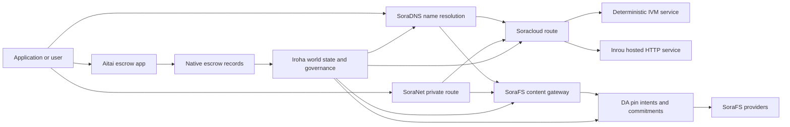

# SORA Nexus Xizmat {#sora-nexus-services}


SORA Nexus Iroha 3 atrofida dasturga ko'ra xizmat samolyotlarini qo'shadi. Ushbu xizmatlar alohida daftarlar emas. Ular Iroha jahon davlatlari, Norito manifestlari, boshqaruv hujjatlari va Torii yo'nalish oilalari bilan mustahkamlanadi.

Bo'shliq nod qurilishi va tarmoq profiliga bog'liq. [`/openapi`](/uz/reference/torii-endpoints.md#app-and-sora-route-families)dan foydalanib, maqsadli nodda yaratilgan app-API yo'nalishlarini kashf eting. Umumiy mahalliy SoraFS CID va yaxshi ma'lum yo'nalishlar ishlab chiqarilgan hujjatning tashqarisida o'rnatilgan, shuning uchun ishga tushirishni tekshirishda ushbu yo'nalishlarni to'g'ridan-to'g'ri tekshirib ko'ring.

## Komponentlar xaritasi {#component-map}

|Komponent |Oʻrni |Asosiy yuzalar |
| ---------------------- | ------------------------------------------------------------------------------------------------------------------------------------------- | ---------------------------------------------------------------------------------------- |
|Soracloud |Dasturlarni ishga tushirish, uyushtirilgan xizmatlar, xususiy model / ish vaqti holati va xizmat hayoti davrini boshqarish. |`/v1/soracloud/`, `/api/`, `iroha app soracloud ...` |
|Ichkariga |Soracloud jonli HTTP samolyotga muhtoj bo'lgan xizmat o'zgartirishlari uchun HTTP ishga tushirish vaqtini joylashtirdi. |Soracloud ishga tushirish vaqti konfiguratsiyasi, uy egasi imkoniyatlari e'lonlar, replika ishga tushirish vaqt holati |
|SoraNet |Circuitlar uchun maxfiylik va transport qoplamasi, relay trafigi, VPN, ulanish seanslari va streaming yo'nalishlari. |`/v1/connect/`, `/v1/vpn/`, SoraNet yo'nalishidagi metadotlar |
|Ma'lumotlarning mavjudligi (DA) |Nexus yo'nalishlari, SoraFS manifestlari va isbot oqimlari bilan bog'liq bo'lgan fayzli yuklar uchun mavjudlik dalillari, majburiyat va pin-intent qatlamlari. |`/v1/da/`, `FindDaPinIntent`, `[sumeragi.da]` |
|SoraFS |Manifestolar, CAR foydali yuklamalar, to'xtatilgan tarkib, darvozalarni olib tashlash va qaytarib olinishi mumkinligini tasdiqlash oqimlari uchun tarkibiy manzilli saqlash matolari. |`/v1/sorafs/`, `/sorafs/`, `FindSorafsProviderOwner` |
|SoraDNS |SORA uyushtirilgan xizmatlar va tarkib uchun deterministik nomlashtirish va resolver-atestatsiya qatlami. |`/v1/soradns/`, `/soradns/`, resolver direktoriyasi hodisalari |
|Aitai |Foydalanuvchi darajasidagi fiat va aktivlar to'lovlari koridori, alohida hisob qaydnomadan emas, balki mahalliy depozit hujjatlari bilan ta'minlanadi. | `OpenAssetEscrow`, `FindAssetEscrow*`, `EscrowEventFilter`, Kotodama `escrow_*` qurilmalar |



## Oddiy oqimlar {#common-flows}

### Xost qilingan Split dasturlari {#hosted-split-application}

Oddiy qarama-qarshi dastur barcha qismlarni birlashtiradi:

1. Statik frontend aktivlari SoraFS orqali to'planadi va yopiladi.
2. Umumiy uy egasi, masalan `<app>.sora`, SoraDNS orqali ro'yxatdan o'tadi.
3. Soracloud yo'nalishlari `/api/v1/search` yoki `/api/v1/stream` orqali Inrou HTTP xizmatiga.
4. Soracloud yo'nalishlari `/api/auth` va `/api/v1/user` deterministik IVM boshqaruvchilariga.
5. Maxfiylikka muhtoj mijozlar o'sha tarkibga yoki API yo'nalishiga SoraNet aylanmasi orqali yetib borishlari mumkin.

|Yoʻl |Tushkun samolyot |Nima uchun ?|
| ----------------- | --------------------- | ------------------------------------------------- |
| `/`               |SoraFS statik tarkib |Qayta tiklanishi mumkin boʻlgan tarkibning ildizi va darvozalar kechoqlash |
|`/assets/*` |SoraFS statik tarkib |Mulohazalarga asoslangan aktivlar va aniq dalillar |
|`/api/auth*` |Soracloud IVM |Qaytarib oʻynash xavfsiz boʻlgan mualliflik va hamyofadan chiqish holati |
|`/api/v1/user*` |Soracloud IVM |Boshqaruvga qodir boʻlgan davlat mutatsiyasi |
|`/api/v1/search*` |Soracloud Inrou |To'g'ridan-to'g'ri HTTP xizmati, oldindan ko'rish, SSE yoki to'plovchi holati |

### Mundarija nashriyotlari {#content-publication}

SoraFS nashri nomi ularga ko'rsatilganidan oldin mustahkam artefaktlarni ishlab chiqaradi:

1. Faydali yuk yoki ko'rsatkich yaratish.
2. Uni CAR arxivga to'plash va qismlar rejasini tuzish.
3. Norito manifestini pin siyosati va boshqaruv ma'lumotlari bilan yaratish.
4. Manifestni Torii raqamiga taqdim etish.
5. Agar maqsadli profil aniq dalillarni talab qilsa, DA pin niyati yoki mavjudlik majburiyatini yozib qo'ying.
6. Manifesti SoraDNS nomiga yoki Soracloud statik oldingi yo'nalishga bog'lang.

### Xususiy tashish yoki yo'nalish {#private-fetch-or-streaming-route}

SoraNet SoraFS yoki Soracloud oldida o'tirishi mumkin:

1. Mijoz nom yoki manifestni hal qiladi.
2. Qo'riqchi direktoriyasi yoki yo'nalish manifestida kirish va chiqish relaylari tanlanadi.
3. Yo'l-yo'l to'ldirib, SoraNet aylanmasi orqali yuboriladi.
4. Chiqish relayi SoraFS darvoza, Torii oqimi yoki Soracloud yo'nalishlariga yetadi.

## Aitai {#aitai}

Aitai SORA dasturining bozor uslubidagi kelishuv uchun koridori bo'lib, u erda xaridor va sotuvchi onlayn to'lovni muvofiqlashtiradi, Iroha esa Yangi raqamli aktivlarni saqlab turish oqimlari uchun kontraktga egalik qiluvchi depozit hisobidan ko'ra, u mahalliy escrow instruction oilasidan foydalanishi kerak.

Native escrow katta kitobda saqlaydi. Sotuvchi `OpenAssetEscrow` bilan taklifni ochadi, xaridor `AcceptAssetEscrow` va `MarkEscrowPaymentSent` bilan to'lovni qabul qiladi va belgilaydi; va sotuvchi `ReleaseAssetEscrow` bilan chiqaradi yoki to'lov belgilangandan oldin bekor qiladi. Agar xaridor va sotuvchining roziligi yo'q bo'lsa, ikkala tomon nizo ochishi mumkin va `CanResolveEscrowDispute` bilan hal qiluvchi qulflangan miqdorni bo'lishishi mumkin.

To'liq hayot davri, umumiy aktivlar qulflari, anonim depozit, so'rovlar, hodisalar va Rust misollar uchun [Native Asset Escrow](/uz/blockchain/escrow.md) ko'ring.

|Aitai yuzi |Undan foydalaning .|
| ------------------------------------------------------------------------------------------------------------------------------------------------------------- | ----------------------------------------------------------------------------------------- |
|`OpenAssetEscrow`, `AcceptAssetEscrow`, `MarkEscrowPaymentSent`, `ReleaseAssetEscrow`, `CancelAssetEscrow` |Ochiq raqamli aktivlar takliflari, shu jumladan XOR nominal hisob-kitob oqimlari. |
|`OpenAnonymousAssetEscrow`, `AcceptAnonymousAssetEscrow`, `MarkAnonymousEscrowPaymentSent`, `ReleaseAnonymousAssetEscrow`, `CancelAnonymousAssetEscrow` |Shielded takliflari moliyalashtirish va harakatlarni yopish uchun dalillar ilovalaridan foydalanadi. |
|`OpenEscrowDispute`, `ResolveEscrowDispute`, `OpenAnonymousEscrowDispute`, `ResolveAnonymousEscrowDispute` |nizolarni hal qilish va sud uslubida hal etish. |
|`FindAssetEscrowById`, `FindAssetEscrowsBySeller`, `FindAssetEscrowsByBuyer`, `FindAssetEscrowsByStatus` |Ilovalar holati sahifalari, uyg'unlashtirish vazifalari va qo'llab-quvvatlash vositalari. |
|`EscrowEventFilter` |Sotuvchi, sotuvchi, xaridor, holat yoki tadbir turi bo'yicha ochiq-oydin escrow obunalari. |
| Kotodama `escrow_open_offer`, `escrow_accept`, `escrow_mark_payment_sent`, `escrow_release`, `escrow_cancel`, `escrow_open_dispute`, `escrow_resolve_dispute` |Kotodama kontrakt qo'ng'iroqlari V1 depozit tizimlari tomonidan qo'llab-quvvatlanadi. |

Ommaviy Taira yoki Minamoto foydalanish uchun tashqaridagi to'lov liniyasi va har qanday qo'llab-quvvatlash yoki sud ish oqimini ariza siyosati sifatida ko'rib chiqing. Iroha saqlash holati, hayot davri hodisalari, dalillar hashlari va oxirgi aktivlarning harakatini qayd etadi; u o'zidan-o'zi fiat hisob-kitobni tekshirishmaydi.

## Tanlangan nodni tekshiring {#check-a-target-node}

Ushbu sahifadagi misollardan foydalanishdan oldin, yoʻnalish oilasi maqsad qilayotgan nodda mavjudligini tasdiqlang:

```bash
export TORII_URL=https://taira.sora.org

curl -fsS "$TORII_URL/openapi.json" \
  | jq '.paths | keys[] | select(test("^/v1/(soracloud|sorafs|soradns|connect|vpn|da)/"))'

curl -fsS -H 'Accept: application/json' "$TORII_URL/status" | jq .
```

Agar `/openapi.json` profil tomonidan aniqlanmasa, `/openapi` ni sinab ko'ring. To'g'ri yo'nalish mavjudligi qurilish xususiyatlari va tarmoq konfiguratsiyasiga bog'liq. Hujjatda ommaviy mahalliy SoraFS CID va ma'lum yo'nalishlar ro'yxatdan o'tkazilmaydi; ushbu oxirgi nuqtalarni quyida tasvirlanganidek to'g'ridan-to'g'risida tekshirib ko'ring .

### Taira Faqatgina o'qish uchun tutun cheklari {#taira-read-only-smoke-checks}

Ommaviy Taira oxirgi nuqtasi o'qish tomonini tekshirish uchun foydali, ammo siz vakolatli hisobni boshqarayotgan bo'lsangiz va ommaviy testnet holatini o'zgartirish niyatida bo'lmasangiz, mutatsiya misollari uchun ishlatmang.

```bash
export TORII_URL=https://taira.sora.org

curl -fsS -H 'Accept: application/json' "$TORII_URL/status" \
  | jq '{version: .build.version, peers, blocks, lanes: (.teu_lane_commit | length)}'

curl -fsS "$TORII_URL/v1/connect/status" | jq '{enabled, sessions_active}'

curl -fsS "$TORII_URL/v1/vpn/profile" \
  | jq '{available, relay_endpoint, supported_exit_classes}'

curl -fsS "$TORII_URL/v1/sorafs/storage/peers?limit=4" \
  | jq '{gateway_base_url, pin_torii_urls}'

curl -fsS -H 'Accept: application/json' "$TORII_URL/v1/soracloud/status" \
  | jq '.control_plane | {service_count, services: [.services[] | {service_name, current_version}]}'
```

Taira yo'nalishda ro'yxatdan o'tkazilmagan ishga tushirish-mahsus boshqaruv rejasi yo'nalishlarini ko'rsatishi mumkin. OpenAPI yo'nalishi xaritasida qayd etilmagan `/openapi` yo'nalishlar uchun yaratilgan shartnoma sifatida qabul qiling, so'ngra ularni mavjud bo'lgan holda hujjatlashtirishdan oldin joylashtirish-mahsus va ommaviy mahalliy SoraFS yo'nalishni to'g'ridan-to'g'ri tasdiqlang.

## Soracloud {#soracloud}

Soracloud SORA dasturlarni boshqarish tekisidir. U ishga tushirish to'plamlarini, xizmatlarni qayta ko'rib chiqish, yo'naltirishni, ishga tushirish holatini, vakolatli konfiguratsiya kirishlarini, shifrlangan xizmat sirlarini, modellar reyestr rekordlarini, xususiy xulosa qilish seanslarini va ish vaqti rasvolarini kuzatadi.

Soracloud ikki ta'sir samolyotlaridan foydalanadi:

|Oʻlim samolyotlari |Ish vaqti |Undan foydalaning .|
| ---------------------- | ------- | -------------------------------------------------------------------------------------------- |
|`DeterministicService` |`Ivm` |Muallif, ombor holati, sertifikatlangan o'qishlar, buyurtma qilingan pochta qutisi muallifi, boshqaruvga qodir mutatsiyalar |
|`HttpService` |`Inrou` |To'g'ridan-to'g'ri HTTP APIs, to'plamda ko'p ishlash, oldindan saqlanadigan xizmatlar, SSE, brauzer yordamida oqimlar |

Boshqaruv rejasi vakolatli. Ishlab chiqarish, yangilash, orqaga qaytish, konfiguratsiya qilish, maxfiylik, model va holat buyruqlari Torii orqali taqdim etiladi va o'qib beriladi; ular alohida CLI mahalliy ko'rinishga tayanmaydilar. Ommaviy yo'nalish eng uzoq prefiksga asoslangan, shuning uchun bitta ro'yxatdan o'tgan uy egasi trafikni uylashtirilgan HTTP yo'nalishlari va deterministik API yo'nalishlar orasida bo'lishishi mumkin.

### Boʻlingan dasturni qoʻshing {#scaffold-a-split-app}

Split-app namuna statik frontendni qo'shadi API va bir deterministik vaft/API xizmati:

```bash
iroha app soracloud app init \
  --template split-app \
  --app-name solswap_indexer \
  --app-version 0.1.0 \
  --public-host solswap-indexer.sora \
  --output-dir ./apps/solswap-indexer

iroha app soracloud app local-plan \
  --manifest ./apps/solswap-indexer/app_manifest.json

iroha app soracloud app doctor \
  --manifest ./apps/solswap-indexer/app_manifest.json
```

`local-plan` yo'nalish bo'linishi, bolalarga xizmat ko'rsatish manifestlari, ish maydonining skript yo'llari va kutilayotgan frontend nashr etish usulini bosib chiqaradi. `doctor` siz Torii bilan shug'ullanishdan oldin mahalliy nashr shartnomasini tasdiqlaydi.

### Dasturni ishga tushirish va tekshirish holati {#deploy-and-inspect-app-state}

```bash
export SORACLOUD_TORII_URL=https://<soracloud-enabled-torii>

iroha app soracloud app deploy \
  --manifest ./apps/solswap-indexer/app_manifest.json \
  --torii-url "$SORACLOUD_TORII_URL"

iroha app soracloud app status \
  --manifest ./apps/solswap-indexer/app_manifest.json \
  --torii-url "$SORACLOUD_TORII_URL"
```

Ilgari ishga tushirilgan xizmat uchun xizmat ko'rsatkichlari bo'yicha buyruqlardan foydalaning:

```bash
iroha app soracloud status \
  --service-name solswap_indexer_live \
  --torii-url "$SORACLOUD_TORII_URL"

iroha app soracloud rollback \
  --service-name solswap_indexer_live \
  --target-version 0.1.0 \
  --torii-url "$SORACLOUD_TORII_URL"
```

### Sirli va sirli materiallar {#config-and-secret-material}

Soracloud konfig va sirli yozuvlar vakolatli joylashtirish holatining bir qismi hisoblanadi. Aktiv manifestlar bilan mavjud bo'lmagan yoki kerakli konfig yoki sirli bog'lovlar yo'q bo'lganda ishga tushirish, yangilash va qaytish yopiladi.

```bash
iroha app soracloud config-set \
  --service-name solswap_indexer_live \
  --config-name indexer/public_config \
  --value-file ./config/public-config.json \
  --torii-url "$SORACLOUD_TORII_URL"

iroha app soracloud secret-set \
  --service-name solswap_indexer_live \
  --secret-name indexer/api_key \
  --secret-file ./secrets/api-key.envelope.json \
  --torii-url "$SORACLOUD_TORII_URL"
```

CLI yordamidan profilingiz tomonidan talab qilingan aniq ma'lumot belgilarini olish uchun foydalaning:

```bash
iroha app soracloud config-set --help
iroha app soracloud secret-set --help
```

## Inrou {#inrou}

Inrou - uy egasi HTTP ishlatiladigan ish vaqti Soracloud. O ' zbekiston Respublikasi Iroha oʻrnatilgan tugma Soracloud Ish vaqtidagi loyihalar qabul qilindi Soracloud mahalliy materializatsiya rejasiga kiritish, o'rnatilgan xosting xizmati nusxalarini loopback xizmatlari sifatida ishga tushirish; va to'g'ridan-to'g'ri modelga qaytish haqida hisobotlarni taqdim etadi.

O'z vaqtida HTTP yuzasini talab qiladigan ish yuklari uchun Inrou-dan foydalaning, masalan, yig'uvchi og'ir APIs, SSE oqimlari, oldindan saqlanadigan boshqaruvchilar yoki brauzer yordamida xizmatlar.

### Ish vaqti talablari {#runtime-requirements}

- Konteynerlar manifestining ish vaqti `Inrou` bo'lishi kerak.
- Xizmat manifesini bajarish tekisligi `HttpService` bo'lishi kerak.
- `HttpService + Inrou` to'g'ri `PersistentRootLeaseVolume` `/` ga o'rnatilgan bo'lishi kerak.
- Replikatsiya qilingan Inrou xizmatlari o'zgaruvchan umumiy holatni saqlagan taqdirda ham, ularda qo'shma xizmat yoki maxfiy ijara saqlashga ehtiyoj bor.
- Ishlab chiqarish xosting nodlari faqat vakili sifatida faoliyat ko'rsatmasdan, haqiqiy Inrou quvvatini reklama qilishlari kerak.

### Koʻrinib turgan parchalari {#manifest-fragment}

Quyidagi misol ikki manifestning shaklini ko'rsatadi. Bu to'liq ishga tushirish to'plami emas, balki bir qismdir.

```jsonc
// container_manifest.json
{
  "schema_version": 1,
  "runtime": { "runtime": "Inrou", "value": null },
  "bundle_path": "/bundles/solswap-indexer.inrou",
  "entrypoint": "/app/bin/launch-indexer.sh",
  "args": [],
  "env": {
    "RUST_LOG": "info",
  },
  "inrou": {
    "schema_version": 1,
    "guest_os": { "guest_os": "DebianSlim", "value": null },
    "guest_images": {
      "x86_64": {
        "kernel_image_path": "/inrou/x86_64/vmlinux",
        "rootfs_image_path": "/inrou/x86_64/rootfs.ext4",
        "initrd_image_path": null,
      },
      "aarch64": {
        "kernel_image_path": "/inrou/aarch64/vmlinux",
        "rootfs_image_path": "/inrou/aarch64/rootfs.ext4",
        "initrd_image_path": null,
      },
    },
  },
  "lifecycle": {
    "start_grace_secs": 60,
    "stop_grace_secs": 30,
    "healthcheck_path": "/api/indexer/v1/health",
  },
}
```

```jsonc
// service_manifest.json
{
  "schema_version": 1,
  "service_name": "solswap_indexer_live",
  "service_version": "0.1.0",
  "execution_plane": { "execution_plane": "HttpService", "value": null },
  "replicas": 2,
  "route": {
    "host": "solswap-indexer.sora",
    "path_prefix": "/api/v1/search",
    "service_port": 8080,
    "visibility": { "visibility": "Public", "value": null },
    "tls_mode": { "tls": "Required", "value": null },
  },
  "lease_volumes": [
    {
      "volume_name": "root_disk",
      "kind": {
        "lease_volume": "PersistentRootLeaseVolume",
        "value": null,
      },
      "storage_class": { "storage_class": "Warm", "value": null },
      "mount_path": "/",
      "max_total_bytes": 8589934592,
    },
    {
      "volume_name": "index_state",
      "kind": { "lease_volume": "ServiceLeaseVolume", "value": null },
      "storage_class": { "storage_class": "Warm", "value": null },
      "mount_path": "/var/lib/solswap-indexer",
      "max_total_bytes": 1073741824,
    },
  ],
}
```

Ish paytida, har bir o'rnatilgan ijara hajmi hajm nomidan kelib chiqqan muhit o'zgaruvchilari orqali aniqlanadi:

```text
SORACLOUD_LEASE_VOLUME_ROOT_DISK_DIR
SORACLOUD_LEASE_VOLUME_ROOT_DISK_MOUNT_PATH
SORACLOUD_LEASE_VOLUME_INDEX_STATE_DIR
SORACLOUD_LEASE_VOLUME_INDEX_STATE_MOUNT_PATH
```

## SoraNet {#soranet}

SoraNet - maxfiylik va transport qoplamasi. U maqsadli darvoza yoki xizmat bilan to'g'ridan-to'g'ri bog'lanmasligi kerak bo'lgan trafik uchun relayga asoslangan yo'nalishlarni taqdim etadi. Transport dizaynida kirish, o'rta va chiqish relay rollari, QUIC transport, tovushga asoslangan hibrid qo'l tortish, imkoniyatlarni muzokara qilish, relay direktoriya metadatalari va qat'iy o'lchamli to'plamlar ishlatiladi.

Nexus ishga tushirishlarida, SoraNet tarkibni olish, darvoza trafikini, VPN yoki Connect seanslarini va Norito oqim yo'nalishlarini o'tkazishi mumkin. Direktoriya kirishlari `norito-stream` ni qo'llab-quvvatlaydigan relaylarni belgilashlari mumkin, bu esa mijozlarga Torii RPC yoki oqim trafiklariga mos yo'nalishni afzal ko'rsatishga imkon beradi.

### Oʻtkazib yuborish konfiguratsiyasi {#streaming-configuration}

Nexus profili streaming yo'nalishlari uchun SoraNet ni ta'minlashga imkon beradi:

```toml
[streaming]
feature_bits = 0b11

[streaming.soranet]
enabled = true
exit_multiaddr = "/dns/torii/udp/9443/quic"
padding_budget_ms = 25
access_kind = "authenticated"
provision_spool_dir = "./storage/streaming/soranet_routes"
provision_spool_max_bytes = 0
provision_window_segments = 4
provision_queue_capacity = 256
```

`access_kind = "read-only"` ni tomoshabinlarni tasdiqlashni talab qilmaydigan tarkib yo'nalishlari uchun ishlating. `authenticated`-ni tomoshabinlar bilan bog'lanishdan oldin chiptalarni yoki tomoshabin shaxsini qo'llash kerak bo'lganda foydalaning. Torii yoki uyushtirilgan xizmatga ko'chish.

### SoraNet-Bila turib SoraFS olib keling {#soranet-aware-sorafs-fetch}

O ' zbekiston Respublikasining SoraFS olib kelish CLI mahalliy proxy manifesti va spool chiqarishi mumkin SoraNet brauzerlar kengaytmalari uchun yo'nalish metadatalari yoki SDK Adapterlar, orkestrator JSON belgilash kerak `local_proxy` bilan `"emit_browser_manifest": true`, va CLI qurilishi kerak `local-quic-proxy` Qo'llab-quvvatlash. Taira, qabul qilingan provayderlar katalogini testnetning ommaviy ildizida tekshirish; so'ngra ushbu provayder uchun chiqarilgan himoyalangan provayder tupleini to'ldiring:

```bash
export TAIRA_ROOT=https://taira.sora.org
curl -fsS "$TAIRA_ROOT/v1/sorafs/providers?limit=20" | jq '.providers'

: "${TAIRA_SORAFS_PROVIDER_ID:?set the admitted provider ID from Taira discovery}"
: "${TAIRA_SORAFS_GATEWAY_KEY:?set the provider gateway key}"
: "${TAIRA_SORAFS_PROVIDER_URL:?set the advertised provider base URL}"
: "${TAIRA_SORAFS_STREAM_TOKEN_FILE:?set the issued stream-token file}"

cargo run -p sorafs_orchestrator --features=local-quic-proxy --bin=sorafs_cli -- \
  fetch \
  --plan=artifacts/payload_plan.json \
  --manifest-id=<manifest-digest-hex> \
  --orchestrator-config=artifacts/orchestrator.json \
  --provider=name=taira,provider-id="$TAIRA_SORAFS_PROVIDER_ID",gateway-key="$TAIRA_SORAFS_GATEWAY_KEY",base-url="$TAIRA_SORAFS_PROVIDER_URL",stream-token="$(cat "$TAIRA_SORAFS_STREAM_TOKEN_FILE")" \
  --output=artifacts/payload.bin \
  --json-out=artifacts/fetch_summary.json \
  --local-proxy-manifest-out=artifacts/proxy_manifest.json \
  --local-proxy-mode=bridge \
  --local-proxy-norito-spool=storage/streaming/soranet_routes \
  --local-proxy-kaigi-spool=storage/streaming/soranet_routes \
  --local-proxy-kaigi-policy=authenticated \
  --max-peers=2 \
  --retry-budget=4
```

Qisqa ma'lumotlar provayderining hisobotlari, qisqacha rasmga olishlar, mahalliy proxy metadatalari va to'lov uchun ishlatiladigan samarali yo'nalish moslamalari.

### Relay ragʻbatlantiruvchi tekshiruvchining roʻyxati {#relay-incentive-verifier-roster}

Agar `incentives.enable` to'g'ri bo'lsa, `incentives.trusted_verifier_ids` kamida bitta kanonik hisobda ID bo'lishi kerak. Ro'yxat hech qachon 64 ta kirishdan oshmasligi kerak, hatto rag'batlantirishlar o'chirilgan bo'lsa ham. Ish vaqti uni deterministik tartibga solinadigan set sifatida saqlaydi va relayni ishga tushirish paytida haqiqiy bo'lmagan ro'yxat geometriyasini rad etadi.

Har bir `RelayBandwidthProofV1` o'rnatilgan ramka / taqsimlash byudjeti bo'yicha dekodlanadi va butun ramkani iste'mol qilishi kerak. Isbotning tasdiqlovchi hisobi konfiguratsiyalangan ro'yxatda mavjud bo'lishi kerak va `RelayBandwidthProofV1::verify_signature()` relayni qulflash yoki uning ishlash akkumulyatorini o'zgartirishdan oldin muvaffaqiyatli bo'lishi shart. Relay ishonchsiz imzochi yoki imzo haqiqiy emas / o'zgartirilgan dalilni e'tiborga olmaydi. Bunday dalil o'lchashni qo'shmaydi va rag'batlantiruvchi fotosurat yaratolmaydi.

## Ma'lumotlar mavjudligi (DA) {#data-availability-da}

DA to'g'ridan-to'g'ri dunyo holatiga joylashtirish uchun juda katta, juda maxfiylikni sezadigan yoki xizmatga mos bo'lgan foydali yuklar uchun mavjudlik guvohnomasi qatlami hisoblanadi. U deterministik majburiyatlar va olish majburiyatlarini qayd etadi, shunda tasdiqlovchilar, darvozalar va mijozlar qaysi baytlar va'da qilinganligi, qaysi siyosat qo'llanilayotganligi va qanday dalillar kuzatilganligi haqida kelishib olishi mumkin.

DA Kura yoki SoraFS o'rniga emas:

- Kura yakuniy blok oqimi va konsensusni qayta tiklash ma'lumotlarini saqlashadi.
- SoraFS tarkib bilan bog'liq bytlarni, CAR foydali yuklarni va manifestlarni saqlaydi va xizmat ko'rsatadi.
- DA ushbu bytlarni jadvalga qo'yish, audit qilish va katta qog'oz holati bilan bog'lanish imkonini beradigan majburiyatlar, dalillar siyosati, dalillar ochilishlari va pin niyatlarini qayd etadi.

Foydalanish DA talabnoma yoki Nexus lane uchun katta qog'ozdan ko'rinadigan va'da kerakki, zanjirdan tashqaridagi ma'lumotlar qayta tiklanishi mumkin. Oddiy misollardan biri hisob-kitob oqimlari uchun yo'nalishdagi foydali yuk majburiyatlarini o'z ichiga oladi. SoraFS nashr etilgan tarkib uchun pin niyatlari, keyinchalik tekshirish uchun saqlanishi kerak bo'lgan dalillar to'plami; va umumiy holati to'liq yuk bo'lishdan ko'ra o'chirish bo'lishi kerak bo'lgan qo'llanma artefaktlari.

### Hayot davri {#lifecycle}

|Sahna |Yozib olingan narsalar|
| ---------- | ----------------------------------------------------------------------------------------------------------------------------------------------------- |
|Niyat .|Chipta, manifest ma'lumoti, alias, yo'nalish/epoch/sequence ma'lumotlari, saqlab qolish siyosati yoki replikatsiya maqsadi. |
|Bagʻishlanish |Manifestni, yo'nalish yukini, dalillar to'plamini yoki tarkibiy ildizni katta kitobga ko'rinadigan rekord bilan bog'laydigan materialni o'chirish. |
|Hujjatlar |Bo'lishi mumkin bo'lgan ovozlar, dalillarni ochish, provayderlarning attestatsiyalari yoki maqsadli tarmoq tomonidan qabul qilingan boshqa profilga mos hujjatlar. |
|Savollar |`FindDaPinIntentByTicket`, `FindDaPinIntentByManifest`, `FindDaPinIntentByAlias` yoki `FindDaPinIntentByLaneEpochSequence` orqali pin-intent qidiruvlari. |

DA tomonidan qo'llab-quvvatlanadigan odatiy nashr oqimi quyidagicha:

1. WSV tashqaridagi foydali yukni yaratish yoki qabul qilish, masalan, SoraFS CAR fayli yoki Nexus yo'nalishdagi foydali yuk.
2. Norito manifestida yoki yo'nalish bo'yicha majburiyatlar to'g'risidagi yozuvda faydali yukni hash va tasvirlang.
3. Ushbu yo'nalishlar oilasi yoqilganda `/v1/da/*` orqali yoki tarmoqning imzolangan tranzaksiya yo'li orqali manifest, pin niyati yoki majburiyatni taqdim eting.
4. Validadorlar yoki mavjudlik provayderlari faol dalillar siyosati talab qiladigan dalillarni to'plashlariga ruxsat berishadi.
5. Noto'g'ri yukga bog'liq bo'lgan alias, kelishuvni tasdiqlovchi yoki darvoza yo'nalishini targ'ib qilishdan oldin natijali pin niyatini yoki majburiyatini so'rang.

### Algoritmik model {#algorithmic-model}

DA fayzli yukni imzolangan, takrorlash bilan himoyalangan, blok-indekslangan majburiyatga aylantiradi. Muhim algoritmlar deterministik, shuning uchun tasdiqlovchilar va darvozalar bir xil baytlardan bir xil o'lchovlarni qayta hisoblashlari mumkin.

1. Jo'natilgan fayzli yukni kanonlashtirish. Torii `(lane_id, epoch, sequence)`, fayzli yuk bytlari, siqish metadatalari, qism hajmi, o'chirish profili bilan iste'mol talabini qabul qiladi; saqlash siyosati va jo'natuvchi imzosi. nod gzip, deflate yoki Zstandard faydali yuklarni talab qilinganda dekompressiya qiladi, so'ngra kanonik bayt uzunligi `total_size` ga tengligini tasdiqlaydi.
2. yo'nalish va qism parametrlarini tasdiqlang. Yo'nalish Nexus yo'nalishi katalogida mavjud bo'lishi kerak. `chunk_size` ikki, kamida ikki bytning nol bo'lmagan quvvatga ega bo'lishi lozim, va konfiguratsiyalangan maksimaldan katta bo'lmasligi kerak. O'chirish profilida ma'lumotlar shartlari va kamida ikkita parity shartlar mavjud bo'lishi kerak. Yo'nalish katalogida `merkle_sha256` yoki `kzg_bls12_381` sifatida isbot sxemasi tanlanadi.
3. Tarmoq siyosatini qo'llash. Nod blob sinf uchun konfiguratsiyalangan nusxalashtirish va saqlab qolish asosini amalga oshiradi. Ommaviy metadotlar oddiy matn bo'lishi kerak; faqat boshqaruvga mo'ljallangan metadotlar manifestga yozilishdan oldin nodning konfiguratsiya qilingan boshqaruv metadata kalitlari bilan shafrlanadi.
4. Chunk va commit. Kanonik faydali yuk `chunk_size` dan kelib chiqadigan qat'iy o'lchamli profil bilan chunk qilinadi. Torii faydali yukni o'zlashtirishni, qayta tiklash mumkinligini isbotlovchi daraxt ildizini va qism bo'yicha majburiyatlarni hisoblaydi. Ma'lumotlar to'plamlari o'z baytlarida BLAKE3 majburiyatlarini olib boradi.
5. O'chirish majburiyatlarini qo'shing. Chiqindilar `data_shards` chiziqlariga guruhlanadi. Oxirgi chiziqdagi yo'qolgan hujayralar paritetani hisoblash uchun nolga to'ldirilgan. RS(16) paritet yaratadi Satr / global parity shards; tanlov `row_parity_stripes` matriks bo'ylab ustun uslubidagi chiziq pariti qo'shish. Parity shard majburiyatlari BLAKE3 kichik bo'lib o'tgan `u16` ramzlarning dizgestlari hisoblanadi.
6. Manifesti yaratish. `DaManifestV1` yo'nalishni, davrni, blob sinfini, kodekni, foydali yukni o'chirishni, chunk root, chunk hajmini, o'chirib tashlash profilini, saqlab qolish siyosatini, ijara narxini, chunk majburiyatlarini, ixtiyoriy IPA majburiyatini, metadatalarni va nashr vaqtini qayd qiladi. saqlash chiptasi deterministik: nod birinchi navbatda bo'sh chipta bilan manifest namunasini hash qiladi, so'ngra uni oxirgi `storage_ticket` sifatida qayta yozadi.
7. Takrorlash nizolarini rad eting. Takrorlash tugmasi `(lane_id, epoch, sequence, manifest_fingerprint)`. Bir xil barmoq izlari bo'lgan nusxasi idempotentdir. Oldin ketma-ket yoki boshqa barmoq izlariga ega bo'lgan bir xil ketma-kete rad etiladi.
8. imzolangan artefaktlarni chiqarish. Torii PDP majburiyatini hisoblaydi, `DaIngestReceipt` ni imzolaydi, `DaCommitmentRecord` ni quradi va manifest uchun rul artefaktlarini yozadi; PDP majburiyati, majburiyatlar ro'yxati, majburiyatlar jadvali, pin niyati, rasm fayli va rasm rejasi. Rasm kursorida `(lane_id, epoch)` bo'yicha bir xil o'zgarishlar yuz beradi.

Bandlik to'g'risidagi yozuvlar bloklarda mavjud.

- Yo'nalish, davr va jadval
- qo'ng'iroq qiluvchi blob ID va kanonik manifest hash
- yo'nalishlarni himoya qilish sxemasi
- bo'lak-bo'lak
- KZG yo'nalishlari uchun KZG majburiyatlari bo'yicha tanlov
- PDP/proof digest
- saqlanish sinfi va saqlash varaqasi
- Torii DA tan olish imzosi

Blok DA rekordlarini o'rnatishdan oldin, blok yig'ilish yo'li to'plamni tasdiqlaydi:

- `(lane_id, epoch, sequence)` to'plam ichida noyob bo'lishi kerak.
- Manifest hashlar to'plam ichida nol bo'lmagan va yagona bo'lishi kerak.
- Imkoniyatni tasdiqlovchi sxemasi konfiguratsiya qilingan yo'nalish siyosatiga mos kelishi kerak.
- Merkle yo'nalishlari KZG majburiyatlarini rad etadi; KZG yo'nalishlar nol bo'lmagan KZG majburiyatini talab qiladi.
- Pinning niyatlari yo'nalishi, manifest hash, saqlash varaqasi, egasining hisobi va alias to'qnashuv qoidalari bo'yicha kanonikalashtirilgan, sinflashtiriladi va filtrlanadi.

Blok sarlavhasi DA isbot siyosati, majburiyatlar va pin niyatlari uchun hashlarni saqlaydi. A'zolik isbotlari uchun majburiyat to'plami Merkle ildizini ham namoyish etadi. Norito kodlangan kanonik `DaCommitmentRecord` qiymatlarning hashlari hisoblanadi. Ota-ona nodlar chap va o'ng bolalarning konketsiyalarini hash qiladi; bir necha barg o'zgarmasdan keyingi qatlamga ko'tariladi.

### Dalolatni tekshirish {#proof-verification}

`/v1/da/commitments/prove` blokdagi bitta majburiyat uchun dalil keltirib chiqarishi mumkin. Ushbu hujjatda majburiyat, blokning balandligi, paketdagi indeks, paket hash, paket uzunligi, Merkle ildiz va qarindosh yo'l mavjud. Tahqiqlash tekshiruvlari:

1. Ko'rsatkichlar to'plamining hashini blok boshliqining DA majburiyat hash bilan moslashtirish.
2. Ko'rsatkich blokining balandligi referensiya qilingan blok sarlavhasi bilan mos keladi.
3. Indeks chegaralarda bo'lib, majburiyat ushbu indeksdagi to'plamga teng.
4. Yo'l-yo'riq xavfsizligi siyosati majburiyatni qabul qiladi.
5. Imkoniyat varaqasidan qarindosh yo'lini uzish taqdim etilgan ildizni qayta tiklaydi.
6. Tiklangan ildiz to'plamning ildiziga tengdir.

Bu ma'lum bir blokning foydali yuklamasiga muayyan mavjudlik majburiyati kiritilganligini isbotlaydi; bu har bir nusxaning hozirda onlayn ekanligini isbotlamayapti. To'g'ridan-to'g'ri olish imkoniyati SoraFS provayderni olib tashlash, PDP/PoTR tekshiruvlari yoki profilga mos bo'lgan mavjudlik ma'lumotlari orqali alohida tekshirish qilinadi.

### Qo'shma fikrlash tarzi {#consensus-interaction}

DA ishonchli etkazib berish (RBC) orqali Sumeragi bilan bog'lanadi, ammo u ikkinchi yakuniylik protokoli emas. RBC takliflarni tarqatadi va tiklaydi: taklif qiluvchi `(height, view, payload_hash)`, tengdoshlar almashinuvi qismlari uchun seansni e'lon qiladi va `READY`/`DELIVER` signallari bir xil foydali yukni ko'rgan yoki bo'lmaganligini kuzatadi.

Iroha 3 da tengdosh blokning ko'tarilgan foydali yukini quyidagi hollarda mavjud deb hisoblaydi:

- mahalliy to'liq bloklar hashni kutilayotgan fayzli yuk hashini o'z ichiga oladi; yoki
- RBC blok hash, balandlik, ko'rinish va foydali yuk hash bilan mos bo'lgan fayzli yukni tikladi.

Agar hech bir shartda amal qilmasa, tengdoshlari `missing_local_data`, RBC yoki blok sinxronizatsiyasi orqali foydali yukni tiklashga harakat qiladi va DA darvozasini status va telemetriya bo'yicha xabar beradi. Joriy amalga oshirishda ushbu DA signallari yakuniyligi uchun maslahat hisoblanadi: blok hali ham qat'iylik sertifikatiga qo'shilib, tegishli mahalliy faydali yukdan yakunlanadi, alohida DA quorum sertifikatidan emas.

DA vaqtini tiklash oynalarini kengaytiradi. Ta'sirchan DA quorum timeout konfiguratsiyalangan blokdan kelib chiqadi va topshiriqlar vaqtini ko'paytiradi, so'ngra `sumeragi.advanced.da.quorum_timeout_multiplier` bilan ko'paytiriladi. Bo'lish vaqti `max(quorum_timeout, availability_timeout_floor_ms) * availability_timeout_multiplier`. Bo'shliq muddati tugagandan oldin nod foydali yukni tiklashni afzal ko'radi va muddatidan oldin qayta rejalashtirishdan qochadi; u tugagach, odatiy tiklash va ko'rinishni o'zgartirish yo'llari davom etishi mumkin.

### Operatorlarning notlari {#operator-notes}

Iroha 3 konsensus profillari o'z ichiga oladi RBC- qo'llab-quvvatlanadigan foydali yuklarni tarqatish, manifestlar himoya qilish, DA to'plamni tasdiqlash va tiklash telemetriyasi. `[sumeragi.da]` Bir blok uchun majburiyatlar va dalillar bo'shliqlari cheklovlari, shuningdek `[sumeragi.advanced.da]` Quorum va mavjudlik xatti-harakatlari uchun vaqtni koʻpaytiruvchilar. Ushbu sozlamalarni bitta tarmoqdagi tasdiqlovchilarda mos saqlang profil.

Yo'lni aniqlash uchun nodning OpenAPI hujjati bilan boshlang:

```bash
curl -fsS "$TORII_URL/openapi.json" \
  | jq '.paths | keys[] | select(startswith("/v1/da/"))'
```

Foydalanish [soʻrov maʼlumotlari](/uz/reference/queries.md#nexus-data-availability-and-packages) joriy uchun DA so'rov nomlari va [Tengdoshlar konfiguratsiyasi namunalari](/uz/reference/peer-config/) mahalliy `[sumeragi.da]` tuxumlar sizning qurilmangiz tomonidan aniqlangan.

## SoraFS {#sorafs}

SoraFS - bu markazlashtirilmagan tarkibga yo'naltirilgan saqlash matoidir. Bu baytlarni deterministik qismlarga, CAR arxivlariga va Norito tarkib ildizlarini bog'laydigan manifestlarga to'ldiradi; profillar, pin siyosatlari va boshqaruv attestatsiyalari. saqlash provayderlari tarkibni taqdim etishdan oldin quvvat va mavjudlikni e'lon qilishadi, darvozalar esa tarkibni xizmat ko'rsatishdan oldin manifestlar va qatlam majburiyatlarni tekshirishadi.

SoraFS odatiy qo'llanmalar statik dastur aktivlari, hujjat qurilmalari, zonalar to'plamlari, model yoki artefakt ma'lumotlari va boshqaruv dalillari to'plamalarini o'z ichiga oladi. Iroha ma'lumotlar modeli SoraFS darvoza hodisalarini va provayder mulkchilikni hal qilish uchun [`FindSorafsProviderOwner`](/uz/reference/queries.md#nexus-data-availability-and-packages) so'rovini ochadi.

### Taira Testnet profillari {#taira-testnet-profile}

Taira - kanonik ommaviy testnet SoraFS. Uning tekshirilgan tasdiqlovchi profilida zanjir `fc56984b-2be7-431d-840e-21514d1883f0` va zanjir diskriminantidan foydalanadi `369`. Uning nashr etilgan SoraFS parametrlari quyidagilardir:

- tarmoq ID: `hash:82531CE8EAE8BFF6BEECA4698BFD13A3BC8BEC5F0EE0D23D428C97FC17AB0F3B#3E94`
- Gateway bazasi URL: `https://taira.sora.org`
- pin Torii URLs: `https://taira-validator-1.sora.org` o'tish `https://taira-validator-4.sora.org`
- Qidiruv qobiliyatlari: `torii_gateway`, `chunk_range_fetch` va `potr_mldsa`
- alohida tarkibning kelib chiqishi: `https://{cid}.sorafs.taira.sora.org/{path}`
- `require_council_signatures = false` bilan ochiq pin siyosati: ruxsatsiz va to'lov cheklangan;

```toml
[sorafs.storage]
enabled = false
max_capacity_bytes = 13743895347

[sorafs.discovery]
discovery_enabled = true
known_capabilities = ["torii_gateway", "chunk_range_fetch", "potr_mldsa"]

[sorafs.discovery.publish]
gateway_base_url = "https://taira.sora.org"
pin_torii_urls = [
  "https://taira-validator-1.sora.org",
  "https://taira-validator-2.sora.org",
  "https://taira-validator-3.sora.org",
  "https://taira-validator-4.sora.org",
]

[sorafs.gateway.untrusted_hosting]
enabled = true
path_gateway_redirect = true
redirect_html_only = true

[sorafs.gateway.untrusted_hosting.cid_host_suffixes]
taira = "sorafs.taira.sora.org"

[sorafs.repair]
enabled = false

[sorafs.gc]
enabled = false

[gov.sorafs_pin_policy]
require_council_signatures = false
```

Taira validatorlari SoraFS saqlash, ta'mirlash va chiqindilarni to'plashni o'chirib qo'ygan. Ularning konfiguratsiya qilingan quvvati validatorning bir qismi bo'lib qoladi Disk-budjetni tekshirish; bu tasdiqlovchi saqlash provayderidir degan ma'noni anglatmaydi. Sinovdan oldin hozirgi konfiguratsiya qilingan darvoza va pin yo'nalishlarini o'qish uchun `GET /v1/sorafs/storage/peers?limit=4` dan foydalaning.

O ' zbekiston Respublikasining `sorafs.sora.org` CID suffix - jonli/mahsulot profilidir, yo'q Taira. Uni qoʻymang . Taira Manifestolar, kelib chiqish tekshiruvlari yoki brauzer sinovlari. Mahsulotlarni ishga tushirishda o'zlarining tarmoq kimligi, boshqaruv kalitlaridan foydalanish kerak; provayderlarni qabul qilish materiallari, pin oxirgi nuqtalari va quvvat/ta'mirlash siyosati; hech qachon nusxa ko'rsatmaslik Taira Ishlab chiqarish konfiguratsiyasida ma'lumotnomalar yoki oxirgi nuqtalarni qo'llash.

### Jamoat mahalliy CID va joylar darvozalari {#public-local-cid-and-site-gateways}

SoraFS qo'llab-quvvatlangan har bir Torii nod ushbu anonim ommaviy yo'nalishlarni o'rnatadi, hatto tanlovli dastur API qurilmagan taqdirda ham:

|usuli va oxirgi nuqtasi | Maqsad                                                              |
| ---------------------------------- | -------------------------------------------------------------------- |
|`GET /.well-known/sorafs/manifest` |Kanonik soʻrovni qabul qiluvchi tomonidan tanlangan manifestni qaytarish |
|`GET /v1/sorafs/cid/{cid}` |CID uchun cheklangan mahalliy manifest metadatalarini va fayl yozuvlarini qaytaring |
|`GET /sorafs/cid/{cid}` |Mahalliy tarkibga ega boʻlgan sayt uchun ilova hujjatini koʻrsatish |
|`GET /sorafs/cid/{cid}/{*path}` |CID ostida bitta normalizatsiya qilingan yo'l yoki bir chegaralangan bayt doirasiga xizmat qiling |

Ushbu yo'nalishlar `x-sorafs-stream-token` yoki `x-sorafs-token-id` ni hech qachon qabul qilmaydi. Har bir boshliqning mavjudligi yomon talabdir. ommaviy o'qish qobiliyati; kecha xatoligi masofadagi provayderni hidratatsiya qilishga ruxsat bermaydi. himoyalangan provayder CAR va chunk yo'nalishlari alohida tasdiqlangan protokol yuzalari bo'lib qolmoqda.

Baytlarni o'qishdan oldin, Torii mahalliy manifestning kanonik kodlashini, semantik cheklovlarini, digest va ildizni CID tasdiqlaydi. So'ngra bu manifest, CID va provayder uchun vakolatli mahalliy provayder identifikatsiyasini, boshqaruv qabul qilishini va tartibga solinadigan muvofiqlikni talab qiladi. Gateway stavka / taqiqlash siyosati haqiqiy mijoz manzilidan foydalanadi, faqat konfiguratsiya qilingan ishonchli vakillar orqali yuborilgan manzillarni hurmat qiladi. Agar siyosat, muvofiqlik, shaxs yoki qabul qilish holati yo'qolsa, Torii so'rovni rad etadi.

Bir so'rovda oxirdan oxirigacha jamoat darvozalari ruxsatnomasi mavjud; jarayon bo'ylab cheklov 64 bir vaqtning o'zida o'qishdir, ortiqcha so'rovlar qaytarilgan `503 Service Unavailable` va `Retry-After: 1`. O'rinli javoblar 16 gacha MiB, fayl ro'yxatlari andoza ravishda 50 ta kirish va maksimal 500 ga qaytadi, to'liq fayl yoki bitta byt doirasi 8 ga cheklanadi. MiB. So'rovlarni tahlil qilish qurilishdan bog'liq. `app_api` qurilishda 32 bitli kodlangan va imzolanmagan dastur qabul qilinadi `limit`, boshqa so'rov kalitlarini e'tiborsiz qoldiradi , so'nggilarini takrorlashga ruxsat beradi `limit` g'alaba qozonish, va qiymatni `1..=500`. Sifatsiz minimal qurilma `app_api` faqat bitta kanonik qabul qiladi `limit=1..500` belgisiz, takrorlanadigan, foizli kodlangan yoki kanonik bo'lmagan shakllarni rad etadi. `limit=<1..500>` Bu xilma-xillik o'rnatish orqali portativ bo'lgan xulq-atvor uchun. CIDs, xostlar, yo'llar va oraliq sarlavhalari ikkala qurilmada ham kanonik va bitta qiymatga ega bo'ladi. HTML, CSS, JavaScript, SVG, XML, PDF, yoki Wasm tarkibi faqat konfiguratsiya qilingan CID-o'ziga xos kelib chiqishi (yoki unga qayta yo'naltirilgan) bo'lgan, bu esa umumiy yo'l-portal kelib chiqishini ishonchli bo'lmagan tarkibni amalga oshirishga to'sqinlik qiladi.

### To'plash, qurish va taqdim etish {#pack-build-and-submit}

Keyingi mutatsiya namunasida Taira `NetworkId`, pin oxirgi nuqtasi, nusxalashtirish maydoni va boshqaruv siyosati ishlatiladi. moliyalashtirilgan testnet hisobidan va birdan foydalanish uchun faqat egalik qiluvchi kalit faylidan foydalaning. Taira kengash imzolarisiz ruxsatsiz pinlarni qabul qiladi, ammo hali ham boshqariladigan to'lovni oladi.

```bash
cargo run -p sorafs_orchestrator --bin sorafs_cli -- \
  car pack \
  --input=./dist \
  --car-out=artifacts/site.car \
  --plan-out=artifacts/site.chunk-plan.json \
  --summary-out=artifacts/site.car-summary.json

: "${TAIRA_AUTHORITY:?set a funded Taira I105 account}"
export TAIRA_NETWORK_ID='hash:82531CE8EAE8BFF6BEECA4698BFD13A3BC8BEC5F0EE0D23D428C97FC17AB0F3B#3E94'
export TAIRA_PIN_TORII_URL=https://taira-validator-1.sora.org
export TAIRA_PRIVATE_KEY_FILE="${TAIRA_PRIVATE_KEY_FILE:-./secrets/taira-authority.ed25519}"
export TAIRA_RETENTION_EPOCH=$(( $(date -u +%s) + 86400 ))

cargo run -p sorafs_orchestrator --bin sorafs_cli -- \
  manifest build \
  --summary=artifacts/site.car-summary.json \
  --manifest-out=artifacts/site.manifest.to \
  --manifest-json-out=artifacts/site.manifest.json \
  --pin-min-replicas=1 \
  --pin-storage-class=warm \
  --pin-retention-epoch="$TAIRA_RETENTION_EPOCH"

cargo run -p sorafs_orchestrator --bin sorafs_cli -- \
  manifest submit \
  --manifest=artifacts/site.manifest.to \
  --chunk-plan=artifacts/site.chunk-plan.json \
  --torii-url="$TAIRA_PIN_TORII_URL" \
  --network-id="$TAIRA_NETWORK_ID" \
  --authority="$TAIRA_AUTHORITY" \
  --private-key-file="$TAIRA_PRIVATE_KEY_FILE" \
  --summary-out=artifacts/site.manifest.submit.json \
  --response-out=artifacts/site.manifest.submit.body
```

`manifest submit` uchun `/v1/sorafs/pin/register` talab qilinadi. Agar maqsadli uzum uni yo'naltirmasa, buyruq muvaffaqiyatsiz tugadi; birinchi chiqarilgan CLI umumiy `/transaction` oxirgi nuqtaga qaytmaydi.

### Tekshiring va olib keling {#verify-and-fetch}

Qo'riqlangan olib tashlash tuplasi provayderga mos. ID va e'lon qilingan baza URL O ' zbekiston Respublikasining Taira provayder katalogini o'qib, ushbu provayderning qabul oqimi orqali darvoza kalitini va tortib olish. Ushbu qiymatlar validatorni saqlash sozlamalari emas. Taira validatorlar o'rnatilgan saqlashni o'chirib qo'ygan, shuning uchun validator pinni almashtirmang. URL provayder uchun URL.

```bash
export TAIRA_ROOT=https://taira.sora.org
curl -fsS "$TAIRA_ROOT/v1/sorafs/providers?limit=20" | jq '.providers'

: "${TAIRA_SORAFS_PROVIDER_ID:?set the admitted provider ID from Taira discovery}"
: "${TAIRA_SORAFS_GATEWAY_KEY:?set the provider gateway key}"
: "${TAIRA_SORAFS_PROVIDER_URL:?set the advertised provider base URL}"
: "${TAIRA_SORAFS_STREAM_TOKEN_FILE:?set the issued stream-token file}"

cargo run -p sorafs_orchestrator --bin sorafs_cli -- \
  proof verify \
  --manifest=artifacts/site.manifest.to \
  --car=artifacts/site.car \
  --chunk-plan=artifacts/site.chunk-plan.json \
  --summary-out=artifacts/site.verify.json

cargo run -p sorafs_orchestrator --bin sorafs_cli -- \
  fetch \
  --plan=artifacts/site.chunk-plan.json \
  --manifest-id=<manifest-digest-hex> \
  --provider=name=taira,provider-id="$TAIRA_SORAFS_PROVIDER_ID",gateway-key="$TAIRA_SORAFS_GATEWAY_KEY",base-url="$TAIRA_SORAFS_PROVIDER_URL",stream-token="$(cat "$TAIRA_SORAFS_STREAM_TOKEN_FILE")" \
  --output=artifacts/site.fetch.tar \
  --json-out=artifacts/site.fetch.json
```

### Qaytarib olinishi to'g'risidagi dalillar {#proof-of-retrievability-checks}

Operatorlar tekshirib koʻrishlari , eksport qilishlari va qayta tiklanishi mumkinligini tasdiqlovchi hujjatlarni bildirishlari mumkin natijalari. Tushkunliklar tarmoqning dalillar quvurida rejalashtirilmoqda; CLI natijalari paydo bo'ladi.

```bash
cargo run -p sorafs_orchestrator --bin sorafs_cli -- \
  por status \
  --torii-url="$TAIRA_PIN_TORII_URL" \
  --manifest=<manifest-digest-hex> \
  --status=failed \
  --limit=20

cargo run -p sorafs_orchestrator --bin sorafs_cli -- \
  por report \
  --torii-url="$TAIRA_PIN_TORII_URL" \
  --week=<YYYY-Www> \
  --format=json
```

## SoraDNS {#soradns}

SoraDNS - SORA xizmatlari va tarkibi uchun deterministik nomlash qatlamidir. Bu ismlarni normallashtiradi, Iroha da resolver direktoriyasini yangilaydi, va SoraFS orqali imzolangan zona yoki resolver to'plamlarini tarqatadi. Resolverlar va darvozalar kashfiyot metadatalariga ishonishdan oldin resolver attestatsiyasi hujjatlarini tekshiradilar.

Browserga kirish uchun SoraDNS portfeli xostlarni ro'yxatdan o'tkazadi FQDN. Ro'yxatga olingan behudalik xosti kanonik ilova kelib chiqishi bo'lib qoladi, ishga tushirilgan portfeli profillar esa ushbu kelib chiqish uchun brauzer va Torii qaytish yo'nalishlarini ko'rsatadi.

### Qonaqchi shakllari {#host-forms}

|shakl |Misol uchun | Maqsad |
| --- | --- | --- |
|Behudalik kelib chiqishi |`https://<fqdn>/<path>` |Kanonik ilova URL manifestlar va nashrnomalarda qayd etilgan |
|Taira brauzer darvoza |`https://<fqdn>.mon.taira.sora.net/<path>` |Aktiv alias uchun ommaviy brauzer darvozasi |
|Torii qaytish yo'li |`https://taira.sora.org/soradns/<fqdn>/<path>` |Torii aktiv alias uchun debug va fallback yo'nalishi |
|Canonical hash gateway |`<base32(blake3(name))>.gw.sora.id` |Deterministik darvoza identifikatsiyasi va GAR tekshiruvi |

`/soradns/<alias>/...` fallback - bu afzal bo'lgan ommaviy URL emas. Asbob-uskunalar, dastur manifestlari va frontend konfiguratsiyasi vanity hostingning o'ziga afzalroq bo'lishi kerak. Agar Taira-da alias faol bo'lmasa, brauzer darvoza yoki qaytish yo'li dasturni yo'naltirish boshlanishidan oldin `404` yoki TLS muvaffaqiyatsiz tugashi mumkin.

### Oʻrinli darvoza hostlari {#derive-gateway-hosts}

```ts
import {
  deriveSoradnsGatewayHosts,
  hostPatternsCoverDerivedHosts,
} from '@iroha/iroha-js'

const derived = deriveSoradnsGatewayHosts('docs.sora')
console.log(derived.canonicalHost)
console.log(derived.prettyHost)

const taira = deriveSoradnsGatewayHosts('solswap-indexer.sora', {
  prettySuffix: 'mon.taira.sora.net',
})
console.log(taira.prettyHost)

const patterns = [
  derived.canonicalHost,
  derived.canonicalWildcard,
  derived.prettyHost,
]
console.log(hostPatternsCoverDerivedHosts(patterns, derived))
```

GAR faydali yuklar kanonik hash host, kanonik wildcard va tanlangan chiroyli uy egasini qamrab olish kerak.

### Resolver direktoriyasining fotosuratini olib boring {#fetch-a-resolver-directory-snapshot}

```bash
curl -i "$TORII_URL/v1/soradns/directory/latest"

soradns_resolver directory fetch \
  --record-url "$TORII_URL/v1/soradns/directory/latest" \
  --directory-url https://gateway.example.org/soradns/directory/latest.car \
  --output ./state/soradns-directory

soradns_resolver rad verify \
  --rad ./state/soradns-directory/rad/resolver-a.norito
```

Gateways resolverni tasdiqlovchi hujjat yo'qolgan, muddati o'tgan, imzolangan bo'lmagan resolverlarni rad qilishi kerak. yoki Merkle root-ning so'nggi direktoriyasida mustahkamlanmagan bo'lsa kerak. `/v1/soradns/directory/latest` qaytishi mumkin `404` Garchi yo'l qo'llanilgan bo'lsa ham.

### Davlat DNS vakolatxonasi {#public-dns-delegation}

SoraDNS xost chizig'i oddiy internet DNS delegatsiyasini almashtirmaydi. Agar ommaviy DNS nomi SoraDNS darvozachasini ko'rsatsa:

- subdomainlar uchun tanlangan go'zal uy egasiga CNAME nashr qiling
- Yuqori nomlar uchun ALIAS/ANAME yoki A/AAAA yozuvlarini IPs darvozalaridan foydalaning.
- GAR tekshiruvlari uchun kanonik hash hostni SoraDNS darvoza domenida saqlang

## FHE va UAID {#fhe-and-uaid}

FHE bilan bog'liq Nexus xizmatlari uchun mavjud bo'lgan yuzalar quyidagilarni o'z ichiga oladi:

- `iroha_crypto::fhe_bfv` skalar shifr matnini baholash uchun deterministik BFV qo'llab-quvvatlashni amalga oshiradi. Identifikator rezolyutsiyasida `BfvIdentifierPublicParameters` va `BfvIdentifierCiphertext` ishlatiladi, unda 0 slot kirish byt uzunligini saqlaydi va keyinchalik slotlar har biri bir kodlangan bytni saqlashadi.
- Soracloud davlat va ish sxemalari modeli FHE boshqaruv tomonidan boshqariladigan parametrlar to'plamlari, amalga oshirish siyosati, chipta matn majburiyatlari, so'rov zarflari va oshkor qilish talablari bilan kodlangan matn ish yuklamalari.

BFV identifikator yo'li maxfiylikni saqlaydigan ro'yxatdan o'tish uchun ishlatiladi. Mijoz Torii resolverga shifrlangan identifikatorni taqdim etishi mumkin. u faol identifikator siyosati bo'yicha `OpaqueAccountId` raqamiga ega bo'lib, rasvot beradi. `ClaimIdentifier` so'ng ushbu rasvotni maqsadli hisobvaraqqa ilova qilingan UAID raqamiga bog'laydi.

O ' zbekiston Respublikasining UAID bu oqim atrofida kimlik va qobiliyatning qutiladi. `UniversalAccountId` hash bilan ta'minlangan va quyidagicha ko'rsatiladi: `uaid:<hash>`. Parserlar buni ham qabul qiladi . `uaid:<hash>` yoki 64 hexning xom o'simligi. `Account` va `NewAccount` ixtiyoriy boʻlishi `uaid` va `opaque_ids` yo'nalishlari. Ish vaqti ro'yxatga olish bir-bir UAID- hisob-kitob ko'rsatkichi, ikkilamchi yoki to'qnashgan shaffof identifikatorlarni rad etadi va shaffof UAID. Har safar a UAID hisob bog'lash o'zgarishlar, ishga tushirish vaqt Space direktoriya ma'lumotlar bazasi bog'lash uchun qayta tiklaydi UAID.

Space Directory UAID ga qo'shish imkoniyatlarini oshkor qiladi. `AssetPermissionManifest` UAID, ma'lumotlar maydoni, faollashtirish va ixtiyoriy muddati tugagan davrni nomlaydi hamda ma'lumot maydonlari, dastur, usul, aktiv va AMX roli bo'yicha tartibga solinadigan ruxsat berish / rad etish kirishlarini belgilaydi. Baholash nega-qutishdir: birinchi moslama rad etish so'rovni rad etadi, aks holda eng so'nggi moslama ruxsat beruvchi nomzod har qanday miqdor chegarasiga qarshi tekshiriladi. Ushbu manifestlarni nashr etish, muddati tugagani va bekor qilish `CanPublishSpaceDirectoryManifest` tomonidan qo'riqlanadi.

Soracloud FHE holati bo'yicha amalga oshirilgan sxemalar:

|Shema |U nimalarni nazorat qiladi ?|
| ----------------------------------------- | --------------------------------------------------------------------------------------------------------------------------- |
|`SoraStateBindingV1` bilan `FheCiphertext` |Davlat kalitining prefiksi ostida FHE kodli matnlar mavjudligini bildiradi. |
|`FheParamSetV1` |Shema nomlari, orqa tomoni, modullar zanjiri, polinomiya darajasi, slotlar soni, xavfsizlik maqsadi, hayot davri va parametrlarni o'chirish .|
|`FheExecutionPolicyV1` |Sifr matnining o'lchamini, oddiy matnning o'lchamini, kirish / chiqish sonini, ko'paytirish chuqurligini, aylanishni, ishga tushirishni va yuvish rejimini cheklaydi. |
|`FheGovernanceBundleV1` |Qabul qilishni tasdiqlash uchun bitta parametrni o'rnatgan va bitta ijro etish siyosatini qo'shgan. |
|`FheJobSpecV1` |`Add`, `Multiply`, `RotateLeft` yoki `Bootstrap` kod matnidagi davlat kalitlari va majburiyatlarni aniqlash ishlarini tasvirlaydi. |
|`CiphertextQuerySpecV1` |So'rovlar faqat kodli matn bo'yicha xizmat, bog'lash, kalit prefiksi, natija chegarasi, metadata darajasi va ixtiyoriy kiritilishga ishonch hosil qiling. |
|`DecryptionRequestV1` |Chifrlash huquqi siyosati bo'yicha bitta kodlangan matn majburiyati uchun e'lon qilinishini talab qiladi. |

`FheJobSpecV1::validate_for_execution` ishga qabul qilishdan oldin ish, ijro siyosati va parametrlar to'plamining kelishilganligini tekshiradi. Shuningdek, u operatsion-mahsus qoidalarni qo'llaydi: qo'shish va ko'paytirish uchun kamida ikkita kirish kerak, aylanish va bootstrap to'g'ri bitta kirish kerak, va talab qilingan chuqurlik, aylanish soni, bootstrap soni, kirish soni, foydali yuklangan bytlar va deterministik chiqish hajmi siyosat chegaralari doirasida qolishi kerak.

UAID kod matni emas va FHE siyosati o'zi emas. Bu xizmat yoki ma'lumotlar maydonining oqimini ruxsat beruvchi hisobni topish, shaffof identifikator talablari va Space Directory bog'lash uchun ishlatiladigan barqaror hisob qobiliyati ankeridir. FHE sxemalari kodlangan foydali yukni qabul qilish va bajarishni parametrlar to'plami, ijro etish siyosati, chifrlangan matn majburiyatlari va chifrlash vakolatlari siyosati orqali alohida tartibga soladi.

Muayyan Torii yuzalari quyidagilarni o'z ichiga oladi:

- `/v1/identifier-policies`
- `/v1/identifiers/resolve`
- `/v1/accounts/{account_id}/identifiers/claim-receipt`
- `/v1/identifiers/receipts/{receipt_hash}`
- `/v1/accounts/{uaid}/portfolio`
- `/v1/space-directory/uaids/{uaid}`
- `/v1/space-directory/uaids/{uaid}/manifests`
- `/v1/soracloud/model/run-private`
- `/v1/soracloud/model/run-private/finalize`
- `/v1/soracloud/model/decrypt-output`

Ommaviy metadotlar chegarasi sxemada aniq ko'rsatilgan: UAID bog'lanishlar, shaffof identifikator yozuvlari, manifest hayot davri, davlat kalitini o'chirishlar, kod matnining kattaligi, kod matni majburiyatlari, siyosat nomlari, parametrlar to'plami versiyalari, vazifa operatsiyalari, chiqish holati kalitlari, va oshkor qilish so'rovi metadatalari ko'rinishi mumkin. identifikator matnlari, kodlangan holat, model kirish va chiqishlar va FHE sirli kalitlar ushbu ommaviy so'rov rekordlaridan tashqarida mavjud.

## Operativ tekshiruv ro'yxati {#operational-checklist}

- Torii nodida `/openapi` bilan ishlab chiqilgan xizmat oilalarini tasdiqlang va to'g'ridan-to'g'ri ommaviy mahalliy SoraFS CID va ma'lum yo'nalishlarni tekshirib turing.
- Soracloud ishga tushirish manifestlarini, SoraFS manifestlarni, SoraDNS resolver direktoriya yozuvlarini, SoraNet relay direktoriya yozuvini va DA pin niyatlarini yoki mavjudlik majburiyatlarini boshqaruvga qodir bo'lgan artefaktlar sifatida ko'rsatish.
- Shu SORA Nexus profilini bitta tarmog'dagi validatorlar bo'ylab doimiy ravishda ishlating.
- Ad hoc node-local yo'nalishlariga tayanishdan ko'ra, Inrou root va ulashilgan ijara hajmlarini manifestlarda saqlang.
- Ma'lumotlar nomini targ'ib qilishdan oldin SoraFS dalil-dalilni tasdiqlashdan foydalaning.
- Monitor SoraNet qo'l tutish muvaffaqiyatsiz tugadi, DA Quorum yoki mavjudlik muddatlari, SoraFS Gateway-ning rad etilishi, SoraDNS RAD yangilik va Soracloud Salomatlikni ishga tushirish.
- Umumiy testnetdan foydalanish uchun Taira profilidan foydalaning va [ bilan boshlang SORA Nexus ma'lumotlar dozalariga ulanish](/uz/get-started/sora-nexus-dataspaces.md).

Shuningdek qarang:

- [Torii oxirgi nuqtalari](/uz/reference/torii-endpoints.md)
- [Ma'lumotlar hodisalari filtrlari ](/uz/blockchain/filters.md#data-event-filters)
- [So'rov uchun ma'lumot](/uz/reference/queries.md#nexus-data-availability-and-packages)
- [Canonical Taira validator konfiguratsiyasi pined commit](https://github.com/hyperledger-iroha/iroha/blob/0010c5a70039eac101a4846499ba9ceaf43eb65c/configs/soranexus/taira/config.toml)
