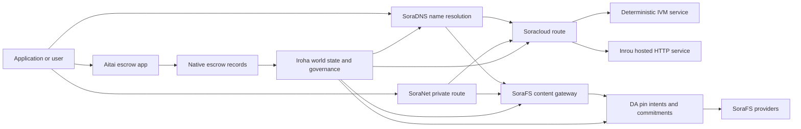

# SORA Nexus xizmatlari {#sora-nexus-services}

SORA Nexus Iroha 3 atrofida ilovalarga mo‘ljallangan xizmat qatlamlarini qo‘shadi. Bu xizmatlar alohida reyestrlar emas. Ular Iroha global holati, Norito manifestlari, boshqaruv yozuvlari va Torii yo‘nalishlari oilalariga bog‘langan.

Mavjudlik tugun yig‘ilmasi va tarmoq profiliga bog‘liq. Maqsad tugunda hosil qilingan ilova API yo‘nalishlarini aniqlash uchun [`/openapi.json`](/uz/reference/torii-endpoints.md#app-and-sora-route-families) dan foydalaning. Ochiq mahalliy SoraFS CID va mashhur yo‘nalishlar hosil qilingan hujjatdan tashqarida ulanadi, shu sababli joylashtirishni tekshirganda ularni bevosita sinab ko‘ring.

## Komponentlar xaritasi {#component-map}

| Komponent | Vazifasi | Asosiy interfeyslar |
| ---------------------- | ------------------------------------------------------------------------------------------------------------------------------------------- | ---------------------------------------------------------------------------------------- |
| Soracloud | Ilovalarni joylashtirish, mezbon xizmatlar, maxfiy model/bajarish muhiti holati va xizmat hayot davrini boshqarish. | `/v1/soracloud/*`, `/api/*`, `iroha soracloud service ...` |
| Inrou | Jonli HTTP qatlami kerak bo‘lgan xizmat tahrirlari uchun Soracloud mezbonlik qiladigan HTTP bajarish muhiti. | Soracloud bajarish muhiti sozlamasi, mezbon imkoniyatlari e’lonlari, replika holati |
| SoraNet | Sxemalar, uzatish trafigi, VPN, Connect seanslari va oqim yo‘nalishlari uchun maxfiylik hamda transport qatlami. | `/v1/connect/*`, `/v1/vpn/*`, SoraNet yo‘nalishi metama’lumotlari |
| Ma’lumotlar mavjudligi (DA) | Nexus yo‘laklari, SoraFS manifestlari va isbot oqimlari ko‘rsatadigan foydali yuklar uchun mavjudlik dalili, majburiyat va mahkamlash niyati qatlami. | `/v1/da/*`, `FindDaPinIntent*`, `[nexus.da]` |
| SoraFS | Manifestlar, CAR foydali yuklari, mahkamlangan kontent, darvozadan olish va qayta olinuvchanlik isboti jarayonlari uchun kontent manzilli saqlash tizimi. | `/v1/sorafs/*`, `/sorafs/*`, `FindSorafsProviderOwner` |
| SoraDNS | SORA mezbonlik qiladigan xizmatlar va kontent uchun deterministik nomlash hamda yechuvchi attestatsiyasi qatlami. | `/v1/soradns/*`, `/soradns/*`, yechuvchi katalogi hodisalari |
| Aitai | Alohida reyestrga emas, mahalliy eskrou yozuvlariga tayangan ilova darajasidagi fiat va aktiv hisob-kitobi yo‘li. | `OpenAssetEscrow`, `FindAssetEscrow*`, `EscrowEventFilter`, Kotodama `escrow_*` ichki amallari |



## Oddiy oqimlar {#common-flows}

### Mezbonlik qilinadigan bo‘lingan ilova {#hosted-split-application}

Bir nechta qatlamni birlashtiradigan odatiy ilova barcha komponentlardan birgalikda foydalanadi:

1. Statik foydalanuvchi interfeysi resurslari SoraFS orqali paketlanib mahkamlanadi.
2. `<app>.sora` kabi ochiq mezbon SoraDNS orqali ro‘yxatdan o‘tkaziladi.
3. Soracloud `/api/v1/search` yoki `/api/v1/stream` ni Inrou HTTP xizmatiga yo‘naltiradi.
4. Soracloud `/api/auth` va `/api/v1/user` ni deterministik IVM ishlovchilariga yo‘naltiradi.
5. Maxfiylik talab qiladigan mijozlar ayni kontent yoki API yo‘nalishiga SoraNet sxemasi orqali yetishi mumkin.

| Yo‘l | Tayanch qatlam | Sababi |
| ----------------- | --------------------- | ------------------------------------------------- |
| `/` | SoraFS statik kontenti | Qayta hosil qilinadigan kontent ildizi va darvoza keshi |
| `/assets/*` | SoraFS statik kontenti | Kontent bo‘yicha manzillangan resurslar va manifest isbotlari |
| `/api/auth*` | Soracloud IVM | Takrorlash hujumidan himoyalangan autentifikatsiya va hamyon sinovi holati |
| `/api/v1/user*` | Soracloud IVM | Boshqaruvga ta’sir qiladigan holat o‘zgarishlari |
| `/api/v1/search*` | Soracloud Inrou | Jonli HTTP xizmati, kesh, SSE yoki jamlovchi holati |

### Kontentni nashr qilish {#content-publication}

SoraFS nashri nom ularga yo‘naltirilishidan avval barqaror artefaktlarni yaratadi:

1. Foydali yuk yoki katalogni yarating.
2. Uni CAR arxivi va bo‘laklar rejasiga paketlang.
3. Mahkamlash siyosati va boshqaruv ma’lumotlari bilan Norito manifestini tuzing.
4. Manifestni Torii ga yuboring.
5. Maqsad profil aniq dalil talab qilsa, DA mahkamlash niyati yoki mavjudlik majburiyatini qayd eting.
6. Manifestni SoraDNS nomi yoki Soracloud statik foydalanuvchi interfeysi yo‘nalishiga bog‘lang.

### Maxfiy olish yoki oqim yo‘nalishi {#private-fetch-or-streaming-route}

SoraNet SoraFS yoki Soracloud oldidagi vositachi qatlam bo‘lishi mumkin:

1. Mijoz nom yoki manifestni aniqlaydi.
2. Himoya tugunlari katalogi yoki yo‘nalish manifesti kirish va chiqish uzatkichlarini tanlaydi.
3. Trafik to‘ldirilib SoraNet sxemasi orqali yuboriladi.
4. Chiqish uzatkichi SoraFS darvozasi, Torii oqimi yoki Soracloud yo‘nalishiga yetadi.

## Aitai {#aitai}

Aitai — xaridor va sotuvchi zanjirdan tashqari to‘lovni muvofiqlashtirayotganda Iroha zanjirdagi aktiv saqlovini boshqaradigan, bozor uslubidagi hisob-kitoblar uchun SORA ilova yo‘li. Yangi sonli aktiv saqlovi jarayonlarida shartnomaga tegishli eskrou hisobi o‘rniga mahalliy eskrou ko‘rsatmalari oilasidan foydalanish kerak.

Mahalliy eskrou saqlovni reyestrda tutadi. Sotuvchi `OpenAssetEscrow` bilan taklif ochadi, xaridor `AcceptAssetEscrow` va `MarkEscrowPaymentSent` orqali taklifni qabul qilib zanjirdan tashqari to‘lovni belgilaydi; sotuvchi `ReleaseAssetEscrow` bilan mablag‘ni bo‘shatadi yoki to‘lov belgilanmasidan oldin bekor qiladi. Xaridor va sotuvchi kelisha olmasa, istalgan tomon nizo ochishi, `CanResolveEscrowDispute` vakolatiga ega hal qiluvchi esa qulflangan miqdorni bo‘lishi mumkin.

To‘liq hayot davri, umumiy aktiv qulflari, anonim eskrou, so‘rovlar, hodisalar va Rust misollari uchun [Mahalliy aktiv eskrousi](/uz/blockchain/escrow.md) bo‘limiga qarang.

| Aitai interfeysi | Qo‘llanishi |
| ------------------------------------------------------------------------------------------------------------------------------------------------------------- | ----------------------------------------------------------------------------------------- |
| `OpenAssetEscrow`, `AcceptAssetEscrow`, `MarkEscrowPaymentSent`, `ReleaseAssetEscrow`, `CancelAssetEscrow` | Oshkora sonli aktiv takliflari, jumladan XOR da ifodalangan hisob-kitob jarayonlari. |
| `OpenAnonymousAssetEscrow`, `AcceptAnonymousAssetEscrow`, `MarkAnonymousEscrowPaymentSent`, `ReleaseAnonymousAssetEscrow`, `CancelAnonymousAssetEscrow` | Himoyalangan takliflarda moliyalashtirish va yopish harakatlari uchun isbot ilovalari. |
| `OpenEscrowDispute`, `ResolveEscrowDispute`, `OpenAnonymousEscrowDispute`, `ResolveAnonymousEscrowDispute` | Nizo ochish va sudga o‘xshash tartibda hal etish. |
| `FindAssetEscrowById`, `FindAssetEscrowsBySeller`, `FindAssetEscrowsByBuyer`, `FindAssetEscrowsByStatus` | Ilova holati sahifalari, solishtirish vazifalari va yordamchi vositalar. |
| `EscrowEventFilter` | Eskrou identifikatori, sotuvchi, xaridor, holat yoki hodisa turi bo‘yicha jonli oshkora eskrou obunalari. |
| Kotodama `escrow_open_offer`, `escrow_accept`, `escrow_mark_payment_sent`, `escrow_release`, `escrow_cancel`, `escrow_open_dispute`, `escrow_resolve_dispute` | V1 eskrou tizim chaqiruvlariga tayangan Kotodama shartnoma chaqiruvlari. |

Ochiq Taira yoki Minamoto da zanjirdan tashqari to‘lov tizimi va har qanday yordam yoki sud jarayonini ilova siyosati deb hisoblang. Iroha saqlov holati, hayot davri hodisalari, dalil xeshlari va aktivning yakuniy harakatini qayd etadi; fiat hisob-kitobini o‘zi tekshirmaydi.

## Maqsad tugunni tekshirish {#check-a-target-node}

Bu sahifadagi misollardan foydalanishdan avval yo‘nalishlar oilasi maqsad tugunda mavjudligini tasdiqlang:

```bash
export TORII_URL=https://taira.sora.org

curl -fsS "$TORII_URL/openapi.json" \
  | jq '.paths | keys[] | select(test("^/v1/(soracloud|sorafs|soradns|connect|vpn|da)/"))'

curl -fsS -H 'Accept: application/json' "$TORII_URL/status" | jq .
```

`/openapi.json` — kanonik OpenAPI so‘nggi nuqtasi. Yo‘nalishlarning aniq mavjudligi yig‘ilma xususiyatlari va tarmoq sozlamasiga bog‘liq. Hujjat ochiq mahalliy SoraFS CID va mashhur yo‘nalishlarni sanamaydi; quyida ko‘rsatilganidek, bu so‘nggi nuqtalarni bevosita tekshiring.

### Taira da faqat o‘qishga mo‘ljallangan tezkor tekshiruvlar {#taira-read-only-smoke-checks}

Ochiq Taira so‘nggi nuqtasi o‘qish tekshiruvlari uchun foydali, ammo vakolatli hisobni boshqarmasangiz va ochiq sinov tarmog‘i holatini ataylab o‘zgartirmoqchi bo‘lmasangiz, unda holatni o‘zgartiradigan misollarni bajarmang.

```bash
export TORII_URL=https://taira.sora.org

curl -fsS -H 'Accept: application/json' "$TORII_URL/status" \
  | jq '{version: .build.version, peers, blocks, lanes: (.teu_lane_commit | length)}'

curl -fsS "$TORII_URL/v1/vpn/profile" \
  | jq '{available, relay_endpoint, supported_exit_classes}'

curl -fsS "$TORII_URL/v1/sorafs/storage/peers?limit=4" \
  | jq '{gateway_base_url, pin_torii_urls}'

curl -fsS -H 'Accept: application/json' "$TORII_URL/v1/soracloud/status" \
  | jq '.control_plane | {service_count, services: [.services[] | {service_name, current_version}]}'
```

Taira OpenAPI yo‘llari xaritasida ko‘rsatilmagan, joylashtirishga xos boshqaruv qatlami yo‘nalishlarini taqdim etishi mumkin. `/openapi.json` faylini undagi yo‘nalishlar uchun yaratilgan shartnoma deb qabul qiling, so‘ng joylashtirishga xos va ommaviy mahalliy SoraFS yo‘nalishlarini mavjud deb hujjatlashtirishdan oldin bevosita tekshiring.

## Soracloud {#soracloud}

Soracloud — SORA ilovalarining boshqaruv qatlami. U joylashtirish paketlari, xizmat versiyalari, yo‘naltirish, tarqatish holati, vakolatli konfiguratsiya yozuvlari, shifrlangan xizmat sirlari, model reyestri yozuvlari, maxfiy inferens seanslari va bajarish muhiti kvitansiyalarini kuzatadi.

Soracloud ikki bajarish qatlamidan foydalanadi:

|Bajarish qatlami|Bajarish muhiti|Qo‘llanishi|
| ---------------------- | ------- | -------------------------------------------------------------------------------------------- |
|`DeterministicService` |`Ivm` |Autentifikatsiya, ombor holati, sertifikatlangan o‘qishlar, tartiblangan pochta qutisi ishlovchilari va boshqaruvga ta’sir qiladigan o‘zgarishlar |
|`HttpService` |`Inrou` |Jonli HTTP APIs, ko‘p ma’lumot jamlaydigan ishlar, keshga tayangan xizmatlar, SSE va brauzer yordamidagi jarayonlar |

Boshqaruv qatlami vakolatli manbadir. Joylashtirish, yangilash, oldingi holatga qaytarish, sozlama, sir, model va holat buyruqlari Torii orqali yuborilib, yakuniy yozilgan global holatni o‘qiydi; ular CLI-ning alohida mahalliy nusxasiga tayanmaydi. Ommaviy yo‘naltirish eng uzun prefiksga asoslanadi, shuning uchun bitta ro‘yxatdan o‘tgan mezbon trafikni joylashtirilgan HTTP yo‘nalishlari va deterministik API yo‘nalishlari o‘rtasida taqsimlay oladi.

### Bo‘lingan ilova andozasini yarating {#scaffold-a-split-app}

Bo‘lingan ilova shabloni statik foydalanuvchi interfeysi, mezbonlik qilinadigan bitta jonli API va bitta deterministik ombor/API xizmatini yaratadi:

```bash
iroha soracloud app init \
  --template split-app \
  --app-name solswap_indexer \
  --app-version 0.1.0 \
  --public-host solswap-indexer.sora \
  --output-dir ./apps/solswap-indexer

iroha soracloud app plan \
  --manifest ./apps/solswap-indexer/app_manifest.json

iroha soracloud app doctor \
  --manifest ./apps/solswap-indexer/app_manifest.json
```

`plan` yo‘nalishlar taqsimoti, yordamchi xizmat manifestlari, ish maydoni skriptlari yo‘llari va kutiladigan foydalanuvchi interfeysini nashr etish rejimini chiqaradi. `doctor` Torii ni jalb etishdan oldin mahalliy reliz shartnomasini tekshiradi.

### Ilovani joylashtirish va holatini tekshirish {#deploy-and-inspect-app-state}

Relizning har bir qayta urinishida kelajakdagi bitta SoraFS saqlash davridan qayta foydalaning. Bo‘lingan ilova shablonida Inrou xizmati bo‘lgani uchun, tarmoqdagi holatni o‘zgartirishdan avval uning aniq artefaktini tanlangan oflayn xizmat ko‘rsatuvchi omborlarida tasdiqlang:

```bash
export SORACLOUD_TORII_URL=https://<soracloud-enabled-torii>
export SORAFS_RETENTION_EPOCH=<future-unix-seconds>

iroha soracloud app preseed \
  --manifest ./apps/solswap-indexer/app_manifest.json \
  --sorafs-retention-epoch "$SORAFS_RETENTION_EPOCH" \
  --inrou-preseed-target <validator-account,peer-id,absolute-store-path> \
  --inrou-preseed-max-capacity-bytes <bytes> \
  --inrou-preseed-helper /absolute/path/to/sorafs-node \
  --inrou-preseed-helper-sha256 <lowercase-sha256> \
  --receipt-out /absolute/path/to/solswap-inrou-preseed.json

iroha soracloud app release \
  --manifest ./apps/solswap-indexer/app_manifest.json \
  --sorafs-retention-epoch "$SORAFS_RETENTION_EPOCH" \
  --inrou-preseed-receipt /absolute/path/to/solswap-inrou-preseed.json \
  --torii-url "$SORACLOUD_TORII_URL"

iroha soracloud app status \
  --manifest ./apps/solswap-indexer/app_manifest.json \
  --torii-url "$SORACLOUD_TORII_URL"
```

Joylashtirish siyosati talab qiladigan har bir xizmat ko‘rsatuvchi ombori uchun `--inrou-preseed-target` ni takrorlang. `release` manifestlarni tuzadi va sinxronlaydi, ilova tekshiruvini bajaradi, ilova infratuzilmasini o‘zgartiradigan bitta kanonik amalni yuboradi, vakolatli holatni muvofiqlashtiradi va e’lon qilingan jonli maqsadlarni tekshiradi. Ilovada Inrou artefaktlari bo‘lsa, oldindan joylashtirish kvitansiyasi majburiy.

Avval joylashtirilgan xizmat uchun xizmat doirasidagi buyruqlardan foydalaning:

```bash
iroha soracloud service status \
  --service-name solswap_indexer_live \
  --torii-url "$SORACLOUD_TORII_URL"

iroha soracloud service rollback \
  --service-name solswap_indexer_live \
  --target-version 0.1.0 \
  --torii-url "$SORACLOUD_TORII_URL"
```

### Sozlama va maxfiy material {#config-and-secret-material}

Soracloud sozlama va sir yozuvlari vakolatli joylashtirish holatining bir qismidir. Majburiy sozlama yoki sir bog‘lanishlari yo‘q bo‘lsa yoxud faol manifestlarga mos kelmasa, joylashtirish, yangilash va oldingi holatga qaytarish xavfsiz tarzda rad etiladi.

```bash
iroha soracloud service config-set \
  --service-name solswap_indexer_live \
  --config-name indexer/public_config \
  --value-file ./config/public-config.json \
  --torii-url "$SORACLOUD_TORII_URL"

iroha soracloud service secret-set \
  --service-name solswap_indexer_live \
  --secret-name indexer/api_key \
  --secret-file ./secrets/api-key.envelope.json \
  --torii-url "$SORACLOUD_TORII_URL"
```

Profilingiz talab qiladigan hisob ma’lumotlari bayroqlarini aniq bilish uchun CLI yordamiga murojaat qiling:

```bash
iroha soracloud service config-set --help
iroha soracloud service secret-set --help
```

## Inrou {#inrou}

Inrou — Soracloud foydalanadigan, joylashtirib beriladigan HTTP bajarish muhiti. Ichiga Soracloud bajarish muhiti o‘rnatilgan Iroha tuguni qabul qilingan Soracloud holatini mahalliy moddiylashtirish rejasiga aks ettiradi, tayinlangan xizmat nusxalarini faqat mahalliy interfeysda ishlaydigan xizmatlar sifatida ishga tushiradi va nusxalarning bajarilish holatini vakolatli modelga qaytarib yozadi.

Jonli HTTP interfeysini talab qiladigan, masalan ko‘p ma’lumot jamlaydigan APIs, SSE oqimlari, keshga tayangan ishlovchilar yoki brauzer yordamidagi xizmatlar uchun Inrou-dan foydalaning.

### Bajarish muhiti talablari {#runtime-requirements}

- Konteyner manifestining bajarish muhiti `Inrou` bo‘lishi kerak.
- Xizmat manifestining bajarish qatlami `HttpService` bo‘lishi kerak.
- `HttpService + Inrou` aynan bitta `PersistentRootLeaseVolume` ni `/` manziliga ulashni talab qiladi.
- Nusxalangan Inrou xizmatlari o‘zgaruvchan umumiy holatni saqlasa, ularga umumiy xizmat yoki maxfiy ijara saqlovi ham kerak.
- Ishlab chiqarish muhitidagi mezbon tugunlar faqat proksi sifatida ishlamasdan, haqiqiy Inrou sig‘imini e’lon qilishi kerak.

### Manifest fragmenti {#manifest-fragment}

Quyidagi misol ikkala manifestning tuzilishini ko‘rsatadi. Bu to‘liq joylashtirish paketi emas, faqat parcha.

```jsonc
// container_manifest.json
{
  "schema_version": 1,
  "runtime": { "runtime": "Inrou", "value": null },
  "bundle_path": "/bundles/solswap-indexer.inrou",
  "entrypoint": "/app/bin/launch-indexer.sh",
  "args": [],
  "env": {
    "RUST_LOG": "info",
  },
  "inrou": {
    "schema_version": 1,
    "guest_os": { "guest_os": "DebianSlim", "value": null },
    "guest_images": {
      "x86_64": {
        "kernel_image_path": "/inrou/x86_64/vmlinux",
        "rootfs_image_path": "/inrou/x86_64/rootfs.ext4",
        "initrd_image_path": null,
      },
      "aarch64": {
        "kernel_image_path": "/inrou/aarch64/vmlinux",
        "rootfs_image_path": "/inrou/aarch64/rootfs.ext4",
        "initrd_image_path": null,
      },
    },
  },
  "lifecycle": {
    "start_grace_secs": 60,
    "stop_grace_secs": 30,
    "healthcheck_path": "/api/indexer/v1/health",
  },
}
```

```jsonc
// service_manifest.json
{
  "schema_version": 1,
  "service_name": "solswap_indexer_live",
  "service_version": "0.1.0",
  "execution_plane": { "execution_plane": "HttpService", "value": null },
  "replicas": 2,
  "route": {
    "host": "solswap-indexer.sora",
    "path_prefix": "/api/v1/search",
    "service_port": 8080,
    "visibility": { "visibility": "Public", "value": null },
    "tls_mode": { "tls": "Required", "value": null },
  },
  "lease_volumes": [
    {
      "volume_name": "root_disk",
      "kind": {
        "lease_volume": "PersistentRootLeaseVolume",
        "value": null,
      },
      "storage_class": { "storage_class": "Warm", "value": null },
      "mount_path": "/",
      "max_total_bytes": 8589934592,
    },
    {
      "volume_name": "index_state",
      "kind": { "lease_volume": "ServiceLeaseVolume", "value": null },
      "storage_class": { "storage_class": "Warm", "value": null },
      "mount_path": "/var/lib/solswap-indexer",
      "max_total_bytes": 1073741824,
    },
  ],
}
```

Bajarish vaqtida har bir ulangan ijara jildi uning nomidan hosil qilingan muhit o‘zgaruvchilari orqali taqdim etiladi:

```text
SORACLOUD_LEASE_VOLUME_ROOT_DISK_DIR
SORACLOUD_LEASE_VOLUME_ROOT_DISK_MOUNT_PATH
SORACLOUD_LEASE_VOLUME_INDEX_STATE_DIR
SORACLOUD_LEASE_VOLUME_INDEX_STATE_MOUNT_PATH
```

## SoraNet {#soranet}

SoraNet — maxfiylik va transport qatlami. U maqsad darvoza yoki xizmatga bevosita ulanmasligi kerak bo‘lgan trafik uchun uzatkichlarga asoslangan yo‘nalishlarni taqdim etadi. Transport tuzilmasida kirish, oraliq va chiqish uzatkichi rollari, QUIC transporti, Noise asosidagi gibrid kelishuv, imkoniyatlarni kelishtirish, uzatkichlar katalogi metama’lumotlari va qat’iy o‘lchamli to‘ldirilgan kataklar ishlatiladi.

Nexus joylashtirishlarida SoraNet kontent olish, darvoza trafigi, VPN yoki Connect seanslari va Norito oqim yo‘nalishlarini tashishi mumkin. Katalog yozuvlari `norito-stream` ni qo‘llab-quvvatlaydigan uzatkichlarni belgilashi mumkin; bu mijozlarga Torii RPC yoki oqim trafigiga mos yo‘nalishlarni afzal ko‘rish imkonini beradi.

### Oqim sozlamasi {#streaming-configuration}

Nexus profili oqim yo‘nalishlari uchun SoraNet ta’minotini yoqadi:

```toml
[streaming]
feature_bits = 0b11

[streaming.soranet]
enabled = true
exit_multiaddr = "/dns/torii/udp/9443/quic"
padding_budget_ms = 25
access_kind = "authenticated"
provision_spool_dir = "./storage/streaming/soranet_routes"
provision_spool_max_bytes = 0
provision_window_segments = 4
provision_queue_capacity = 256
```

Tomoshabinni autentifikatsiya qilishni talab qilmaydigan kontent yo‘nalishlari uchun `access_kind = "read-only"` dan foydalaning. Chiqish uzatkichi Torii yoki mezbon xizmatga ko‘prik yaratishdan oldin chipta yoxud tomoshabin identifikatorini tekshirishi kerak bo‘lsa, `authenticated` dan foydalaning.

### SoraNet-ni hisobga oladigan SoraFS olish jarayoni {#soranet-aware-sorafs-fetch}

SoraFS olish CLI si brauzer kengaytmalari yoki SDK moslagichlari uchun mahalliy proksi manifestini yaratishi va SoraNet yo‘nalishi metama’lumotlarini navbat fayliga yozishi mumkin. Orkestrator JSON faylida `local_proxy` uchun `"emit_browser_manifest": true` ni belgilang va CLI ni `local-quic-proxy` qo‘llab-quvvatlashi bilan yig‘ing. Taira da qabul qilingan xizmat ko‘rsatuvchilar katalogini ochiq sinov tarmog‘i ildizidan tekshiring, so‘ng shu xizmat ko‘rsatuvchiga berilgan himoyalangan xizmat ko‘rsatuvchi qiymatlari majmuasini kiriting:

```bash
export TAIRA_ROOT=https://taira.sora.org
curl -fsS "$TAIRA_ROOT/v1/sorafs/providers?limit=20" | jq '.providers'

: "${TAIRA_SORAFS_PROVIDER_ID:?set the admitted provider ID from Taira discovery}"
: "${TAIRA_SORAFS_GATEWAY_KEY:?set the provider gateway key}"
: "${TAIRA_SORAFS_PROVIDER_URL:?set the advertised provider base URL}"
: "${TAIRA_SORAFS_STREAM_TOKEN_FILE:?set the issued stream-token file}"

cargo run -p sorafs_orchestrator --features=local-quic-proxy --bin=sorafs_cli -- \
  fetch \
  --plan=artifacts/payload_plan.json \
  --manifest-id=<manifest-digest-hex> \
  --orchestrator-config=artifacts/orchestrator.json \
  --provider=name=taira,provider-id="$TAIRA_SORAFS_PROVIDER_ID",gateway-key="$TAIRA_SORAFS_GATEWAY_KEY",base-url="$TAIRA_SORAFS_PROVIDER_URL",stream-token="$(cat "$TAIRA_SORAFS_STREAM_TOKEN_FILE")" \
  --output=artifacts/payload.bin \
  --json-out=artifacts/fetch_summary.json \
  --local-proxy-manifest-out=artifacts/proxy_manifest.json \
  --local-proxy-mode=bridge \
  --local-proxy-norito-spool=storage/streaming/soranet_routes \
  --local-proxy-kaigi-spool=storage/streaming/soranet_routes \
  --local-proxy-kaigi-policy=authenticated \
  --max-peers=2 \
  --retry-budget=4
```

Xulosa xizmat ko‘rsatuvchi hisobotlari, bo‘lak kvitansiyalari, mahalliy proksi metama’lumotlari va olish jarayonida ishlatilgan amaldagi yo‘nalish sozlamalarini qayd etadi.

### Uzatkich rag‘bati tekshiruvchilari tarkibi {#relay-incentive-verifier-roster}

Uzatkich rag‘bati ma’lumotlarini qabul qilish xavfsiz tarzda rad etish tamoyiliga amal qiladi. `incentives.enable` qiymati rost bo‘lsa, `incentives.trusted_verifier_ids` kamida bitta kanonik hisob identifikatorini o‘z ichiga olishi shart. Rag‘batlar o‘chirilganida ham tarkib 64 yozuvdan oshmasligi kerak. Bajarish muhiti uni deterministik tartiblangan majmua sifatida saqlaydi va uzatkich ishga tushayotganda yaroqsiz tarkib tuzilishini rad etadi.

Har bir `RelayBandwidthProofV1` qat’iy kadr va ajratish budjeti doirasida dekodlanadi hamda butun kadrni sarflashi shart. Uzatkich ishlash ko‘rsatkichlari jamlagichini qulflash yoki o‘zgartirishidan avval isbotdagi tekshiruvchi hisobi sozlangan tarkibda bo‘lishi va `RelayBandwidthProofV1::verify_signature()` muvaffaqiyatli bajarilishi kerak. Shu sababli ishonchsiz imzolovchi yoki imzosi yaroqsiz yoxud buzilgan isbot hech qanday o‘lchov qo‘shmaydi va rag‘bat oniy tasvirini yarata olmaydi.

## Ma’lumotlar mavjudligi (DA) {#data-availability-da}

DA global holatga bevosita joylashtirish uchun haddan tashqari katta, maxfiylik jihatidan nozik yoki muayyan xizmatga xos foydali yuklarning mavjudligini tasdiqlovchi qatlamdir. U deterministik majburiyatlar va qayta olish majburiyatlarini qayd etadi; shunda tasdiqlovchilar, darvozalar va mijozlar qaysi baytlar va’da qilingani, qaysi siyosat amal qilishi va qanday dalillar kuzatilgani haqida bir fikrga keladi.

DA Kura yoki SoraFS o‘rnini bosmaydi:

- Kura yakunlangan bloklar oqimi va konsensusni tiklash ma’lumotlarini saqlaydi.
- SoraFS kontent bo‘yicha manzillangan baytlar, CAR foydali yuklari va manifestlarni saqlaydi hamda uzatadi.
- DA bu baytlarni rejalashtirish, tekshirish va reyestr holatiga qayta bog‘lash imkonini beradigan majburiyatlar, isbot siyosatlari, isbot ochilishlari va mahkamlash niyatlarini qayd etadi.

Ilova yoki Nexus yo‘lagiga zanjirdan tashqari ma’lumotni qayta olish mumkinligi haqida reyestrda ko‘rinadigan va’da kerak bo‘lsa, DA-dan foydalaning. Odatdagi misollar: hisob-kitob jarayonlari uchun yo‘lak foydali yuki majburiyatlari, nashr qilingan kontent uchun SoraFS mahkamlash niyatlari, keyinroq tekshirish uchun saqlanishi shart bo‘lgan isbot paketlari hamda ochiq holatda to‘liq foydali yuk emas, uning dayjesti saqlanishi kerak bo‘lgan ilova artefaktlari.

### Hayot davri {#lifecycle}

|Bosqich |Qayd etiladigan ma’lumot|
| ---------- | ----------------------------------------------------------------------------------------------------------------------------------------------------- |
| Niyat | Chipta, manifest havolasi, taxallus, yo‘lak/davr/ketma-ketlik havolasi, saqlash siyosati yoki nusxalash maqsadi. |
| Majburiyat | Manifest, yo‘lak foydali yuki, isbot to‘plami yoki kontent ildizini reyestrda ko‘rinadigan yozuvga bog‘laydigan dayjest materiali. |
|Dalil |Mavjudlik ovozlari, isbot ochilishlari, xizmat ko‘rsatuvchi attestatsiyalari yoki maqsad tarmoq qabul qiladigan boshqa profilga xos dalillar. |
|So‘rov |`FindDaPinIntentByTicket`, `FindDaPinIntentByManifest`, `FindDaPinIntentByAlias` yoki `FindDaPinIntentByLaneEpochSequence` orqali mahkamlash niyatini qidirish. |

DA bilan ta’minlangan odatiy nashr jarayoni quyidagicha:

1. Masalan, SoraFS CAR fayli yoki Nexus yo‘lagi foydali yukini WSV tashqarisida yarating yoxud qabul qiling.
2. Foydali yukning xeshini va tavsifini Norito manifestiga yoki yo‘nalishga xos majburiyat yozuviga kiriting.
3. Tegishli yo‘nalishlar oilasi yoqilgan bo‘lsa, manifest, mahkamlash niyati yoki majburiyatni `/v1/da/*` orqali, aks holda tarmoqning imzolangan tranzaksiya yo‘li orqali yuboring.
4. Tasdiqlovchilar yoki mavjudlik xizmat ko‘rsatuvchilari faol isbot siyosati talab qiladigan dalillarni to‘plashiga imkon bering.
5. Foydali yukga bog‘liq taxallus, hisob-kitob isboti yoki darvoza yo‘nalishini foydalanishga chiqarishdan avval hosil bo‘lgan mahkamlash niyati yoki majburiyatini so‘rov bilan tekshiring.

### Algoritmik model {#algorithmic-model}

DA foydali yukni imzolangan, takroriy yuborishdan himoyalangan va blok bo‘yicha indekslangan majburiyatga aylantiradi. Muhim algoritmlar deterministik, shuning uchun tasdiqlovchilar va darvozalar ayni baytlardan ayni dayjestlarni qayta hisoblay oladi.

1. **Yuborilgan foydali yukni kanonlashtirish.** Torii `(lane_id, epoch, sequence)`, foydali yuk baytlari, siqish metama’lumotlari, bo‘lak o‘lchami, yo‘qotishga chidamlilik profili, saqlash siyosati va yuboruvchi imzosidan iborat qabul so‘rovini oladi. So‘ralganda tugun gzip, deflate yoki Zstandard foydali yukini ochadi, so‘ng kanonik baytlar uzunligi `total_size` ga tengligini tekshiradi.
2. **Yo‘lak va bo‘lak parametrlarini tekshirish.** Yo‘lak Nexus yo‘laklari katalogida mavjud bo‘lishi shart. `chunk_size` noldan katta, ikkining darajasi, kamida ikki bayt va sozlangan maksimumdan oshmaydigan bo‘lishi kerak. Yo‘qotishga chidamlilik profili ma’lumot bo‘laklari hamda kamida ikkita paritet bo‘lagini o‘z ichiga olishi shart. Yo‘lak katalogi `merkle_sha256` yoki `kzg_bls12_381` isbot sxemasini tanlaydi.
3. **Tarmoq siyosatini qo‘llash.** Tugun blob sinfi uchun sozlangan nusxalash va saqlash asosiy siyosatini ta’minlaydi. Ochiq metama’lumotlar ochiq matnda qolishi shart; faqat boshqaruvga mo‘ljallangan metama’lumotlar manifestga yozilishidan avval tugunning sozlangan boshqaruv metama’lumotlari kaliti bilan shifrlanadi.
4. **Bo‘laklash va majburiyatni hisoblash.** Kanonik foydali yuk `chunk_size` dan hosil qilingan qat’iy o‘lchamli profil bo‘yicha bo‘laklanadi. Torii foydali yuk dayjestini, qayta olinuvchanlik isboti daraxti ildizini va har bo‘lak majburiyatini hisoblaydi. Ma’lumot bo‘laklari o‘z baytlari ustidagi BLAKE3 majburiyatlarini olib yuradi.
5. **Yo‘qotishga chidamlilik majburiyatlarini qo‘shish.** Bo‘laklar `data_shards` sonli tasmalarga guruhlanadi. Oxirgi tasmadagi yetishmaydigan kataklar paritetni hisoblash uchun nollar bilan to‘ldiriladi. RS(16) pariteti satr/global paritet bo‘laklarini yaratadi; ixtiyoriy `row_parity_stripes` matritsa bo‘ylab ustun uslubidagi tasma paritetini qo‘shadi. Paritet bo‘lagi majburiyatlari kichik bayt tartibidagi `u16` belgilarining BLAKE3 dayjestlaridir.
6. **Manifestni yaratish.** `DaManifestV1` yo‘lak, davr, blob sinfi, kodek, foydali yuk dayjesti, bo‘lak ildizi, bo‘lak o‘lchami, yo‘qotishga chidamlilik profili, saqlash siyosati, ijara kotirovkasi, bo‘lak majburiyatlari, ixtiyoriy IPA majburiyati, metama’lumot va chiqarilish vaqtini qayd etadi. Saqlash chiptasi deterministik: tugun avval chiptasi bo‘sh manifest shablonining xeshini hisoblaydi, so‘ng shu barmoq izini yakuniy `storage_ticket` sifatida yozadi.
7. **Takrorlash ziddiyatlarini rad etish.** Takrorlash kaliti `(lane_id, epoch, sequence, manifest_fingerprint)` dir. Ayni barmoq izli dublikat idempotent hisoblanadi. Eskirgan ketma-ketlik yoki ayni ketma-ketlikning boshqa barmoq izli nusxasi rad etiladi.
8. **Imzolangan artefaktlarni chiqarish.** Torii PDP majburiyatini hisoblaydi, `DaIngestReceipt` ni imzolaydi, `DaCommitmentRecord` ni yaratadi va manifest, PDP majburiyati, majburiyat yozuvi, majburiyat jadvali, mahkamlash niyati, kvitansiya fayli hamda kvitansiya jurnali uchun navbat artefaktlarini yozadi. Kvitansiya kursori har bir `(lane_id, epoch)` uchun faqat oldinga siljiydi.

Bloklar majburiyat yozuvlarini olib yuradi. Har bir yozuv quyidagilarni bog‘laydi:

- yo‘lak, davr va ketma-ketlik;
- chaqiruvchi bergan blob identifikatori va kanonik manifest xeshi;
- yo‘lak isbot sxemasi;
- bo‘lak ildizi;
- KZG yo‘laklari uchun ixtiyoriy KZG majburiyati;
- PDP/isbot dayjesti
- saqlash sinfi va saqlash chiptasi;
- Torii DA tasdiq imzosi.

Blok DA yozuvlarini kiritishidan avval blokni yig‘ish jarayoni paketni tekshiradi:

- `(lane_id, epoch, sequence)` paket ichida takrorlanmasligi kerak.
- Manifest xeshlari noldan farqli va paket ichida takrorlanmas bo‘lishi kerak.
- Majburiyatning isbot sxemasi sozlangan yo‘lak siyosatiga mos kelishi kerak.
- Merkle yo‘laklari KZG majburiyatlarini rad etadi; KZG yo‘laklari noldan farqli KZG majburiyatini talab qiladi.
- Mahkamlash niyatlari kanonlashtiriladi, tartiblanadi va yo‘lak, manifest xeshi, saqlash chiptasi, ega hisobi hamda taxallus to‘qnashuvi qoidalari bo‘yicha filtrlanadi.

Blok sarlavhasi DA isbot siyosatlari, majburiyatlar va mahkamlash niyatlari xeshlarini saqlaydi. A’zolik isbotlari uchun majburiyatlar paketi barglari kanonik Norito formatida kodlangan `DaCommitmentRecord` qiymatlarining xeshlaridan iborat Merkle ildizini ham taqdim etadi. Ota tugunlar chap va o‘ng avlodlar birikmasining xeshini hisoblaydi; juftsiz barg keyingi qatlamga o‘zgartirilmay ko‘tariladi.

### Isbotni tekshirish {#proof-verification}

`/v1/da/commitments/prove` blokdagi bitta majburiyat uchun isbot yaratishi mumkin. Isbot majburiyat, blok balandligi, paketdagi indeks, paket xeshi, paket uzunligi, Merkle ildizi va qardosh tugunlar yo‘lini o‘z ichiga oladi. Tekshirish quyidagilarni nazorat qiladi:

1. Isbotdagi paket xeshi blok sarlavhasidagi DA majburiyatlari xeshiga mos.
2. Isbotdagi blok balandligi murojaat qilingan blok sarlavhasiga mos.
3. Indeks chegaralar ichida va majburiyat shu indeksdagi paket yozuviga teng.
4. Yo‘lakning isbot siyosati majburiyatni qabul qiladi.
5. Majburiyat bargidan qardoshlar yo‘lini yig‘ish berilgan ildizni qayta hosil qiladi.
6. Qayta hosil qilingan ildiz paket ildiziga teng.

Bu muayyan mavjudlik majburiyati muayyan blokning foydali yukiga kiritilganini isbotlaydi; u barcha nusxalar ayni paytda tarmoqda ekanini isbotlamaydi. Jonli qayta olish imkoniyati SoraFS xizmat ko‘rsatuvchisidan olish, PDP/PoTR tekshiruvlari yoki profilga xos mavjudlik dalillari orqali alohida tekshiriladi.

### Konsensus bilan o‘zaro ishlash {#consensus-interaction}

Konsensus foydali yukining mavjudligi majburiy, ammo bu ikkinchi yakuniylik protokoli emas. Yetakchi imzolangan `PayloadManifest` ni to‘liq `3f + 1` qo‘mitaga uzatadi. Tana va RS16 bo‘lagining birinchi nusxasi A to‘plamiga yo‘naltiriladi; uning `2f + 1` a’zosi yetakchi va proksi dumini ham o‘z ichiga oladi. Ayni ko‘rinish doirasidagi cheklangan qayta uzatish tana va bo‘laklarga xizmat ko‘rsatishni butun qo‘mitaga kengaytiradi.

Ovoz berish uchun manifest yoki bo‘laklarning qisman majmuasi yetarli emas. Tayyorlash bosqichidan oldin har bir tasdiqlovchi bo‘laklarning haqiqiyligini tekshirishi, butun kanonik tanani qayta tiklashi, uning uzunligi, bo‘laklar ildizi va tana xeshini tekshirishi, tanani barqaror saqlashi hamda deterministik blok tekshiruvini tugatishi shart. Tasdiqlovchi aynan shu tanani `CommitQC` qo‘llanguncha yoki sertifikatlangan tiklash yakunlanguncha saqlaydi.

Agar tugun tanani olishdan oldin sertifikatni olsa, u avval sertifikat imzolovchilaridan autentifikatsiyalangan bo‘laklar yoki kanonik tanani so‘raydi, so‘ng tiklashni muzlatilgan qo‘mitaga kengaytiradi. Har bir javob aynan shu balandlik konteksti, taklif raundi, manifest va tana predmetiga bog‘langan holda qoladi. Blok faqat mahalliy qayta tiklangan tana sertifikatga mos kelgach qo‘llaniladi.

### Operator eslatmalari {#operator-notes}

Iroha 3 konsensus profillari doim imzolangan manifest va RS16 foydali yukini tarqatish, `Prepare` dan avval to‘liq tanani tekshirish, DA paketini tekshirish va cheklangan tiklash telemetriyasini o‘z ichiga oladi. Tuzilish va protokol chegaralari imzolangan balandlik kontekstida qat’iy belgilangan; ularni o‘chiradigan yoki qayta belgilaydigan mahalliy o‘zgartirgich yoxud kutish vaqti profili yo‘q. Tugunga xos blok va navbat chegaralari baribir joylashtirishning imzolangan tuzilishi va ish yukiga mos kelishi kerak.

Yo‘nalishlarni aniqlashni tugunning OpenAPI hujjatidan boshlang:

```bash
curl -fsS "$TORII_URL/openapi.json" \
  | jq '.paths | keys[] | select(startswith("/v1/da/"))'
```

Joriy DA so‘rov nomlari uchun [so‘rovlar ma’lumotnomasi](/uz/reference/queries.md#nexus-data-availability-and-packages), ilova darajasidagi `[nexus.da]` qabul qilish, namuna olish, tekshirish va tiklash chegaralari hamda mahalliy Sumeragi blok va navbat cheklovlari uchun esa [tugun sozlamalari shabloni](/uz/reference/peer-config/) dan foydalaning.

## SoraFS {#sorafs}

SoraFS — markazlashmagan, kontent bo‘yicha manzillanadigan saqlash tizimi. U baytlarni deterministik bo‘laklar va CAR arxivlariga joylaydi hamda kontent ildizlari, bo‘laklash profillari, mahkamlash siyosatlari va boshqaruv attestatsiyalarini bog‘laydigan Norito manifestlarini yaratadi. Saqlash xizmat ko‘rsatuvchilari sig‘im va kontent mavjudligini e’lon qiladi; darvozalar esa kontentni uzatishdan avval manifest va bo‘lak majburiyatlarini tekshiradi.

SoraFS odatda statik ilova resurslari, yig‘ilgan hujjatlar, zona paketlari, model yoki artefakt havolalari hamda boshqaruv dalillari paketlari uchun ishlatiladi. Iroha ma’lumotlar modeli SoraFS darvozasi hodisalarini va xizmat ko‘rsatuvchi egasini aniqlash uchun [`FindSorafsProviderOwner`](/uz/reference/queries.md#nexus-data-availability-and-packages) so‘rovini taqdim etadi.

### Taira test tarmog‘i profili {#taira-testnet-profile}

Taira — kanonik ochiq SoraFS sinov tarmog‘i. Repozitoriydagi tasdiqlovchi profili `fc56984b-2be7-431d-840e-21514d1883f0` zanjiri va `369` zanjir diskriminantidan foydalanadi. Quyidagi `NetworkId` joriy mahkamlangan Taira genezisining aniq identifikatoridir. Taira qayta o‘rnatilganda zanjir yorlig‘i saqlanib, xesh o‘zgarishi mumkin; shuning uchun uni joriy imzolangan joylashtirish profilidan yangilang va zanjir UUID-sidan hech qachon hosil qilmang. Taira-ning amaldagi SoraFS sozlamalari:

- tarmoq ID: `hash:82531CE8EAE8BFF6BEECA4698BFD13A3BC8BEC5F0EE0D23D428C97FC17AB0F3B#3E94`
- darvozaning asosiy URL manzili: `https://taira.sora.org`
- mahkamlash uchun Torii URLs: `https://taira-validator-1.sora.org` dan `https://taira-validator-4.sora.org` gacha
- aniqlash imkoniyatlari: `torii_gateway`, `chunk_range_fetch` va `potr_mldsa`
- ajratilgan kontent manbasi: `https://{cid}.sorafs.taira.sora.org/{path}`
- ochiq mahkamlash siyosati: `require_council_signatures = false` bilan ruxsatsiz, ammo haq to‘lash talab qilinadi

```toml
[sorafs.storage]
enabled = false
max_capacity_bytes = 13743895347

[sorafs.discovery]
discovery_enabled = true
known_capabilities = ["torii_gateway", "chunk_range_fetch", "potr_mldsa"]

[sorafs.discovery.admission]
envelopes_dir = "configs/soranexus/taira/sorafs_admission"
trusted_council_keys = ["REPLACE_WITH_TAIRA_SORAFS_COUNCIL_PUBLIC_KEY"]
signature_threshold = "REPLACE_WITH_TAIRA_SORAFS_COUNCIL_SIGNATURE_THRESHOLD"

[sorafs.discovery.publish]
gateway_base_url = "https://taira.sora.org"
pin_torii_urls = [
  "https://taira-validator-1.sora.org",
  "https://taira-validator-2.sora.org",
  "https://taira-validator-3.sora.org",
  "https://taira-validator-4.sora.org",
]

[sorafs.gateway]
require_manifest_envelope = true
enforce_admission = true
enforce_capabilities = true

[sorafs.gateway.untrusted_hosting]
enabled = true
path_gateway_redirect = true
redirect_html_only = true

[sorafs.gateway.untrusted_hosting.cid_host_suffixes]
live = "sorafs.sora.org"
taira = "sorafs.taira.sora.org"

[sorafs.repair]
enabled = false
claim_ttl_secs = 900
heartbeat_interval_secs = 60
max_attempts = 3
worker_concurrency = 4

[sorafs.gc]
enabled = false
interval_secs = 900
max_deletions_per_run = 500
retention_grace_secs = 86400

[gov.sorafs_pin_policy]
require_council_signatures = false
```

Darvozaga oid yuqori darajadagi uch qiymat xavfsiz rad etish tamoyilidagi merosiy standartlardir; parchadagi boshqa barcha qiymatlar Taira-ning repozitoriydagi profilida aniq belgilangan. Operator aniqlashga qabul qilish to‘ldirgichlarini imzolangan joylashtirish materiali bilan almashtirishi shart. Xizmat ko‘rsatiladigan har bir so‘rov manifest konvertini olib yurishi, xizmat ko‘rsatuvchini qabul qilish tekshiruvidan o‘tishi va e’lon qilingan imkoniyatdan foydalanishi kerak.

Taira tasdiqlovchilarida ichki SoraFS saqlovi, tiklash va keraksiz ma’lumotlarni yig‘ish o‘chirilgan. Ularning sozlangan sig‘imi tasdiqlovchi disk budjeti tekshiruvining bir qismi bo‘lib qoladi; bu tasdiqlovchi saqlash xizmat ko‘rsatuvchisi degani emas. Sinovdan avval joriy sozlangan darvoza va mahkamlash manzillarini o‘qish uchun `GET /v1/sorafs/storage/peers?limit=4` dan foydalaning.

Taira sxemasi sozlamasi CID mezbon qo‘shimchasi uchun `live` va `taira` kalitlarini qabul qiladi. Ochiq sinov tarmog‘i manifestlari, kelib chiqish tekshiruvlari va brauzer sinovlari `sorafs.taira.sora.org` dan foydalanishi kerak, shunda kelib chiqishi Taira ga bog‘langani aniq ko‘rinadi; qabul qilinadigan `live` kalitini sinov tarmog‘i kontentini ishlab chiqarish muhitiga o‘xshash manzilda nashr etish tavsiyasi deb hisoblamang. Boshqa joylashtirishlar o‘z tarmoq identifikatori, boshqaruv kalitlari, xizmat ko‘rsatuvchini qabul qilish materiali, mahkamlash so‘nggi nuqtalari hamda sig‘im va tiklash siyosatidan foydalanishi kerak.

### Ochiq mahalliy CID va sayt darvozalari {#public-local-cid-and-site-gateways}

SoraFS yoqilgan har bir Torii tuguni, ixtiyoriy ilova API-si yig‘ilmagan bo‘lsa ham, quyidagi anonim ochiq yo‘nalishlarni o‘rnatadi:

|Usul va so‘nggi nuqta | Maqsadi |
| ---------------------------------- | -------------------------------------------------------------------- |
|`GET /.well-known/sorafs/manifest` |Kanonik so‘rov mezboni tanlagan manifestni qaytaradi |
|`GET /v1/sorafs/cid/{cid}` |Bitta CID uchun chegaralangan mahalliy manifest metama’lumotlari va fayl yozuvlarini qaytaradi |
|`GET /sorafs/cid/{cid}` |Mahalliy kontent bo‘yicha manzillangan saytning ildiz hujjatini uzatadi |
|`GET /sorafs/cid/{cid}/{*path}` |Shu CID ostidagi bitta me’yorlashtirilgan yo‘l yoki chegaralangan bayt oralig‘ini uzatadi |

Bu yo‘nalishlar `x-sorafs-stream-token` yoki `x-sorafs-token-id` ni hech qachon qabul qilmaydi. Har ikki sarlavhadan birining mavjudligi so‘rovni yaroqsiz qiladi. Tugunning vakolatli mahalliy omborida allaqachon mavjud kanonik manifest ochiq o‘qish imkoniyatini beradi; keshda topilmaslik masofaviy xizmat ko‘rsatuvchidan ma’lumot yuklashga ruxsat bermaydi. Himoyalangan xizmat ko‘rsatuvchining CAR va bo‘lak yo‘nalishlari alohida autentifikatsiyalangan protokol interfeyslari bo‘lib qoladi.

Baytlarni o‘qishdan avval Torii mahalliy manifestning kanonik kodlanishi, semantik cheklovlari, dayjesti va ildiz CID-ini tekshiradi. Keyin manifest, CID va xizmat ko‘rsatuvchi uchun vakolatli mahalliy xizmat ko‘rsatuvchi identifikatori, boshqaruv orqali qabul qilinganlik va boshqariladigan muvofiqlik mavjudligini talab qiladi. Darvozaning tezlik/taqiq siyosati amaldagi mijoz manzilidan foydalanadi va uzatilgan manzillarga faqat sozlangan ishonchli proksilar orqali kelganida ishonadi. Siyosat, muvofiqlik, identifikator yoki qabul holati bo‘lmasa, so‘rov xavfsiz tarzda rad etiladi.

Bitta so‘rov ochiq darvozaning boshidan oxirigacha amal qiladigan ruxsatini egallaydi. Butun jarayon uchun bir vaqtdagi o‘qishlar chegarasi 64; ortiqcha so‘rovlar `503 Service Unavailable` va `Retry-After: 1` bilan qaytariladi. Manifest javoblari 16 MiB bilan cheklanadi, fayl ro‘yxatlari standart holatda 50 yozuvni va ko‘pi bilan 500 yozuvni qaytaradi, to‘liq fayl yoki bitta bayt oralig‘i esa 8 MiB bilan cheklanadi. So‘rovni tahlil qilish yig‘ilmaga bog‘liq. Tarqatiladigan `app_api` yig‘ilmasi dekodlangan, ishorasiz 32 bitli `limit` ni qabul qiladi, boshqa so‘rov kalitlarini e’tiborsiz qoldiradi, takrorlangan `limit` ning oxirgisini oladi va qiymatni `1..=500` oralig‘iga qisadi. `app_api` siz minimal imkoniyatli yig‘ilma faqat bitta kanonik `limit=1..500` juftini qabul qiladi va noma’lum, takrorlangan, foizli kodlangan yoki nokanonik shakllarni rad etadi. Barcha yig‘ilmalarda bir xil ishlashi uchun aynan bitta `limit=<1..500>` juftini yuboring. CIDs, mezbonlar, yo‘llar va oraliq sarlavhalari har ikki yig‘ilmada ham kanonik va bir qiymatli bo‘lib qoladi. Faol HTML, CSS, JavaScript, SVG, XML, PDF yoki Wasm kontenti faqat sozlangan, CID-dan hosil qilingan ajratilgan manbadan uzatiladi yoki u yerga qayta yo‘naltiriladi; shu orqali umumiy yo‘l darvozasi manbasida ishonchsiz kontent bajarilishining oldi olinadi.

### Paketlash, yaratish va yuborish {#pack-build-and-submit}

Quyidagi holatni o‘zgartirish misoli joriy mahkamlangan Taira `NetworkId`, mahkamlash so‘nggi nuqtasi, nusxalashning quyi chegarasi va boshqaruv siyosatidan foydalanadi. Mablag‘li sinov tarmog‘i hisobi va faqat egaga ochiq, keyin o‘chiriladigan kalit faylidan foydalaning. Taira kengash imzolarisiz ruxsatsiz mahkamlashlarni qabul qiladi, ammo boshqaruv belgilagan haqni baribir undiradi.

```bash
cargo run -p sorafs_orchestrator --bin sorafs_cli -- \
  car pack \
  --input=./dist \
  --car-out=artifacts/site.car \
  --plan-out=artifacts/site.chunk-plan.json \
  --summary-out=artifacts/site.car-summary.json

: "${TAIRA_AUTHORITY:?set a funded Taira I105 account}"
export TAIRA_NETWORK_ID='hash:82531CE8EAE8BFF6BEECA4698BFD13A3BC8BEC5F0EE0D23D428C97FC17AB0F3B#3E94'
export TAIRA_PIN_TORII_URL=https://taira-validator-1.sora.org
export TAIRA_PRIVATE_KEY_FILE="${TAIRA_PRIVATE_KEY_FILE:-./secrets/taira-authority.ed25519}"
export TAIRA_RETENTION_EPOCH=$(( $(date -u +%s) + 86400 ))

cargo run -p sorafs_orchestrator --bin sorafs_cli -- \
  manifest build \
  --summary=artifacts/site.car-summary.json \
  --manifest-out=artifacts/site.manifest.to \
  --manifest-json-out=artifacts/site.manifest.json \
  --pin-min-replicas=1 \
  --pin-storage-class=warm \
  --pin-retention-epoch="$TAIRA_RETENTION_EPOCH"

cargo run -p sorafs_orchestrator --bin sorafs_cli -- \
  manifest submit \
  --manifest=artifacts/site.manifest.to \
  --chunk-plan=artifacts/site.chunk-plan.json \
  --torii-url="$TAIRA_PIN_TORII_URL" \
  --network-id="$TAIRA_NETWORK_ID" \
  --authority="$TAIRA_AUTHORITY" \
  --private-key-file="$TAIRA_PRIVATE_KEY_FILE" \
  --summary-out=artifacts/site.manifest.submit.json \
  --response-out=artifacts/site.manifest.submit.body
```

`manifest submit` uchun `/v1/sorafs/pin/register` talab qilinadi. Maqsad tugun uni yo‘naltirmasa, buyruq xato bilan tugaydi; birinchi reliz CLI-si umumiy `/transaction` so‘nggi nuqtasiga qaytmaydi.

### Tekshirish va olish {#verify-and-fetch}

Himoyalangan olish parametrlari xizmat ko‘rsatuvchiga xosdir. Uning identifikatori va e’lon qilingan asosiy URL manzilini Taira xizmat ko‘rsatuvchilar katalogidan, shlyuz kaliti va oqim tokenini esa shu xizmat ko‘rsatuvchining qabul jarayonidan oling. Bu qiymatlar tasdiqlovchi tugun saqlovi sozlamalari emas. Repozitoriydagi Taira tasdiqlovchi tugunlarida ichki saqlash o‘chirilgan, shuning uchun xizmat ko‘rsatuvchi URL manzili o‘rniga tasdiqlovchi tugunning mahkamlash URL manzilini qo‘ymang.

```bash
export TAIRA_ROOT=https://taira.sora.org
curl -fsS "$TAIRA_ROOT/v1/sorafs/providers?limit=20" | jq '.providers'

: "${TAIRA_SORAFS_PROVIDER_ID:?set the admitted provider ID from Taira discovery}"
: "${TAIRA_SORAFS_GATEWAY_KEY:?set the provider gateway key}"
: "${TAIRA_SORAFS_PROVIDER_URL:?set the advertised provider base URL}"
: "${TAIRA_SORAFS_STREAM_TOKEN_FILE:?set the issued stream-token file}"

cargo run -p sorafs_orchestrator --bin sorafs_cli -- \
  proof verify \
  --manifest=artifacts/site.manifest.to \
  --car=artifacts/site.car \
  --chunk-plan=artifacts/site.chunk-plan.json \
  --summary-out=artifacts/site.verify.json

cargo run -p sorafs_orchestrator --bin sorafs_cli -- \
  fetch \
  --plan=artifacts/site.chunk-plan.json \
  --manifest-id=<manifest-digest-hex> \
  --provider=name=taira,provider-id="$TAIRA_SORAFS_PROVIDER_ID",gateway-key="$TAIRA_SORAFS_GATEWAY_KEY",base-url="$TAIRA_SORAFS_PROVIDER_URL",stream-token="$(cat "$TAIRA_SORAFS_STREAM_TOKEN_FILE")" \
  --output=artifacts/site.fetch.tar \
  --json-out=artifacts/site.fetch.json
```

### Qayta olinuvchanlik isboti tekshiruvlari {#proof-of-retrievability-checks}

Operatorlar qayta olinuvchanlik isboti natijalarini tekshirishi, eksport qilishi va hisobot qilishi mumkin. Sinovlar tarmoqning isbot konveyeri tomonidan rejalashtiriladi; CLI ularning natijalarini ko‘rsatadi.

```bash
cargo run -p sorafs_orchestrator --bin sorafs_cli -- \
  por status \
  --torii-url="$TAIRA_PIN_TORII_URL" \
  --manifest=<manifest-digest-hex> \
  --status=failed \
  --limit=20

cargo run -p sorafs_orchestrator --bin sorafs_cli -- \
  por report \
  --torii-url="$TAIRA_PIN_TORII_URL" \
  --week=<YYYY-Www> \
  --format=json
```

## SoraDNS {#soradns}

SoraDNS — SORA xizmatlari va kontenti uchun deterministik nomlash qatlami. U nomlarni me’yorlashtiradi, yechuvchi katalogi yangilanishlarini Iroha da mustahkamlaydi va imzolangan zona yoki yechuvchi to‘plamlarini SoraFS orqali tarqatadi. Yechuvchilar va darvozalar aniqlash metama’lumotlariga ishonishdan avval yechuvchi attestatsiyasi hujjatlarini tekshiradi.

Brauzer orqali kirish uchun SoraDNS ro‘yxatdan o‘tkazilgan FQDN-dan darvoza mezbonlarini hosil qiladi. Ro‘yxatdan o‘tkazilgan qulay mezbon ilovaning kanonik manbasi bo‘lib qoladi; joylashtirilgan darvoza profillari esa shu manba uchun brauzer va Torii zaxira yo‘nalishlarini taqdim etadi.

### Mezbon shakllari {#host-forms}

|Shakl |Misol |Maqsadi |
| ---------------------- | ---------------------------------------------- | --------------------------------------------------------- |
|Qulay manba |`https://<fqdn>/<path>` |Manifestlar va reliz qaydlarida yozilgan kanonik ilova URL manzili |
| Taira brauzer darvozasi | `https://<fqdn>.mon.taira.sora.net/<path>` | Faol taxallus uchun ochiq brauzer darvozasi |
| Torii zaxira yo‘li | `https://taira.sora.org/soradns/<fqdn>/<path>` | Faol taxallus uchun Torii nosozlikni aniqlash va zaxira yo‘nalishi |
|Kanonik xesh darvozasi |`<base32(blake3(name))>.gw.sora.id` |Deterministik darvoza identifikatori va GAR tekshiruvi |

`/soradns/<alias>/...` zaxira yo‘li afzal ochiq URL emas. Vositalar, ilova manifestlari va foydalanuvchi interfeysi sozlamasi chiroyli mezbonning o‘zini tanlashi kerak. Taira da taxallus faol bo‘lmasa, ilova yo‘naltirilishi boshlanishidan avval brauzer darvozasi yoki zaxira yo‘li `404` qaytarishi yoxud TLS xatosiga uchrashi mumkin.

### Darvoza mezbonlarini hosil qilish {#derive-gateway-hosts}

```ts
import {
  deriveSoradnsGatewayHosts,
  hostPatternsCoverDerivedHosts,
} from '@iroha/iroha-js'

const derived = deriveSoradnsGatewayHosts('docs.sora')
console.log(derived.canonicalHost)
console.log(derived.prettyHost)

const taira = deriveSoradnsGatewayHosts('solswap-indexer.sora', {
  prettySuffix: 'mon.taira.sora.net',
})
console.log(taira.prettyHost)

const patterns = [
  derived.canonicalHost,
  derived.canonicalWildcard,
  derived.prettyHost,
]
console.log(hostPatternsCoverDerivedHosts(patterns, derived))
```

GAR foydali yuklari kanonik xesh mezbon, kanonik andoza mezbon va tanlangan chiroyli mezbonni qamrab olishi kerak.

### Yechuvchi katalogining oniy tasvirini olish {#fetch-a-resolver-directory-snapshot}

```bash
curl -i "$TORII_URL/v1/soradns/directory/latest"

soradns_resolver directory fetch \
  --record-url "$TORII_URL/v1/soradns/directory/latest" \
  --directory-url https://gateway.example.org/soradns/directory/latest.car \
  --output ./state/soradns-directory

soradns_resolver rad verify \
  --rad ./state/soradns-directory/rad/resolver-a.norito
```

Darvozalar yechuvchi attestatsiyasi hujjati yo‘q, muddati tugagan, imzolanmagan yoki katalogning eng so‘nggi Merkle ildiziga bog‘lanmagan yechuvchilarni rad etishi kerak. Yechuvchi katalogi hali nashr qilinmagan tarmoqda yo‘nalish yoqilgan bo‘lsa ham, `/v1/soradns/directory/latest` `404` qaytarishi mumkin.

### Ochiq DNS vakolatini berish {#public-dns-delegation}

SoraDNS mezbonlarini hosil qilish odatiy internet DNS vakolatini berish jarayonining o‘rnini bosmaydi. Ochiq DNS nomi SoraDNS darvozasiga yo‘naltirilishi kerak bo‘lsa:

- quyi domenlar uchun tanlangan qulay mezbonga CNAME yozuvini nashr qiling;
- ildiz nomlar uchun darvozaning anycast IPs qiymatlariga yo‘naltirilgan ALIAS/ANAME yoki A/AAAA yozuvlaridan foydalaning;
- GAR tekshiruvlari uchun kanonik xesh mezbonini SoraDNS darvozasi domenida saqlang.

## FHE va UAID {#fhe-and-uaid}

Nexus xizmatlari foydalanishi mumkin bo‘lgan FHE interfeyslari quyidagilarni o‘z ichiga oladi:

- `iroha_crypto::fhe_bfv` skalyar shifrmatnni hisoblash uchun deterministik BFV qo‘llab-quvvatlashini amalga oshiradi. Identifikatorni aniqlashda `BfvIdentifierPublicParameters` va `BfvIdentifierCiphertext` ishlatiladi: 0-slot kirishning baytlardagi uzunligini, keyingi har bir slot esa bittadan shifrlangan baytni saqlaydi.
- Soracloud holati va vazifa sxemalari FHE shifrmatni ish yuklarini boshqaruv nazoratidagi parametrlar majmuasi, bajarish siyosati, shifrmatn majburiyatlari, so‘rov konvertlari va oshkor qilish talablari bilan modellashtiradi.

BFV identifikatori yo‘li maxfiylikni saqlaydigan ro‘yxatdan o‘tish uchun ishlatiladi. Mijoz Torii yechuvchisiga shifrlangan identifikator yuborishi mumkin. Yechuvchi uni faol identifikator siyosati asosida hisoblaydi, `OpaqueAccountId` hosil qiladi va kvitansiya chiqaradi. So‘ng `ClaimIdentifier` shu kvitansiyani maqsad hisobga biriktirilgan UAID bilan bog‘laydi.

UAID bu jarayonning identifikatsiya va imkoniyat tayanchidir. Ma’lumotlar modelida `UniversalAccountId` xeshga asoslanadi va `uaid:<hash>` ko‘rinishida chiqadi. Tahlilchilar `uaid:<hash>` shaklini ham, 64 ta o‘n oltilik belgidan iborat xom dayjestni ham qabul qiladi. `Account` va `NewAccount` tarkibida ixtiyoriy `uaid` va `opaque_ids` maydonlari bor. Bajarish muhiti ro‘yxatdan o‘tkazishda UAID bilan hisob o‘rtasidagi birga-bir indeksni ta’minlaydi, takrorlangan yoki to‘qnashuvchi yashirin identifikatorlarni hamda UAID bo‘lmagan yashirin identifikatorlarni rad etadi. UAID bilan hisob bog‘lanishi o‘zgarganida, bajarish muhiti shu UAID uchun Makon katalogining ma’lumotlar makoni bog‘lanishlarini qayta yaratadi.

Makon katalogi manifestlari imkoniyatlarni UAID identifikatoriga biriktiradi. `AssetPermissionManifest` UAID identifikatorini, ma’lumotlar makonini, faollashish davrini, ixtiyoriy tugash davrini hamda ma’lumotlar makoni, dastur, usul, aktiv va AMX roli doirasidagi tartiblangan ruxsat berish yoki rad etish yozuvlarini belgilaydi. Baholashda rad etish ustun keladi: birinchi mos rad yozuvi so‘rovni rad etadi; aks holda eng so‘nggi mos ruxsat nomzodi mavjud miqdor chegarasiga nisbatan tekshiriladi. Ushbu manifestlarni nashr qilish, muddatini tugatish va bekor qilish `CanPublishSpaceDirectoryManifest` bilan himoyalangan.

Soracloud FHE holati uchun amalga oshirilgan sxemalar:

|Sxema |Boshqaradigan ma’lumotlari |
| ----------------------------------------- | --------------------------------------------------------------------------------------------------------------------------- |
|`SoraStateBindingV1` va `FheCiphertext` |Holat kaliti prefiksi ostidagi qiymatlar FHE shifrmatnlari ekanini e’lon qiladi. |
|`FheParamSetV1` |Sxema, ichki tizim, modul zanjiri, polinom darajasi, slotlar soni, xavfsizlik maqsadi, hayot sikli va parametr dayjestini nomlaydi. |
|`FheExecutionPolicyV1` |Shifrmatn o‘lchami, ochiq matn o‘lchami, kirish/chiqish soni, ko‘paytirish chuqurligi, aylantirishlar, qayta yuklashlar va yaxlitlash rejimini cheklaydi. |
|`FheGovernanceBundleV1` |Qabulni tekshirish uchun bitta parametr majmuasini bitta bajarish siyosati bilan bog‘laydi. |
|`FheJobSpecV1` |Shifrmatn holati kalitlari va majburiyatlari ustidagi deterministik `Add`, `Multiply`, `RotateLeft` yoki `Bootstrap` ishini tavsiflaydi. |
| `CiphertextQuerySpecV1` | Xizmat, bog‘lanish, kalit prefiksi, natija chegarasi, metama’lumot darajasi va ixtiyoriy kiritish isboti bo‘yicha faqat shifrmatn holatini so‘raydi. |
|`DecryptionRequestV1` |Shifrni ochish vakolati siyosati asosida bitta shifrmatn majburiyatini oshkor qilishni so‘raydi. |

`FheJobSpecV1::validate_for_execution` qabul qilishdan avval vazifa, bajarish siyosati va parametrlar majmuasi o‘zaro mosligini tekshiradi. U amalga xos qoidalarni ham ta’minlaydi: qo‘shish va ko‘paytirish kamida ikki kirishni, aylantirish va qayta yuklash aynan bitta kirishni talab qiladi; so‘ralgan chuqurlik, aylantirishlar soni, qayta yuklashlar soni, kirishlar soni, foydali yuk baytlari va deterministik chiqish o‘lchami siyosat chegaralaridan oshmasligi kerak. Shifrmatn so‘rovi natijalari ochiq matn satrlarini qaytarmasligi shart.

UAID shifrlangan matn ham, FHE siyosatining o‘zi ham emas. U hisobni, yashirin identifikator da’volarini va xizmat yoki ma’lumotlar makoni jarayoniga ruxsat beradigan Makon katalogi bog‘lanishlarini topish uchun ishlatiladigan barqaror hisob imkoniyati tayanchidir. FHE sxemalari shifrlangan foydali yukni qabul qilish va bajarishni parametrlar majmuasi, bajarish siyosati, shifrlangan matn majburiyatlari va shifrni ochish vakolati siyosatlari orqali alohida boshqaradi.

Tegishli Torii interfeyslari quyidagilarni o‘z ichiga oladi:

- `/v1/identifier-policies`
- `/v1/identifiers/resolve`
- `/v1/accounts/{account_id}/identifiers/claim-receipt`
- `/v1/identifiers/receipts/{receipt_hash}`
- `/v1/accounts/{uaid}/portfolio`
- `/v1/space-directory/uaids/{uaid}`
- `/v1/space-directory/uaids/{uaid}/manifests`
- `/v1/soracloud/fhe/job/run`
- `/v1/soracloud/ciphertext/query`
- `/v1/soracloud/decrypt/request`

Sxemalarda ochiq metama’lumotlar chegarasi aniq belgilangan: UAID bog‘lanishlari, yashirin identifikator yozuvlari, manifest hayot sikli, holat kaliti dayjestlari, shifrmatn o‘lchamlari, shifrmatn majburiyatlari, siyosat nomlari, parametrlar majmuasi versiyalari, vazifa amallari, chiqish holati kalitlari va oshkor qilish so‘rovi metama’lumotlari ko‘rinishi mumkin. Identifikatorlarning ochiq matni, shifri ochilgan holat, model kirishlari va chiqishlari hamda FHE maxfiy kalitlari bu ochiq so‘rov yozuvlariga kirmaydi.

## Amaliy tekshiruv ro‘yxati {#operational-checklist}

- Maqsad Torii tugunida `/openapi.json` orqali hosil qilingan xizmat oilalarini tasdiqlang; ochiq mahalliy SoraFS CID va mashhur yo‘nalishlarni bevosita sinang.
- Soracloud joylashtirish manifestlari, SoraFS manifestlari, SoraDNS yechuvchi katalogi yozuvlari, SoraNet uzatkichlar katalogi yozuvlari va DA mahkamlash niyatlari yoki mavjudlik majburiyatlarini boshqaruvga ta’sirchan artefaktlar deb hisoblang.
- Bitta tarmoqdagi barcha tasdiqlovchilarda ayni SORA Nexus profilidan izchil foydalaning.
- Vaqtinchalik tugunga xos yo‘llarga tayanish o‘rniga Inrou ildiz va umumiy ijara jildlarini manifestlarda saqlang.
- Kontent taxalluslarini foydalanishga chiqarishdan avval SoraFS isbotini tekshiring.
- SoraNet kelishuv xatolari, Sumeragi blok tanasi holati va yo‘qolgan foydali yukni tiklash, SoraFS darvozasi rad javoblari, SoraDNS RAD yangiligi hamda Soracloud tarqatish holatini kuzating.
- Ochiq sinov tarmog‘ida Taira profilidan foydalaning va [SORA Nexus ma’lumotlar makonlariga ulanish](/uz/get-started/sora-nexus-dataspaces.md) bo‘limidan boshlang.

Shuningdek qarang:

- [Torii so‘nggi nuqtalari](/uz/reference/torii-endpoints.md)
- [Ma’lumotlar hodisasi filtrlari](/uz/blockchain/filters.md#data-event-filters)
- [So‘rovlar ma’lumotnomasi](/uz/reference/queries.md#nexus-data-availability-and-packages)
- [Mahkamlangan manba kodi tahriridagi kanonik Taira validatori konfiguratsiyasi](https://github.com/hyperledger-iroha/iroha/blob/0010c5a70039eac101a4846499ba9ceaf43eb65c/configs/soranexus/taira/config.toml)
