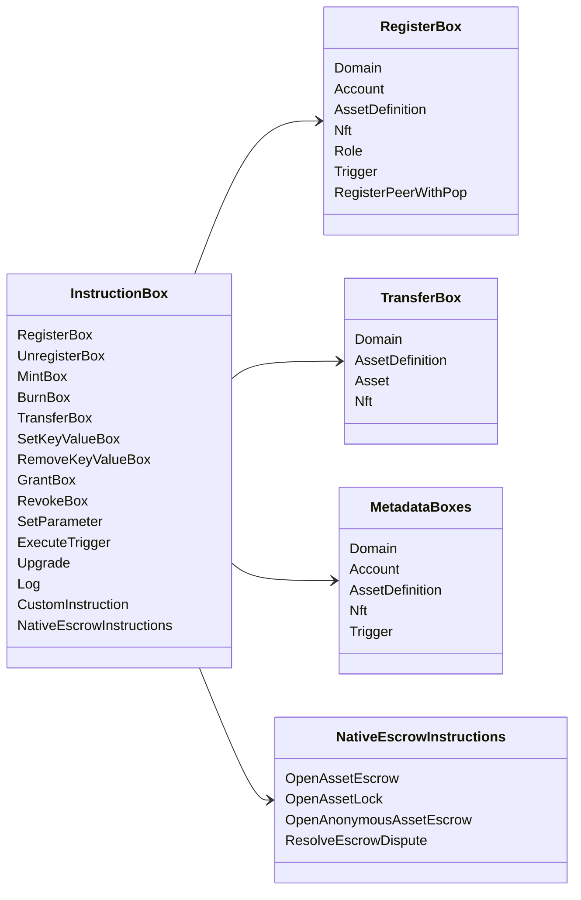

# Iroha Ko‘rsatma operatsiyalari {#iroha-special-instructions}

Joriy ma'lumotlar modeli ushbu ichki ko'rsatma oilalarini ochib beradi:

|Ko'rsatma|Variantlar|
| --- | --- |
| [`RegisterBox`](/uz/blockchain/instructions.md#un-register) | `Domain`, `Account`, `AssetDefinition`, `Nft`, `Role`, `Trigger`, `RegisterPeerWithPop` |
| [`UnregisterBox`](/uz/blockchain/instructions.md#un-register) | `Peer`, `Domain`, `Account`, `AssetDefinition`, `Nft`, `Role`, `Trigger` |
| [`MintBox`](/uz/blockchain/instructions.md#mint-burn) |raqamli `Asset`, takrorlashlarni ishga tushirish|
| [`BurnBox`](/uz/blockchain/instructions.md#mint-burn) |raqamli `Asset`, takrorlashlarni ishga tushirish|
| [`TransferBox`](/uz/blockchain/instructions.md#transfer) | `Domain`, `AssetDefinition`, sonli `Asset`, `Nft` |
| [`SetKeyValueBox`](/uz/blockchain/instructions.md#setkeyvalue-removekeyvalue) | `Domain`, `Account`, `AssetDefinition`, `Nft`, `Trigger` meta ma'lumot|
| [`RemoveKeyValueBox`](/uz/blockchain/instructions.md#setkeyvalue-removekeyvalue) | `Domain`, `Account`, `AssetDefinition`, `Nft`, `Trigger` meta ma'lumot|
| [`GrantBox`](/uz/blockchain/instructions.md#grant-revoke) | `Permission` (`Grant<Permission, Account>`), `Role` (`Grant<RoleId, Account>`), `RolePermission` (`Grant<Permission, Role>`) |
| [`RevokeBox`](/uz/blockchain/instructions.md#grant-revoke) | `Permission` (`Revoke<Permission, Account>`), `Role` (`Revoke<RoleId, Account>`), `RolePermission` (`Revoke<Permission, Role>`) |
| [`SetParameter`](/uz/blockchain/instructions.md#setparameter) |zanjir parametrini yangilash|
| [`ExecuteTrigger`](/uz/blockchain/instructions.md#executetrigger) |ishga tushirishni amalga oshirish|
| [`Upgrade`](/uz/blockchain/instructions.md#other-instructions) |ijrochi yangilanishi|
| [`Log`](/uz/blockchain/instructions.md#other-instructions) |ijrochi jurnal yozuvi|
| [`CustomInstruction`](/uz/blockchain/instructions.md#other-instructions) |ijrochi-ga xos JSON yuk|
| [Mahalliy aktiv depoziti](/uz/blockchain/escrow.md) | `OpenAssetEscrow`, `AcceptAssetEscrow`, `MarkEscrowPaymentSent`, `ReleaseAssetEscrow`, `CancelAssetEscrow`, `OpenEscrowDispute`, `ResolveEscrowDispute` |
| [Umumiy aktiv qulflari](/uz/blockchain/escrow.md#generic-asset-locks) | `OpenAssetLock`, `DrawdownAssetLock`, `CancelAssetLock`, `ExpireAssetLock` |
| [Anonim aktiv depoziti](/uz/blockchain/escrow.md#anonymous-escrow) |`OpenAnonymousAssetEscrow`, `AcceptAnonymousAssetEscrow`, `MarkAnonymousEscrowPaymentSent`, `ReleaseAnonymousAssetEscrow`, `CancelAnonymousAssetEscrow`, `OpenAnonymousEscrowDispute`, `ResolveAnonymousEscrowDispute`|
| [Atomik shaxsiy moliyaviy tranzaksiya hisob-kitobi](/uz/blockchain/instructions.md#atomic-private-settlement) | `ActivatePrivateSettlementPoolV1`, `RotatePrivateSettlementPoolPolicyV1`, `FinalizeAtomicPrivateSettlementV1`, `AbortAtomicPrivateSettlementV1` |

Qo'shimcha Iroha 3 modullar domenga xos ko'rsatma turlarini ko'rsatmalar reestri orqali ro'yxatdan o'tkazishi mumkin. Tugun-avtorizatsiya qiluvchi sxema va uni ushlaydigan buyruq uchun [Ma'lumotlar modeli sxemasi](./data-model-schema.md) ga qarang.

::: details Diagramma: Asosiy Buyruq Oilalari

:::
