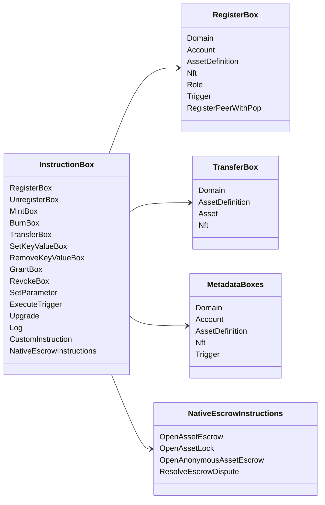

# Iroha Maxsus ko'rsatmalar {#iroha-special-instructions}

Joriy ma'lumotlar modeli ushbu o'rnatilgan ta'lim oilalarini aniqlaydi:

|Koʻrsatmalar |Variantlari |
| --- | --- |
| [`RegisterBox`](/uz/blockchain/instructions.md#un-register) | `Domain`, `Account`, `AssetDefinition`, `Nft`, `Role`, `Trigger`, `RegisterPeerWithPop` |
| [`UnregisterBox`](/uz/blockchain/instructions.md#un-register) | `Peer`, `Domain`, `Account`, `AssetDefinition`, `Nft`, `Role`, `Trigger` |
| [`MintBox`](/uz/blockchain/instructions.md#mint-burn) |raqamli `Asset`, takrorlashlarni qo'zg'atish |
| [`BurnBox`](/uz/blockchain/instructions.md#mint-burn) |raqamli `Asset`, takrorlashlarni qo'zg'atish |
| [`TransferBox`](/uz/blockchain/instructions.md#transfer) |`Domain`, `AssetDefinition`, raqamli `Asset`, `Nft` |
| [`SetKeyValueBox`](/uz/blockchain/instructions.md#setkeyvalue-removekeyvalue) | `Domain`, `Account`, `AssetDefinition`, `Nft`, `Trigger` Metadatalar |
| [`RemoveKeyValueBox`](/uz/blockchain/instructions.md#setkeyvalue-removekeyvalue) | `Domain`, `Account`, `AssetDefinition`, `Nft`, `Trigger` Metadatalar |
| [`GrantBox`](/uz/blockchain/instructions.md#grant-revoke) |hisobini yuritish uchun ruxsat, ro'yxatga olish uchun ruxsat, rolni bajarish uchun ruxsat |
| [`RevokeBox`](/uz/blockchain/instructions.md#grant-revoke) |hisobdan ruxsat, hisobdan ro'l, roldan ruxsat |
| [`SetParameter`](/uz/blockchain/instructions.md#setparameter) |zanjir parametrlarini yangilash |
| [`ExecuteTrigger`](/uz/blockchain/instructions.md#executetrigger) |qoʻzgʻatish bajarilishi |
| [`Upgrade`](/uz/blockchain/instructions.md#other-instructions) |ijrochi yangilanishi |
| [`Log`](/uz/blockchain/instructions.md#other-instructions) |ijrochi roʻyxatga olish |
| [`CustomInstruction`](/uz/blockchain/instructions.md#other-instructions) |Ijrochiga xos JSON foydali yuk |
| [Asosiy aktivlar garovi](/uz/blockchain/escrow.md) | `OpenAssetEscrow`, `AcceptAssetEscrow`, `MarkEscrowPaymentSent`, `ReleaseAssetEscrow`, `CancelAssetEscrow`, `OpenEscrowDispute`, `ResolveEscrowDispute` |
| [Umumiy aktivlar qulflari](/uz/blockchain/escrow.md#generic-asset-locks) |`OpenAssetLock`, `DrawdownAssetLock`, `CancelAssetLock`, `ExpireAssetLock` |
| [Anonim aktivlar garovi](/uz/blockchain/escrow.md#anonymous-escrow) | `OpenAnonymousAssetEscrow`, `AcceptAnonymousAssetEscrow`, `MarkAnonymousEscrowPaymentSent`, `ReleaseAnonymousAssetEscrow`, `CancelAnonymousAssetEscrow`, `OpenAnonymousEscrowDispute`, `ResolveAnonymousEscrowDispute` |

Qo'shimcha Iroha 3 modullari ko'rsatmalar reyestri orqali domenga mos ko'rsatma turlarini ro'yxatdan o'tkazishi mumkin. Joriy manba daraxtidan hosil qilingan sxema-darajali ro'yxat uchun [Ma'lumotlar modeli sxemasi](./data-model-schema.md) ni ko'ring.

::: details Diagramma: Oilalarning asosiy ta'limotlari

:::
