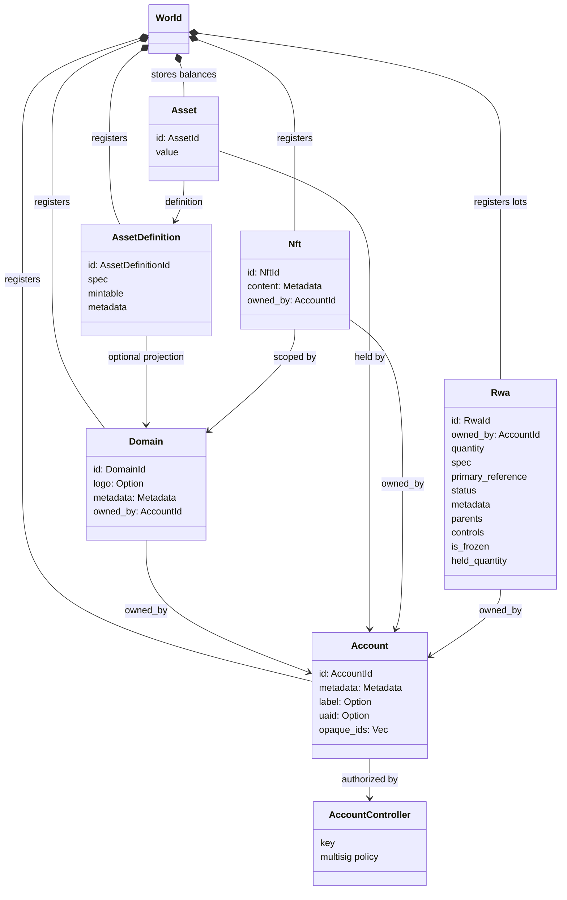
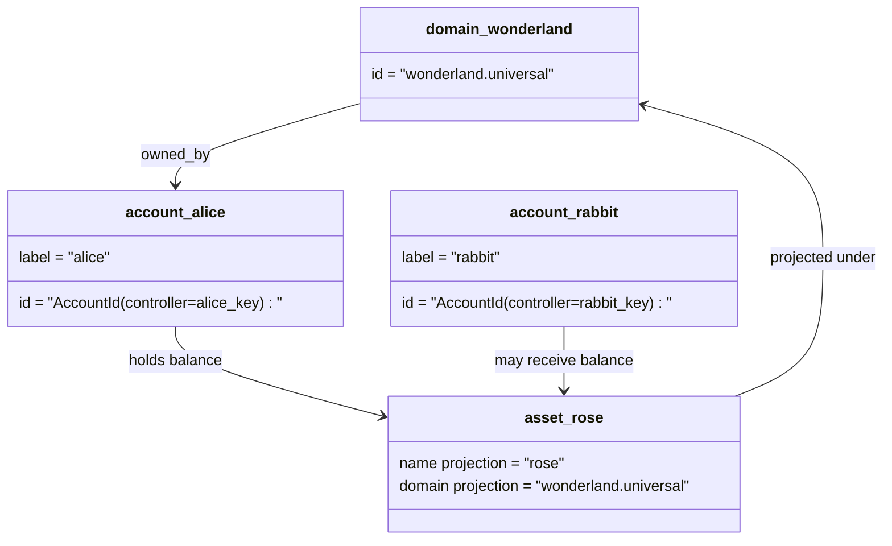

# 数据模型 {#data-model}

Iroha 在美国 `World`. 它的首次发布数据模型使用
以下法定身份和实体:

- 例如,域名是数据空间合格的. `payments.universal`
- 账户是可信的,无域名; ID 是从
  账户管理员
- 资产定义可以保持域名投影,但它们的定律
  文本地址是不透明的Base58标识符
- 资产是特定资产定义的账户持有的余额
- NFTs 具有域名资格的单独所有权记录 IDs 和元数据
  内容
- RWAs 产生的ID 代表现有链外资产的分数
  所有者,数量,来源,元数据,存储,结和生命周期
  控制

## 举个例子 {#example}

在一个 Iroha 3 网络, `wonderland.universal` 是一个域在
`universal` 在这个例子中,可视账户是控制的.
通过其密钥或政策编码为无域名 I105 账户 IDs. 可阅读
标签: `alice@wonderland.universal` 是单独的称,与这些
IDs. 预测的资产定义仍然可以从一个领域和
名称如 `rose` 在 `wonderland.universal`, 而正宗资产
在电线上使用的定义地址是生成的Base58地址.

## 别名 {#aliases}

姓氏是面向人类的名字,
它们在 API, CLI, 钱包和探险家的边界,但正规
IDs 保持在严格的账本领域存储的稳定标识符.

| 目标         | 标准目标                                    | 字面上的号                                          | 支持模式                                                                 |
| -------------- | --------------------------------------------------- | ------------------------------------------------------ | ----------------------------------------------------------------------------- |
| 用户帐户   | 无域名 `AccountId` 编码为 I105 地址   | `name@domain.dataspace` 或 `name@dataspace`            | `AccountAlias`; 主要的别名是 `Account.label`, 额外的号是结合  |
| 资产定义 | 圣经 `AssetDefinitionId` 基58地址     | `name#domain.dataspace` 或 `name#dataspace`            | `AssetDefinitionAlias` 绑定到资产定义                           |
| 合同       | 经典的贝赫32m `ContractAddress`                 | `name::domain.dataspace` 或 `name::dataspace`          | `ContractAlias` 绑定到部署的合同地址                          |
| 域名    | `DomainId` 在 `domain.dataspace` 形式               | `domain.dataspace`                                    | SNS `domain` 名称空间记录                                                 |
| 数据空间名称 | 数字 `DataSpaceId` 活跃的 Nexus 标签 | 数据空间别名,如 `universal`, `paynet`, 或 `zk` | SNS `dataspace` 名称空间记录加上活跃的数据空间目录            |

账户号是面向用户的帐户名称.
由于号指向了活跃账户 ID 通过世界国家
索引和账户回复记录. `SetPrimaryAccountAlias` 对于
账户的主要标签, `SetAccountAliasBinding` 对于额外的非初级
别名,以及 `FindAccountByAlias` 或 `FindAliasesByAccountId` 对于阅读.
账户的姓名通常需要一个活跃的 SNS 收购的账户租
在 `AcquireAccountAliasLease` 和更新 `RenewAccountAliasLease`.

资产别名名称资产定义,而不是个人账户余额.
代名字和合同代名字是直接从可读的名字对一个
现有可行目标.资产别名设置为 `SetAssetDefinitionAlias`;
别名名称段必须匹配资产定义显示名称或
预测定义名称.合同别名设置为 `SetContractAlias`;
别名数据空间必须与合同地址编码的数据空间相匹配.
两种结合可以携带 `lease_expiry_ms`; 过期后,它们停止解决
当恩典窗口过去,并被扫除了世界国家指数.

域没有单独的域名 `DomainAlias` 域名标识符是
已有数据空间资格的名称,如 `payments.universal`. SNS 轨迹
租所有权 `domain` 名称空间和数据空间
其他名字 `dataspace` 预留的名字空间 `universal` 数据空间别名
必须保持定义.

## 相关文件 {#related-docs}

| 主题                                  | 我们要去哪里?                                 |
| -------------------------------------- | ------------------------------------------- |
| 域名                                | [域名](/zh-hans/blockchain/domains.md)           |
| 账户                               | [账户](/zh-hans/blockchain/accounts.md)         |
| 资产                                 | [资产](/zh-hans/blockchain/assets.md)             |
| NFTs                                   | [NFTs](/zh-hans/blockchain/nfts.md)                 |
| 现实资产                      | [现实世界资产](/zh-hans/blockchain/rwas.md)    |
| 数据表                               | [数据表](/zh-hans/blockchain/metadata.md)         |
| 注册和转让说明 | [指示](/zh-hans/blockchain/instructions.md) |
| 运行时间权限                    | [许可证](/zh-hans/blockchain/permissions.md)   |
| 命名规则                           | [命名规则](/zh-hans/reference/naming.md)        |
