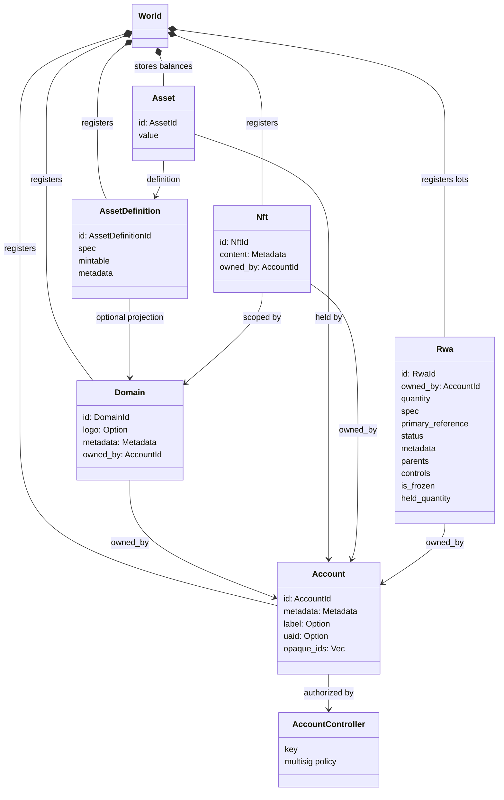
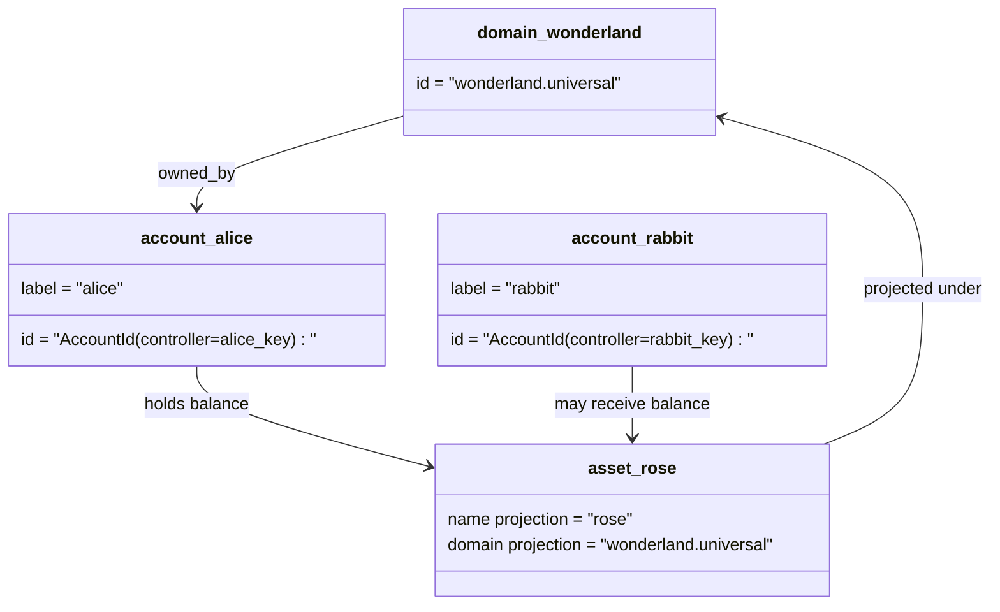

# 数据模型 {#data-model}

Iroha 在 `World` 中存储账本状态。其首个版本的数据模型使用以下规范身份和实体：

- 域名具有数据空间资格,例如 `payments.universal`
- 账户是规范的,无域名;账户 ID 来自账户管理员.
- 资产定义可以保留域名投影,但它们的标准文本地址是不透明的Base58标识符
- 资产是指对特定资产定义的账户持有的余额
- NFTs 是具有域名资格的 IDs 和元数据含量的独有的记录.
- RWAs 产生的-ID 分数代表了链外资产,目前拥有者,数量,来源,元数据,存储,结和生命周期控制.

## 举例 {#example}

在 Iroha 3 网络中, `wonderland.universal` 是`universal` 数据空间内的域名.本示例中的规范账户由其密钥或政策控制,并编码为无域名的 I105 帐户 IDs.可读标签如`alice@wonderland.universal`是与 IDs 联系的单独号.预测资产定义仍然可以从 `wonderland.universal` 中的域名和名称中构建`rose`,而在线上使用的规范资产定义地址是生成的Base58地址.

## 姓名 {#aliases}

别名是面向人类的名称,叠加在规范账本标识符上.它们在 API, CLI,钱包和探险器边界中有用,但规范 IDs 仍然是严格账本领域存储的稳定标识符.

|目标|标志性目标|字面上的号|支持模式|
| -------------- | --------------------------------------------------- | ------------------------------------------------------ | ----------------------------------------------------------------------------- |
|用户帐户|无域名 `AccountId`编码为 I105 地址 |`name@domain.dataspace`或 `name@dataspace` |`AccountAlias`;主要别名为 `Account.label`,额外别名是结合性的 |
|资产定义|规范的 `AssetDefinitionId` Base58 地址 |`name#domain.dataspace`或 `name#dataspace` |`AssetDefinitionAlias` 绑定到资产定义|
|合同|正文 Bech32m `ContractAddress` |`name::domain.dataspace`或 `name::dataspace` |`ContractAlias` 绑定到部署的合同地址|
|域名| `DomainId` 在 `domain.dataspace` 形式               |`domain.dataspace`|SNS `domain`名称空间记录|
|数据域名 |从活跃的 Nexus 目录中的数值 `DataSpaceId` |数据空间别名,例如 `universal`, `paynet`或 `zk` |SNS `dataspace`名区记录加上活跃的数据空间目录 |

账户别名是面向用户的账户名称。账户重新设定密钥后，别名仍然有效，因为它会通过世界状态索引和账户密钥变更记录指向活跃的账户 ID。使用 `SetPrimaryAccountAlias` 设置账户的主要标签，使用 `SetAccountAliasBinding` 设置其他非主要别名，并使用 `FindAccountByAlias` 或 `FindAliasesByAccountId` 进行读取。账户别名通常需要一项有效的 SNS 账户别名租约，该租约通过 `AcquireAccountAliasLease` 获取，并通过 `RenewAccountAliasLease` 续期。

资产别名命名的是资产定义，而不是单个账户余额。资产别名和合约别名把一个可读名称直接绑定到现有规范目标。使用 `SetAssetDefinitionAlias` 设置资产别名；别名的名称段必须与资产定义的显示名称或投影定义名称匹配。使用 `SetContractAlias` 设置合约别名；别名的数据空间必须与合约地址中编码的数据空间匹配。两种绑定都可以携带 `lease_expiry_ms`；到期后，宽限窗口一旦结束，它们就会停止解析，并从世界状态索引中清除。

域名没有单独的 `DomainAlias`对象.一个域名标识符已经是一个数据空间合格的名字,如`payments.universal`. SNS 追踪租所有权在 `domain`命名空间中的域名和`dataspace`名称空间中的数据空间别名.保留的 `universal`数据空间别必须保持定义.

## 相关文件 {#related-docs}

|主题|我们要去哪里?|
| -------------------------------------- | ------------------------------------------- |
|域名| [域名](/zh-hans/blockchain/domains.md)|
|账户| [账户](/zh-hans/blockchain/accounts.md)|
|资产| [资产](/zh-hans/blockchain/assets.md)|
|NFTs| [NFTs](/zh-hans/blockchain/nfts.md) |
|现实世界资产| [现实世界资产](/zh-hans/blockchain/rwas.md)|
|超级数据| [数据表](/zh-hans/blockchain/metadata.md)|
|登记和转移指令| [指示](/zh-hans/blockchain/instructions.md) |
|运行时权限| [许可证](/zh-hans/blockchain/permissions.md)|
|命名规则| [命名规则](/zh-hans/reference/naming.md) |
