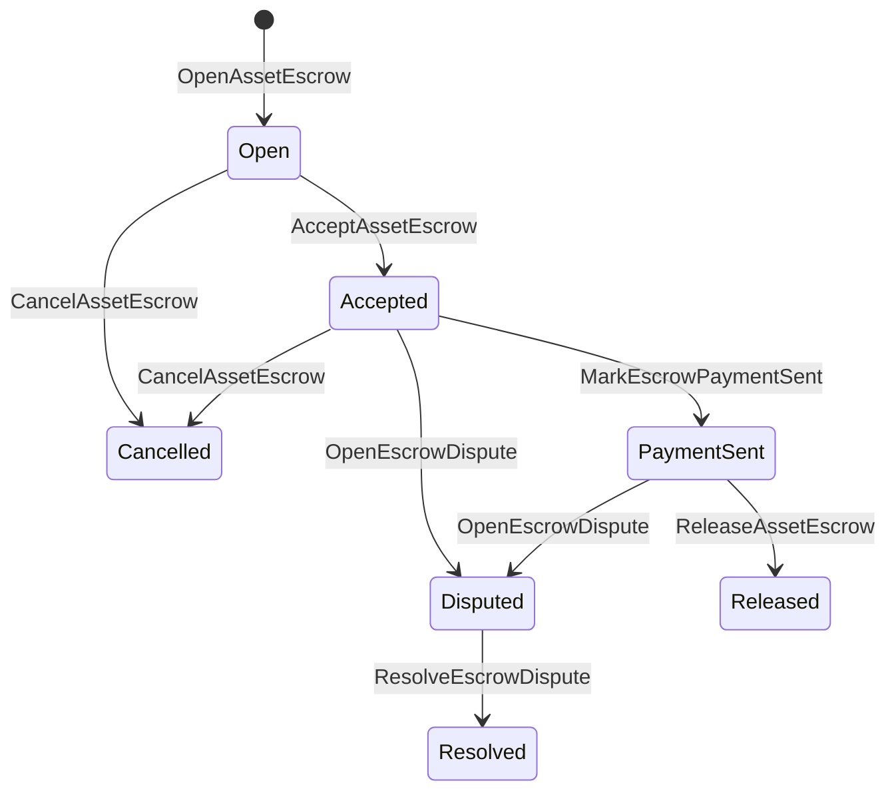

# 产业资产保证 {#native-asset-escrow}

本地保证是对数值资产进行账本管理的保管机制.而不是将资产发送到应用程序拥有的帐户,并依赖应用程序代码来保护该帐户,托管 ISIs 将价值转移到确定性协议保管账户中,并记录托管的生命周期在世界状态.

使用本地保证金用于市场结算,Aitai式的链外支付协调,里程碑锁和需要账本可见生命周期状态的保护保证金工作流.

## 概念 {#concepts}

|概念|描述|
| --- | --- |
|`EscrowId`|被调用者选择的标识符包裹一个哈希. 在透明和匿名的保证券中,它必须是独特的. |
|`AssetEscrowRecord`|透明的数值资产保证或锁定记录.|
|`AnonymousAssetEscrowRecord`|通过无效证书,承诺和证明附件支持的保证记录.|
|托管账户|来自链 ID,保证券 ID 和资产定义的确定性协议账户. |
|证据的.|证据哈希可以识别账单,判决,消息,存储表或其他离链的证据.证据的有效载荷本身没有存储在保险记录中. |

透明记录包含卖方,选购者,资产定义,总额,保管账户,生命周期状况,行为类型,剩余金额,选择性释放权限,可选的过期时间印,证据哈希,时间印和可选的解决细节.

担保金额必须是正数资产量,并且必须符合资产定义的数值规范.当担保金或锁存活时,通用资产转让不能耗尽保管账户;以下描述的担保金 ISIs 是担保金的退出路径.

## 市场保证金 {#marketplace-escrow}

市场托管协调链上资产释放与链外支付或交货工作流程.



|ISI|谁提出了?|影响|
| --- | --- | --- |
|`OpenAssetEscrow`|卖家|锁定卖方数值资产在协议保管中,并创建一个 `Open`市场记录. |
|`AcceptAssetEscrow`|买家|记录买方并将 `Open`转移到 `Accepted`.卖方不能接受自己的保证金. |
|`MarkEscrowPaymentSent`|接受的买家|在买方发送链外支付后,转移`Accepted`到 `PaymentSent`. |
|`ReleaseAssetEscrow`|卖家|转移`PaymentSent`到 `Released`并将全部保证金转移给买方. |
|`CancelAssetEscrow`|卖家|转移 `Open`或 `Accepted`到 `Cancelled`并在支付标记之前退款给卖方. |
|`OpenEscrowDispute`|卖家或被接受的买家|移动 `Accepted`或 `PaymentSent`到 `Disputed`,并添加证据. |
|`ResolveEscrowDispute`|在 `CanResolveEscrowDispute` 中的账户|转移`Disputed`到 `Resolved`,并将金额分为买方和卖方. |

争端解决金额必须是非负面的,并且 `buyer_amount + seller_amount`必须等于保证金金额.零价值的腿被允许,但整个分开必须占锁定余额.

### Rust 举例 {#rust-example}

这种例子假设卖方和买方的账户已经存在,资产定义被注册为数值,并且卖方有足够的余额.

```rust
use iroha::{
    client::Client,
    data_model::{
        isi::escrow::{
            AcceptAssetEscrow, MarkEscrowPaymentSent, OpenAssetEscrow,
            ReleaseAssetEscrow,
        },
        prelude::*,
    },
};
use iroha_crypto::Hash;

fn release_marketplace_escrow(
    seller_client: &Client,
    buyer_client: &Client,
    asset_definition_id: AssetDefinitionId,
) -> eyre::Result<()> {
    let escrow_id = EscrowId::new(Hash::new("docs-marketplace-escrow-001"));

    seller_client.submit_blocking(OpenAssetEscrow::with_evidence_hashes(
        escrow_id,
        asset_definition_id,
        Numeric::from(40_u64),
        vec![Hash::new("invoice:2026-001")],
    ))?;

    buyer_client.submit_blocking(AcceptAssetEscrow::new(escrow_id))?;
    buyer_client.submit_blocking(MarkEscrowPaymentSent::new(escrow_id))?;
    seller_client.submit_blocking(ReleaseAssetEscrow::new(escrow_id))?;

    let record = seller_client.query_single(FindAssetEscrowById::new(escrow_id))?;
    assert_eq!(record.status, AssetEscrowStatus::Released);
    assert_eq!(record.remaining_amount, Numeric::zero());

    Ok(())
}
```

## 一般资产锁 {#generic-asset-locks}

资产锁使用相同的保管记录类型,但它们不是买家-卖家的报价.它们锁定了目的地账户的资金,并需要另一个发放权限部门提取资金.

|ISI|谁提出了?|影响|
| --- | --- | --- |
|`OpenAssetLock`|来源账户|锁定正额,记录目的地作为记录买家,并设置状态为 `Locked`. |
|`DrawdownAssetLock`|没有设置的释放权限,或目的地|转移部分或全部剩余的监护到目的地.|
|`CancelAssetLock`|锁打开器|取消一个活跃的锁,并退还剩余的金额给打开器. |
|`ExpireAssetLock`|经过最后期限后的任何交易权威机构|在过去使用 `expires_at_ms` 的锁期到期,并将剩余的金额退还给打开器. |

`DrawdownAssetLock`在 `Locked`中保持记录,而部分数额仍然存在.当剩余数量达到零时,状态将成为`DrawnDown`,并且记录会关闭.

```rust
use iroha::{
    client::Client,
    data_model::{
        isi::escrow::{CancelAssetLock, DrawdownAssetLock, ExpireAssetLock, OpenAssetLock},
        prelude::*,
    },
};
use iroha_crypto::Hash;

fn drawdown_and_close_asset_locks(
    opener_client: &Client,
    destination_client: &Client,
    release_authority_client: &Client,
    asset_definition_id: AssetDefinitionId,
    destination: AccountId,
    release_authority: AccountId,
) -> eyre::Result<()> {
    let trusted_lock_id = EscrowId::new(Hash::new("docs-asset-lock-trusted"));

    opener_client.submit_blocking(OpenAssetLock::with_options(
        trusted_lock_id,
        asset_definition_id.clone(),
        destination.clone(),
        Numeric::from(40_u64),
        Some(release_authority),
        None,
        vec![Hash::new("milestone-plan-v1")],
    ))?;

    release_authority_client.submit_blocking(DrawdownAssetLock::new(
        trusted_lock_id,
        Numeric::from(15_u64),
    ))?;

    let partially_drawn =
        opener_client.query_single(FindAssetEscrowById::new(trusted_lock_id))?;
    assert_eq!(partially_drawn.status, AssetEscrowStatus::Locked);
    assert_eq!(partially_drawn.remaining_amount, Numeric::from(25_u64));

    opener_client.submit_blocking(CancelAssetLock::new(trusted_lock_id))?;
    let cancelled = opener_client.query_single(FindAssetEscrowById::new(trusted_lock_id))?;
    assert_eq!(cancelled.status, AssetEscrowStatus::Cancelled);

    let expiring_lock_id = EscrowId::new(Hash::new("docs-asset-lock-expiring"));
    opener_client.submit_blocking(OpenAssetLock::with_options(
        expiring_lock_id,
        asset_definition_id,
        destination,
        Numeric::from(10_u64),
        None,
        Some(0),
        Vec::new(),
    ))?;

    destination_client.submit_blocking(ExpireAssetLock::new(expiring_lock_id))?;
    let expired = opener_client.query_single(FindAssetEscrowById::new(expiring_lock_id))?;
    assert_eq!(expired.status, AssetEscrowStatus::Expired);

    Ok(())
}
```

Python 目前暴露了一般锁的高级辅助器: `open_asset_lock`, `drawdown_asset_lock`, `cancel_asset_lock`, 和 `expire_asset_lock`. 对于市场和匿名的保证金 Python, 使用法典 `InstructionBox` JSON 通过 SDK 现在, JSON 逃离门,或通过一个 SDK 这揭示了一流的保证金制造商.

## 争议 {#disputes}

一个市场托管可以从 `Accepted`或 `PaymentSent`进入争端.只有注册的卖家或买家才能打开争端.解决需要 `CanResolveEscrowDispute`,无论是直接向解决者账户授予,还是通过角色继承.

```rust
use iroha::{
    client::Client,
    data_model::{
        isi::escrow::{OpenEscrowDispute, ResolveEscrowDispute},
        prelude::*,
    },
};
use iroha_crypto::Hash;
use iroha_executor_data_model::permission::escrow::CanResolveEscrowDispute;

fn resolve_disputed_escrow(
    admin_client: &Client,
    buyer_client: &Client,
    court_client: &Client,
    court: AccountId,
    escrow_id: EscrowId,
) -> eyre::Result<()> {
    admin_client.submit_blocking(Grant::account_permission(
        Permission::from(CanResolveEscrowDispute),
        court,
    ))?;

    buyer_client.submit_blocking(OpenEscrowDispute::with_evidence_hashes(
        escrow_id,
        vec![Hash::new("buyer-payment-receipt")],
    ))?;

    court_client.submit_blocking(ResolveEscrowDispute::with_evidence_hashes(
        escrow_id,
        Numeric::from(30_u64),
        Numeric::from(10_u64),
        vec![Hash::new("court-judgement-001")],
    ))?;

    let record = admin_client.query_single(FindAssetEscrowById::new(escrow_id))?;
    assert_eq!(record.status, AssetEscrowStatus::Resolved);
    assert_eq!(
        record.resolution.as_ref().map(|resolution| resolution.buyer_amount.clone()),
        Some(Numeric::from(30_u64)),
    );

    Ok(())
}
```

## 匿名的保证金 {#anonymous-escrow}

匿名保证券使用相同的市场生命周期,但资金和关闭资产的流动都受到保护.公开记录仍然存储卖方,买家,状态,证据哈希,时刻印章和与证据链接的移动记录.屏蔽笔记中的数额和收件人以承诺,废除符和证据附件表示.

|透明 ISI |匿名 ISI|
| --- | --- |
|`OpenAssetEscrow`|`OpenAnonymousAssetEscrow`|
|`AcceptAssetEscrow`|`AcceptAnonymousAssetEscrow`|
|`MarkEscrowPaymentSent`|`MarkAnonymousEscrowPaymentSent`|
|`ReleaseAssetEscrow`|`ReleaseAnonymousAssetEscrow`|
|`CancelAssetEscrow`|`CancelAnonymousAssetEscrow`|
|`OpenEscrowDispute`|`OpenAnonymousEscrowDispute`|
|`ResolveEscrowDispute`|`ResolveAnonymousEscrowDispute`|

钱包或证明工具必须构建证据附件和公共输入.开放创造了一个保险承诺.释放,取消和匿名纠纷解决必须花费一个保险承诺并创建该行动所需的买方,卖方或分产承诺.

```rust
use iroha::{
    client::Client,
    data_model::{
        isi::escrow::{
            AcceptAnonymousAssetEscrow, MarkAnonymousEscrowPaymentSent,
            OpenAnonymousAssetEscrow,
        },
        prelude::*,
        proof::ProofAttachment,
    },
};
use iroha_crypto::Hash;

fn open_anonymous_escrow(
    seller_client: &Client,
    buyer_client: &Client,
    escrow_id: EscrowId,
    asset_definition_id: AssetDefinitionId,
    funding_nullifiers: Vec<[u8; 32]>,
    escrow_commitment: [u8; 32],
    proof: ProofAttachment,
    root_hint: Option<[u8; 32]>,
) -> eyre::Result<()> {
    seller_client.submit_blocking(OpenAnonymousAssetEscrow::with_evidence_hashes(
        escrow_id,
        asset_definition_id,
        funding_nullifiers,
        escrow_commitment,
        proof,
        root_hint,
        vec![Hash::new("shielded-invoice")],
    ))?;

    buyer_client.submit_blocking(AcceptAnonymousAssetEscrow::new(escrow_id))?;
    buyer_client.submit_blocking(MarkAnonymousEscrowPaymentSent::new(escrow_id))?;

    Ok(())
}
```

对于底层的屏蔽交易模式,见 [匿名交易](/zh-hans/blockchain/anonymous-transactions.md).

## SDK 使用 {#sdk-usage}

在 SDKs 中,保证金支持的曝光方式不同. Rust 具有标准类型的数据模型. Python 目前暴露了通用资产锁定辅助器.JavaScript 和 TypeScript 使用 Kotodama 托管主机电话. Kotlin/JVM 和 Swift 为市场和匿名托管提供类型的有效载荷构建者.

|SDK|使用这个表面.|范围|
| --- | --- | --- |
| [Rust](#rust-sdk) |`iroha::data_model::isi::escrow`|商场托管,通用锁,匿名托管,查询和活动.|
| [Python](#python-asset-locks) |`Instruction.open_asset_lock`,`TransactionDraft.open_asset_lock`,和客户 `*_and_wait`的助手 |市场和匿名保证人还不是一流的 Python 方法. |
| [JavaScript / TypeScript](#javascript-and-typescript-kotodama) |`compileKotodamaProgram`从 `@iroha/iroha-js/kotodama-compiler` |在 Kotodama 合同中收购主机的电话. |
| [Kotlin / JVM](#kotlin-and-jvm) |在 `org.hyperledger.iroha.sdk.core.model.instructions` 中的`InstructionTemplate`类|市场和匿名的托管定制说明模板. |
| [Swift /iOS](#swift-and-ios) |`NativeEscrowInstructionBuilders`和`IrohaSDK.build*Escrow*`的助手 |市场和匿名保证人 Norito JSON 指令有效载荷. |

下面的例子侧重于指令构建. 账户融资,签名管理和交易提交遵循每个 SDK 的正常流量.

### Rust SDK {#rust-sdk}

当您需要完整的本地覆盖或查询/事件支持时使用 Rust SDK. 上面的例子显示了市场发布,通用锁定拉,争端解决和匿名保证构建与 `iroha::data_model::isi::escrow`.

```rust
use iroha::{
    client::Client,
    data_model::{isi::escrow::OpenAssetEscrow, prelude::*},
};
use iroha_crypto::Hash;

fn open_and_read(
    client: &Client,
    asset_definition_id: AssetDefinitionId,
) -> eyre::Result<AssetEscrowRecord> {
    let escrow_id = EscrowId::new(Hash::new("docs-rust-sdk-escrow"));

    client.submit_blocking(OpenAssetEscrow::new(
        escrow_id,
        asset_definition_id,
        Numeric::from(10_u64),
    ))?;

    client.query_single(FindAssetEscrowById::new(escrow_id))
}
```

### Python 资产锁定 {#python-asset-locks}

Python SDK 将一流的辅助者暴露在通用资产锁中. 使用它们进行里程碑式支付,释放权威机构的提款,开户方取消和过期退款.

```python
client.open_asset_lock_and_wait(
    chain_id="dev-chain",
    authority="<source-account-id>",
    private_key_hex="<source-private-key-hex>",
    escrow_id="merchant-lock-001",
    asset_definition_id="<asset-definition-base58>",
    destination="<destination-account-id>",
    amount="2500",
    release_authority="<trusted-release-account-id>",
    expires_at_ms=1_704_000_000_000,
)

client.drawdown_asset_lock_and_wait(
    chain_id="dev-chain",
    authority="<trusted-release-account-id>",
    private_key_hex="<trusted-release-private-key-hex>",
    escrow_id="merchant-lock-001",
    amount="1000",
)

client.expire_asset_lock_and_wait(
    chain_id="dev-chain",
    authority="<any-account-id>",
    private_key_hex="<any-private-key-hex>",
    escrow_id="merchant-lock-001",
)
```

对于双方锁,遗漏 `release_authority`;目的地账户可以提交 `drawdown_asset_lock`.

### JavaScript 和 TypeScript Kotodama {#javascript-and-typescript-kotodama}

其他 JavaScript SDK 目前没有曝光直接的本地托管交易构建者. JavaScript 或 TypeScript 部署的应用 Kotodama 合同,编译托管主机电话 Kotodama 编译器.

原生托管主机调用需要明确的访问提示,因为编译器无法为不透明托管 ISIs 获得更窄的访问集合.在出口入口点上使用呼叫`escrow_*`内置的野生卡指引.

```js
import { compileKotodamaProgram } from "@iroha/iroha-js/kotodama-compiler";

const source = `
seiyaku MarketplaceEscrow {
  meta { abi_version: 1; }

  #[access(read="*", write="*")]
  kotoage fn run() permission(Admin) {
    let asset = asset_definition("62Fk4FPcMuLvW5QjDGNF2a4jAmjM");
    let offer = name("aitai_offer");
    let evidence = norito_bytes("00");

    call escrow_open_offer(offer, asset, 10, evidence);
    call escrow_accept(offer);
    call escrow_mark_payment_sent(offer);
    call escrow_release(offer);
  }
}
`;

const compiled = compileKotodamaProgram(source, {
  sourceName: "escrow.ko",
});

if (compiled.diagnostics.length > 0) {
  throw new Error(compiled.diagnostics.map((item) => item.message).join("\n"));
}
```

在争端中,使用 `escrow_open_dispute(offer, evidence)` 和 `escrow_resolve_dispute(offer, buyer_amount, seller_amount, evidence)`.匿名托管主机调用接受 Norito 请求有效载荷字节,例如 `anonymous_escrow_open_offer(request)`.

### Kotlin 和 JVM {#kotlin-and-jvm}

Kotlin/JVM SDK 模型本地托管作为自定义指令模板.每个模板验证了所需的字段,并揭示了交易构造商使用的定律参数地图.

```kotlin
import org.hyperledger.iroha.sdk.core.model.escrow.NativeEscrowPermissions
import org.hyperledger.iroha.sdk.core.model.instructions.AcceptAssetEscrowInstruction
import org.hyperledger.iroha.sdk.core.model.instructions.MarkEscrowPaymentSentInstruction
import org.hyperledger.iroha.sdk.core.model.instructions.OpenAssetEscrowInstruction
import org.hyperledger.iroha.sdk.core.model.instructions.ReleaseAssetEscrowInstruction
import org.hyperledger.iroha.sdk.core.model.instructions.ResolveEscrowDisputeInstruction

val open = OpenAssetEscrowInstruction(
    escrowId = "escrow-hash",
    assetDefinition = "xor#wonderland",
    amount = "42.5",
    evidenceHashes = listOf("invoice-hash"),
)
val accept = AcceptAssetEscrowInstruction("escrow-hash")
val paid = MarkEscrowPaymentSentInstruction("escrow-hash")
val release = ReleaseAssetEscrowInstruction("escrow-hash")
val resolve = ResolveEscrowDisputeInstruction(
    escrowId = "escrow-hash",
    buyerAmount = "30",
    sellerAmount = "12.5",
    evidenceHashes = listOf("judgement-hash"),
)

println(open.arguments)
println(NativeEscrowPermissions.CAN_RESOLVE_ESCROW_DISPUTE)
```

匿名模板可提供: `OpenAnonymousAssetEscrowInstruction`, `AcceptAnonymousAssetEscrowInstruction`, `MarkAnonymousEscrowPaymentSentInstruction`, `ReleaseAnonymousAssetEscrowInstruction`, `CancelAnonymousAssetEscrowInstruction`, `OpenAnonymousEscrowDisputeInstruction`, 和 `ResolveAnonymousEscrowDisputeInstruction`. Android Java调用者可以使用匹配 `NativeEscrowInstructions.*` 建筑师从 Android 艺术品.

### Swift 和iOS {#swift-and-ios}

Swift SDK 将保证说明构建为 Norito JSON 的有效载荷. 直接使用 `NativeEscrowInstructionBuilders`,或者在您的应用程序已经拥有一个 `IrohaSDK`实例时,拨打对等式的 `IrohaSDK.build*Escrow*`辅助器.

```swift
import IrohaSwift

let open = try NativeEscrowInstructionBuilders.openAssetEscrow(
    escrowId: "escrow-hash",
    assetDefinition: "xor#wonderland",
    amount: "42.5",
    evidenceHashes: ["invoice-hash"]
)
let accept = try NativeEscrowInstructionBuilders.acceptAssetEscrow(
    escrowId: "escrow-hash"
)
let paid = try NativeEscrowInstructionBuilders.markEscrowPaymentSent(
    escrowId: "escrow-hash"
)
let release = try NativeEscrowInstructionBuilders.releaseAssetEscrow(
    escrowId: "escrow-hash"
)
let resolve = try NativeEscrowInstructionBuilders.resolveEscrowDispute(
    escrowId: "escrow-hash",
    buyerAmount: "30",
    sellerAmount: "12.5",
    evidenceHashes: ["judgement-hash"]
)
```

匿名的 Swift 构建者采用无效列表,输出承诺列表,证明词典和可选的 `rootHint`值.争端解决权限代币是`NativeEscrowPermissions.canResolveEscrowDispute`.

## 问题和事件 {#queries-and-events}

使用保证查询状态页面,调整工作和支持工具:

|问题|目的|
| --- | --- |
|`FindAssetEscrowById`|按 `EscrowId`阅读一个透明的保证金或锁定.|
|`FindAssetEscrows`|列出透明的托管和锁定记录.|
|`FindAssetEscrowsBySeller`|列出卖家或锁开户打开的记录. |
|`FindAssetEscrowsByBuyer`|列出买方接受的市场保证券或针对目的地锁定. |
|`FindAssetEscrowsByStatus`|在 `AssetEscrowStatus`之前列出记录. |
|`FindAnonymousAssetEscrowById`|通过 `EscrowId`阅读一个匿名的保证金.|
|`FindAnonymousAssetEscrows*`|按所有记录,卖家,买家或身份列出匿名保证金.|

`EscrowEventFilter` 可以订阅透明的本地托管和按托管锁定活动 ID, 销售者,买家,状态和事件设置面具. `Opened`, `Accepted`, `PaymentSent`, `Released`, `Cancelled`, `Expired`, `Disputed`, 和 `Resolved`. 通过匿名的托管查询来检查匿名托管记录.

## 运营说明 {#operational-notes}

- 存储大型账单,聊天日志,判断或审计包在保证金记录之外,并将它们的哈希作为证据.
- 在申请中使用稳定的 `EscrowId`衍生值,以便重新尝试不能为相同的报价创建重复保证金.
- 授予 `CanResolveEscrowDispute`仅为经营争端程序的账户或角色.
- 视支付链外验证为应用政策. Iroha 记录保管和生命周期过渡;它不单独验证法定或外部支付轨道.
