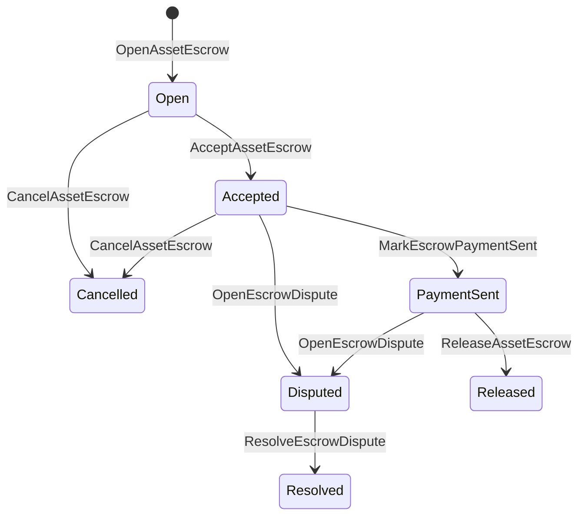

# 产业资产抵押 {#native-asset-escrow}

首发保证是数值资产的账本管理保管机制.
而不是将资产发送到申请所有账户,
申请代码保护该账户,保证 ISIs 将价值转移到
确定性协议保管账户和记录保证金的生命周期
世界国家.

用本土的保证金进行市场结算,Aitai风格的链外支付
需要的协调,里程碑锁定和保密托管工作流程
在本书中可见的生命周期状态.

## 概念 {#concepts}

| 概念 | 描述 |
| --- | --- |
| `EscrowId` | 呼叫者选择的标识符包裹一个哈希. 它必须是透明和匿名的保证券中唯一的. |
| `AssetEscrowRecord` | 透明的数字资产保证或锁定记录. |
| `AnonymousAssetEscrowRecord` | 通过无效证书,承诺和证明附件支持的保险记录. |
| 托管账户 | 从链中衍生的确定性协议账户 ID, 托管 ID, 和资产的定义. |
| 证据的哈希 | 账单,判决,消息,存储表或其他链外证据. |

透明的记录包括卖家,选购者,资产定义,
总额,托管账户,生命周期状况,行为类型,剩余
额外的资金,可选释放权限,可选到期时间表,证据
哈希,时间和可选的分辨率详细信息.

担保金额必须是正数资产量,
资产定义的数值规格.
一般资产转移不能耗尽保险账户;保险退出
路径是保证金 ISIs 下面所述.

## 市场保证金 {#marketplace-escrow}

市场托管协调在链上释放的资产与离线的资产
支付或交付工作流程.



| ISI | 谁提交它 | 影响 |
| --- | --- | --- |
| `OpenAssetEscrow` | 卖家 | 锁定出售商的数值资产在协议保管中,并创建一个 `Open` 市场记录. |
| `AcceptAssetEscrow` | 买家 | 记录买家和移动 `Open` 在 `Accepted`. 卖家不能接受自己的保证金. |
| `MarkEscrowPaymentSent` | 接受的买家 | 移动 `Accepted` 在 `PaymentSent` 在买方发送外链支付后. |
| `ReleaseAssetEscrow` | 卖家 | 移动 `PaymentSent` 在 `Released` 并将全部保证金转移给买方. |
| `CancelAssetEscrow` | 卖家 | 移动 `Open` 或 `Accepted` 在 `Cancelled` 在支付标记之前,将退款给卖方. |
| `OpenEscrowDispute` | 卖方或被接受的买家 | 移动 `Accepted` 或 `PaymentSent` 在 `Disputed` 并且添加了证据. |
| `ResolveEscrowDispute` | 账户与 `CanResolveEscrowDispute` | 移动 `Disputed` 在 `Resolved` 买家和卖方之间分开了这个金额. |

争端解决金额必须非负数,
`buyer_amount + seller_amount` 必须等于保证金额.
腿可以,但整个分断必须考虑到锁定的平衡.

### Rust 举个例子 {#rust-example}

这种例子假设卖家和买家账户已经存在,资产
销售者有足够的平衡.

```rust
use iroha::{
    client::Client,
    data_model::{
        isi::escrow::{
            AcceptAssetEscrow, MarkEscrowPaymentSent, OpenAssetEscrow,
            ReleaseAssetEscrow,
        },
        prelude::*,
    },
};
use iroha_crypto::Hash;

fn release_marketplace_escrow(
    seller_client: &Client,
    buyer_client: &Client,
    asset_definition_id: AssetDefinitionId,
) -> eyre::Result<()> {
    let escrow_id = EscrowId::new(Hash::new("docs-marketplace-escrow-001"));

    seller_client.submit_blocking(OpenAssetEscrow::with_evidence_hashes(
        escrow_id,
        asset_definition_id,
        Numeric::from(40_u64),
        vec![Hash::new("invoice:2026-001")],
    ))?;

    buyer_client.submit_blocking(AcceptAssetEscrow::new(escrow_id))?;
    buyer_client.submit_blocking(MarkEscrowPaymentSent::new(escrow_id))?;
    seller_client.submit_blocking(ReleaseAssetEscrow::new(escrow_id))?;

    let record = seller_client.query_single(FindAssetEscrowById::new(escrow_id))?;
    assert_eq!(record.status, AssetEscrowStatus::Released);
    assert_eq!(record.remaining_amount, Numeric::zero());

    Ok(())
}
```

## 一般资产锁 {#generic-asset-locks}

资产锁使用相同的保管记录类型,但它们不是买家-卖家
它们锁定了目的地账户的资金,
单独的发放权限提取资金.

| ISI | 谁提交它 | 影响 |
| --- | --- | --- |
| `OpenAssetLock` | 来源账户 | 锁定一个正数额,记录目的地作为记录买家,并设置状态为 `Locked`. |
| `DrawdownAssetLock` | 如果没有设置的释放权,释放权或目的地 | 转移剩余的监护部分或全部到目的地. |
| `CancelAssetLock` | 锁打开器 | 取消一个活跃的锁,并将剩余的金额退还给打开器. |
| `ExpireAssetLock` | 经过最后期限后的任何交易权威机构 | 关闭的时间过去了. `expires_at_ms` 在过去,并将剩余的金额退还给开放者. |

`DrawdownAssetLock` 保存记录 `Locked` 在部分资金仍然存在时.
当剩余的数量达到零时,状态会变为 `DrawnDown` 并且
记录已关闭.

```rust
use iroha::{
    client::Client,
    data_model::{
        isi::escrow::{CancelAssetLock, DrawdownAssetLock, ExpireAssetLock, OpenAssetLock},
        prelude::*,
    },
};
use iroha_crypto::Hash;

fn drawdown_and_close_asset_locks(
    opener_client: &Client,
    destination_client: &Client,
    release_authority_client: &Client,
    asset_definition_id: AssetDefinitionId,
    destination: AccountId,
    release_authority: AccountId,
) -> eyre::Result<()> {
    let trusted_lock_id = EscrowId::new(Hash::new("docs-asset-lock-trusted"));

    opener_client.submit_blocking(OpenAssetLock::with_options(
        trusted_lock_id,
        asset_definition_id.clone(),
        destination.clone(),
        Numeric::from(40_u64),
        Some(release_authority),
        None,
        vec![Hash::new("milestone-plan-v1")],
    ))?;

    release_authority_client.submit_blocking(DrawdownAssetLock::new(
        trusted_lock_id,
        Numeric::from(15_u64),
    ))?;

    let partially_drawn =
        opener_client.query_single(FindAssetEscrowById::new(trusted_lock_id))?;
    assert_eq!(partially_drawn.status, AssetEscrowStatus::Locked);
    assert_eq!(partially_drawn.remaining_amount, Numeric::from(25_u64));

    opener_client.submit_blocking(CancelAssetLock::new(trusted_lock_id))?;
    let cancelled = opener_client.query_single(FindAssetEscrowById::new(trusted_lock_id))?;
    assert_eq!(cancelled.status, AssetEscrowStatus::Cancelled);

    let expiring_lock_id = EscrowId::new(Hash::new("docs-asset-lock-expiring"));
    opener_client.submit_blocking(OpenAssetLock::with_options(
        expiring_lock_id,
        asset_definition_id,
        destination,
        Numeric::from(10_u64),
        None,
        Some(0),
        Vec::new(),
    ))?;

    destination_client.submit_blocking(ExpireAssetLock::new(expiring_lock_id))?;
    let expired = opener_client.query_single(FindAssetEscrowById::new(expiring_lock_id))?;
    assert_eq!(expired.status, AssetEscrowStatus::Expired);

    Ok(())
}
```

Python 目前暴露了对通用锁的高级辅助器:
`open_asset_lock`, `drawdown_asset_lock`, `cancel_asset_lock`, 并且
`expire_asset_lock`. 对于市场和匿名的保证金 Python, 使用
圣经 `InstructionBox` JSON 通过 SDK 现在 JSON 逃离口,或提交
通过一个 SDK 这揭示了第一流的保证金制造商.

## 争议 {#disputes}

市场保证可以从 `Accepted` 或 `PaymentSent`.
只有注册的卖方或买家才能开庭争端.
`CanResolveEscrowDispute`, 直接向解决方案账户提供
或通过角色继承.

```rust
use iroha::{
    client::Client,
    data_model::{
        isi::escrow::{OpenEscrowDispute, ResolveEscrowDispute},
        prelude::*,
    },
};
use iroha_crypto::Hash;
use iroha_executor_data_model::permission::escrow::CanResolveEscrowDispute;

fn resolve_disputed_escrow(
    admin_client: &Client,
    buyer_client: &Client,
    court_client: &Client,
    court: AccountId,
    escrow_id: EscrowId,
) -> eyre::Result<()> {
    admin_client.submit_blocking(Grant::account_permission(
        Permission::from(CanResolveEscrowDispute),
        court,
    ))?;

    buyer_client.submit_blocking(OpenEscrowDispute::with_evidence_hashes(
        escrow_id,
        vec![Hash::new("buyer-payment-receipt")],
    ))?;

    court_client.submit_blocking(ResolveEscrowDispute::with_evidence_hashes(
        escrow_id,
        Numeric::from(30_u64),
        Numeric::from(10_u64),
        vec![Hash::new("court-judgement-001")],
    ))?;

    let record = admin_client.query_single(FindAssetEscrowById::new(escrow_id))?;
    assert_eq!(record.status, AssetEscrowStatus::Resolved);
    assert_eq!(
        record.resolution.as_ref().map(|resolution| resolution.buyer_amount.clone()),
        Some(Numeric::from(30_u64)),
    );

    Ok(())
}
```

## 匿名的保证金 {#anonymous-escrow}

匿名保证券使用相同的市场生命周期,
公开记录仍然保留卖家,
购买者,状态,证据的哈希,时间邮票和与证据相关的移动
章内存的数额和收件人均由
在此之前,我认为这项政策是非常重要的.

| 透明 ISI | 匿名 ISI |
| --- | --- |
| `OpenAssetEscrow` | `OpenAnonymousAssetEscrow` |
| `AcceptAssetEscrow` | `AcceptAnonymousAssetEscrow` |
| `MarkEscrowPaymentSent` | `MarkAnonymousEscrowPaymentSent` |
| `ReleaseAssetEscrow` | `ReleaseAnonymousAssetEscrow` |
| `CancelAssetEscrow` | `CancelAnonymousAssetEscrow` |
| `OpenEscrowDispute` | `OpenAnonymousEscrowDispute` |
| `ResolveEscrowDispute` | `ResolveAnonymousEscrowDispute` |

钱包或检查工具必须构建证明附件和公共输入.
开放创造了一个保证金承诺.
解决争端必须支付一个保证金承诺,
购买者,卖家或分产出承诺所需的行动.

```rust
use iroha::{
    client::Client,
    data_model::{
        isi::escrow::{
            AcceptAnonymousAssetEscrow, MarkAnonymousEscrowPaymentSent,
            OpenAnonymousAssetEscrow,
        },
        prelude::*,
        proof::ProofAttachment,
    },
};
use iroha_crypto::Hash;

fn open_anonymous_escrow(
    seller_client: &Client,
    buyer_client: &Client,
    escrow_id: EscrowId,
    asset_definition_id: AssetDefinitionId,
    funding_nullifiers: Vec<[u8; 32]>,
    escrow_commitment: [u8; 32],
    proof: ProofAttachment,
    root_hint: Option<[u8; 32]>,
) -> eyre::Result<()> {
    seller_client.submit_blocking(OpenAnonymousAssetEscrow::with_evidence_hashes(
        escrow_id,
        asset_definition_id,
        funding_nullifiers,
        escrow_commitment,
        proof,
        root_hint,
        vec![Hash::new("shielded-invoice")],
    ))?;

    buyer_client.submit_blocking(AcceptAnonymousAssetEscrow::new(escrow_id))?;
    buyer_client.submit_blocking(MarkAnonymousEscrowPaymentSent::new(escrow_id))?;

    Ok(())
}
```

对于底层的屏蔽交易模式,见
[匿名交易](/zh-hans/blockchain/anonymous-transactions.md).

## SDK 使用 {#sdk-usage}

担保支在各个国家不同. SDKs. Rust 有法典的
输入数据模型. Python 目前暴露了通用资产锁定辅助器.
JavaScript 并且 TypeScript 使用 Kotodama 托管主机的电话. Kotlin/JVM 并且 Swift
为市场提供类型的有效载荷制造商和匿名保证人.

| SDK | 使用这个表面 | 范围 |
| --- | --- | --- |
| [Rust](#rust-sdk) | `iroha::data_model::isi::escrow` | 市场保证,通用锁,匿名保证,查询和活动. |
| [Python](#python-asset-locks) | `Instruction.open_asset_lock`, `TransactionDraft.open_asset_lock`, 和客户 `*_and_wait` 助手 | 总体资产锁定.市场和匿名保证人助手不是一流的 Python 没有方法. |
| [JavaScript / TypeScript](#javascript-and-typescript-kotodama) | `compileKotodamaProgram` 在 `@iroha/iroha-js/kotodama-compiler` | 托管主机打电话 Kotodama 合同. |
| [Kotlin / JVM](#kotlin-and-jvm) | `InstructionTemplate` 在 `org.hyperledger.iroha.sdk.core.model.instructions` | 市场和匿名的托管定制指令模板. |
| [Swift / iOS](#swift-and-ios) | `NativeEscrowInstructionBuilders` 并且 `IrohaSDK.build*Escrow*` 助手 | 市场和匿名保证金 Norito JSON 指示有效载荷. |

下面的例子集中在教学建设.
签名管理和交易提交遵循正常流量
每一个 SDK.

### Rust SDK {#rust-sdk}

使用 Rust SDK 如果您需要完整的本土覆盖或查询/事件支持.
上面的例子显示了市场上发布,通用锁定,争端
解决问题,以及匿名的保证金建设
`iroha::data_model::isi::escrow`.

```rust
use iroha::{
    client::Client,
    data_model::{isi::escrow::OpenAssetEscrow, prelude::*},
};
use iroha_crypto::Hash;

fn open_and_read(
    client: &Client,
    asset_definition_id: AssetDefinitionId,
) -> eyre::Result<AssetEscrowRecord> {
    let escrow_id = EscrowId::new(Hash::new("docs-rust-sdk-escrow"));

    client.submit_blocking(OpenAssetEscrow::new(
        escrow_id,
        asset_definition_id,
        Numeric::from(10_u64),
    ))?;

    client.query_single(FindAssetEscrowById::new(escrow_id))
}
```

### Python 资产锁 {#python-asset-locks}

其他 Python SDK 让一流的辅助员发现了通用资产锁.
对于里程碑式支付,释放机构的提款,
开放机和过期退款.

```python
client.open_asset_lock_and_wait(
    chain_id="dev-chain",
    authority="<source-account-id>",
    private_key_hex="<source-private-key-hex>",
    escrow_id="merchant-lock-001",
    asset_definition_id="<asset-definition-base58>",
    destination="<destination-account-id>",
    amount="2500",
    release_authority="<trusted-release-account-id>",
    expires_at_ms=1_704_000_000_000,
)

client.drawdown_asset_lock_and_wait(
    chain_id="dev-chain",
    authority="<trusted-release-account-id>",
    private_key_hex="<trusted-release-private-key-hex>",
    escrow_id="merchant-lock-001",
    amount="1000",
)

client.expire_asset_lock_and_wait(
    chain_id="dev-chain",
    authority="<any-account-id>",
    private_key_hex="<any-private-key-hex>",
    escrow_id="merchant-lock-001",
)
```

对于双方锁,省略 `release_authority`; 目的地账户可以
然后提交 `drawdown_asset_lock`.

### JavaScript 并且 TypeScript Kotodama {#javascript-and-typescript-kotodama}

其他 JavaScript SDK 目前未披露直接本地保证金交易
对于建筑师, JavaScript 或 TypeScript 部署的应用程序 Kotodama
合同,编译托管主机电话 Kotodama 编译器.

由于编译器需要明确的访问提示
无法为不透明的保证所取得更窄的访问集合 ISIs. 使用牌提示
调用的出口入口点 `escrow_*` 建筑物.

```js
import { compileKotodamaProgram } from "@iroha/iroha-js/kotodama-compiler";

const source = `
seiyaku MarketplaceEscrow {
  meta { abi_version: 1; }

  #[access(read="*", write="*")]
  kotoage fn run() permission(Admin) {
    let asset = asset_definition("62Fk4FPcMuLvW5QjDGNF2a4jAmjM");
    let offer = name("aitai_offer");
    let evidence = norito_bytes("00");

    call escrow_open_offer(offer, asset, 10, evidence);
    call escrow_accept(offer);
    call escrow_mark_payment_sent(offer);
    call escrow_release(offer);
  }
}
`;

const compiled = compileKotodamaProgram(source, {
  sourceName: "escrow.ko",
});

if (compiled.diagnostics.length > 0) {
  throw new Error(compiled.diagnostics.map((item) => item.message).join("\n"));
}
```

在争端中,使用 `escrow_open_dispute(offer, evidence)` 并且
`escrow_resolve_dispute(offer, buyer_amount, seller_amount, evidence)`.
匿名托管主机电话接受 Norito 要求有效载荷字节,例如
`anonymous_escrow_open_offer(request)`.

### Kotlin 并且 JVM {#kotlin-and-jvm}

其他 Kotlin/JVM SDK 作为自定义指令模板.
模板验证所需的字段并揭示使用的正规参数地图
交易构建者.

```kotlin
import org.hyperledger.iroha.sdk.core.model.escrow.NativeEscrowPermissions
import org.hyperledger.iroha.sdk.core.model.instructions.AcceptAssetEscrowInstruction
import org.hyperledger.iroha.sdk.core.model.instructions.MarkEscrowPaymentSentInstruction
import org.hyperledger.iroha.sdk.core.model.instructions.OpenAssetEscrowInstruction
import org.hyperledger.iroha.sdk.core.model.instructions.ReleaseAssetEscrowInstruction
import org.hyperledger.iroha.sdk.core.model.instructions.ResolveEscrowDisputeInstruction

val open = OpenAssetEscrowInstruction(
    escrowId = "escrow-hash",
    assetDefinition = "xor#wonderland",
    amount = "42.5",
    evidenceHashes = listOf("invoice-hash"),
)
val accept = AcceptAssetEscrowInstruction("escrow-hash")
val paid = MarkEscrowPaymentSentInstruction("escrow-hash")
val release = ReleaseAssetEscrowInstruction("escrow-hash")
val resolve = ResolveEscrowDisputeInstruction(
    escrowId = "escrow-hash",
    buyerAmount = "30",
    sellerAmount = "12.5",
    evidenceHashes = listOf("judgement-hash"),
)

println(open.arguments)
println(NativeEscrowPermissions.CAN_RESOLVE_ESCROW_DISPUTE)
```

匿名模板可提供
`OpenAnonymousAssetEscrowInstruction`, `AcceptAnonymousAssetEscrowInstruction`,
`MarkAnonymousEscrowPaymentSentInstruction`,
`ReleaseAnonymousAssetEscrowInstruction`,
`CancelAnonymousAssetEscrowInstruction`,
`OpenAnonymousEscrowDisputeInstruction`, 并且
`ResolveAnonymousEscrowDisputeInstruction`. Android Java调用者可以使用
匹配 `NativeEscrowInstructions.*` 建筑师从 Android 艺术品.

### Swift 和iOS {#swift-and-ios}

其他 Swift SDK 构建保证指令 Norito JSON 用于使用
`NativeEscrowInstructionBuilders` 直接,或呼叫同等
`IrohaSDK.build*Escrow*` 如果您的应用程序已经持有 `IrohaSDK`
在本文中,

```swift
import IrohaSwift

let open = try NativeEscrowInstructionBuilders.openAssetEscrow(
    escrowId: "escrow-hash",
    assetDefinition: "xor#wonderland",
    amount: "42.5",
    evidenceHashes: ["invoice-hash"]
)
let accept = try NativeEscrowInstructionBuilders.acceptAssetEscrow(
    escrowId: "escrow-hash"
)
let paid = try NativeEscrowInstructionBuilders.markEscrowPaymentSent(
    escrowId: "escrow-hash"
)
let release = try NativeEscrowInstructionBuilders.releaseAssetEscrow(
    escrowId: "escrow-hash"
)
let resolve = try NativeEscrowInstructionBuilders.resolveEscrowDispute(
    escrowId: "escrow-hash",
    buyerAmount: "30",
    sellerAmount: "12.5",
    evidenceHashes: ["judgement-hash"]
)
```

匿名 Swift 构建者采用无效清单,输出承诺清单,证明
字典和可选 `rootHint` 争端解决权限
代币可用为 `NativeEscrowPermissions.canResolveEscrowDispute`.

## 问题和事件 {#queries-and-events}

使用托管查询状态页面,调整工作和支持工具:

| 查询 | 目的 |
| --- | --- |
| `FindAssetEscrowById` | 阅读一个透明的保证金或锁定 `EscrowId`. |
| `FindAssetEscrows` | 列出透明的保证金和锁定记录. |
| `FindAssetEscrowsBySeller` | 清单由卖家或锁开户打开的记录. |
| `FindAssetEscrowsByBuyer` | 列出买方接受的市场保证金或针对目的地锁定. |
| `FindAssetEscrowsByStatus` | 列出记录 `AssetEscrowStatus`. |
| `FindAnonymousAssetEscrowById` | 阅读一个匿名的保证人 `EscrowId`. |
| `FindAnonymousAssetEscrows*` | 按所有记录,卖家,买家或身份列出匿名保证金. |

`EscrowEventFilter` 可以订阅透明的本地保证和锁定
托管事件 ID, 卖家,买家,状态和事件设置面具.
家庭包括 `Opened`, `Accepted`, `PaymentSent`, `Released`,
`Cancelled`, `Expired`, `Disputed`, 并且 `Resolved`. 匿名的保证金
记录通过匿名的保证人查询进行检查.

## 运营说明 {#operational-notes}

- 存储大型账单,聊天日志,判断或审计包
  存储记录,并将它们的哈希作为证据.
- 使用稳定 `EscrowId` 在应用程序中推导,因此重试不能创建
  两次保证相同的报价.
- 提供资金 `CanResolveEscrowDispute` 只有经营该机构的账户或角色
  争议程序.
- 作为申请政策,应对链外支付验证. Iroha 记录
  监管和生命周期的过渡;它不验证法定或外部
  支付轨道本身.
