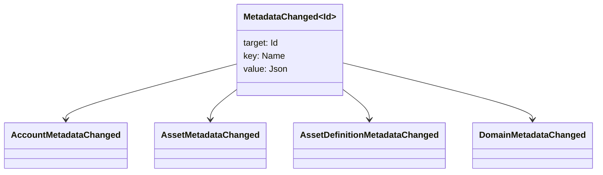

# 超级数据 {#metadata}

密码数据是连接到账本对象的检查关键值地图.关键是`Name`值和值是 JSON (`Json`) 实用负载.

下列对象可以携带元数据:

- 域名
- 账户
- 资产
- 资产定义
- NFTs
- RWAs
- 触发器
- 交易

使用在账本状态下属于的小型描述或索引字段的元数据. 大型有效载荷应存储在 WSV 外,并由一个消化, URI 或 SoraFS 路径引用.

关于选择元数据,资产 NFTs,RWAs 或链外存储的指南,请参见 [元数据和账本存储选择](/zh-hans/guide/configure/metadata-and-store-assets.md).

## 在 Taira 试看. {#try-it-on-taira}

通过正常的资源阅读,可以看到元数据.该命令列出目前具有元数据的 Taira 资产定义:

```bash
curl -fsS 'https://taira.sora.org/v1/assets/definitions?limit=100' \
  | jq '.items[]
    | select((.metadata | length) > 0)
    | {id, name, metadata}'
```

使用域名和帐户的模式:

```bash
curl -fsS 'https://taira.sora.org/v1/domains?limit=20' \
  | jq '.items[] | select((.metadata // {} | length) > 0)'

curl -fsS 'https://taira.sora.org/v1/accounts?limit=20' \
  | jq '.items[] | select((.metadata // {} | length) > 0)'
```

将空输出视为有效的结果. 这意味着 Taira 对象的当前页面没有元数据,而不是终点失败了.

## 更新元数据 {#updating-metadata}

用 Iroha 特殊指令更改元数据:

- [`SetKeyValue`](/zh-hans/blockchain/instructions.md#setkeyvalue-removekeyvalue)插入或取代一个钥匙
- [`RemoveKeyValue`](/zh-hans/blockchain/instructions.md#setkeyvalue-removekeyvalue) 删除一个钥匙

提交交易的机构必须有所要求的许可.通过活跃的运行时间验证器. [许可证代码](/zh-hans/reference/permissions.md).

## 事件 {#events}

随着元数据的变化,数据事件发射.通用事件有效载荷为 `MetadataChanged<Id>`:



使用 [数据事件过器](/zh-hans/blockchain/filters.md#data-event-filters),只会订阅对集成重要的实体类型或对象 ID 的元数据事件.

## 问题 {#queries}

例如,使用 [`FindAccountById`](/zh-hans/reference/queries.md#accounts-and-permissions),[`FindDomainById`](/zh-hans/reference/queries.md#domains-and-peers),或[`FindAssetDefinitionById`](/zh-hans/reference/queries.md#assets-nfts-and-rwas).使用 [`FindNfts`](/zh-hans/reference/queries.md#assets-nfts-and-rwas)或 [`FindNftsByAccountId`](/zh-hans/reference/queries.md#assets-nfts-and-rwas)为 NFTs,和 [`FindRwas`](/zh-hans/reference/queries.md#assets-nfts-and-rwas)为 RWA 批量.然后阅读对象的元数据领域. NFT 查询答案将 NFT `content` 地图作为记录元数据.

大数据密钥是账本状态的一部分,因此保持它们稳定,避免在 JSON 值可以明确地携带该版本时将应用程序特定版本编码转换到关键名称中.
