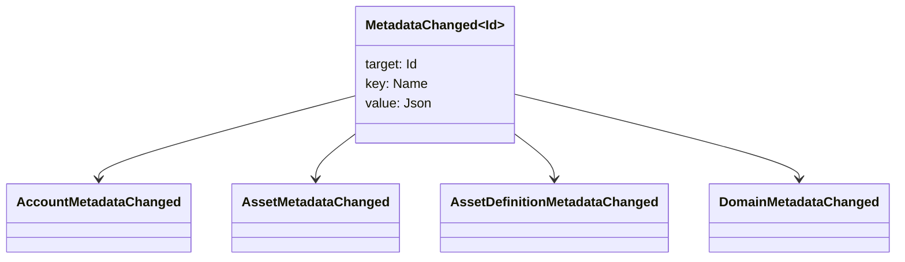

# 元数据 {#metadata}

元数据是附加到账本对象上的、经过检查的键值映射。键是 `Name` 值，值是 JSON（`Json`）载荷。

下列对象可以携带元数据:

- 域名
- 账户
- 资产
- 资产定义
- NFTs
- RWAs
- 触发器
- 交易

使用在账本状态下属于的小型描述或索引字段的元数据. 大型有效载荷应存储在 WSV 外,并由一个摘要, URI 或 SoraFS 路径引用.

关于选择元数据,资产 NFTs,RWAs 或链外存储的指南,请参见 [元数据和账本存储选择](/zh-hans/guide/configure/metadata-and-store-assets.md).

## 在 Taira 试看. {#try-it-on-taira}

通过正常的资源阅读,可以看到元数据.该命令列出目前具有元数据的 Taira 资产定义:

```bash
curl -fsS 'https://taira.sora.org/v1/assets/definitions?limit=100' \
  | jq '.items[]
    | select((.metadata | length) > 0)
    | {id, name, metadata}'
```

使用域名和帐户的模式:

```bash
curl -fsS 'https://taira.sora.org/v1/domains?limit=20' \
  | jq '.items[] | select((.metadata // {} | length) > 0)'

curl -fsS 'https://taira.sora.org/v1/accounts?limit=20' \
  | jq '.items[] | select((.metadata // {} | length) > 0)'
```

将空输出视为有效的结果. 这意味着 Taira 对象的当前页面没有元数据,而不是端点失败了.

## 更新元数据 {#updating-metadata}

用 Iroha 特殊指令更改元数据:

- [`SetKeyValue`](/zh-hans/blockchain/instructions.md#setkeyvalue-removekeyvalue)插入或取代一个钥匙
- [`RemoveKeyValue`](/zh-hans/blockchain/instructions.md#setkeyvalue-removekeyvalue) 删除一个钥匙

提交交易的授权主体必须具备当前运行时验证器要求的权限。有关默认权限接口，请参阅[权限令牌](/zh-hans/reference/permissions.md)。

## 事件 {#events}

元数据发生变化时会发出数据事件。通用事件有效载荷为 `MetadataChanged<Id>`：



使用 [数据事件过滤器](/zh-hans/blockchain/filters.md#data-event-filters),只会订阅对集成重要的实体类型或对象 ID 的元数据事件.

## 查询 {#queries}

元数据会作为被查询对象的一部分返回。例如，可使用 [`FindAccountById`](/zh-hans/reference/queries.md#accounts-and-permissions)、[`FindDomainById`](/zh-hans/reference/queries.md#domains-and-peers) 或 [`FindAssetDefinitionById`](/zh-hans/reference/queries.md#assets-nfts-and-rwas)。对于 NFTs，使用 [`FindNfts`](/zh-hans/reference/queries.md#assets-nfts-and-rwas) 或 [`FindNftsByAccountId`](/zh-hans/reference/queries.md#assets-nfts-and-rwas)；对于 RWA 批次，使用 [`FindRwas`](/zh-hans/reference/queries.md#assets-nfts-and-rwas)。然后读取对象的元数据字段。NFT 查询响应会将 NFT `content` 映射作为记录的元数据公开。

元数据键是账本状态的一部分，因此应保持稳定；如果 JSON 值能够明确携带版本，就不要把应用特定的版本编码到键名中。
