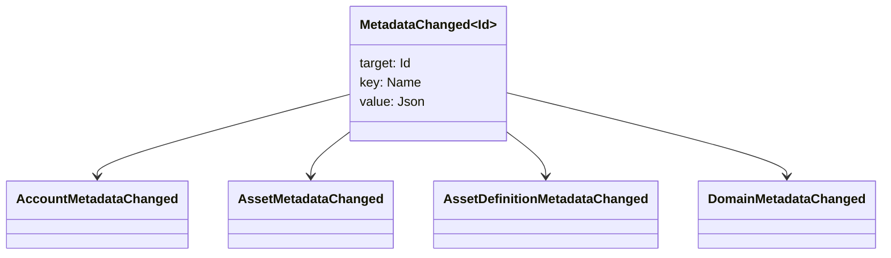

# 数据表 {#metadata}

大数据是连接到账本对象的检查键值地图.
`Name` 价值和价值是 JSON (`Json`) 有效载荷.

下列物体可以携带元数据:

- 域名
- 账户
- 资产
- 资产定义
- NFTs
- RWAs
- 触发器
- 交易

使用在本书中属于的小描述或索引字段的元数据
大型的有效载荷应存储在 WSV 引用的是:
消化, URI, 或 SoraFS 路径.

关于选择元数据,资产的指导 NFTs, RWAs, 或在链外
存储,见
[大数据和账本存储选项](/zh-hans/guide/configure/metadata-and-store-assets.md).

## 试着. Taira {#try-it-on-taira}

通过正常资源阅读可见的元数据. Taira
目前具有元数据的资产定义:

```bash
curl -fsS 'https://taira.sora.org/v1/assets/definitions?limit=100' \
  | jq '.items[]
    | select((.metadata | length) > 0)
    | {id, name, metadata}'
```

使用域名和帐户的模式相同:

```bash
curl -fsS 'https://taira.sora.org/v1/domains?limit=20' \
  | jq '.items[] | select((.metadata // {} | length) > 0)'

curl -fsS 'https://taira.sora.org/v1/accounts?limit=20' \
  | jq '.items[] | select((.metadata // {} | length) > 0)'
```

将空输出视为有效的结果. Taira
对象不携带元数据,不是终点失败.

## 更新元数据 {#updating-metadata}

转换的元数据是 Iroha 特别指示:

- [`SetKeyValue`](/zh-hans/blockchain/instructions.md#setkeyvalue-removekeyvalue)
  插入或取代钥匙
- [`RemoveKeyValue`](/zh-hans/blockchain/instructions.md#setkeyvalue-removekeyvalue)
  删除一个钥匙

提交交易的机构必须具备所需许可
对于默认权限表面,请参见
[许可令牌](/zh-hans/reference/permissions.md).

## 事件 {#events}

随着变化,数据事件发射.通用事件有效载荷是
`MetadataChanged<Id>`:



使用 [数据事件过器](/zh-hans/blockchain/filters.md#data-event-filters) 在
仅订阅对实体类型或对象的元数据事件 ID 这
对于整合而言,

## 问题 {#queries}

返回的转换数据是查询对象的一部分.
[`FindAccountById`](/zh-hans/reference/queries.md#accounts-and-permissions),
[`FindDomainById`](/zh-hans/reference/queries.md#domains-and-peers), 或
[`FindAssetDefinitionById`](/zh-hans/reference/queries.md#assets-nfts-and-rwas).
使用 [`FindNfts`](/zh-hans/reference/queries.md#assets-nfts-and-rwas) 或
[`FindNftsByAccountId`](/zh-hans/reference/queries.md#assets-nfts-and-rwas) 对于
NFTs, 并且 [`FindRwas`](/zh-hans/reference/queries.md#assets-nfts-and-rwas) 对于 RWA
然后阅读对象的元数据字段. NFT 查询答案显示了
NFT `content` 作为记录的元数据.

因此,保持它们稳定,避免
编码应用程序特定版本转换为关键名称,当一个 JSON
值可以明确地载入该版本.
