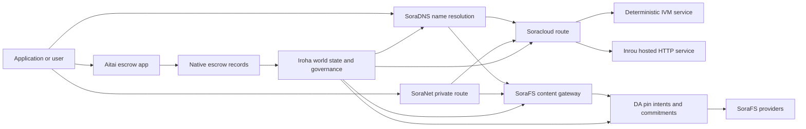

# SORA Nexus 服务 {#sora-nexus-services}

SORA Nexus 增加了应用程序面向的服务飞机 Iroha 3. 这些服务
不是单独的账本. Iroha 世界国家, Norito
管理文件,管理记录 Torii 路线家庭.

可用性取决于节点构建和网络配置文件.
[`/openapi`](/zh-hans/reference/torii-endpoints.md#app-and-sora-route-families) 在
目标节点作为启用路线的权威列表.

## 组件地图 {#component-map}

| 组件              | 角色                                                                                                                                        | 主要表面                                                                            |
| ---------------------- | ------------------------------------------------------------------------------------------------------------------------------------------- | ---------------------------------------------------------------------------------------- |
| Soracloud              | 应用部署,托管服务,私人模型/运行时间状态以及服务生命周期控制.                                        | `/v1/soracloud/*`, `/api/*`, `iroha app soracloud ...`                                   |
| 在线                  | Soracloud 接待者 HTTP 需要直播的服务修改运行时间 HTTP 飞机.                                                            | Soracloud 运行时间配置,主机功能广告,复制运行时间状态                 |
| SoraNet                | 电路的隐私和运输覆盖,继电器流量 VPN, 连接会议和流媒体路线.                                     | `/v1/connect/*`, `/v1/vpn/*`, SoraNet 路线元数据                                     |
| 数据可用性 (DA) | 对于被引用的有效载荷的可用性证据,承诺和准意图层 Nexus 车道, SoraFS 证据的流动. | `/v1/da/*`, `FindDaPinIntent*`, `[sumeragi.da]`                                          |
| SoraFS                 | 对表格的含量定位存储布料, CAR 运输量,固定内容,网关检索和可回收性证明流.           | `/v1/sorafs/*`, `/sorafs/*`, `FindSorafsProviderOwner`                                   |
| SoraDNS                | 确定性命名和解决方案认证层 SORA- 托管的服务和内容.                                                   | `/v1/soradns/*`, `/soradns/*`, 解决目录事件                                 |
| 爱泰                  | 应用程序级的法定和资产结算走廊由本地保证记录支持,而不是单独的账本.                                     | `OpenAssetEscrow`, `FindAssetEscrow*`, `EscrowEventFilter`, Kotodama `escrow_*` 建筑物 |



## 常见的流动 {#common-flows}

### 托管的分类应用程序 {#hosted-split-application}

一个典型的混合平面应用程序使用了所有零件:

1. 静态前端资产被包装并固定 SoraFS.
2. 公共主持人,例如 `<app>.sora`, 通过
   SoraDNS.
3. Soracloud 航线 `/api/v1/search` 或 `/api/v1/stream` 给一个Inrou HTTP
   服务.
4. Soracloud 航线 `/api/auth` 并且 `/api/v1/user` 到确定性 IVM
   管理员.
5. 需要隐私的客户可以获得相同内容或 API 航线
   通过一个 SoraNet 电路.

| 路径              | 后台飞机         | 为什么?                                               |
| ----------------- | --------------------- | ------------------------------------------------- |
| `/`               | SoraFS 静态含量 | 可复制内容的根和网关缓存     |
| `/assets/*`       | SoraFS 静态含量 | 内容地址的资产和明确证据      |
| `/api/auth*`      | Soracloud IVM         | 复制安全版权和钱包挑战状态       |
| `/api/v1/user*`   | Soracloud IVM         | 对治理敏感的状态突变              |
| `/api/v1/search*` | Soracloud 在线       | 活着 HTTP 服务,缓存 SSE, 或收藏国 |

### 内容出版 {#content-publication}

SoraFS 出版物在名称指向它们之前,产生持久的文物:

1. 建立一个有效载荷或目录.
2. 包装在一个 CAR 文件和部分计划.
3. 建立一个 Norito 通过 pin 政策和治理数据来表达.
4. 提交公告 Torii.
5. 记录一个 DA 目标时的定位意图或可用性承诺
   需要明确的证据.
6. 绑定表格到一个 SoraDNS 名称或 Soracloud 静态前端路线.

### 私人带车或流媒体路线 {#private-fetch-or-streaming-route}

SoraNet 可以坐在前面 SoraFS 或 Soracloud:

1. 客户端解决了名称或公告.
2. 一个保安目录或路线表选择入口和出口继电器.
3. 交通被填充, SoraNet 电路.
4. 出口继电器到达 SoraFS 门户, Torii 流动或 Soracloud
   路线.

## 爱泰 {#aitai}

艾塔伊是 SORA 应用程序走廊用于市场式结算,
买方和卖方协调在链外支付, Iroha 控制
在连锁资产监管.它应该使用本地保证指令家族
而不是合同所有的保证账户,用于新的数值资产保管
流动.

在本地保证人账目中保留保险权.
`OpenAssetEscrow`, 购买者接受并标记无链支付,
`AcceptAssetEscrow` 并且 `MarkEscrowPaymentSent`, 卖家将释放
在 `ReleaseAssetEscrow` 如果买方和
卖家不同意,双方可以开启争端和解决
`CanResolveEscrowDispute` 可以把锁定的数量分开.

在整个生命周期,通用资产锁定,匿名保证金,查询,
事件,以及 Rust 例如,见
[产业资产抵押](/zh-hans/blockchain/escrow.md).

| 艾塔伊表面                                                                                                                                                 | 用它来                                                                                |
| ------------------------------------------------------------------------------------------------------------------------------------------------------------- | ----------------------------------------------------------------------------------------- |
| `OpenAssetEscrow`, `AcceptAssetEscrow`, `MarkEscrowPaymentSent`, `ReleaseAssetEscrow`, `CancelAssetEscrow`                                                    | 透明数值资产的报价,包括 XOR- 定位结算流量.             |
| `OpenAnonymousAssetEscrow`, `AcceptAnonymousAssetEscrow`, `MarkAnonymousEscrowPaymentSent`, `ReleaseAnonymousAssetEscrow`, `CancelAnonymousAssetEscrow`       | 提供资金和关闭活动的保护性报价 |
| `OpenEscrowDispute`, `ResolveEscrowDispute`, `OpenAnonymousEscrowDispute`, `ResolveAnonymousEscrowDispute`                                                    | 争端的解决方法.                                                 |
| `FindAssetEscrowById`, `FindAssetEscrowsBySeller`, `FindAssetEscrowsByBuyer`, `FindAssetEscrowsByStatus`                                                      | 应用程序状态页面,调整工作和支持工具.                               |
| `EscrowEventFilter`                                                                                                                                           | 按保证人身份,卖家,买家,状态或事件类型的透明保证人订阅. |
| Kotodama `escrow_open_offer`, `escrow_accept`, `escrow_mark_payment_sent`, `escrow_release`, `escrow_cancel`, `escrow_open_dispute`, `escrow_resolve_dispute` | Kotodama 支持的合同呼叫 V1 监管机构.                                 |

公共服务 Taira 或 Minamoto 使用,处理链外支付轨道和
任何支持或法院工作流程作为申请政策. Iroha 记录
监管状态,生命周期事件,证据和资产最终流动;
它不自行核实法定结算.

## 检查目标节点 {#check-a-target-node}

在使用本页的例子之前,确认路线家族是否存在
在您的目标节点上:

```bash
export TORII_URL=https://taira.sora.org

curl -fsS "$TORII_URL/openapi.json" \
  | jq '.paths | keys[] | select(test("^/v1/(soracloud|sorafs|soradns|connect|vpn|da)/"))'

curl -fsS "$TORII_URL/status" | jq .
```

如果 `/openapi.json` 没有被个人资料所暴露,试着 `/openapi`. 正确的
路线可用性取决于构建功能和网络配置.

### Taira 仅阅读烟雾检查 {#taira-read-only-smoke-checks}

公众 Taira 终端点是用于阅读侧检查,但不要使用它
对于突变的例子,除非您正在运营一个授权账户;
为了改变现实状态.

```bash
export TORII_URL=https://taira.sora.org

curl -fsS "$TORII_URL/status" \
  | jq '{version: .build.version, peers, blocks, lanes: (.teu_lane_commit | length)}'

curl -fsS "$TORII_URL/v1/connect/status" | jq '{enabled, sessions_active}'

curl -fsS "$TORII_URL/v1/vpn/profile" \
  | jq '{available, relay_endpoint, supported_exit_classes}'

curl -fsS "$TORII_URL/v1/sorafs/storage/state" \
  | jq '{bytes_capacity, bytes_used, pin_queue_depth, por_inflight}'

curl -fsS -H 'Accept: application/json' "$TORII_URL/v1/soracloud/status" \
  | jq '.control_plane | {service_count, services: [.services[] | {service_name, current_version}]}'
```

Taira 可能会暴露非部署特定的控制飞机路线
列在 OpenAPI 路线地图. `/openapi` 作为原产品
API 直接确认任何部署特定路线之前
在现场记录它.

## Soracloud {#soracloud}

Soracloud 是 SORA 应用控制平面. 它跟踪部署
包,服务修改,路由,部署状态,权威配置
报名,加密服务机密,模型登记记录,私人
推断会议和运行时间收据.

Soracloud 使用两个执行飞机:

| 执行飞机        | 运行时间 | 用它来                                                                                   |
| ---------------------- | ------- | -------------------------------------------------------------------------------------------- |
| `DeterministicService` | `Ivm`   | 作者,库存状态,认证阅读,订单邮箱处理器,对治理敏感的突变 |
| `HttpService`          | `Inrou` | 活着 HTTP APIs, 收藏者繁重工作,缓存支持的服务 SSE, 浏览器辅助流量     |

控制飞机是权威的.部署,升级,倒车,配置,
秘密,模型和状态命令通过 Torii 阅读承诺
世界国家;它们不依赖一个独立的 CLI- 地方镜子.
路由是基于最长的前,所以一个注册的主机可以分开流量
接待者之间 HTTP 路线和确定性 API 路线.

### 起一个分开的应用程序 {#scaffold-a-split-app}

分类应用模板创建静态前端加上一个主机直播 API
一个确定性库/API 服务:

```bash
iroha app soracloud app init \
  --template split-app \
  --app-name solswap_indexer \
  --app-version 0.1.0 \
  --public-host solswap-indexer.sora \
  --output-dir ./apps/solswap-indexer

iroha app soracloud app local-plan \
  --manifest ./apps/solswap-indexer/app_manifest.json

iroha app soracloud app doctor \
  --manifest ./apps/solswap-indexer/app_manifest.json
```

`local-plan` 打印路线分区,儿童服务公告,工作空间
预期的前端发布模式. `doctor`
在你参与之前,验证本地释放合同 Torii.

### 部署和检查应用程序状态 {#deploy-and-inspect-app-state}

```bash
export SORACLOUD_TORII_URL=https://<soracloud-enabled-torii>

iroha app soracloud app deploy \
  --manifest ./apps/solswap-indexer/app_manifest.json \
  --torii-url "$SORACLOUD_TORII_URL"

iroha app soracloud app status \
  --manifest ./apps/solswap-indexer/app_manifest.json \
  --torii-url "$SORACLOUD_TORII_URL"
```

对于已经部署的服务,使用服务范围指令:

```bash
iroha app soracloud status \
  --service-name solswap_indexer_live \
  --torii-url "$SORACLOUD_TORII_URL"

iroha app soracloud rollback \
  --service-name solswap_indexer_live \
  --target-version 0.1.0 \
  --torii-url "$SORACLOUD_TORII_URL"
```

### 隐私和秘密材料 {#config-and-secret-material}

Soracloud 配置和秘密输入是权威部署的一部分
部署,升级和反弹未能关闭
秘密结合不存在或与活性表现不一致.

```bash
iroha app soracloud config-set \
  --service-name solswap_indexer_live \
  --config-name indexer/public_config \
  --value-file ./config/public-config.json \
  --torii-url "$SORACLOUD_TORII_URL"

iroha app soracloud secret-set \
  --service-name solswap_indexer_live \
  --secret-name indexer/api_key \
  --secret-file ./secrets/api-key.envelope.json \
  --torii-url "$SORACLOUD_TORII_URL"
```

使用 CLI 您的个人资料所需的准确身份证标签:

```bash
iroha app soracloud config-set --help
iroha app soracloud secret-set --help
```

## 在线 {#inrou}

伊内罗是主机. HTTP 使用的运行时间 Soracloud. 一个 Iroha 节点与
嵌入式 Soracloud 运行时间项目被录取 Soracloud 州成一个地方
作为循环回归,开始分配的托管服务复制
报告复制运行时间状态回到权威的
模型.

使用Inrou用于需要直播的工作负载 HTTP 表面,如
收藏量重 APIs, SSE 流,缓存支持的处理器或
浏览器辅助服务.

### 运行时间要求 {#runtime-requirements}

- 集装箱表运行时间必须是 `Inrou`.
- 服务表执行飞机必须是 `HttpService`.
- `HttpService + Inrou` 需要一个. `PersistentRootLeaseVolume`
  装在 `/`.
- 复制的Inrou服务也需要共享服务或保密租
  在保持可变共享状态时存储.
- 产业托管节点应该广告实际的Inrou容量,而不是
  仅作为代理人.

### 显而易见的碎片 {#manifest-fragment}

下面的例子显示了两种表现的形状.
不是完整的部署包.

```jsonc
// container_manifest.json
{
  "schema_version": 1,
  "runtime": { "runtime": "Inrou", "value": null },
  "bundle_path": "/bundles/solswap-indexer.inrou",
  "entrypoint": "/app/bin/launch-indexer.sh",
  "args": [],
  "env": {
    "RUST_LOG": "info",
  },
  "inrou": {
    "schema_version": 1,
    "guest_os": { "guest_os": "DebianSlim", "value": null },
    "guest_images": {
      "x86_64": {
        "kernel_image_path": "/inrou/x86_64/vmlinux",
        "rootfs_image_path": "/inrou/x86_64/rootfs.ext4",
        "initrd_image_path": null,
      },
      "aarch64": {
        "kernel_image_path": "/inrou/aarch64/vmlinux",
        "rootfs_image_path": "/inrou/aarch64/rootfs.ext4",
        "initrd_image_path": null,
      },
    },
  },
  "lifecycle": {
    "start_grace_secs": 60,
    "stop_grace_secs": 30,
    "healthcheck_path": "/api/indexer/v1/health",
  },
}
```

```jsonc
// service_manifest.json
{
  "schema_version": 1,
  "service_name": "solswap_indexer_live",
  "service_version": "0.1.0",
  "execution_plane": { "execution_plane": "HttpService", "value": null },
  "replicas": 2,
  "route": {
    "host": "solswap-indexer.sora",
    "path_prefix": "/api/v1/search",
    "service_port": 8080,
    "visibility": { "visibility": "Public", "value": null },
    "tls_mode": { "tls": "Required", "value": null },
  },
  "lease_volumes": [
    {
      "volume_name": "root_disk",
      "kind": {
        "lease_volume": "PersistentRootLeaseVolume",
        "value": null,
      },
      "storage_class": { "storage_class": "Warm", "value": null },
      "mount_path": "/",
      "max_total_bytes": 8589934592,
    },
    {
      "volume_name": "index_state",
      "kind": { "lease_volume": "ServiceLeaseVolume", "value": null },
      "storage_class": { "storage_class": "Warm", "value": null },
      "mount_path": "/var/lib/solswap-indexer",
      "max_total_bytes": 1073741824,
    },
  ],
}
```

在运行时,每个安装的租量通过环境暴露
从体积名称中取出的变量:

```text
SORACLOUD_LEASE_VOLUME_ROOT_DISK_DIR
SORACLOUD_LEASE_VOLUME_ROOT_DISK_MOUNT_PATH
SORACLOUD_LEASE_VOLUME_INDEX_STATE_DIR
SORACLOUD_LEASE_VOLUME_INDEX_STATE_MOUNT_PATH
```

## SoraNet {#soranet}

SoraNet 它提供了基于继电器的
不应直接连接到目标门口的交通路线
运输设计采用入口,中部和出口继电器,
QUIC 交通,基于噪音的混合动力握手,能力谈判,
连接目录的元数据和固体尺寸的填充细胞.

在 Nexus 部署, SoraNet 能携带内容传输,网关流量,
VPN 或连接会议,以及 Norito 传输路线.目录入口可以
标记继电器 `norito-stream`, 这让客户更喜欢航线
适用于 Torii RPC 或流量流量.

### 流媒体配置 {#streaming-configuration}

其他 Nexus 个人资料可以 SoraNet 供应流通路线:

```toml
[streaming]
feature_bits = 0b11

[streaming.soranet]
enabled = true
exit_multiaddr = "/dns/torii/udp/9443/quic"
padding_budget_ms = 25
access_kind = "authenticated"
provision_spool_dir = "./storage/streaming/soranet_routes"
provision_spool_max_bytes = 0
provision_window_segments = 4
provision_queue_capacity = 256
```

使用 `access_kind = "read-only"` 对于不需要的内容路线
浏览器身份验证. `authenticated` 当出口继电器必须执行时
在接到桥之前, Torii 或是主机服务.

### SoraNet- 我知道. SoraFS 带来 {#soranet-aware-sorafs-fetch}

其他 SoraFS 收取 CLI 可以发出本地代理表格和卷 SoraNet
浏览器扩展的路线元数据或 SDK 适配器:

```bash
sorafs_cli fetch \
  --plan artifacts/payload_plan.json \
  --manifest-id 7bb2...9d31 \
  --provider name=alpha,provider-id=9f5c...73aa,base-url=https://gw-alpha.example.org/,stream-token="$(cat alpha.token)" \
  --output artifacts/payload.bin \
  --json-out artifacts/fetch_summary.json \
  --local-proxy-manifest-out artifacts/proxy_manifest.json \
  --local-proxy-mode bridge \
  --local-proxy-norito-spool storage/streaming/soranet_routes \
  --local-proxy-kaigi-spool storage/streaming/soranet_routes \
  --local-proxy-kaigi-policy authenticated \
  --max-peers=2 \
  --retry-budget=4
```

总结记录提供商报告,零件收据,本地代理元数据,
以及用于采集的有效路线设置.

## 数据可用性 (DA) {#data-availability-da}

DA 对于太大的有效载荷,也是可用性证据层
隐私敏感,或服务特异性太大,无法直接在世界中放置
它记录了确定性承诺和检索义务
验证器,网关和客户端可以同意哪些字节被承诺,
哪些政策适用,以及有哪些证据.

DA 不取代 Kura 或 SoraFS:

- Kura 存储最终的区块流和共识恢复数据.
- SoraFS 存储和服务内容地址的字节, CAR 有效载荷,以及
  它们的表现.
- DA 记录承诺,证据政策,证据开放和笔意图
  允许这些字节进行调度,审计和链接到账本
  美国.

使用 DA 在申请或 Nexus 路需要一个可见的承诺.
常见的例子包括车道
对结算流量的有效负载承诺, SoraFS 发布的印意图
内容,必须保留以后进行验证的证明捆绑,以及
应用文物,其公共状态应该是一个消化而不是
充满有效载荷.

### 生命周期 {#lifecycle}

| 阶段      | 记录的内容                                                                                                                                      |
| ---------- | ----------------------------------------------------------------------------------------------------------------------------------------------------- |
| 意图     | 一个门票,明示引用,别名,车道/时代/序列参考,保留政策或复制目标.                                          |
| 承诺 | 消化材料,将表格,行径有效载荷,证据捆绑或内容根连接到本书可见的记录.                                    |
| 证据   | 可用性投票,证据开放,供应商认证或目标网络接受的其他特定配置文件证据.                         |
| 查询      | 通过准的检查 `FindDaPinIntentByTicket`, `FindDaPinIntentByManifest`, `FindDaPinIntentByAlias`, 或 `FindDaPinIntentByLaneEpochSequence`. |

一个典型的 DA-支持的出版流量是:

1. 构建或接收在外面的有效载荷 WSV, 例如: SoraFS CAR
   文件或 Nexus 车道的有效载荷.
2. 哈希和描述一个有效载荷 Norito 标志性或路线特定
   承诺记录.
3. 提交明确表,笔意图或承诺 `/v1/da/*` 什么时候
   通过网络的签署,该路线家族已启用
   交易路径.
4. 让验证者或可用性提供商收集所需的证据
   通过积极的证据政策.
5. 在推广一个名之前,请询问所产生的目的或承诺.
   结算证明,或取决于有效载荷的门口路线.

### 算法模型 {#algorithmic-model}

DA 转换一个有效载荷为签署的,反弹保护的,区块指数承诺.
重要算法是确定性的,所以验证器和网关可以
在同一字节中重新计算相同的消化.

1. **运输的有效载荷.** Torii 接受食用请求
   `(lane_id, epoch, sequence)`, 使用载荷字节,压缩元数据,部分
   删除配置文件,保留政策和提交人签名.
   在要求时将gzip,deflate或Zstandard的有效载荷解压,然后
   验证可波音字节长度等于 `total_size`.
2. **验证车道和零件参数.** 车道必须存在 Nexus
   车道目录. `chunk_size` 必须是两个,至少两个的非零功率
   字节,且不超过配置的最大值.
   包含数据片段和至少两个平率片段.
   证明方案 `merkle_sha256` 或 `kzg_bls12_381`.
3. **应用网络政策.** 节点执行配置的复制和
   类的保留基线.公开元数据必须保持纯文本;
   仅使用管理方式的元数据是通过节点配置的管理方式加密的
   在将其写入表格之前的元数据键.
4. **碎和承诺.** 标准的有效载荷是固定尺寸的.
   来自: `chunk_size`. Torii 计算有效载荷消化,
   证据可回收性树根,每块承诺.
   运输 BLAKE3 对于其字节的承诺.
5. **添加删除承诺.** 切片分成条纹
   `data_shards`. 最后条中缺失的细胞为平衡填充了零
   计算. RS(16) 偶数创建行/全球偶数分片;可选
   `row_parity_stripes` 在矩阵中添加列式条纹平数.
   平等分片承诺是: BLAKE3 小鱼的消化物 `u16` 标志.
6. **打造一个文件表.** `DaManifestV1` 记录车道,时代,片类别,
   编码,有效载荷消化,零件根,零件尺寸,删除配置文件,保留
   租金政策,租金报价,零额承诺,可选 IPA 承诺,元数据
   存储票是确定性的:节点首先哈希一个
   然后把指纹写回为
   最后一次 `storage_ticket`.
7. **拒绝重播冲突.** 复制键是
   `(lane_id, epoch, sequence, manifest_fingerprint)`. 一个复制版
   一个陈旧的序列或同一序列与一个
   不同的指纹被拒绝.
8. **发出签名的文物.** Torii 计算一个 PDP 承诺,签署
   `DaIngestReceipt`, 构建一个 `DaCommitmentRecord`, 他写着子的文物.
   对于明确的. PDP 承诺,承诺记录,承诺时间表
   收件标志,收件文件和收件日志.
   单调的 `(lane_id, epoch)`.

一个记录绑定:

- 路径,时代和序列
- 调用器 ID 和法典表格哈希
- 车道防护方案
- 碎片根
- 选择性 KZG 承诺 KZG 车道
- PDP/证据消化
- 存储类和存储门票
- Torii DA 确认签名

在一个区块嵌入之前 DA 记录,区块组合路径验证了捆绑:

- `(lane_id, epoch, sequence)` 在包裹中必须是独一无二的.
- 显而易见的哈希必须在捆绑中非零,并且是唯一的.
- 承诺证明方案必须符合配置的车道政策.
- 默克尔车道拒绝 KZG 承诺; KZG 车道需要一个非零 KZG
  承诺.
- 按行径,表达哈希进行加нони化,分类和过
  存储门票,所有者账户和称规则.

区块标题存储哈希 DA 证据政策,承诺和印
对于会员身份证明,承诺包还显示了一个 Merkle
根,叶子是法典的哈希 Norito- 编码
`DaCommitmentRecord` 关节链的左边和右边
一个奇怪的叶子不变地转移到下一个层.

### 证据验证 {#proof-verification}

`/v1/da/commitments/prove` 可以在一个区块中证明一项承诺.
证据包含承诺,块高度,捆绑中的指数,捆绑
查询检查:

1. 证据捆绑哈希与区块标题相匹配 DA 承诺的.
2. 证据块高度与引用的区块标题相匹配.
3. 指数在限额中,承诺等于集团入口
   指数.
4. 路线防护政策接受了承诺.
5. 通过从承诺表中折叠的兄弟路径,重新构建了供应
   根源.
6. 复制的根与捆绑根等.

这证明了特定的可用性承诺被纳入
没有证据表明每一个复制品都在线.
检查可回收性通过 SoraFS 供应商收取, PDP/PoTR
检查,或特定配置文件的可用性证据.

### 共识互动 {#consensus-interaction}

DA 连接到 Sumeragi 通过可靠的广播 (RBC),但它不是一个
第二个最终协议. RBC 传播和回收提案有效载荷:
提议者宣布召开会议 `(height, view, payload_hash)`, 同龄人
交换片,以及 `READY`/`DELIVER` 信号追踪是否有足够的验证器
观察到相同的有效载荷.

在 Iroha 3, 一个同行认为悬而未决的区块有效载荷可用,如果:

- 当地悬而未决区块对预期有效载荷的哈希字节,或
- RBC 已经恢复了与区块哈希,高度,视图和
  运用量哈希.

如果任何条件都不符合,同行记录 `missing_local_data`, 继续努力.
通过 RBC 或阻止同步,并报告 DA 进入门口
在目前的实施过程中, DA 信号是
关于最终的建议:从承诺证书中仍然完成一个块
与相匹配的本地有效载荷,而不是来自单独的 DA 定制证书.

DA 时机扩大恢复窗口. DA 定制时间取出
从配置的区块和提交时间,然后乘以
`sumeragi.advanced.da.quorum_timeout_multiplier`. 可用时间是:
`max(quorum_timeout, availability_timeout_floor_ms) * availability_timeout_multiplier`.
在可用性截止日期到期之前,节点有利于有效载荷恢复和
避免过早重新安排;经过过过期后,正常恢复和
视图改变的路径可以继续.

### 运营商注释 {#operator-notes}

Iroha 3 共识配置包括 RBC- 支持有效载荷传播,说明
警卫, DA 包装验证和恢复远程测量.
模板曝光 `[sumeragi.da]` 承诺和证据开放的限制
区块,加上 `[sumeragi.advanced.da]` 定制时间的乘法和
保持这些设置在一个验证器中一致
网络配置文件.

为了发现路线,从节点的 OpenAPI 文件:

```bash
curl -fsS "$TORII_URL/openapi.json" \
  | jq '.paths | keys[] | select(startswith("/v1/da/"))'
```

使用
[查询参考](/zh-hans/reference/queries.md#nexus-data-availability-and-packages)
对于目前 DA 查询名称,以及
[同行配置模板](/zh-hans/reference/peer-config/) 对于本地
`[sumeragi.da]` 由于你的构建而暴露的子.

## SoraFS {#sorafs}

SoraFS 它包装的材料是集成式存储布料.
字节分成确定性块, CAR 档案,以及 Norito 表明
绑定内容的根源,碎片配置文件,针政策和治理
存储提供商宣传容量和内容
网关在之前验证公开表和承诺的部分
提供内容.

典型的 SoraFS 使用包括静态应用资产,文档
建筑物,区域捆绑,模型或文物参考以及治理证据
它们的子. Iroha 数据模型暴露 SoraFS 门户活动和
[`FindSorafsProviderOwner`](/zh-hans/reference/queries.md#nexus-data-availability-and-packages)
查询提供商所有权解决方案.

### 包装,表达,签署,提交 {#pack-manifest-sign-and-submit}

```bash
cargo run -p sorafs_car --features cli --bin sorafs_cli -- \
  car pack \
  --input ./dist \
  --car-out artifacts/site.car \
  --plan-out artifacts/site.chunk-plan.json \
  --summary-out artifacts/site.car-summary.json

cargo run -p sorafs_car --features cli --bin sorafs_cli -- \
  manifest build \
  --summary artifacts/site.car-summary.json \
  --manifest-out artifacts/site.manifest.to \
  --manifest-json-out artifacts/site.manifest.json \
  --pin-min-replicas=3 \
  --pin-storage-class=warm \
  --pin-retention-epoch=42

SIGSTORE_ID_TOKEN=$(oidc-client fetch-token) \
cargo run -p sorafs_car --features cli --bin sorafs_cli -- \
  manifest sign \
  --manifest artifacts/site.manifest.to \
  --bundle-out artifacts/site.manifest.bundle.json \
  --signature-out artifacts/site.manifest.sig

cargo run -p sorafs_car --features cli --bin sorafs_cli -- \
  manifest submit \
  --manifest artifacts/site.manifest.to \
  --chunk-plan artifacts/site.chunk-plan.json \
  --torii-url "$TORII_URL" \
  --resolve-submitted-epoch=true \
  --authority=<i105-account-id> \
  --private-key-file ./secrets/authority.ed25519 \
  --summary-out artifacts/site.manifest.submit.json \
  --response-out artifacts/site.manifest.submit.body
```

如果 `/v1/sorafs/pin/register` 在目标节点上没有路由, CLI 能使用
回到一个签名的 `/transaction` 提交并等待终端
管道状况.

### 检查和提取 {#verify-and-fetch}

```bash
cargo run -p sorafs_car --features cli --bin sorafs_cli -- \
  proof verify \
  --manifest artifacts/site.manifest.to \
  --car artifacts/site.car \
  --chunk-plan artifacts/site.chunk-plan.json \
  --summary-out artifacts/site.verify.json

sorafs_cli fetch \
  --plan artifacts/site.chunk-plan.json \
  --manifest-id <manifest-digest-hex> \
  --provider name=primary,provider-id=<provider-id-hex>,base-url=https://gateway.example.org/,stream-token="$(cat provider.token)" \
  --output artifacts/site.fetch.tar \
  --json-out artifacts/site.fetch.json
```

### 检查可回收性的证据 {#proof-of-retrievability-checks}

运营商可以对存储供应商进行检查并启动验证:

```bash
sorafs_cli por status \
  --torii-url "$TORII_URL" \
  --manifest <manifest-digest-hex> \
  --status=failed \
  --limit=20

sorafs_cli por trigger \
  --torii-url "$TORII_URL" \
  --manifest <manifest-digest-hex> \
  --provider <provider-id-hex> \
  --reason=latency_probe \
  --samples=48 \
  --auth-token artifacts/challenge_token.to
```

## SoraDNS {#soradns}

SoraDNS 是确定性命名层 SORA 服务和内容.
标准化名称,结解决目录更新在 Iroha, 并且
分布签署的区域或解决器捆绑通过 SoraFS. 解决器和
在信任发现之前,网关验证解决方案认证文件
其他数据.

为浏览器访问, SoraDNS 从注册的网关主机中提取 FQDN.
已注册的虚荣宿主仍然是常规应用程序来源,
部署的网关配置文件暴露浏览器和 Torii 为了此,
的起源.

### 主持人表格 {#host-forms}

| 形式 | 举个例子 | 目的 |
| --- | --- | --- |
| 虚荣来源 | `https://<fqdn>/<path>` | 佳能应用程序 URL 记录在表格和释放说明中 |
| Taira 浏览器门户 | `https://<fqdn>.mon.taira.sora.net/<path>` | 公共浏览器入口为活跃的号 |
| Torii 倒退路径 | `https://taira.sora.org/soradns/<fqdn>/<path>` | Torii  active alias 的调试和回归路线 |
| 标准的哈希网关 | `<base32(blake3(name))>.gw.sora.id` | 确定性门口身份和 GAR 验证 |

其他 `/soradns/<alias>/...` 倒退不是最受欢迎的公众 URL.
工具,应用程序表格和前端配置应该更喜欢虚荣
如果一个名字不活跃在 Taira, 浏览器门口或
倒退路径可以返回 `404` 或失败 TLS 在应用程序路由之前
开始了.

### 导出门口主机 {#derive-gateway-hosts}

```ts
import {
  deriveSoradnsGatewayHosts,
  hostPatternsCoverDerivedHosts,
} from '@iroha/iroha-js'

const derived = deriveSoradnsGatewayHosts('docs.sora')
console.log(derived.canonicalHost)
console.log(derived.prettyHost)

const taira = deriveSoradnsGatewayHosts('solswap-indexer.sora', {
  prettySuffix: 'mon.taira.sora.net',
})
console.log(taira.prettyHost)

const patterns = [
  derived.canonicalHost,
  derived.canonicalWildcard,
  derived.prettyHost,
]
console.log(hostPatternsCoverDerivedHosts(patterns, derived))
```

GAR 有效载荷应覆盖加нони Hash 主机,加нони野生卡,
和精选的漂亮的主人.

### 拿一个解决器目录快照 {#fetch-a-resolver-directory-snapshot}

```bash
curl -i "$TORII_URL/v1/soradns/directory/latest"

soradns_resolver directory fetch \
  --record-url "$TORII_URL/v1/soradns/directory/latest" \
  --directory-url https://gateway.example.org/soradns/directory/latest.car \
  --output ./state/soradns-directory

soradns_resolver rad verify \
  --rad ./state/soradns-directory/rad/resolver-a.norito
```

网关应拒绝其解决器证明文档的解析器
缺失,过期,未签名或没有在最新的Merkle目录中固定
在一个尚未发布解决方案目录的网络上,
`/v1/soradns/directory/latest` 可以回来 `404` 虽然路线是
已启用.

### 公众 DNS 代表团 {#public-dns-delegation}

SoraDNS 主机衍生式不取代普通互联网 DNS 代表团.
如果公众 DNS 这个名字应该指向一个 SoraDNS 门户:

- 对于子域,发布一个 CNAME 给精选的漂亮的主人
- 标题名称,使用 ALIAS/ANAME 或 A/AAAA 记录到门口的任何cast
  IPs
- 保持可行的哈希主机在 SoraDNS 关口域 GAR
  检查

## FHE 并且 UAID {#fhe-and-uaid}

FHE-可供使用的相关表面 Nexus 包括:

- `iroha_crypto::fhe_bfv` 实现确定性 BFV 支持 skalar
  密码文本评估.识别器分辨率使用
  `BfvIdentifierPublicParameters` 并且 `BfvIdentifierCiphertext`, 在哪里插槽
  0 存储输入字节长度,后段存储一个加密字节
  每一个.
- Soracloud 国家和就业方案模型 FHE 密码文本工作负载
  管理参数集合,执行政策,密码文本
  承诺,查询封和披露请求.

其他 BFV 客户端的身份识别路径用于保护隐私.
可以向该机构提交加密标识符 Torii 解决器.
根据活跃识别政策进行评估,
`OpaqueAccountId`, 他发出了收据. `ClaimIdentifier` 然后绑定它
收据 UAID 附加到目标账户.

其他 UAID 它们的潜力和潜力,
数据模型 `UniversalAccountId` 是哈希支持的,显示为
`uaid:<hash>`. 解析者接受了两种 `uaid:<hash>` 或是原始的64hex
消化. `Account` 并且 `NewAccount` 包含可选 `uaid` 并且 `opaque_ids`
运行时间登记强制执行一个对一个 UAID-对账户指数,
拒绝复制或碰撞的不透明标识符,并拒绝不透明
没有标识符 UAID. 每当一个 UAID 结合账户的变化,
运行时间重建空间目录数据区绑定 UAID.

空间目录显示将功能添加到一个 UAID. 一个
`AssetPermissionManifest` 的名称 UAID, 数据空间,激活和
可选的过期期和按数据空间进行排序允许/拒绝输入,
项目,方法,资产和 AMX 评价是否定-获利:第一
匹配拒绝拒绝请求,否则最新匹配允许
申请人对任何数额限制进行检查.
撤销这些公开证书是保卫的 `CanPublishSpaceDirectoryManifest`.

对于 Soracloud FHE 实施的方案是:

| 方案                                    | 它所控制的东西                                                                                                            |
| ----------------------------------------- | --------------------------------------------------------------------------------------------------------------------------- |
| `SoraStateBindingV1` 在 `FheCiphertext` | 声明状态密钥前下的值是 FHE 密码文本.                                                          |
| `FheParamSetV1`                           | 名称:方案,后端,模块链,多项级别,插槽数量,安全目标,生命周期和参数消化.  |
| `FheExecutionPolicyV1`                    | 限制密码文本大小,简体文本的大小,输入/输出数量,乘法深度,旋转,启动带和圆形模式. |
| `FheGovernanceBundleV1`                   | 配合一个参数设置与一个执行政策进行录取验证.                                               |
| `FheJobSpecV1`                            | 描述确定性 `Add`, `Multiply`, `RotateLeft`, 或 `Bootstrap` 在加密文本状态密钥和承诺上工作.    |
| `CiphertextQuerySpecV1`                   | 查询仅按服务,绑定,关键前置,结果限制,元数据水平和可选的包含证明.  |
| `DecryptionRequestV1`                     | 要求披露一个加密文本承诺,根据解密权限政策.                                      |

`FheJobSpecV1::validate_for_execution` 检查工作,执行
政策和参数设定在录取前达成一致.
操作特定规则:添加和乘以至少需要两个输入,旋转
需要一个输入,要求的深度,旋转数量,
启动线数,输入数,有效载荷字节和确定性输出尺寸
密码文本查询结果不得返回
简体文本行.

UAID 是不是密码文本,也不是 FHE 政策本身.
使用用于查找账户的帐户能力,不透明标识符
要求和空间目录绑定,授权服务或数据空间
流量. FHE 规划管理加密有效载荷的接入和执行
通过参数集合,执行策略,加密文本
承诺和解密权威政策.

相关性 Torii 表面包括:

- `/v1/identifier-policies`
- `/v1/identifiers/resolve`
- `/v1/accounts/{account_id}/identifiers/claim-receipt`
- `/v1/identifiers/receipts/{receipt_hash}`
- `/v1/accounts/{uaid}/portfolio`
- `/v1/space-directory/uaids/{uaid}`
- `/v1/space-directory/uaids/{uaid}/manifests`
- `/v1/soracloud/model/run-private`
- `/v1/soracloud/model/run-private/finalize`
- `/v1/soracloud/model/decrypt-output`

公共元数据界限在方案中是明确的: UAID 结合,
不透明的标识记录,表现生命周期,状态密钥消化,
密码文字大小,密码文字承诺,政策名称,参数组
版本,工作操作,输出状态密钥和披露请求
标识字体,解密状态,模型
输入和输出,以及 FHE 秘密密钥在这些公开查询之外
记录.

## 运营检查列表 {#operational-checklist}

- 确认有能力的服务家庭 `/openapi` 在目标上 Torii
  一个节点.
- 治疗 Soracloud 部署表, SoraFS 的表格, SoraDNS 解决器
  目录记录, SoraNet 连接目录记录, DA 笔的意图或
  作为对治理敏感产品的可用性承诺.
- 使用相同的方法 SORA Nexus 一个验证器的配置一致
  网络.
- 保持Inrou根和共享租数量在表格中,而不是依赖
  在特定的节点-本地路径上.
- 使用 SoraFS 在推广内容别名之前进行验证.
- 监视器 SoraNet 握手失败, DA 定制或可用性时间,
  SoraFS 网关拒绝, SoraDNS RAD 新鲜性,以及 Soracloud 部署
  医疗.
- 公共服务 Taira 或 Minamoto 使用,从
  [连接到 SORA Nexus 数据空间](/zh-hans/get-started/sora-nexus-dataspaces.md).

查看以下内容:

- [Torii 终点](/zh-hans/reference/torii-endpoints.md)
- [数据事件过器](/zh-hans/blockchain/filters.md#data-event-filters)
- [查询参考](/zh-hans/reference/queries.md#nexus-data-availability-and-packages)
