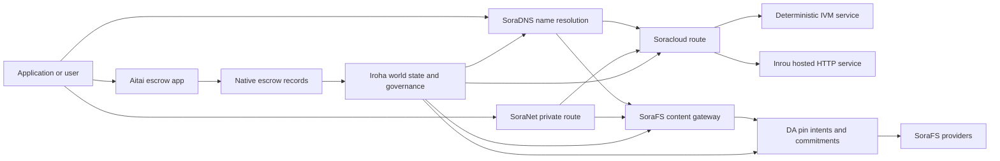

# SORA Nexus 服务 {#sora-nexus-services}

SORA Nexus 在 Iroha 3 周边增加面向应用的服务层。这些服务不是独立的账本，而是锚定在 Iroha 世界状态、Norito 清单、治理记录和 Torii 路由族之上。

可用性取决于节点构建和网络配置. [`/openapi.json`](/zh-hans/reference/torii-endpoints.md#app-and-sora-route-families) 发现生成的应用程序.API 目标节点的路线. SoraFS CID 而已知路线在生成的文件之外安装,所以检查部署时直接探讨这些路线.

## 组件地图 {#component-map}

|组件|角色|主要表面|
| ---------------------- | ------------------------------------------------------------------------------------------------------------------------------------------- | ---------------------------------------------------------------------------------------- |
|Soracloud|应用部署,托管服务,私人模型/运行时状态以及服务生命周期控制. |`/v1/soracloud/*`, `/api/*`,`iroha soracloud service ...` |
|Inrou|Soracloud 托管的 HTTP 运行时，供需要实时 HTTP 层的服务修订使用。|Soracloud 运行时配置、主机能力公告、副本运行时状态|
|SoraNet|电路,继电流, VPN,连接会议和流媒体线路的隐私和运输覆盖. |`/v1/connect/*`,`/v1/vpn/*`, SoraNet 的路线元数据 |
|数据可用性 (DA) |在 Nexus 通道, SoraFS 清单和证据流程中引用的有效载荷的可用性证明,承诺和准意图层. |`/v1/da/*`, `FindDaPinIntent*`,`[nexus.da]` |
|SoraFS|文件表, CAR 有效载荷,固定内容,网关检索和可回收性证明流的内容定位存储布料. |`/v1/sorafs/*`, `/sorafs/*`,`FindSorafsProviderOwner` |
|SoraDNS|对于 SORA 托管的服务和内容,确定性命名和解决器认证层. |`/v1/soradns/*`, `/soradns/*`,解决方程式事件|
|艾塔伊|应用程序级的法定和资产结算走廊,由本地托管记录支持,而不是单独的账本.|`OpenAssetEscrow`, `FindAssetEscrow*`,`EscrowEventFilter`, Kotodama `escrow_*`的建筑物|



## 常见流量 {#common-flows}

### 托管的分类应用程序 {#hosted-split-application}

典型的混合层级应用会配合使用所有组件：

1. 静态前端资产被包装并通过 SoraFS 绑定.
2. 公共主机,例如 `<app>.sora`,通过 SoraDNS 进行注册.
3. Soracloud 路线 `/api/v1/search`或`/api/v1/stream`到一个 Inrou HTTP 服务.
4. Soracloud 路线 `/api/auth`和 `/api/v1/user`向确定性处理器 IVM.
5. 需要隐私的客户可以通过 SoraNet 电路达到相同内容或 API 路线.

|路径|后端层|原因|
| ----------------- | --------------------- | ------------------------------------------------- |
| `/`               |SoraFS 静态含量|可复制内容的根和网关缓存|
|`/assets/*`|SoraFS 静态含量|内容地址的资产和明确证明|
|`/api/auth*`|Soracloud IVM |复制安全的作者和钱包挑战状态 |
|`/api/v1/user*`|Soracloud IVM |对于治理敏感的状态突变|
|`/api/v1/search*`|Soracloud 在线|现场 HTTP 服务,缓存, SSE,或收藏状态|

### 内容出版 {#content-publication}

SoraFS 出版物在名称指向它们之前,生产了持久的构件:

1. 建立一个有效载荷或目录.
2. 包装在一个 CAR 档案和分片计划.
3. 建立一个 Norito 清单,包含固定策略和治理数据.
4. 提交说明书给 Torii.
5. 如果目标配置文件需要明确的证据,则记录 DA 固定意图或可用性承诺.
6. 绑定表与 SoraDNS 名称或 Soracloud 静态前端路线.

### 乘坐私人车或播放路线 {#private-fetch-or-streaming-route}

SoraNet 可以坐在 SoraFS 或 Soracloud 前面:

1. 客户端解决了名称或清单.
2. 一个警卫目录或路线公开选择入口和出口继电器.
3. 交通被填充并通过 SoraNet 电路发送.
4. 输出继电器到达 SoraFS 门口, Torii 流或 Soracloud 路线.

## 艾塔伊 {#aitai}

Aitai是市场式结算的 SORA 应用程序走廊,买方和卖方在链外协调支付,而 Iroha 则控制了 在链上存储资产.它应使用本地托管指令家族,而不是合同所有的托管账户用于新数值资产托管流动.

原生托管将托管资产保留在账本中。卖方使用 `OpenAssetEscrow` 开立要约，买方使用 `AcceptAssetEscrow` 和 `MarkEscrowPaymentSent` 接受并标记链下付款，卖方使用 `ReleaseAssetEscrow` 释放资产，或在付款被标记前取消要约。如果买卖双方有分歧，任何一方都可以发起争议，拥有 `CanResolveEscrowDispute` 的解决者可以拆分锁定金额。

对于整个生命周期,通用资产锁定,匿名托管,查询,事件和 Rust 的例子,请见 [原始资产托管](/zh-hans/blockchain/escrow.md).

|艾塔伊表面|用它来|
| ------------------------------------------------------------------------------------------------------------------------------------------------------------- | ----------------------------------------------------------------------------------------- |
| `OpenAssetEscrow`, `AcceptAssetEscrow`, `MarkEscrowPaymentSent`, `ReleaseAssetEscrow`, `CancelAssetEscrow`                                                    |透明数值资产报价,包括以 XOR 为单位的结算流动. |
| `OpenAnonymousAssetEscrow`, `AcceptAnonymousAssetEscrow`, `MarkAnonymousEscrowPaymentSent`, `ReleaseAnonymousAssetEscrow`, `CancelAnonymousAssetEscrow`       |保护的报价使用证明附件对于资金和关闭活动.|
|`OpenEscrowDispute`, `ResolveEscrowDispute`,`OpenAnonymousEscrowDispute`, `ResolveAnonymousEscrowDispute` |纠纷和法庭方式的解决.|
|`FindAssetEscrowById`, `FindAssetEscrowsBySeller`,`FindAssetEscrowsByBuyer`, `FindAssetEscrowsByStatus` |应用程序状态页面,调整工作和支持工具.|
|`EscrowEventFilter`|按托管身份,卖家,买家,状态或事件类型的透明托管订阅.|
| Kotodama `escrow_open_offer`, `escrow_accept`, `escrow_mark_payment_sent`, `escrow_release`, `escrow_cancel`, `escrow_open_dispute`, `escrow_resolve_dispute` |Kotodama 合同通话由 V1 托管系统支持. |

对于公开使用的 Taira 或 Minamoto,请将离链支付轨道和任何支持或法院工作流程视为应用程序政策. Iroha 记录保管状态,生命周期事件,证据哈希以及最终资产移动;它不会自行验证法定结算.

## 检查目标节点 {#check-a-target-node}

在使用本页面的示例之前,请确认您正在准的节点中存在路线家族:

```bash
export TORII_URL=https://taira.sora.org

curl -fsS "$TORII_URL/openapi.json" \
  | jq '.paths | keys[] | select(test("^/v1/(soracloud|sorafs|soradns|connect|vpn|da)/"))'

curl -fsS -H 'Accept: application/json' "$TORII_URL/status" | jq .
```

`/openapi.json`是规范的 OpenAPI 端点.准确的路线可用性取决于构建功能和网络配置.该文件不列出公开本地 SoraFS CID 和已知路线;直接检查这些端点如下描述.

### Taira 仅阅读烟雾检查 {#taira-read-only-smoke-checks}

公开 Taira 端点对于阅读侧检查是有用的,但除非您运营一个授权帐户,并且打算改变公开测试网状态,否则不要使用它用于突变例子.

```bash
export TORII_URL=https://taira.sora.org

curl -fsS -H 'Accept: application/json' "$TORII_URL/status" \
  | jq '{version: .build.version, peers, blocks, lanes: (.teu_lane_commit | length)}'

curl -fsS "$TORII_URL/v1/vpn/profile" \
  | jq '{available, relay_endpoint, supported_exit_classes}'

curl -fsS "$TORII_URL/v1/sorafs/storage/peers?limit=4" \
  | jq '{gateway_base_url, pin_torii_urls}'

curl -fsS -H 'Accept: application/json' "$TORII_URL/v1/soracloud/status" \
  | jq '.control_plane | {service_count, services: [.services[] | {service_name, current_version}]}'
```

Taira 可能会公开未列在 OpenAPI 路由图中的部署专用控制层路由。请将 `/openapi.json` 视为其中所含路由的生成契约；在将部署专用路由和公开的本地 SoraFS 路由记录为可用之前，应直接验证这些路由。

## Soracloud {#soracloud}

Soracloud 是 SORA 应用的控制层。它跟踪部署包、服务修订、路由、推出状态、权威配置条目、加密的服务机密、模型注册表记录、私有推理会话和运行时回执。

Soracloud 使用两个执行层：

|执行层|运行时|用途|
| ---------------------- | ------- | -------------------------------------------------------------------------------------------- |
|`DeterministicService`|`Ivm`|作者,库存状态,认证阅读,订单邮箱处理器,对治理敏感的突变 |
|`HttpService`|`Inrou`|现场 HTTP APIs,收藏器繁重工作,缓存支持的服务, SSE,浏览器辅助流动.|

控制层是权威信息源。请通过 Torii 提交部署、升级、回滚、配置、机密、模型和状态命令，并读取已提交的世界状态；这些命令不依赖单独的 CLI 本地镜像。公共路由采用最长前缀匹配，因此一个已注册主机可以在托管 HTTP 路由和确定性 API 路由之间分流流量。

### 架一个分开的应用程序 {#scaffold-a-split-app}

分类应用程序模板创建了静态前端加上一个托管的直播 API 和一个确定性库/API 服务:

```bash
iroha soracloud app init \
  --template split-app \
  --app-name solswap_indexer \
  --app-version 0.1.0 \
  --public-host solswap-indexer.sora \
  --output-dir ./apps/solswap-indexer

iroha soracloud app plan \
  --manifest ./apps/solswap-indexer/app_manifest.json

iroha soracloud app doctor \
  --manifest ./apps/solswap-indexer/app_manifest.json
```

`plan` 打印路线分区,儿童服务清单,工作空间脚本路径以及预期的前端发布模式. `doctor` 在你参与之前,验证本地释放合同 Torii.

### 部署和检查应用程序状态 {#deploy-and-inspect-app-state}

再利用一个未来 SoraFS 由于分类应用模板包含了Inrou服务,在在线突变之前,在选择的离线供应商商商店中认证其确切的构件:

```bash
export SORACLOUD_TORII_URL=https://<soracloud-enabled-torii>
export SORAFS_RETENTION_EPOCH=<future-unix-seconds>

iroha soracloud app preseed \
  --manifest ./apps/solswap-indexer/app_manifest.json \
  --sorafs-retention-epoch "$SORAFS_RETENTION_EPOCH" \
  --inrou-preseed-target <validator-account,peer-id,absolute-store-path> \
  --inrou-preseed-max-capacity-bytes <bytes> \
  --inrou-preseed-helper /absolute/path/to/sorafs-node \
  --inrou-preseed-helper-sha256 <lowercase-sha256> \
  --receipt-out /absolute/path/to/solswap-inrou-preseed.json

iroha soracloud app release \
  --manifest ./apps/solswap-indexer/app_manifest.json \
  --sorafs-retention-epoch "$SORAFS_RETENTION_EPOCH" \
  --inrou-preseed-receipt /absolute/path/to/solswap-inrou-preseed.json \
  --torii-url "$SORACLOUD_TORII_URL"

iroha soracloud app status \
  --manifest ./apps/solswap-indexer/app_manifest.json \
  --torii-url "$SORACLOUD_TORII_URL"
```

复制 `--inrou-preseed-target` 根据部署政策所要求的每个供应商商店. `release` 构建和同步清单,运行应用程序医生,提交一个规范的应用程序基础设施突变.调整权威地位,并验证已宣布的现实目标.在应用程序中包含Inrou构件时,预定收据是不可选的.

对于已部署的服务,使用服务范围指令:

```bash
iroha soracloud service status \
  --service-name solswap_indexer_live \
  --torii-url "$SORACLOUD_TORII_URL"

iroha soracloud service rollback \
  --service-name solswap_indexer_live \
  --target-version 0.1.0 \
  --torii-url "$SORACLOUD_TORII_URL"
```

### 隐私和秘密材料 {#config-and-secret-material}

Soracloud 配置和秘密条目是权威部署状态的一部分。当所需配置或秘密绑定缺失或与活动清单不一致时，部署、升级和回滚会采用失败关闭策略。

```bash
iroha soracloud service config-set \
  --service-name solswap_indexer_live \
  --config-name indexer/public_config \
  --value-file ./config/public-config.json \
  --torii-url "$SORACLOUD_TORII_URL"

iroha soracloud service secret-set \
  --service-name solswap_indexer_live \
  --secret-name indexer/api_key \
  --secret-file ./secrets/api-key.envelope.json \
  --torii-url "$SORACLOUD_TORII_URL"
```

使用 CLI 帮助查询您的个人资料所需的准确凭证标志:

```bash
iroha soracloud service config-set --help
iroha soracloud service secret-set --help
```

## 在线 {#inrou}

伊内罗是主机 HTTP 使用的运行时 Soracloud. 一个 Iroha 嵌入式的节点 Soracloud 运行时项目被录取 Soracloud 在本地实现计划中,将分配的托管服务副本作为循环服务启动,报告复制运行时状态回到权威模型中.

使用Inrou用于需要现场 HTTP 表面的工作负载,例如收藏量重的 APIs,SSE 流程,缓存支持的处理器或浏览器辅助服务.

### 运行时要求 {#runtime-requirements}

- 集装箱表运行时必须为 `Inrou`.
- 服务清单的执行层必须是 `HttpService`。
- `HttpService + Inrou`需要一个确切的 `PersistentRootLeaseVolume`安装在`/`.
- 复制的Inrou服务还需要共享服务或保密租存储,如果它们保持可变的共享状态.
- 产品托管节点应该宣传真正的Inrou容量,而不是仅仅作为代理.

### 清单片段 {#manifest-fragment}

下面的例子显示了两个表现体的形状. 它是一个片段,而不是一个完整的部署捆绑.

```jsonc
// container_manifest.json
{
  "schema_version": 1,
  "runtime": { "runtime": "Inrou", "value": null },
  "bundle_path": "/bundles/solswap-indexer.inrou",
  "entrypoint": "/app/bin/launch-indexer.sh",
  "args": [],
  "env": {
    "RUST_LOG": "info",
  },
  "inrou": {
    "schema_version": 1,
    "guest_os": { "guest_os": "DebianSlim", "value": null },
    "guest_images": {
      "x86_64": {
        "kernel_image_path": "/inrou/x86_64/vmlinux",
        "rootfs_image_path": "/inrou/x86_64/rootfs.ext4",
        "initrd_image_path": null,
      },
      "aarch64": {
        "kernel_image_path": "/inrou/aarch64/vmlinux",
        "rootfs_image_path": "/inrou/aarch64/rootfs.ext4",
        "initrd_image_path": null,
      },
    },
  },
  "lifecycle": {
    "start_grace_secs": 60,
    "stop_grace_secs": 30,
    "healthcheck_path": "/api/indexer/v1/health",
  },
}
```

```jsonc
// service_manifest.json
{
  "schema_version": 1,
  "service_name": "solswap_indexer_live",
  "service_version": "0.1.0",
  "execution_plane": { "execution_plane": "HttpService", "value": null },
  "replicas": 2,
  "route": {
    "host": "solswap-indexer.sora",
    "path_prefix": "/api/v1/search",
    "service_port": 8080,
    "visibility": { "visibility": "Public", "value": null },
    "tls_mode": { "tls": "Required", "value": null },
  },
  "lease_volumes": [
    {
      "volume_name": "root_disk",
      "kind": {
        "lease_volume": "PersistentRootLeaseVolume",
        "value": null,
      },
      "storage_class": { "storage_class": "Warm", "value": null },
      "mount_path": "/",
      "max_total_bytes": 8589934592,
    },
    {
      "volume_name": "index_state",
      "kind": { "lease_volume": "ServiceLeaseVolume", "value": null },
      "storage_class": { "storage_class": "Warm", "value": null },
      "mount_path": "/var/lib/solswap-indexer",
      "max_total_bytes": 1073741824,
    },
  ],
}
```

在运行时,每个安装的租量都通过从数量名称所衍生的环境变量来暴露:

```text
SORACLOUD_LEASE_VOLUME_ROOT_DISK_DIR
SORACLOUD_LEASE_VOLUME_ROOT_DISK_MOUNT_PATH
SORACLOUD_LEASE_VOLUME_INDEX_STATE_DIR
SORACLOUD_LEASE_VOLUME_INDEX_STATE_MOUNT_PATH
```

## SoraNet {#soranet}

SoraNet 是隐私和运输覆盖层.它为交通提供了基于继电的路线,该路线不应直接连接到目标门口或服务.运输设计采用入口,中部和出口继电器角色, QUIC 运输,基于噪音的混合握手,能力谈判,继电器目录元数据以及固定尺寸接式细胞.

在 Nexus 部署中,SoraNet 可以携带内容获取,网关流量, VPN 或连接会议和 Norito 流媒体路线.目录入口可标记支持 `norito-stream`的继电器,这使客户能够更好地选择适合 Torii RPC 或流媒体流量的路线.

### 流媒体配置 {#streaming-configuration}

Nexus 的配置使 SoraNet 为流媒体路线提供:

```toml
[streaming]
feature_bits = 0b11

[streaming.soranet]
enabled = true
exit_multiaddr = "/dns/torii/udp/9443/quic"
padding_budget_ms = 25
access_kind = "authenticated"
provision_spool_dir = "./storage/streaming/soranet_routes"
provision_spool_max_bytes = 0
provision_window_segments = 4
provision_queue_capacity = 256
```

使用 `access_kind = "read-only"`在不需要观众身份验证的内容路线上.使用 `authenticated`当退出继电器必须在连接到 Torii 或托管服务之前强制执行票或观众身份时.

### SoraNet-意识到 SoraFS 带来 {#soranet-aware-sorafs-fetch}

SoraFS 获取 CLI 可以生成本地代理清单,并为浏览器扩展或 SDK 适配器输出 SoraNet 路线元数据.调整器 JSON 必须用 `"emit_browser_manifest": true`定义 `local_proxy`,而 CLI 必须使用 `local-quic-proxy`支持构建.在 Taira 上,检查公开测试网络根上的被允许供应商目录,然后填写为该供应商发行的保护供应商图普:

```bash
export TAIRA_ROOT=https://taira.sora.org
curl -fsS "$TAIRA_ROOT/v1/sorafs/providers?limit=20" | jq '.providers'

: "${TAIRA_SORAFS_PROVIDER_ID:?set the admitted provider ID from Taira discovery}"
: "${TAIRA_SORAFS_GATEWAY_KEY:?set the provider gateway key}"
: "${TAIRA_SORAFS_PROVIDER_URL:?set the advertised provider base URL}"
: "${TAIRA_SORAFS_STREAM_TOKEN_FILE:?set the issued stream-token file}"

cargo run -p sorafs_orchestrator --features=local-quic-proxy --bin=sorafs_cli -- \
  fetch \
  --plan=artifacts/payload_plan.json \
  --manifest-id=<manifest-digest-hex> \
  --orchestrator-config=artifacts/orchestrator.json \
  --provider=name=taira,provider-id="$TAIRA_SORAFS_PROVIDER_ID",gateway-key="$TAIRA_SORAFS_GATEWAY_KEY",base-url="$TAIRA_SORAFS_PROVIDER_URL",stream-token="$(cat "$TAIRA_SORAFS_STREAM_TOKEN_FILE")" \
  --output=artifacts/payload.bin \
  --json-out=artifacts/fetch_summary.json \
  --local-proxy-manifest-out=artifacts/proxy_manifest.json \
  --local-proxy-mode=bridge \
  --local-proxy-norito-spool=storage/streaming/soranet_routes \
  --local-proxy-kaigi-spool=storage/streaming/soranet_routes \
  --local-proxy-kaigi-policy=authenticated \
  --max-peers=2 \
  --retry-budget=4
```

总结记录提供商报告,分片收据,本地代理元数据以及用于采集的有效路线设置.

### 继电激励验证器清单 {#relay-incentive-verifier-roster}

中继激励摄取采用失败关闭策略。当 `incentives.enable` 为 true 时，`incentives.trusted_verifier_ids` 必须包含至少一个规范账户 ID。即使激励已禁用，名单也绝不能超过 64 项。运行时将其存储为确定性有序集合，并在中继启动期间拒绝无效的名单结构。

每个 `RelayBandwidthProofV1`都根据固定框架/分配预算进行解码,必须使用完整的框架.证明验证账户必须在配置列表中存在,并且`RelayBandwidthProofV1::verify_signature()`必须成功,在继电器锁定或更改其性能蓄积器之前.一个不值得信赖的签署者或签名无效/改的证明因此没有做出任何测量,无法产生激励快照.

## 数据可用性 (DA) {#data-availability-da}

DA 是太大,太敏感于隐私或太特定于服务的有效载荷的可用性证据层,无法直接放置在世界状态.它记录了确定性承诺和检索义务,以便验证者,网关和客户可以同意哪些字节被承诺,哪些政策适用,以及哪些证据已经观察到.

DA 不取代 Kura 或 SoraFS:

- Kura 存储了最终的区块流和共识恢复数据.
- SoraFS 存储并提供内容地址字节,CAR 实用载荷和公开文件.
- DA 记录承诺,证明政策,证明开放,并将这些字节安排,审计和链接到账本状态的标记.

使用 DA 当应用程序或 Nexus 通道需要在账本中可见的承诺,即链外数据仍然可回收.常见例子包括对结算流程的通道实用负载承诺,发布内容的 SoraFS 固定意图;必须保存以后进行验证的证明捆绑,以及公共状态应该是摘要而不是全部有效载荷的应用构件.

### 生命周期 {#lifecycle}

|阶段|记录的内容|
| ---------- | ----------------------------------------------------------------------------------------------------------------------------------------------------- |
|意图|一张门票,明确引用,号,通道/时代/序列参考,保留政策或复制目标. |
|承诺|摘要材料将清单,通道有效载荷,证明捆绑或内容根连接到账本可见的记录.|
|证据|可用性投票,证明开放,供应商认证或其他被目标网络接受的个人资料特定证据. |
|查询|通过 `FindDaPinIntentByTicket`,`FindDaPinIntentByManifest`, `FindDaPinIntentByAlias`或 `FindDaPinIntentByLaneEpochSequence`进行固定意图查询.|

一个典型的 DA 支持的出版流量是:

1. 在 WSV 之外构建或接收有效载荷,例如一个 SoraFS CAR 文件或 Nexus 通道有效载荷.
2. 在 Norito 清单或路线特定的承诺记录中描述有效载荷.
3. 在启用该路线家族时,通过 `/v1/da/*` 或网络签署的交易途径提交明示表,固定意图或承诺.
4. 让验证者或可用性提供者收集根据活跃证明政策所要求的证据.
5. 在推广一个姓名,结算证明或关口路线之前,请询问所产生的针意图或承诺.

### 算法模型 {#algorithmic-model}

DA 将一个有效载荷转化为签署的,反弹保护的,区块索引承诺.重要算法是确定性的,所以验证器和网关可以从相同字节中重新计算相同的摘要.

1. **规范化提交的有效载荷。** Torii 接受摄取请求，其中包含 `(lane_id, epoch, sequence)`、有效载荷字节、压缩元数据、分块大小、纠删配置、保留策略和提交者签名。节点会在请求时解压缩 gzip、deflate 或 Zstandard 有效载荷，然后验证规范字节长度等于 `total_size`。
2. **验证通道和分块参数。** 通道必须存在于 Nexus 通道目录中。`chunk_size` 必须是非零的二次幂，至少为两个字节，且不得大于配置的最大值。纠删配置必须包含数据分片和至少两个奇偶校验分片。通道目录会选择证明方案，即 `merkle_sha256` 或 `kzg_bls12_381`。
3. **应用网络策略。** 节点对该数据块类别强制执行配置的复制和保留基线。公共元数据必须保持明文；仅限治理的元数据在写入清单之前，会使用节点配置的治理元数据密钥加密。
4. **分片并提交。** 规范有效载荷按照从 `chunk_size` 派生的固定大小配置进行分片。Torii 计算有效载荷摘要、可检索性证明树根以及每个分片的承诺。数据分片携带其字节的 BLAKE3 承诺。
5. **添加纠删承诺。** 分块按 `data_shards` 分组成条带。最终条带中缺失的单元用零填充以计算奇偶校验。RS(16) 奇偶校验会生成行／全局奇偶校验分片；可选的 `row_parity_stripes` 会在矩阵中添加列式条带奇偶校验。奇偶校验分片承诺是小端 `u16` 符号的 BLAKE3 摘要。
6. **构建清单。** `DaManifestV1` 记录通道、纪元、数据块类别、编解码器、有效载荷摘要、分片根、分片大小、纠删配置、保留策略、租金报价、分片承诺、可选 IPA 承诺、元数据和签发时间。存储票据是确定性的：节点先对存储票据为空的清单模板进行哈希，再将该指纹写回最终的 `storage_ticket`。
7. **拒绝重放冲突。** 重放键为 `(lane_id, epoch, sequence, manifest_fingerprint)`。具有相同指纹的重复请求是幂等的。过时的序列，或序列相同但指纹不同的请求，会被拒绝。
8. **生成已签名构件。** Torii 计算 PDP 承诺、签署 `DaIngestReceipt`、构建 `DaCommitmentRecord`，并为清单、PDP 承诺、承诺记录、承诺计划、固定意图、回执文件和回执日志写入后台队列构件。回执游标按每个 `(lane_id, epoch)` 单调递增。

一个记录绑定了:

- 路线,时代和序列
- ID 的调用器和规范清单哈希
- 通道防护方案
- 子根
- 对 KZG 通道的可选 KZG 承诺
- PDP/证明摘要
- 存储类和存储门票
- Torii DA 确认签名

在区块嵌入 DA 记录之前,区块组装路径验证了捆绑:

- `(lane_id, epoch, sequence)`必须在捆绑中是唯一的.
- 显而易见的哈希必须在捆绑中是非零和独特的.
- 承诺证明方案必须符合配置的通道政策.
- 梅克尔路线拒绝 KZG 承诺; KZG 路线需要非零的 KZG 承诺.
- 按通道,清单哈希,存储票,所有者账户和碰规则进行规范化,分类和过.

区块标题存储 DA 证明政策,承诺和固定意图的哈希.对于会员身份证明,承诺捆绑还暴露出一个 Merkle根,其叶子 Norito 编码的规范值 `DaCommitmentRecord` 的哈希.父母节点对左和右孩子的连接进行了哈希;一个奇偶叶是不变地推向下一层的.

### 证明验证 {#proof-verification}

`/v1/da/commitments/prove`可以为区块中的一个承诺提供证明.该证明包含承诺,区块高度,捆绑中索引,捆绑哈希,捆绑长度,默克尔根和兄弟路径.验证检查:

1. 证明捆绑哈希匹配区块标题的 DA 承诺哈希.
2. 证明区块高度与引用的区块标题相匹配.
3. 索引在范围内,承诺等于该索引中的包入.
4. 通道防护政策接受了承诺.
5. 从承诺叶子折叠的兄弟路径重建了提供的根.
6. 复制的根与捆绑根等.

这证明,一个特定的区块有效载荷中包含了具体的可用性承诺;这并不证明每个复制品都目前在线.通过 SoraFS 供应商检查, PDP/PoTR 检查或特定配置文件的可用性证据来单独检查现场获取性.

### 协商一致的互动 {#consensus-interaction}

共识有效载荷的可用性是强制要求，但它不是第二套最终性协议。领导者向完整的 `3f + 1` 委员会广播已签名的 `PayloadManifest`。正文和 RS16 分块首次发送给集合 A；该集合的 `2f + 1` 个成员包括领导者和代理尾节点。有界的同视图重传会将正文和分块服务扩展到整个委员会。

清单或不完整的分片集不足以进行投票。在 Prepare 之前，每个验证者都必须认证分块、重建完整的规范正文、验证其长度、分块根和正文哈希、持久化该正文，并完成确定性区块验证。验证者会保留完全相同的正文，直至应用 CommitQC 或完成经认证的恢复。

当对等节点在获得正文前得知证书时，它首先向证书签名者请求经过认证的分块或规范正文，然后将恢复范围扩展到已冻结的委员会。每个响应仍与确切的高度上下文、提案轮次、清单和正文主题绑定。只有在本地重建的正文与证书匹配后，才会应用该区块。

### 运营商笔记 {#operator-notes}

Iroha 3 共识配置文件总是包括签署的清单和 RS16 有效载荷传播,准备前全体验证, DA 捆绑验证以及限度恢复遥测.布局和协议界限在签署的高度背景中被结;没有任何可禁或重新定义它们的本地开关或时机配置文件.节点本地区块和队列界限仍然需要符合部署的签署布局和工作负载.

对于路线发现,从节点的 OpenAPI 文档开始:

```bash
curl -fsS "$TORII_URL/openapi.json" \
  | jq '.paths | keys[] | select(startswith("/v1/da/"))'
```

使用 [查询参考](/zh-hans/reference/queries.md#nexus-data-availability-and-packages) 对于当前 DA 查询名称,以及 [同等配置模板](/zh-hans/reference/peer-config/) 对于申请级别 `[nexus.da]` 吸收,采样,审计和恢复限额以及本地 Sumeragi 区块和排队限制.

## SoraFS {#sorafs}

SoraFS 是分散的内容地址存储布料. 它将字节包装成决定性块, CAR 档案,和 Norito 表达了绑定内容根,分类配置文件,固定策略和治理证书. 存储服务提供商广告容量和内容可用性,而在提供内容之前,门户验证清单和部分承诺.

典型的 SoraFS 用途包括静态应用资产,文档构建,区域捆绑,模型或构件引用和治理证据捆绑. Iroha 数据模型暴露了 SoraFS 门户事件和供应商所有权解决方案的[`FindSorafsProviderOwner`](/zh-hans/reference/queries.md#nexus-data-availability-and-packages)查询.

### Taira 测试网配置文件 {#taira-testnet-profile}

Taira 是正式的公共 SoraFS 测试网。其签入的验证器配置文件使用 chain `fc56984b-2be7-431d-840e-21514d1883f0` 和 chain discriminant `369`。下方的 `NetworkId` 是当前固定的 Taira genesis 的确切标识。重置 Taira 时，即使保留 chain label，也可能更改该哈希；因此请从当前已签名的部署配置文件重新获取它，切勿从 chain UUID 推导。Taira 实际采用的 SoraFS 设置如下：

- 网络 ID: `hash:82531CE8EAE8BFF6BEECA4698BFD13A3BC8BEC5F0EE0D23D428C97FC17AB0F3B#3E94`
- 门口基 URL: `https://taira.sora.org`
- 标签: Torii URLs: `https://taira-validator-1.sora.org` 到`https://taira-validator-4.sora.org`
- 发现能力: `torii_gateway`, `chunk_range_fetch`,和 `potr_mldsa`
- 单独含量来源: `https://{cid}.sorafs.taira.sora.org/{path}`
- 公开标签政策:无许可和有费用目标,具有 `require_council_signatures = false`

```toml
[sorafs.storage]
enabled = false
max_capacity_bytes = 13743895347

[sorafs.discovery]
discovery_enabled = true
known_capabilities = ["torii_gateway", "chunk_range_fetch", "potr_mldsa"]

[sorafs.discovery.admission]
envelopes_dir = "configs/soranexus/taira/sorafs_admission"
trusted_council_keys = ["REPLACE_WITH_TAIRA_SORAFS_COUNCIL_PUBLIC_KEY"]
signature_threshold = "REPLACE_WITH_TAIRA_SORAFS_COUNCIL_SIGNATURE_THRESHOLD"

[sorafs.discovery.publish]
gateway_base_url = "https://taira.sora.org"
pin_torii_urls = [
  "https://taira-validator-1.sora.org",
  "https://taira-validator-2.sora.org",
  "https://taira-validator-3.sora.org",
  "https://taira-validator-4.sora.org",
]

[sorafs.gateway]
require_manifest_envelope = true
enforce_admission = true
enforce_capabilities = true

[sorafs.gateway.untrusted_hosting]
enabled = true
path_gateway_redirect = true
redirect_html_only = true

[sorafs.gateway.untrusted_hosting.cid_host_suffixes]
live = "sorafs.sora.org"
taira = "sorafs.taira.sora.org"

[sorafs.repair]
enabled = false
claim_ttl_secs = 900
heartbeat_interval_secs = 60
max_attempts = 3
worker_concurrency = 4

[sorafs.gc]
enabled = false
interval_secs = 900
max_deletions_per_run = 500
retention_grace_secs = 86400

[gov.sorafs_pin_policy]
require_council_signatures = false
```

顶层的三个网关值继承自失败时关闭的默认值；此片段中其他所有值都在 Taira 已检入的配置文件中显式设定。运营方必须用已签名的部署材料替换发现准入占位符。每个对外提供的请求都必须携带清单封套、通过提供者准入检查，并使用已广播的功能。

Taira 验证节点禁用了内置的 SoraFS 存储、修复和垃圾回收功能。已配置的容量仍会纳入验证节点的磁盘预算检查，但这并不意味着验证节点是存储提供者。测试前，请使用 `GET /v1/sorafs/storage/peers?limit=4` 读取当前配置的网关和固定目标。

Taira 的架构配置同时接受 `live` 和 `taira` 两个 CID 主机后缀键。公共测试网的清单、来源检查和浏览器测试应使用 `sorafs.taira.sora.org`，以明确显示其来源与 Taira 绑定；配置接受 `live` 键并不表示建议在看似生产环境的来源下发布测试网内容。其他部署必须使用各自的网络身份、治理密钥、提供者准入材料、固定端点和容量/修复策略。

### 公共本地 CID 和站点网关 {#public-local-cid-and-site-gateways}

每个启用 SoraFS 的 Torii 节点都会挂载以下匿名公开路由，即使构建时未包含可选的应用 API：

| 方法和端点                     | 用途                                             |
| ---------------------------------- | -------------------------------------------------------------------- |
| `GET /.well-known/sorafs/manifest` | 返回由规范请求主机选定的清单             |
| `GET /v1/sorafs/cid/{cid}`         | 返回一个 CID 在本地有界的清单元数据和文件条目 |
| `GET /sorafs/cid/{cid}`            | 提供一个本地内容寻址站点的根文档               |
| `GET /sorafs/cid/{cid}/{*path}`    | 提供该 CID 下的一个规范化路径或一个有界字节范围    |

这些路由从不接受 `x-sorafs-stream-token` 或 `x-sorafs-token-id`。请求中只要出现任一标头，就会被视为错误请求。节点的权威本地存储中已存在的规范清单本身就构成公开读取权限；缓存未命中不会授权从远程提供者拉取并回填内容。受保护的提供者 CAR 和分块路由仍是独立的已认证协议接口。

在读取字节之前，Torii 会验证本地清单的规范编码、语义约束、摘要和根 CID。随后，它还要求存在权威本地提供者身份、治理准入，且清单、CID 和提供者都符合治理规则。网关的限速/封禁策略使用客户端的有效地址，仅当请求通过已配置的可信代理时才接受转发地址。如果策略、合规状态、身份或准入状态缺失，系统将以关闭方式失败。

每个请求都会占用一个端到端的公共网关许可槽位；整个进程最多允许 64 个并发读取，超出限额的请求会返回 `503 Service Unavailable` 和 `Retry-After: 1`。清单响应上限为 16 MiB；文件列表默认返回 50 项，最多返回 500 项；完整文件或单个字节范围的上限为 8 MiB。查询参数的解析方式取决于构建配置。正式发布的 `app_api` 构建接受解码后的 32 位无符号 `limit`，忽略其他查询键；如果 `limit` 重复出现，则以最后一个为准，并将值限定在 `1..=500` 之内。不含 `app_api` 的最小功能构建只接受一个规范的 `limit=1..500` 参数对，并拒绝未知键、重复键、百分号编码或其他非规范形式。为了使行为在不同构建中都一致可用，请只发送一个 `limit=<1..500>` 参数对。在两种构建中，CIDs、主机、路径和范围标头都必须使用规范形式，且只能有一个值。可执行的 HTML、CSS、JavaScript、SVG、XML、PDF 或 Wasm 内容只会从已配置的、由 CID 派生的隔离源提供（或重定向至该源），以防共享的路径网关源执行不受信任的内容。

### 包装,建立和提交 {#pack-build-and-submit}

下面的变更示例使用当前固定的 Taira `NetworkId`、pin 端点、最低副本数和治理策略。请使用已获资金的 testnet 帐户和一次性的仅所有者可访问密钥文件。Taira 无需理事会签名即可接纳无需许可的 pin，但仍会收取治理规定的费用。

```bash
cargo run -p sorafs_orchestrator --bin sorafs_cli -- \
  car pack \
  --input=./dist \
  --car-out=artifacts/site.car \
  --plan-out=artifacts/site.chunk-plan.json \
  --summary-out=artifacts/site.car-summary.json

: "${TAIRA_AUTHORITY:?set a funded Taira I105 account}"
export TAIRA_NETWORK_ID='hash:82531CE8EAE8BFF6BEECA4698BFD13A3BC8BEC5F0EE0D23D428C97FC17AB0F3B#3E94'
export TAIRA_PIN_TORII_URL=https://taira-validator-1.sora.org
export TAIRA_PRIVATE_KEY_FILE="${TAIRA_PRIVATE_KEY_FILE:-./secrets/taira-authority.ed25519}"
export TAIRA_RETENTION_EPOCH=$(( $(date -u +%s) + 86400 ))

cargo run -p sorafs_orchestrator --bin sorafs_cli -- \
  manifest build \
  --summary=artifacts/site.car-summary.json \
  --manifest-out=artifacts/site.manifest.to \
  --manifest-json-out=artifacts/site.manifest.json \
  --pin-min-replicas=1 \
  --pin-storage-class=warm \
  --pin-retention-epoch="$TAIRA_RETENTION_EPOCH"

cargo run -p sorafs_orchestrator --bin sorafs_cli -- \
  manifest submit \
  --manifest=artifacts/site.manifest.to \
  --chunk-plan=artifacts/site.chunk-plan.json \
  --torii-url="$TAIRA_PIN_TORII_URL" \
  --network-id="$TAIRA_NETWORK_ID" \
  --authority="$TAIRA_AUTHORITY" \
  --private-key-file="$TAIRA_PRIVATE_KEY_FILE" \
  --summary-out=artifacts/site.manifest.submit.json \
  --response-out=artifacts/site.manifest.submit.body
```

`manifest submit` 要求 `/v1/sorafs/pin/register`. 如果目标节点不路由它,命令会失败; CLI 不属于普通产品. `/transaction` 端点.

### 检查和带来 {#verify-and-fetch}

受保护的获取元组因提供商而异。从 Taira 的提供商目录获取其提供商 ID 和公布的基础 URL，并通过该提供商的准入流程获取网关密钥和流令牌。这些值不是验证者存储设置。签入仓库的 Taira 验证者已禁用嵌入式存储，因此不要用验证者固定 URL 代替提供商 URL。

```bash
export TAIRA_ROOT=https://taira.sora.org
curl -fsS "$TAIRA_ROOT/v1/sorafs/providers?limit=20" | jq '.providers'

: "${TAIRA_SORAFS_PROVIDER_ID:?set the admitted provider ID from Taira discovery}"
: "${TAIRA_SORAFS_GATEWAY_KEY:?set the provider gateway key}"
: "${TAIRA_SORAFS_PROVIDER_URL:?set the advertised provider base URL}"
: "${TAIRA_SORAFS_STREAM_TOKEN_FILE:?set the issued stream-token file}"

cargo run -p sorafs_orchestrator --bin sorafs_cli -- \
  proof verify \
  --manifest=artifacts/site.manifest.to \
  --car=artifacts/site.car \
  --chunk-plan=artifacts/site.chunk-plan.json \
  --summary-out=artifacts/site.verify.json

cargo run -p sorafs_orchestrator --bin sorafs_cli -- \
  fetch \
  --plan=artifacts/site.chunk-plan.json \
  --manifest-id=<manifest-digest-hex> \
  --provider=name=taira,provider-id="$TAIRA_SORAFS_PROVIDER_ID",gateway-key="$TAIRA_SORAFS_GATEWAY_KEY",base-url="$TAIRA_SORAFS_PROVIDER_URL",stream-token="$(cat "$TAIRA_SORAFS_STREAM_TOKEN_FILE")" \
  --output=artifacts/site.fetch.tar \
  --json-out=artifacts/site.fetch.json
```

### 检查可回收性证明 {#proof-of-retrievability-checks}

运营商可以检查,出口和报告可回收性证明结果.网络的证明管道规划挑战; CLI 将其结果表现出来.

```bash
cargo run -p sorafs_orchestrator --bin sorafs_cli -- \
  por status \
  --torii-url="$TAIRA_PIN_TORII_URL" \
  --manifest=<manifest-digest-hex> \
  --status=failed \
  --limit=20

cargo run -p sorafs_orchestrator --bin sorafs_cli -- \
  por report \
  --torii-url="$TAIRA_PIN_TORII_URL" \
  --week=<YYYY-Www> \
  --format=json
```

## SoraDNS {#soradns}

SoraDNS 是 SORA 服务和内容的确定性命名层。它会规范化名称，将解析器目录更新锚定到 Iroha，并通过 SoraFS 分发已签名的区域或解析器捆绑包。解析器和网关在信任发现元数据之前会验证解析器证明文档。

对于浏览器访问, SoraDNS 从注册的 FQDN 中导出网关主机. 注册的虚无性主机仍然是规范应用程序来源,而部署的网关配置文件则暴露了该来源的浏览器和 Torii 倒退路线.

### 主机形式 {#host-forms}

|形式|示例| 用途                                                   |
| ---------------------- | ---------------------------------------------- | --------------------------------------------------------- |
|虚荣的起源|`https://<fqdn>/<path>`|URL 记录在清单和发布说明中|
|Taira 浏览器网关|`https://<fqdn>.mon.taira.sora.net/<path>`|公共浏览器网关为活跃的名|
|Torii 倒车路径|`https://taira.sora.org/soradns/<fqdn>/<path>`|Torii  active alias 的调试和回归路线|
|佳能式哈希网关|`<base32(blake3(name))>.gw.sora.id`|确定性门口身份和 GAR 验证 |

`/soradns/<alias>/...` 倒退不是首选的公众 URL.工具,应用程序清单和前端配置应该更喜欢虚无主机本身.如果在 Taira 上不活跃的别名,浏览器网关或倒退路径可以在应用程序路由启动之前返回`404`或失败 TLS.

### 导入网关主机 {#derive-gateway-hosts}

```ts
import {
  deriveSoradnsGatewayHosts,
  hostPatternsCoverDerivedHosts,
} from '@iroha/iroha-js'

const derived = deriveSoradnsGatewayHosts('docs.sora')
console.log(derived.canonicalHost)
console.log(derived.prettyHost)

const taira = deriveSoradnsGatewayHosts('solswap-indexer.sora', {
  prettySuffix: 'mon.taira.sora.net',
})
console.log(taira.prettyHost)

const patterns = [
  derived.canonicalHost,
  derived.canonicalWildcard,
  derived.prettyHost,
]
console.log(hostPatternsCoverDerivedHosts(patterns, derived))
```

GAR 有效载荷应该覆盖规范的哈希主机,规范的野生卡片和选择的漂亮的主机.

### 获取一个分辨器目录快照 {#fetch-a-resolver-directory-snapshot}

```bash
curl -i "$TORII_URL/v1/soradns/directory/latest"

soradns_resolver directory fetch \
  --record-url "$TORII_URL/v1/soradns/directory/latest" \
  --directory-url https://gateway.example.org/soradns/directory/latest.car \
  --output ./state/soradns-directory

soradns_resolver rad verify \
  --rad ./state/soradns-directory/rad/resolver-a.norito
```

网关应拒绝那些在最新的Merkle root目录中缺失,过期,未签名或未安装的解决方案证明文件. 在尚未发布任何解决方案目录的网络上, `/v1/soradns/directory/latest`可以返回 `404` 即使路线已启用.

### 公共 DNS 代表团 {#public-dns-delegation}

SoraDNS 主机衍生程序不取代普通互联网 DNS 委托程序.如果一个公共的 DNS 名称应该指向 SoraDNS 门户口:

- 为子域,将 CNAME 发布到所选择的漂亮主机
- 对于顶点域名，使用指向网关任播 IPs 的 ALIAS/ANAME 或 A/AAAA 记录。
- 在 SoraDNS 网关域下保存可行的哈希主机,以便进行 GAR 检查.

## FHE 和 UAID {#fhe-and-uaid}

在 Nexus 服务中可用的与 FHE 有关的表面包括:

- `iroha_crypto::fhe_bfv` 实现确定性 BFV 支持 skalar ciphertext评价.识别器分辨率使用 `BfvIdentifierPublicParameters` 和 `BfvIdentifierCiphertext`, 在此,插槽0存储输入字节长度,后来的插槽存储每一个加密字节.
- Soracloud 状态和职位方案模型 FHE 密码文本工作负载与管理管理参数组,执行政策,密码文档承诺,查询封以及披露请求.

BFV 识别器路径用于保护隐私的注册. 客户端可以提交加密识别器到 Torii 解决方案中.根据活跃识别器政策,获得一个 `OpaqueAccountId`,并发出一个收据. `ClaimIdentifier`然后将该收据绑定到目标账户附带的 UAID.

其他 UAID 而在数据模型中, `UniversalAccountId` 是哈希支持的,显示为 `uaid:<hash>`. 解析者接受了两种 `uaid:<hash>` 或是原始的64 Hex摘要. `Account` 和 `NewAccount` 包含可选 `uaid` 和 `opaque_ids` 运行时登记执行一个对一个的 UAID 到账户索引,拒绝复制或碰撞的不透明标识符,并且拒绝没有 UAID. 每当一个 UAID 运行时重建空间目录数据空间的绑定. UAID.

空间目录表达了将功能添加到 UAID.一个 `AssetPermissionManifest` 命名 UAID,数据空间,激活和可选的过期时代,并按数据空间,程序,方法,资产和 AMX 角色进行排序允许/拒绝输入.评价是拒绝胜利:第一个匹配拒绝拒绝请求,否则最新匹配允许候选人与任何数额限制进行检查.发布,过期和撤销这些清单由 `CanPublishSpaceDirectoryManifest`保护.

对于 Soracloud FHE 状态,实施的计划是:

|方案|它控制了什么?|
| ----------------------------------------- | --------------------------------------------------------------------------------------------------------------------------- |
|`SoraStateBindingV1`与 `FheCiphertext`|声明状态密钥前置值为 FHE 密码文本. |
|`FheParamSetV1`|名称:方案,后端,模块链,多项级别,插槽数量,安全目标,生命周期和参数摘要.|
|`FheExecutionPolicyV1`|限制密码文本大小,纯文本的大小,输入/输出数量,乘法深度,旋转,启动带和圆形模式. |
|`FheGovernanceBundleV1`|一个参数设置与一个执行政策进行录取验证. |
|`FheJobSpecV1`|描述对密码文本状态密钥和承诺的确定性 `Add`, `Multiply`, `RotateLeft`或 `Bootstrap`工作. |
|`CiphertextQuerySpecV1`|查询仅按服务,绑定,关键前置,结果限量,元数据水平和可选的包含证明.|
|`DecryptionRequestV1`|要求在解密权限政策下披露一个加密文本承诺. |

`FheJobSpecV1::validate_for_execution` 检查工作,执行政策和参数设置在录取前是否一致.它还强制执行特定操作规则:添加和乘法需要至少两个输入,旋转和启动带需要一个输入,要求的深度,旋转数量,启动带数量,输入数量,有效载荷字节和确定性输出尺寸必须保持在政策界限内.密码文字查询结果不得返回直文行.

UAID 不是加密文本,也不是 FHE 政策本身.它是用于查找帐户,不透明的标识符索赔和空间目录绑定的稳定账户功能,允许服务或数据空间流程.FHE 方案通过参数集合,执行政策,密码文本承诺和解密授权主体政策分别管理加密有效载荷的输入和执行.

相关的 Torii 表面包括:

- `/v1/identifier-policies`
- `/v1/identifiers/resolve`
- `/v1/accounts/{account_id}/identifiers/claim-receipt`
- `/v1/identifiers/receipts/{receipt_hash}`
- `/v1/accounts/{uaid}/portfolio`
- `/v1/space-directory/uaids/{uaid}`
- `/v1/space-directory/uaids/{uaid}/manifests`
- `/v1/soracloud/fhe/job/run`
- `/v1/soracloud/ciphertext/query`
- `/v1/soracloud/decrypt/request`

公开元数据界限在方案中明确:UAID 绑定,不透明的标识符记录,表达生命周期,状态密钥摘要,加密文本大小,加密文字承诺,政策名称,参数设置版本,工作操作,输出状态密钥,识别字体,解密状态,模型输入和输出以及 FHE 秘密钥匙都在这些公开查询记录之外.

## 运营检查列表 {#operational-checklist}

- 在目标 Torii 节点上使用 `/openapi.json` 确认生成的服务系列，并直接探测公开的本地 SoraFS CID 路由和 well-known 路由。
- 将 Soracloud 部署清单、SoraFS 清单、SoraDNS 解析器目录记录、SoraNet 中继目录记录以及 DA 固定意图或可用性承诺视为治理敏感构件。
- 在同一网络的所有验证者上始终使用相同的 SORA Nexus 配置文件。
- 将 Inrou 根目录和共享租约卷保留在清单中，不要依赖临时的节点本地路径。
- 在推广内容别名之前使用 SoraFS 证明验证。
- 监控 SoraNet 握手失败、Sumeragi 区块体状态和缺失有效载荷恢复、SoraFS 网关拒绝、SoraDNS RAD 新鲜度以及 Soracloud 发布运行状况。
- 使用公共测试网时，请使用 Taira 配置文件，并从[连接到 SORA Nexus 数据空间](/zh-hans/get-started/sora-nexus-dataspaces.md)开始。

此外,请参见:

- [Torii 端点](/zh-hans/reference/torii-endpoints.md)
- [数据事件过滤器](/zh-hans/blockchain/filters.md#data-event-filters)
- [查询参考](/zh-hans/reference/queries.md#nexus-data-availability-and-packages)
- [在固定的 commit](https://github.com/hyperledger-iroha/iroha/blob/0010c5a70039eac101a4846499ba9ceaf43eb65c/configs/soranexus/taira/config.toml)上可尼克式 Taira 验证器配置
