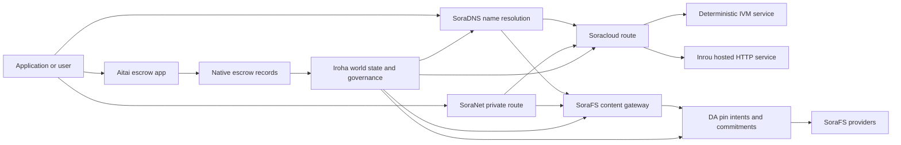

# SORA Nexus 服务 {#sora-nexus-services}

SORA Nexus 在 Iroha 3 周围添加了应用程序面向的服务飞机.这些服务不是单独的账本.它们由 Iroha 世界状态,Norito 公开表,治理记录和 Torii 路线家族固定.

可用性取决于节点构建和网络配置文件. 在目标节点上使用 [`/openapi`](/zh-hans/reference/torii-endpoints.md#app-and-sora-route-families)作为启用路线的权威列表.

## 组件地图 {#component-map}

|组件|角色|主要表面|
| ---------------------- | ------------------------------------------------------------------------------------------------------------------------------------------- | ---------------------------------------------------------------------------------------- |
|Soracloud|应用部署,托管服务,私人模型/运行时间状态以及服务生命周期控制. |`/v1/soracloud/`, `/api/`,`iroha app soracloud ...` |
|在里面|Soracloud 为需要直播 HTTP 飞机的服务修改运行时间托管 HTTP. |Soracloud 运行时间配置,主机功能广告,复制运行时间状态.|
|SoraNet|电路,继电流, VPN,连接会议和流媒体线路的隐私和运输覆盖. |`/v1/connect/`,`/v1/vpn/`, SoraNet 的路线元数据 |
|数据可用性 (DA) |在 Nexus 车道, SoraFS 表格和证明流程中引用的有效载荷的可用性证据,承诺和准意图层. |`/v1/da/`, `FindDaPinIntent`,`[sumeragi.da]` |
|SoraFS|文件表, CAR 有效载荷,固定内容,网关检索和可回收性证明流的内容定位存储布料. |`/v1/sorafs/`, `/sorafs/`,`FindSorafsProviderOwner` |
|SoraDNS|对于 SORA 托管的服务和内容,确定性命名和解决器认证层. |`/v1/soradns/`, `/soradns/`,解决方程式事件|
|艾塔伊|应用程序级的法定和资产结算走廊,由本地托管记录支持,而不是单独的账本.|`OpenAssetEscrow`, `FindAssetEscrow*`,`EscrowEventFilter`, Kotodama `escrow_*`的建筑物|



## 常见流量 {#common-flows}

### 托管的分类应用程序 {#hosted-split-application}

一个典型的混合平面应用程序使用了所有零件:

1. 静态前端资产被包装并通过 SoraFS 绑定.
2. 公共主机,例如 `<app>.sora`,通过 SoraDNS 进行注册.
3. Soracloud 路线 `/api/v1/search`或`/api/v1/stream`到一个 Inrou HTTP 服务.
4. Soracloud 路线 `/api/auth`和 `/api/v1/user`向确定性处理器 IVM.
5. 需要隐私的客户可以通过 SoraNet 电路达到相同内容或 API 路线.

|路径|后备飞机|为什么?|
| ----------------- | --------------------- | ------------------------------------------------- |
| `/`               |SoraFS 静态含量|可复制内容的根和网关缓存|
|`/assets/*`|SoraFS 静态含量|内容地址的资产和明确证据|
|`/api/auth*`|Soracloud IVM |复制安全的作者和钱包挑战状态 |
|`/api/v1/user*`|Soracloud IVM |对于治理敏感的状态突变|
|`/api/v1/search*`|Soracloud 在线|现场 HTTP 服务,缓存, SSE,或收藏状态|

### 内容出版 {#content-publication}

SoraFS 出版物在名称指向它们之前,生产了持久的文物:

1. 建立一个有效载荷或目录.
2. 包装在一个 CAR 档案和零件计划.
3. 建立一个 Norito 表格,包含针政策和治理数据.
4. 提交说明书给 Torii.
5. 如果目标配置文件需要明确的证据,则记录 DA 笔意图或可用性承诺.
6. 绑定表与 SoraDNS 名称或 Soracloud 静态前端路线.

### 乘坐私人车或播放路线 {#private-fetch-or-streaming-route}

SoraNet 可以坐在 SoraFS 或 Soracloud 前面:

1. 客户端解决了名称或表格.
2. 一个警卫目录或路线公开选择入口和出口继电器.
3. 交通被填充并通过 SoraNet 电路发送.
4. 输出继电器到达 SoraFS 门口, Torii 流或 Soracloud 路线.

## 艾塔伊 {#aitai}

Aitai是市场式结算的 SORA 应用程序走廊,买方和卖方在链外协调支付,而 Iroha 则控制了 在链上存储资产.它应使用本地托管指令家族,而不是合同所有的托管账户用于新数值资产托管流动.

在本地保证人账户中保留保管权.卖方开设了 `OpenAssetEscrow`, 买方接受并标记链外支付: `AcceptAssetEscrow` 和 `MarkEscrowPaymentSent`, 卖家将与 `ReleaseAssetEscrow` 如果买方和卖方不同意,双方可以开启争端,并通过 `CanResolveEscrowDispute` 可以把锁定的金额划分.

对于整个生命周期,通用资产锁定,匿名保证金,查询,事件和 Rust 的例子,请见 [原始资产保证金](/zh-hans/blockchain/escrow.md).

|艾塔伊表面|用它来|
| ------------------------------------------------------------------------------------------------------------------------------------------------------------- | ----------------------------------------------------------------------------------------- |
| `OpenAssetEscrow`, `AcceptAssetEscrow`, `MarkEscrowPaymentSent`, `ReleaseAssetEscrow`, `CancelAssetEscrow`                                                    |透明数值资产报价,包括以 XOR 为单位的结算流动. |
| `OpenAnonymousAssetEscrow`, `AcceptAnonymousAssetEscrow`, `MarkAnonymousEscrowPaymentSent`, `ReleaseAnonymousAssetEscrow`, `CancelAnonymousAssetEscrow`       |保护的报价使用证明附件对于资金和关闭活动.|
|`OpenEscrowDispute`, `ResolveEscrowDispute`,`OpenAnonymousEscrowDispute`, `ResolveAnonymousEscrowDispute` |纠纷和法庭方式的解决.|
|`FindAssetEscrowById`, `FindAssetEscrowsBySeller`,`FindAssetEscrowsByBuyer`, `FindAssetEscrowsByStatus` |应用程序状态页面,调整工作和支持工具.|
|`EscrowEventFilter`|按保证人身份,卖家,买家,状态或事件类型的透明保证人订阅.|
| Kotodama `escrow_open_offer`, `escrow_accept`, `escrow_mark_payment_sent`, `escrow_release`, `escrow_cancel`, `escrow_open_dispute`, `escrow_resolve_dispute` |Kotodama 合同通话由 V1 保证金系统支持. |

对于公开使用的 Taira 或 Minamoto,请将离链支付轨道和任何支持或法院工作流程视为应用程序政策. Iroha 记录保管状态,生命周期事件,证据哈希以及最终资产移动;它不会自行验证法定结算.

## 检查目标节点 {#check-a-target-node}

在使用本页面的示例之前,请确认您正在准的节点中存在路线家族:

```bash
export TORII_URL=https://taira.sora.org

curl -fsS "$TORII_URL/openapi.json" \
  | jq '.paths | keys[] | select(test("^/v1/(soracloud|sorafs|soradns|connect|vpn|da)/"))'

curl -fsS "$TORII_URL/status" | jq .
```

如果 `/openapi.json` 没有被个人资料所暴露,请尝试 `/openapi`.准确的路线可用性取决于构建功能和网络配置.

### Taira 仅阅读烟雾检查 {#taira-read-only-smoke-checks}

公开 Taira 终端点对于阅读侧检查是有用的,但除非您正在运营一个授权帐户并且打算更改现实状态,否则不要使用它用于突变例子.

```bash
export TORII_URL=https://taira.sora.org

curl -fsS "$TORII_URL/status" \
  | jq '{version: .build.version, peers, blocks, lanes: (.teu_lane_commit | length)}'

curl -fsS "$TORII_URL/v1/connect/status" | jq '{enabled, sessions_active}'

curl -fsS "$TORII_URL/v1/vpn/profile" \
  | jq '{available, relay_endpoint, supported_exit_classes}'

curl -fsS "$TORII_URL/v1/sorafs/storage/state" \
  | jq '{bytes_capacity, bytes_used, pin_queue_depth, por_inflight}'

curl -fsS -H 'Accept: application/json' "$TORII_URL/v1/soracloud/status" \
  | jq '.control_plane | {service_count, services: [.services[] | {service_name, current_version}]}'
```

Taira 可能会暴露出未列在 OpenAPI 路径地图中的部署特定控制平面路线.将 `/openapi`视为首要生成的 API 合同,然后直接确认任何部署特定路线,然后记录它作为现场.

## Soracloud {#soracloud}

Soracloud 是 SORA 应用控制平面.它跟踪部署捆绑,服务修订,路由,推出状态,权威配置输入,加密服务机密,模型注册表记录,私人推断会议和运行时间收据 .

Soracloud 使用两个执行飞机:

|执行飞机|运行时间|用它来|
| ---------------------- | ------- | -------------------------------------------------------------------------------------------- |
|`DeterministicService`|`Ivm`|作者,库存状态,认证阅读,订单邮箱处理器,对治理敏感的突变 |
|`HttpService`|`Inrou`|现场 HTTP APIs,收藏器繁重工作,缓存支持的服务, SSE,浏览器辅助流动.|

控制平面是权威的.部署,升级,反弹,配置,秘密,模型和状态命令通过 Torii 提交并阅读承诺世界状态;它们不依赖单独的 CLI 本地镜子.公共路由基于最长的前,因此一个注册主机可以在托管的 HTTP 路线和确定性的 API 路线之间分开流量.

### 架一个分开的应用程序 {#scaffold-a-split-app}

分类应用程序模板创建了静态前端加上一个托管的直播 API 和一个确定性库/API 服务:

```bash
iroha app soracloud app init \
  --template split-app \
  --app-name solswap_indexer \
  --app-version 0.1.0 \
  --public-host solswap-indexer.sora \
  --output-dir ./apps/solswap-indexer

iroha app soracloud app local-plan \
  --manifest ./apps/solswap-indexer/app_manifest.json

iroha app soracloud app doctor \
  --manifest ./apps/solswap-indexer/app_manifest.json
```

`local-plan` 打印路线分区,儿童服务表格,工作空间脚本路径以及预期的前端发布模式. `doctor` 在你参与之前,验证本地释放合同 Torii.

### 部署和检查应用程序状态 {#deploy-and-inspect-app-state}

```bash
export SORACLOUD_TORII_URL=https://<soracloud-enabled-torii>

iroha app soracloud app deploy \
  --manifest ./apps/solswap-indexer/app_manifest.json \
  --torii-url "$SORACLOUD_TORII_URL"

iroha app soracloud app status \
  --manifest ./apps/solswap-indexer/app_manifest.json \
  --torii-url "$SORACLOUD_TORII_URL"
```

对于已部署的服务,使用服务范围指令:

```bash
iroha app soracloud status \
  --service-name solswap_indexer_live \
  --torii-url "$SORACLOUD_TORII_URL"

iroha app soracloud rollback \
  --service-name solswap_indexer_live \
  --target-version 0.1.0 \
  --torii-url "$SORACLOUD_TORII_URL"
```

### 隐私和秘密材料 {#config-and-secret-material}

Soracloud 配置和秘密输入是权威部署状态的一部分.当需要的配置或秘密绑定缺失或与活跃表格不一致时,部署,升级和反弹无法关闭.

```bash
iroha app soracloud config-set \
  --service-name solswap_indexer_live \
  --config-name indexer/public_config \
  --value-file ./config/public-config.json \
  --torii-url "$SORACLOUD_TORII_URL"

iroha app soracloud secret-set \
  --service-name solswap_indexer_live \
  --secret-name indexer/api_key \
  --secret-file ./secrets/api-key.envelope.json \
  --torii-url "$SORACLOUD_TORII_URL"
```

使用 CLI 帮助查询您的个人资料所需的准确凭证标志:

```bash
iroha app soracloud config-set --help
iroha app soracloud secret-set --help
```

## 在线 {#inrou}

伊内罗是主机 HTTP 使用的运行时间 Soracloud. 一个 Iroha 嵌入式的节点 Soracloud 运行时间项目被录取 Soracloud 在本地实现计划中,将分配的托管服务副本作为循环服务启动,报告复制运行时间状态回到权威模型中.

使用Inrou用于需要现场 HTTP 表面的工作负载,例如收藏量重的 APIs,SSE 流程,缓存支持的处理器或浏览器辅助服务.

### 运行时间要求 {#runtime-requirements}

- 集装箱表运行时间必须为 `Inrou`.
- 服务表执行平面必须是 `HttpService`.
- `HttpService + Inrou`需要一个确切的 `PersistentRootLeaseVolume`安装在`/`.
- 复制的Inrou服务还需要共享服务或保密租存储,如果它们保持可变的共享状态.
- 产品托管节点应该宣传真正的Inrou容量,而不是仅仅作为代理.

### 显而易见的部分 {#manifest-fragment}

下面的例子显示了两个表现体的形状. 它是一个碎片,而不是一个完整的部署捆绑.

```jsonc
// container_manifest.json
{
  "schema_version": 1,
  "runtime": { "runtime": "Inrou", "value": null },
  "bundle_path": "/bundles/solswap-indexer.inrou",
  "entrypoint": "/app/bin/launch-indexer.sh",
  "args": [],
  "env": {
    "RUST_LOG": "info",
  },
  "inrou": {
    "schema_version": 1,
    "guest_os": { "guest_os": "DebianSlim", "value": null },
    "guest_images": {
      "x86_64": {
        "kernel_image_path": "/inrou/x86_64/vmlinux",
        "rootfs_image_path": "/inrou/x86_64/rootfs.ext4",
        "initrd_image_path": null,
      },
      "aarch64": {
        "kernel_image_path": "/inrou/aarch64/vmlinux",
        "rootfs_image_path": "/inrou/aarch64/rootfs.ext4",
        "initrd_image_path": null,
      },
    },
  },
  "lifecycle": {
    "start_grace_secs": 60,
    "stop_grace_secs": 30,
    "healthcheck_path": "/api/indexer/v1/health",
  },
}
```

```jsonc
// service_manifest.json
{
  "schema_version": 1,
  "service_name": "solswap_indexer_live",
  "service_version": "0.1.0",
  "execution_plane": { "execution_plane": "HttpService", "value": null },
  "replicas": 2,
  "route": {
    "host": "solswap-indexer.sora",
    "path_prefix": "/api/v1/search",
    "service_port": 8080,
    "visibility": { "visibility": "Public", "value": null },
    "tls_mode": { "tls": "Required", "value": null },
  },
  "lease_volumes": [
    {
      "volume_name": "root_disk",
      "kind": {
        "lease_volume": "PersistentRootLeaseVolume",
        "value": null,
      },
      "storage_class": { "storage_class": "Warm", "value": null },
      "mount_path": "/",
      "max_total_bytes": 8589934592,
    },
    {
      "volume_name": "index_state",
      "kind": { "lease_volume": "ServiceLeaseVolume", "value": null },
      "storage_class": { "storage_class": "Warm", "value": null },
      "mount_path": "/var/lib/solswap-indexer",
      "max_total_bytes": 1073741824,
    },
  ],
}
```

在运行时,每个安装的租量都通过从数量名称所衍生的环境变量来暴露:

```text
SORACLOUD_LEASE_VOLUME_ROOT_DISK_DIR
SORACLOUD_LEASE_VOLUME_ROOT_DISK_MOUNT_PATH
SORACLOUD_LEASE_VOLUME_INDEX_STATE_DIR
SORACLOUD_LEASE_VOLUME_INDEX_STATE_MOUNT_PATH
```

## SoraNet {#soranet}

SoraNet 是隐私和运输覆盖层.它为交通提供了基于继电的路线,该路线不应直接连接到目标门口或服务.运输设计采用入口,中部和出口继电器角色, QUIC 运输,基于噪音的混合握手,能力谈判,继电器目录元数据以及固定尺寸接式细胞.

在 Nexus 部署中,SoraNet 可以携带内容获取,网关流量, VPN 或连接会议和 Norito 流媒体路线.目录入口可标记支持 `norito-stream`的继电器,这使客户能够更好地选择适合 Torii RPC 或流媒体流量的路线.

### 流媒体配置 {#streaming-configuration}

Nexus 的配置使 SoraNet 为流媒体路线提供:

```toml
[streaming]
feature_bits = 0b11

[streaming.soranet]
enabled = true
exit_multiaddr = "/dns/torii/udp/9443/quic"
padding_budget_ms = 25
access_kind = "authenticated"
provision_spool_dir = "./storage/streaming/soranet_routes"
provision_spool_max_bytes = 0
provision_window_segments = 4
provision_queue_capacity = 256
```

使用 `access_kind = "read-only"`在不需要观众身份验证的内容路线上.使用 `authenticated`当退出继电器必须在连接到 Torii 或托管服务之前强制执行票或观众身份时.

### SoraNet-意识到 SoraFS 带来 {#soranet-aware-sorafs-fetch}

SoraFS 获取 CLI 可以发射一个本地代理表格,并为浏览器扩展或 SDK 适配器输出 SoraNet 路线元数据:

```bash
sorafs_cli fetch \
  --plan artifacts/payload_plan.json \
  --manifest-id 7bb2...9d31 \
  --provider name=alpha,provider-id=9f5c...73aa,base-url=https://gw-alpha.example.org/,stream-token="$(cat alpha.token)" \
  --output artifacts/payload.bin \
  --json-out artifacts/fetch_summary.json \
  --local-proxy-manifest-out artifacts/proxy_manifest.json \
  --local-proxy-mode bridge \
  --local-proxy-norito-spool storage/streaming/soranet_routes \
  --local-proxy-kaigi-spool storage/streaming/soranet_routes \
  --local-proxy-kaigi-policy authenticated \
  --max-peers=2 \
  --retry-budget=4
```

总结记录提供商报告,零件收据,本地代理元数据以及用于采集的有效路线设置.

## 数据可用性 (DA) {#data-availability-da}

DA 是太大,太敏感于隐私或太特定于服务的有效载荷的可用性证据层,无法直接放置在世界状态.它记录了确定性承诺和检索义务,以便验证者,网关和客户可以同意哪些字节被承诺,哪些政策适用,以及哪些证据已经观察到.

DA 不取代 Kura 或 SoraFS:

- Kura 存储了最终的区块流和共识恢复数据.
- SoraFS 存储并提供内容地址字节,CAR 实用载荷和公开文件.
- DA 记录承诺,证据政策,证据开放,并将这些字节安排,审计和链接到账本状态的标记.

使用 DA 当应用程序或 Nexus 车道需要在账本中可见的承诺,即链外数据仍然可回收.常见例子包括对结算流程的车道实用负载承诺,发布内容的 SoraFS 笔意图;必须保存以后进行验证的证据捆绑,以及公共状态应该是消化品而不是全部有效载荷的应用文物.

### 生命周期 {#lifecycle}

|阶段|记录的内容|
| ---------- | ----------------------------------------------------------------------------------------------------------------------------------------------------- |
|意图|一张门票,明确引用,号,车道/时代/序列参考,保留政策或复制目标. |
|承诺|消化材料将表格,车道有效载荷,证据捆绑或内容根连接到本书可见的记录.|
|证据|可用性投票,证据开放,供应商认证或其他被目标网络接受的个人资料特定证据. |
|问题|通过 `FindDaPinIntentByTicket`,`FindDaPinIntentByManifest`, `FindDaPinIntentByAlias`或 `FindDaPinIntentByLaneEpochSequence`进行印意图查询.|

一个典型的 DA 支持的出版流量是:

1. 在 WSV 之外构建或接收有效载荷,例如一个 SoraFS CAR 文件或 Nexus 车道有效载荷.
2. 在 Norito 宣言或路线特定的承诺记录中描述有效载荷.
3. 在启用该路线家族时,通过 `/v1/da/*` 或网络签署的交易途径提交明示表,印意图或承诺.
4. 让验证者或可用性提供者收集根据活跃证明政策所要求的证据.
5. 在推广一个姓名,结算证明或关口路线之前,请询问所产生的针意图或承诺.

### 算法模型 {#algorithmic-model}

DA 将一个有效载荷转化为签署的,反弹保护的,区块索引承诺.重要算法是确定性的,所以验证器和网关可以从相同字节中重新计算相同的消化.

1. Torii 接受一个用量请求,包括 `(lane_id, epoch, sequence)`,用量字节,压缩元数据,零件大小,删除配置文件,节点在要求时将gzip,delate或Zstandard的有效载荷解压缩,然后验证标准字节长度等于 `total_size`.
2. 验证车道和零件参数.该车道必须存在于 Nexus 车道目录中. `chunk_size`必须具有两个,至少两个字节的非零功率.不大于配置的最大值.删除资料必须包括数据片段和至少两个平率片段.车道目录选择证明方案,无论是 `merkle_sha256`还是 `kzg_bls12_381`.
3. 应用网络政策.节点强制对类的配置复制和保留基线.公共元数据必须保持纯文本;只使用统治方式的元数据在被写入表格之前,由节点的配置统治性元数据密钥加密.
4. 常规的有效载荷是通过固体尺寸的配置文件进行的 `chunk_size`. Torii 计算有效载荷消化,可检索性证明树根和每块的承诺. 数据分量 BLAKE3 对于其字节的承诺.
5. 添加删除承诺.切片被组分为 `data_shards` 的条纹.最后条纹中缺失的细胞是零填充的,用于平衡计算. RS(16) 平衡创造排/全球平衡分片;可选的 `row_parity_stripes`在矩阵中添加列式条纹平衡. 平衡分片承诺是 BLAKE3 少数符号的消化`u16`.
6. 建立表格. `DaManifestV1`记录了车道,时代,斑点类别,编码器,有效载荷消化,零件根,零件大小,删除配置文件,保留政策,租金报价,零件承诺,可选的 IPA 承诺,元数据和发布时间.存储门票是确定性的:节点首先将一个表格模板与空格门票哈希,然后把指纹写回为最后的 `storage_ticket`.
7. 拒绝重播冲突.重播键是 `(lane_id, epoch, sequence, manifest_fingerprint)`.具有相同指纹的复制件是无效的.已过时的序列或具有不同的指纹的同一序列被拒绝.
8. 发行签署的文物. Torii 计算 PDP 承诺,签署`DaIngestReceipt`,构建`DaCommitmentRecord`,并为公开文件编写卷文物;PDP 承诺,承诺记录,承诺时间表,笔意图,收件文件和收件日志.收件缓冲器每次`(lane_id, epoch)`均地推进.

一个记录绑定了:

- 路线,时代和序列
- ID 的调用器和法典表格哈希
- 车道防护方案
- 子根
- 对 KZG 车道的可选 KZG 承诺
- PDP/证据消化
- 存储类和存储门票
- Torii DA 确认签名

在区块嵌入 DA 记录之前,区块组装路径验证了捆绑:

- `(lane_id, epoch, sequence)`必须在捆绑中是唯一的.
- 显而易见的哈希必须在捆绑中是非零和独特的.
- 承诺证明方案必须符合配置的车道政策.
- 梅克尔路线拒绝 KZG 承诺; KZG 路线需要非零的 KZG 承诺.
- 按行径,表格哈希,存储票,所有者账户和碰规则进行加нони化,分类和过.

区块标题存储 DA 证明政策,承诺和笔意图的哈希.对于会员身份证明,承诺捆绑还暴露出一个 Merkle根,其叶子 Norito 编码的常规值 `DaCommitmentRecord` 的哈希.父母节点对左和右孩子的连接进行了哈希;一个奇偶叶是不变地推向下一层的.

### 证据验证 {#proof-verification}

`/v1/da/commitments/prove`可以为区块中的一个承诺提供证明.该证据包含承诺,区块高度,捆绑中索引,捆绑哈希,捆绑长度,默克尔根和兄弟路径.验证检查:

1. 证据捆绑哈希匹配区块标题的 DA 承诺哈希.
2. 证明区块高度与引用的区块标题相匹配.
3. 指数是限额的,承诺等于该指数中的包入.
4. 车道防护政策接受了承诺.
5. 从承诺叶子折叠的兄弟路径重建了提供的根.
6. 复制的根与捆绑根等.

这证明,一个特定的区块有效载荷中包含了具体的可用性承诺;这并不证明每个复制品都目前在线.通过 SoraFS 供应商检查, PDP/PoTR 检查或特定配置文件的可用性证据来单独检查现场获取性.

### 协商一致的互动 {#consensus-interaction}

DA 通过可靠的广播 (RBC) 连接到 Sumeragi,但它不是第二个最终协议. RBC 传播和恢复提案有效载荷:提议者宣布为 `(height, view, payload_hash)`,同行交换部分和 `READY`/`DELIVER`信号进行会议,追踪是否有足够的验证者观察到相同的有效负载.

在 Iroha 3 中,一个同行将悬而未决的区块有效载荷视为可用的,当:

- 当地悬而未决区块对预期有效载荷的哈希字节进行值,或
- RBC 已经恢复了一个符合区块哈希,高度,视图和有效载荷哈希的实用负载.

如果任何条件都不符合,同行记录 `missing_local_data`,通过 RBC 或区块同步继续试图恢复有效载荷,并报告状态和远程测量中 DA 门口.在目前的实施中,这些 DA 信号是最终性的建议:一个区块仍然从承诺证书加上相匹配的本地有效载荷来完成,而不是从单独的 DA 定制证书.

DA 时间扩大恢复窗口.有效的 DA 定制时限从配置的区块中提取,然后乘以 `sumeragi.advanced.da.quorum_timeout_multiplier`.可用性时限为 `max(quorum_timeout, availability_timeout_floor_ms) * availability_timeout_multiplier`.在可用性截止日期到期之前,节点有利于有效载荷恢复并避免过早重新安排;在截止日后,正常恢复和视图更改路径可以继续进行.

### 运营商笔记 {#operator-notes}

Iroha 3 共识配置文件包括 RBC 支持的有效载荷传播,表格保护,DA 捆绑验证和恢复远程测量.同行模板暴露`[sumeragi.da]`限制 对于每个区块的承诺和证据开放,再加上 `[sumeragi.advanced.da]` 定制和可用性行为时间延误乘法.保持这些设置在一个网络配置文件中的验证器中一致.

对于路线发现,从节点的 OpenAPI 文档开始:

```bash
curl -fsS "$TORII_URL/openapi.json" \
  | jq '.paths | keys[] | select(startswith("/v1/da/"))'
```

对于当前的 DA 查询名称,使用[查询参考](/zh-hans/reference/queries.md#nexus-data-availability-and-packages),以及您的构建暴露的本地 `[sumeragi.da]`按的](/zh-hans/reference/peer-config/)同行配置模板[.

## SoraFS {#sorafs}

SoraFS 是分散的内容地址存储布料. 它将字节包装成决定性块, CAR 档案,和 Norito 表达了绑定内容根,分类配置文件,针政策和治理证书. 存储服务提供商广告容量和内容可用性,而在提供内容之前,门户验证表格和部分承诺.

典型的 SoraFS 用途包括静态应用资产,文档构建,区域捆绑,模型或文物引用和治理证据捆绑. Iroha 数据模型暴露了 SoraFS 门户事件和供应商所有权解决方案的[`FindSorafsProviderOwner`](/zh-hans/reference/queries.md#nexus-data-availability-and-packages)查询.

### 包装,表达,签署和提交 {#pack-manifest-sign-and-submit}

```bash
cargo run -p sorafs_car --features cli --bin sorafs_cli -- \
  car pack \
  --input ./dist \
  --car-out artifacts/site.car \
  --plan-out artifacts/site.chunk-plan.json \
  --summary-out artifacts/site.car-summary.json

cargo run -p sorafs_car --features cli --bin sorafs_cli -- \
  manifest build \
  --summary artifacts/site.car-summary.json \
  --manifest-out artifacts/site.manifest.to \
  --manifest-json-out artifacts/site.manifest.json \
  --pin-min-replicas=3 \
  --pin-storage-class=warm \
  --pin-retention-epoch=42

SIGSTORE_ID_TOKEN=$(oidc-client fetch-token) \
cargo run -p sorafs_car --features cli --bin sorafs_cli -- \
  manifest sign \
  --manifest artifacts/site.manifest.to \
  --bundle-out artifacts/site.manifest.bundle.json \
  --signature-out artifacts/site.manifest.sig

cargo run -p sorafs_car --features cli --bin sorafs_cli -- \
  manifest submit \
  --manifest artifacts/site.manifest.to \
  --chunk-plan artifacts/site.chunk-plan.json \
  --torii-url "$TORII_URL" \
  --resolve-submitted-epoch=true \
  --authority=<i105-account-id> \
  --private-key-file ./secrets/authority.ed25519 \
  --summary-out artifacts/site.manifest.submit.json \
  --response-out artifacts/site.manifest.submit.body
```

如果 `/v1/sorafs/pin/register` 没有在目标节点上路由,则 CLI 可以回到已签署的 `/transaction` 提交中,并等待终端管道状态.

### 检查和带来 {#verify-and-fetch}

```bash
cargo run -p sorafs_car --features cli --bin sorafs_cli -- \
  proof verify \
  --manifest artifacts/site.manifest.to \
  --car artifacts/site.car \
  --chunk-plan artifacts/site.chunk-plan.json \
  --summary-out artifacts/site.verify.json

sorafs_cli fetch \
  --plan artifacts/site.chunk-plan.json \
  --manifest-id <manifest-digest-hex> \
  --provider name=primary,provider-id=<provider-id-hex>,base-url=https://gateway.example.org/,stream-token="$(cat provider.token)" \
  --output artifacts/site.fetch.tar \
  --json-out artifacts/site.fetch.json
```

### 检查可回收性证明 {#proof-of-retrievability-checks}

运营商可以对存储提供商进行检查并启动验证:

```bash
sorafs_cli por status \
  --torii-url "$TORII_URL" \
  --manifest <manifest-digest-hex> \
  --status=failed \
  --limit=20

sorafs_cli por trigger \
  --torii-url "$TORII_URL" \
  --manifest <manifest-digest-hex> \
  --provider <provider-id-hex> \
  --reason=latency_probe \
  --samples=48 \
  --auth-token artifacts/challenge_token.to
```

## SoraDNS {#soradns}

SoraDNS 是 SORA 服务和内容的确定性命名层.它将名称正常化,在 Iroha 中关联解决方案目录更新,和通过 SoraFS 分发签署的区域或解决器捆绑.

对于浏览器访问, SoraDNS 从注册的 FQDN 中导出网关主机. 注册的虚无性主机仍然是常规应用程序来源,而部署的网关配置文件则暴露了该来源的浏览器和 Torii 倒退路线.

### 主持人表格 {#host-forms}

|表格|示例|目的|
| --- | --- | --- |
|虚荣的起源|`https://<fqdn>/<path>`|URL 记录在表格和公告中|
|Taira 浏览器网关|`https://<fqdn>.mon.taira.sora.net/<path>`|公共浏览器网关为活跃的名|
|Torii 倒车路径|`https://taira.sora.org/soradns/<fqdn>/<path>`|Torii  active alias 的调试和回归路线|
|佳能式哈希网关|`<base32(blake3(name))>.gw.sora.id`|确定性门口身份和 GAR 验证 |

`/soradns/<alias>/...` 倒退不是首选的公众 URL.工具,应用程序表格和前端配置应该更喜欢虚无主机本身.如果在 Taira 上不活跃的姓氏,浏览器网关或倒退路径可以在应用程序路由启动之前返回`404`或失败 TLS.

### 导入网关主机 {#derive-gateway-hosts}

```ts
import {
  deriveSoradnsGatewayHosts,
  hostPatternsCoverDerivedHosts,
} from '@iroha/iroha-js'

const derived = deriveSoradnsGatewayHosts('docs.sora')
console.log(derived.canonicalHost)
console.log(derived.prettyHost)

const taira = deriveSoradnsGatewayHosts('solswap-indexer.sora', {
  prettySuffix: 'mon.taira.sora.net',
})
console.log(taira.prettyHost)

const patterns = [
  derived.canonicalHost,
  derived.canonicalWildcard,
  derived.prettyHost,
]
console.log(hostPatternsCoverDerivedHosts(patterns, derived))
```

GAR 有效载荷应该覆盖正规的哈希主机,正规的野生卡片和选择的漂亮的主机.

### 获取一个分辨器目录快照 {#fetch-a-resolver-directory-snapshot}

```bash
curl -i "$TORII_URL/v1/soradns/directory/latest"

soradns_resolver directory fetch \
  --record-url "$TORII_URL/v1/soradns/directory/latest" \
  --directory-url https://gateway.example.org/soradns/directory/latest.car \
  --output ./state/soradns-directory

soradns_resolver rad verify \
  --rad ./state/soradns-directory/rad/resolver-a.norito
```

网关应拒绝那些在最新的Merkle root目录中缺失,过期,未签名或未安装的解决方案证明文件. 在尚未发布任何解决方案目录的网络上, `/v1/soradns/directory/latest`可以返回 `404` 即使路线已启用.

### 公共 DNS 代表团 {#public-dns-delegation}

SoraDNS 主机衍生程序不取代常规互联网 DNS 委托程序.如果一个公共的 DNS 名称应该指向 SoraDNS 门户口:

- 为子域,将 CNAME 发布到所选择的漂亮主机
- 对于顶点名称,在任何cast IPs 门口使用 ALIAS/ANAME 或A/AAAA 记录.
- 在 SoraDNS 网关域下保存可行的哈希主机,以便进行 GAR 检查.

## FHE 和 UAID {#fhe-and-uaid}

在 Nexus 服务中可用的与 FHE 有关的表面包括:

- `iroha_crypto::fhe_bfv` 实现确定性 BFV 支持 skalar ciphertext评价.识别器分辨率使用 `BfvIdentifierPublicParameters` 和 `BfvIdentifierCiphertext`, 在此,插槽0存储输入字节长度,后来的插槽存储每一个加密字节.
- Soracloud 状态和职位方案模型 FHE 密码文本工作负载与管理管理参数组,执行政策,密码文档承诺,查询封以及披露请求.

BFV 识别器路径用于保护隐私的注册. 客户端可以提交加密识别器到 Torii 解决方案中.根据活跃识别器政策,获得一个 `OpaqueAccountId`,并发出一个收据. `ClaimIdentifier`然后将该收据绑定到目标账户附带的 UAID.

其他 UAID 而在数据模型中, `UniversalAccountId` 是哈希支持的,显示为 `uaid:<hash>`. 解析者接受了两种 `uaid:<hash>` 或是原始的64 Hex消化. `Account` 和 `NewAccount` 包含可选 `uaid` 和 `opaque_ids` 运行时间登记执行一个对一个的 UAID-对账户指数,拒绝复制或碰撞的不透明标识符,并且拒绝没有 UAID. 每当一个 UAID 运行时间重建空间目录数据库的绑定. UAID.

空间目录表达了将功能添加到 UAID.一个 `AssetPermissionManifest` 命名 UAID,数据空间,激活和可选的过期时代,并按数据空间,程序,方法,资产和 AMX 角色进行排序允许/拒绝输入.评价是拒绝胜利:第一个匹配拒绝拒绝请求,否则最新匹配允许候选人与任何数额限制进行检查.发布,过期和撤销这些表格由 `CanPublishSpaceDirectoryManifest`保护.

对于 Soracloud FHE 状态,实施的计划是:

|方案|它控制了什么?|
| ----------------------------------------- | --------------------------------------------------------------------------------------------------------------------------- |
|`SoraStateBindingV1`与 `FheCiphertext`|声明状态密钥前置值为 FHE 密码文本. |
|`FheParamSetV1`|名称:方案,后端,模块链,多项级别,插槽数量,安全目标,生命周期和参数消化.|
|`FheExecutionPolicyV1`|限制密码文本大小,纯文本的大小,输入/输出数量,乘法深度,旋转,启动带和圆形模式. |
|`FheGovernanceBundleV1`|一个参数设置与一个执行政策进行录取验证. |
|`FheJobSpecV1`|描述对密码文本状态密钥和承诺的确定性 `Add`, `Multiply`, `RotateLeft`或 `Bootstrap`工作. |
|`CiphertextQuerySpecV1`|查询仅按服务,绑定,关键前置,结果限量,元数据水平和可选的包含证明.|
|`DecryptionRequestV1`|要求在解密权限政策下披露一个加密文本承诺. |

`FheJobSpecV1::validate_for_execution` 检查工作,执行政策和参数设置在录取前是否一致.它还强制执行特定操作规则:添加和乘法需要至少两个输入,旋转和启动带需要一个输入,要求的深度,旋转数量,启动带数量,输入数量,有效载荷字节和确定性输出尺寸必须保持在政策界限内.密码文字查询结果不得返回直文行.

UAID 不是加密文本,也不是 FHE 政策本身.它是用于查找帐户,不透明的标识符索赔和空间目录绑定的稳定账户功能,允许服务或数据空间流程.FHE 方案通过参数集合,执行政策,密码文本承诺和解密权威政策分别管理加密有效载荷的输入和执行.

相关的 Torii 表面包括:

- `/v1/identifier-policies`
- `/v1/identifiers/resolve`
- `/v1/accounts/{account_id}/identifiers/claim-receipt`
- `/v1/identifiers/receipts/{receipt_hash}`
- `/v1/accounts/{uaid}/portfolio`
- `/v1/space-directory/uaids/{uaid}`
- `/v1/space-directory/uaids/{uaid}/manifests`
- `/v1/soracloud/model/run-private`
- `/v1/soracloud/model/run-private/finalize`
- `/v1/soracloud/model/decrypt-output`

公开元数据界限在方案中明确:UAID 绑定,不透明的标识符记录,表达生命周期,状态密钥消化,加密文本大小,加密文字承诺,政策名称,参数设置版本,工作操作,输出状态密钥,识别字体,解密状态,模型输入和输出以及 FHE 秘密钥匙都在这些公开查询记录之外.

## 运营检查列表 {#operational-checklist}

- 确认有 `/openapi`在目标 Torii 节点上的启用服务家庭.
- 处理 Soracloud 部署表格, SoraFS 表格,SoraDNS 解决器目录记录, SoraNet 继电目录记录和 DA 笔意图或可用性承诺作为对治理敏感的文具.
- 在一个网络中的验证器中,使用相同的 SORA Nexus 配置文件.
- 保持Inrou根和共享租数量在表格中,而不是依赖于临时节点本地路径.
- 在推广内容别名之前使用 SoraFS 证据验证.
- 监视器 SoraNet 握手失败, DA 定制或可用性时间, SoraFS 网关拒绝, SoraDNS RAD 新鲜性,以及 Soracloud 部署健康.
- 对于公开 Taira 或 Minamoto 的使用,首先使用[连接到 SORA Nexus 数据库](/zh-hans/get-started/sora-nexus-dataspaces.md).

此外,请参见:

- [Torii 终端点](/zh-hans/reference/torii-endpoints.md)
- [数据事件过器](/zh-hans/blockchain/filters.md#data-event-filters)
- [查询参考](/zh-hans/reference/queries.md#nexus-data-availability-and-packages)
