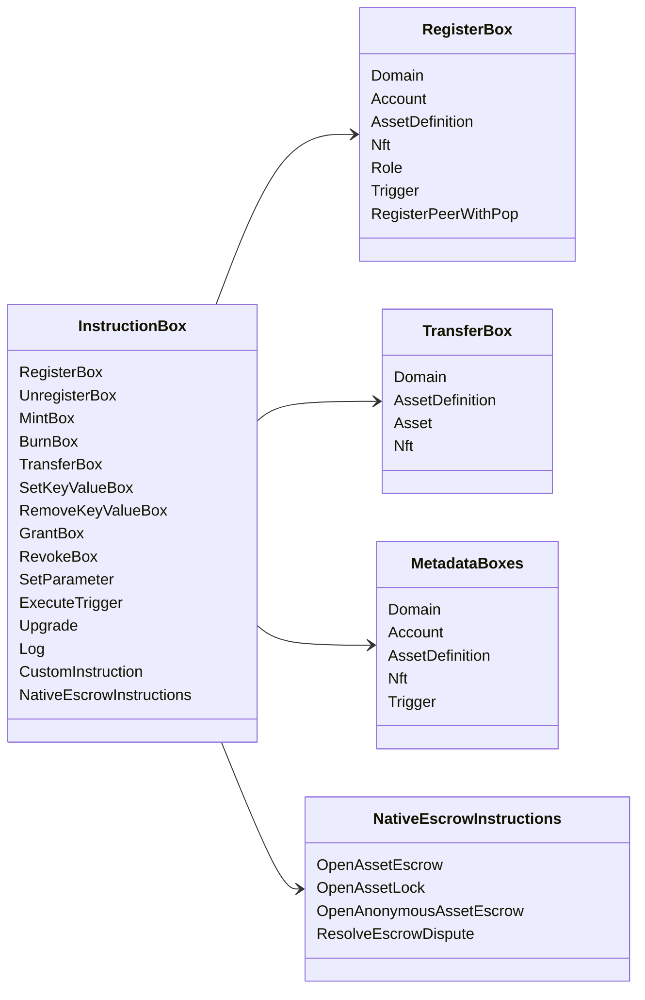

# Iroha 特别指示 {#iroha-special-instructions}

目前的数据模型揭示了这些内置指令家庭:

| 指示 | 变体 |
| --- | --- |
| [`RegisterBox`](/zh-hans/blockchain/instructions.md#un-register) | `Domain`, `Account`, `AssetDefinition`, `Nft`, `Role`, `Trigger`, `RegisterPeerWithPop` |
| [`UnregisterBox`](/zh-hans/blockchain/instructions.md#un-register) | `Peer`, `Domain`, `Account`, `AssetDefinition`, `Nft`, `Role`, `Trigger` |
| [`MintBox`](/zh-hans/blockchain/instructions.md#mint-burn) | 数字 `Asset`, 触发重复 |
| [`BurnBox`](/zh-hans/blockchain/instructions.md#mint-burn) | 数字 `Asset`, 触发重复 |
| [`TransferBox`](/zh-hans/blockchain/instructions.md#transfer) | `Domain`, `AssetDefinition`, 数字 `Asset`, `Nft` |
| [`SetKeyValueBox`](/zh-hans/blockchain/instructions.md#setkeyvalue-removekeyvalue) | `Domain`, `Account`, `AssetDefinition`, `Nft`, `Trigger` 大数据 |
| [`RemoveKeyValueBox`](/zh-hans/blockchain/instructions.md#setkeyvalue-removekeyvalue) | `Domain`, `Account`, `AssetDefinition`, `Nft`, `Trigger` 大数据 |
| [`GrantBox`](/zh-hans/blockchain/instructions.md#grant-revoke) | 审计许可,审计职能,审核权 |
| [`RevokeBox`](/zh-hans/blockchain/instructions.md#grant-revoke) | 账户的许可,账户中的角色,职位的许可 |
| [`SetParameter`](/zh-hans/blockchain/instructions.md#setparameter) | 链参数更新 |
| [`ExecuteTrigger`](/zh-hans/blockchain/instructions.md#executetrigger) | 触发执行 |
| [`Upgrade`](/zh-hans/blockchain/instructions.md#other-instructions) | 执行器升级 |
| [`Log`](/zh-hans/blockchain/instructions.md#other-instructions) | 执行程序日志输入 |
| [`CustomInstruction`](/zh-hans/blockchain/instructions.md#other-instructions) | 执行者特定 JSON 有效载荷 |
| [国产资产保证金](/zh-hans/blockchain/escrow.md) | `OpenAssetEscrow`, `AcceptAssetEscrow`, `MarkEscrowPaymentSent`, `ReleaseAssetEscrow`, `CancelAssetEscrow`, `OpenEscrowDispute`, `ResolveEscrowDispute` |
| [一般资产锁](/zh-hans/blockchain/escrow.md#generic-asset-locks) | `OpenAssetLock`, `DrawdownAssetLock`, `CancelAssetLock`, `ExpireAssetLock` |
| [匿名资产保证](/zh-hans/blockchain/escrow.md#anonymous-escrow) | `OpenAnonymousAssetEscrow`, `AcceptAnonymousAssetEscrow`, `MarkAnonymousEscrowPaymentSent`, `ReleaseAnonymousAssetEscrow`, `CancelAnonymousAssetEscrow`, `OpenAnonymousEscrowDispute`, `ResolveAnonymousEscrowDispute` |

额外 Iroha 3 模块可能会记录特定域的指令类型
通过指令注册表.
目前的源树,见 [数据模型方案](./data-model-schema.md).

::: details 图:家庭的基本指导

:::
