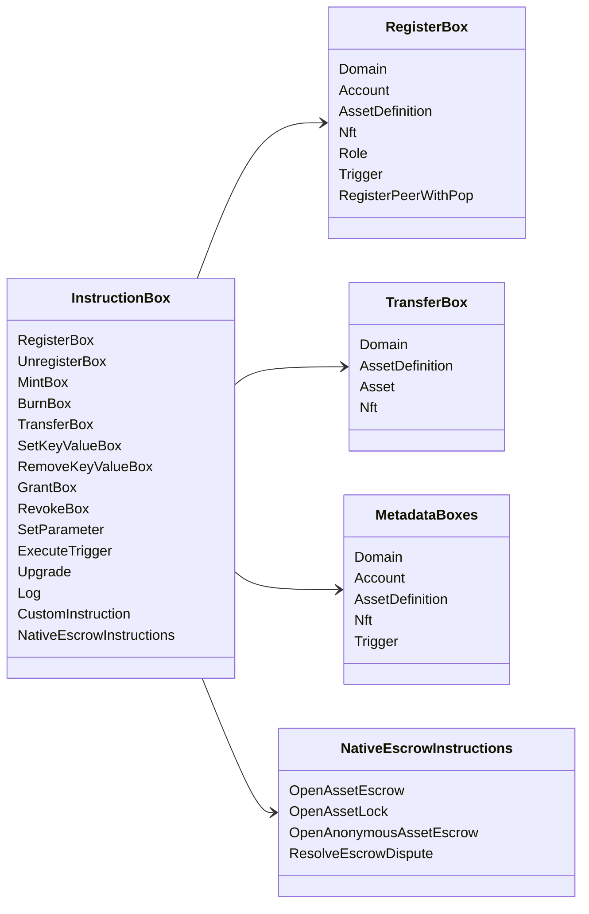

# Iroha 特殊指令 {#iroha-special-instructions}

当前数据模型公开以下内置指令族：

| 指令 | 变体 |
| --- | --- |
| [`RegisterBox`](/zh-hans/blockchain/instructions.md#un-register) | `Domain`, `Account`, `AssetDefinition`, `Nft`, `Role`, `Trigger`, `RegisterPeerWithPop` |
| [`UnregisterBox`](/zh-hans/blockchain/instructions.md#un-register) | `Peer`, `Domain`, `Account`, `AssetDefinition`, `Nft`, `Role`, `Trigger` |
| [`MintBox`](/zh-hans/blockchain/instructions.md#mint-burn) | 数值型 `Asset`、触发器重复次数 |
| [`BurnBox`](/zh-hans/blockchain/instructions.md#mint-burn) | 数值型 `Asset`、触发器重复次数 |
| [`TransferBox`](/zh-hans/blockchain/instructions.md#transfer) | `Domain`、`AssetDefinition`、数值型 `Asset`、`Nft` |
| [`SetKeyValueBox`](/zh-hans/blockchain/instructions.md#setkeyvalue-removekeyvalue) | `Domain`、`Account`、`AssetDefinition`、`Nft`、`Trigger` 元数据 |
| [`RemoveKeyValueBox`](/zh-hans/blockchain/instructions.md#setkeyvalue-removekeyvalue) | `Domain`、`Account`、`AssetDefinition`、`Nft`、`Trigger` 元数据 |
| [`GrantBox`](/zh-hans/blockchain/instructions.md#grant-revoke) | `Permission` (`Grant<Permission, Account>`), `Role` (`Grant<RoleId, Account>`), `RolePermission` (`Grant<Permission, Role>`) |
| [`RevokeBox`](/zh-hans/blockchain/instructions.md#grant-revoke) | `Permission` (`Revoke<Permission, Account>`), `Role` (`Revoke<RoleId, Account>`), `RolePermission` (`Revoke<Permission, Role>`) |
| [`SetParameter`](/zh-hans/blockchain/instructions.md#setparameter) | 更新链上参数 |
| [`ExecuteTrigger`](/zh-hans/blockchain/instructions.md#executetrigger) | 执行触发器 |
| [`Upgrade`](/zh-hans/blockchain/instructions.md#other-instructions) | 升级执行器 |
| [`Log`](/zh-hans/blockchain/instructions.md#other-instructions) | 执行器日志条目 |
| [`CustomInstruction`](/zh-hans/blockchain/instructions.md#other-instructions) | 执行器专用的 JSON 载荷 |
| [原生资产托管](/zh-hans/blockchain/escrow.md) | `OpenAssetEscrow`, `AcceptAssetEscrow`, `MarkEscrowPaymentSent`, `ReleaseAssetEscrow`, `CancelAssetEscrow`, `OpenEscrowDispute`, `ResolveEscrowDispute` |
| [通用资产锁定](/zh-hans/blockchain/escrow.md#generic-asset-locks) | `OpenAssetLock`, `DrawdownAssetLock`, `CancelAssetLock`, `ExpireAssetLock` |
| [匿名资产托管](/zh-hans/blockchain/escrow.md#anonymous-escrow) | `OpenAnonymousAssetEscrow`, `AcceptAnonymousAssetEscrow`, `MarkAnonymousEscrowPaymentSent`, `ReleaseAnonymousAssetEscrow`, `CancelAnonymousAssetEscrow`, `OpenAnonymousEscrowDispute`, `ResolveAnonymousEscrowDispute` |
| [原子私密结算](/zh-hans/blockchain/instructions.md#atomic-private-settlement) | `ActivatePrivateSettlementPoolV1`, `RotatePrivateSettlementPoolPolicyV1`, `FinalizeAtomicPrivateSettlementV1`, `AbortAtomicPrivateSettlementV1` |

其他 Iroha 3 模块可以通过指令注册表注册特定领域的指令类型。 有关节点提供的模式以及用于保存它的命令，请参阅[数据模型模式](./data-model-schema.md)。

::: details 图：核心指令族

:::
