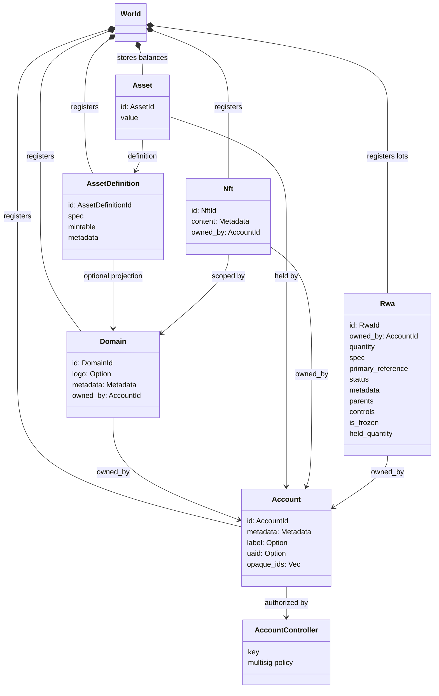
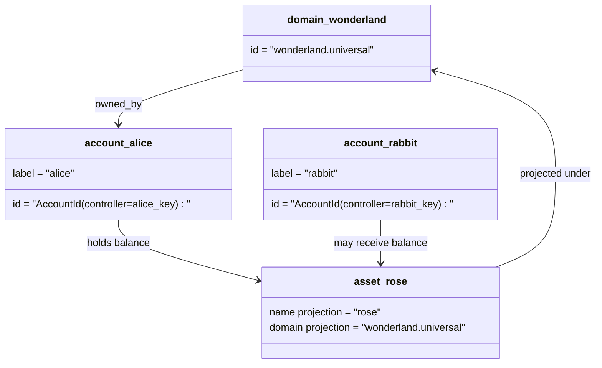

# 數據模型 {#data-model}

Iroha 存儲帳號國家 `World`. 首次發布的數據模型使用
以下法典身份和实體:

- 例如,域名有數據空間的資格 `payments.universal`
- 帳戶是法規的,沒有域名; ID 是由
  帳戶管理員
- 產品定義可以保持域名投影,
  文字地址是不透明的 Base58識別碼
- 資產是特定資產定義的帳戶所持有的餘額
- NFTs 具有專屬領域的獨家所有權記錄 IDs 和元數據
  內容
- RWAs 產生於:ID 代表外連鎖資產的分數
  擁有者,數量,來源,元數據,儲存,凍結和生命周期
  控制方式

## 舉例 {#example}

在一個 Iroha 3 網路, `wonderland.universal` 是一個域在
`universal` 數據空間. 在這個例子中,
他們的密碼或政策, I105 帳號 IDs. 可閱讀
標籤如: `alice@wonderland.universal` 是與這些聯繫的別名稱
IDs. 預算的資產定義仍可從一個領域和
這樣的名稱 `rose` 在 `wonderland.universal`, 而法典的資產
在電線上使用的定義地址是生成的 Base58地址.

## 姓名 {#aliases}

稱號是以人為對象的名字,
他們在 API, CLI, 沒有任何證券,
IDs 在嚴格帳號欄位中存儲的穩定識別碼.

| 目標         | 該組織的目標                                    | 字面上的名稱                                          | 支持模式                                                                 |
| -------------- | --------------------------------------------------- | ------------------------------------------------------ | ----------------------------------------------------------------------------- |
| 使用者帳戶   | 沒有域名 `AccountId` 編碼為 I105 年 月 日   | `name@domain.dataspace` 或是 `name@dataspace`            | `AccountAlias`; 主要的稱號是 `Account.label`, 其他名稱是結合  |
| 資產的定義 | 公教法典 `AssetDefinitionId` 基58地址     | `name#domain.dataspace` 或是 `name#dataspace`            | `AssetDefinitionAlias` 聯系到資產定義                           |
| 合同       | 經典的Bech32m `ContractAddress`                 | `name::domain.dataspace` 或是 `name::dataspace`          | `ContractAlias` 聯繫到部署的合同地址                          |
| 域名    | `DomainId` 在 `domain.dataspace` 形式               | `domain.dataspace`                                    | SNS `domain` 名稱空間記錄                                                 |
| 數據空間名稱 | 數字化 `DataSpaceId` 來自活動 Nexus 資料庫 | 數據空間名稱如 `universal`, `paynet`, 或是 `zk` | SNS `dataspace` 名字空間記錄加上活動資料空間目錄            |

帳戶名稱是面向使用者的帳戶名字.
因為名稱指向主戶 ID 通過世界國家
使用指數和帳戶回收記錄. `SetPrimaryAccountAlias` 關於
帳戶的主要標籤, `SetAccountAliasBinding` 其他非小學類
姓名,以及 `FindAccountByAlias` 或是 `FindAliasesByAccountId` 這是一份好好的經驗.
帳戶名稱通常需要積極的 SNS 收購的帳戶租
在 `AcquireAccountAliasLease` 並以 `RenewAccountAliasLease`.

不是個人帳戶餘額的資產.
密碼和合同密碼是直接從可讀的名字結束
已存在的法規目標. `SetAssetDefinitionAlias`;
密碼名稱段必須與資產定義顯示名稱相匹配,
預定定義名稱. `SetContractAlias`;
密碼數據空間必須與合同地址加碼的數據空間相匹配.
這兩種帶都能 `lease_expiry_ms`; 在使用期限後,他們停止解決
在世界國家指數中被除時,

域沒有獨立的域名 `DomainAlias` 域名識別子是
已有數據空間合格的名稱,如 `payments.universal`. SNS 列表
在該地區的域名租賃所有權 `domain` 命名空間和數據空間
其他名稱: `dataspace` 預訂的名稱空間 `universal` 數據空間名稱
必須保持定義.

## 有關文件 {#related-docs}

| 主題:                                  | 該去哪裡?                                 |
| -------------------------------------- | ------------------------------------------- |
| 域名                                | [域名](/zh-hant/blockchain/domains.md)           |
| 帳戶                               | [帳戶](/zh-hant/blockchain/accounts.md)         |
| 資產                                 | [資產](/zh-hant/blockchain/assets.md)             |
| NFTs                                   | [NFTs](/zh-hant/blockchain/nfts.md)                 |
| 實際的資產                      | [實際財產](/zh-hant/blockchain/rwas.md)    |
| 數據表                               | [數據表](/zh-hant/blockchain/metadata.md)         |
| 註冊和轉移指令 | [指示](/zh-hant/blockchain/instructions.md) |
| 執行時間許可                    | [許可證](/zh-hant/blockchain/permissions.md)   |
| 命名規則                           | [命名規則](/zh-hant/reference/naming.md)        |
