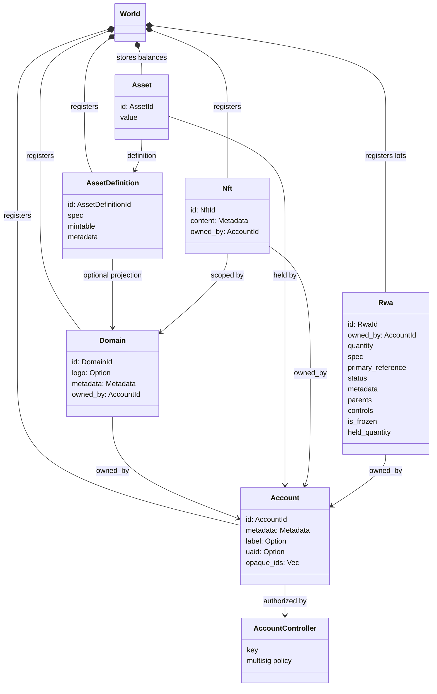
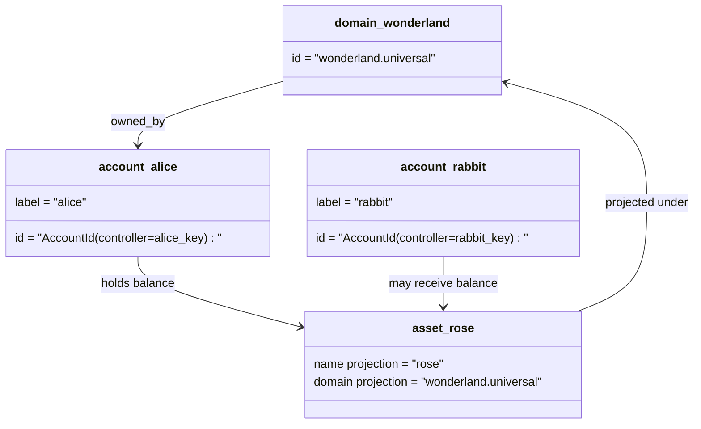

# 數據模型 {#data-model}

Iroha 在 `World` 中存儲本體狀態.其首次發佈的數據模型使用以下法定身份和實體:

- 域名具有數據空間資格,例如 `payments.universal`
- 賬戶是正規的,無域名;賬戶 ID 來自賬戶管理員.
- 資產定義可以保留域名投影,但它們的標準文本地址是不透明的Base58標識符
- 資產是指對特定資產定義的賬戶持有的餘額
- NFTs 是具有域名資格的 IDs 和元數據含量的獨有的記錄.
- RWAs 產生的-ID 分數代表了鏈外資產,目前擁有者,數量,來源,元數據,存儲,結和生命週期控制.

## 舉例 {#example}

在 Iroha 3 網絡中, `wonderland.universal` 是`universal` 數據空間內的域名.本示例中的常規賬戶由其密鑰或政策控制,並編碼爲無域名的 I105 帳戶 IDs.可讀標籤如`alice@wonderland.universal`是與 IDs 聯繫的單獨號.預測資產定義仍然可以從 `wonderland.universal` 中的域名和名稱中構建`rose`,而在線上使用的正規資產定義地址是生成的Base58地址.

## 姓名 {#aliases}

別名是面向人類的名稱,疊加在正規賬本標識符上.它們在 API, CLI,錢包和探險器邊界中有用,但正規 IDs 仍然是嚴格賬本領域存儲的穩定標識符.

|目標|標誌性目標|字面上的號|支持模式|
| -------------- | --------------------------------------------------- | ------------------------------------------------------ | ----------------------------------------------------------------------------- |
|用戶帳戶|無域名 `AccountId`編碼爲 I105 地址 |`name@domain.dataspace`或 `name@dataspace` |`AccountAlias`;主要姓氏爲 `Account.label`,額外姓氏是結合性的 |
|資產定義|`AssetDefinitionId` 基58地址 |`name#domain.dataspace`或 `name#dataspace` |`AssetDefinitionAlias` 綁定到資產定義|
|合同|正文 Bech32m `ContractAddress` |`name::domain.dataspace`或 `name::dataspace` |`ContractAlias` 綁定到部署的合同地址|
|域名| `DomainId` 在 `domain.dataspace` 形式               |`domain.dataspace`|SNS `domain`名稱空間記錄|
|數據域名 |從活躍的 Nexus 目錄中的數值 `DataSpaceId` |數據空間別名,例如 `universal`, `paynet`或 `zk` |SNS `dataspace`名區記錄加上活躍的數據空間目錄 |

賬戶號是面向用戶的帳戶名稱.它們存活下來,因爲號指向主動賬戶 ID 通過世界國家指數和賬戶回覆記錄. `SetPrimaryAccountAlias` 對賬戶的首要標籤, `SetAccountAliasBinding` 對於額外的非主要姓氏,以及 `FindAccountByAlias` 或 `FindAliasesByAccountId` 賬戶名字通常需要一個活躍的 SNS 收購的賬戶租 `AcquireAccountAliasLease` 和更新 `RenewAccountAliasLease`.

資產別名是指代資產的定義,而不是個人賬戶餘額.資產別稱和合同別名是直接從可讀的名字對現有正規目標進行綁定.資產別名設置爲 `SetAssetDefinitionAlias`;別名段必須與資產定義顯示名稱或預測定義名稱匹配.合同別名設定爲 `SetContractAlias`;代號數據空間必須與合同地址編碼的數據空間相匹配.兩個綁定可以攜帶 `lease_expiry_ms`;在過期後,它們停止解決時寬限窗口到期,並從世界國家指數掃除.

域名沒有單獨的 `DomainAlias`對象.一個域名標識符已經是一個數據空間合格的名字,如`payments.universal`. SNS 追蹤租所有權在 `domain`命名空間中的域名和`dataspace`名稱空間中的數據空間別名.保留的 `universal`數據空間別必須保持定義.

## 相關文件 {#related-docs}

|主題|我們要去哪裏?|
| -------------------------------------- | ------------------------------------------- |
|域名| [域名](/zh-hant/blockchain/domains.md)|
|賬戶| [賬戶](/zh-hant/blockchain/accounts.md)|
|資產| [資產](/zh-hant/blockchain/assets.md)|
|NFTs| [NFTs](/zh-hant/blockchain/nfts.md) |
|現實世界資產| [現實世界資產](/zh-hant/blockchain/rwas.md)|
|超級數據| [數據表](/zh-hant/blockchain/metadata.md)|
|登記和轉移指令| [指示](/zh-hant/blockchain/instructions.md) |
|運行時間權限| [許可證](/zh-hant/blockchain/permissions.md)|
|命名規則| [命名規則](/zh-hant/reference/naming.md) |
