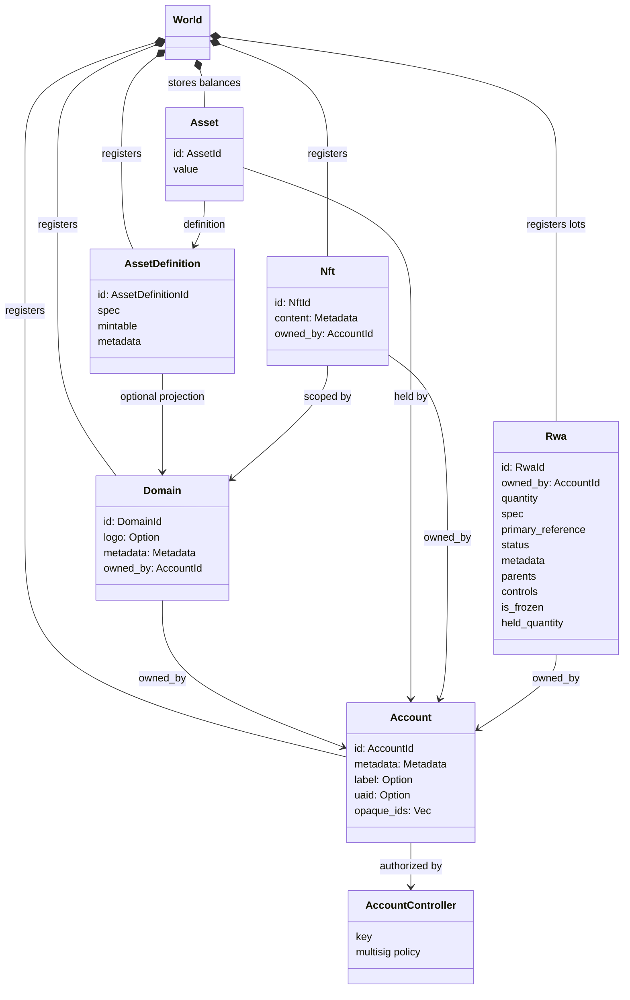
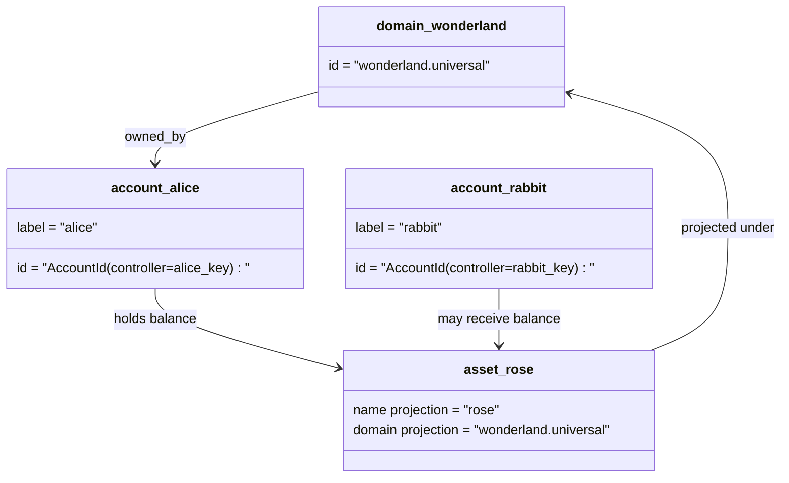

# 資料模型 {#data-model}

Iroha 在 `World` 中儲存帳本狀態。其首個版本的資料模型使用以下規範身分和實體：

- 域名具有資料空間資格,例如 `payments.universal`
- 帳戶是規範的,無域名;帳戶 ID 來自帳戶管理員.
- 資產定義可以保留域名投影,但它們的標準文字地址是不透明的Base58識別符號
- 資產是指對特定資產定義的帳戶持有的餘額
- NFTs 是具有域名資格的 IDs 和後設資料含量的獨有的記錄.
- RWAs 產生的-ID 分數代表了鏈外資產,目前擁有者,數量,來源,後設資料,儲存,結和生命週期控制.

## 舉例 {#example}

在 Iroha 3 網路中, `wonderland.universal` 是`universal` 資料空間內的域名.本示例中的規範帳戶由其金鑰或政策控制,並編碼為無域名的 I105 帳戶 IDs.可讀標籤如`alice@wonderland.universal`是與 IDs 聯絡的單獨號.預測資產定義仍然可以從 `wonderland.universal` 中的域名和名稱中構建`rose`,而線上上使用的規範資產定義地址是生成的Base58地址.

## 姓名 {#aliases}

別名是面向人類的名稱,疊加在規範賬本識別符號上.它們在 API, CLI,錢包和探險器邊界中有用,但規範 IDs 仍然是嚴格賬本領域儲存的穩定識別符號.

|目標|標誌性目標|字面上的號|支援模式|
| -------------- | --------------------------------------------------- | ------------------------------------------------------ | ----------------------------------------------------------------------------- |
|使用者帳戶|無域名 `AccountId`編碼為 I105 地址 |`name@domain.dataspace`或 `name@dataspace` |`AccountAlias`;主要別名為 `Account.label`,額外別名是結合性的 |
|資產定義|規範的 `AssetDefinitionId` Base58 位址 |`name#domain.dataspace`或 `name#dataspace` |`AssetDefinitionAlias` 繫結至資產定義|
|合同|正文 Bech32m `ContractAddress` |`name::domain.dataspace`或 `name::dataspace` |`ContractAlias` 繫結到部署的合同地址|
|域名| `DomainId` 在 `domain.dataspace` 形式               |`domain.dataspace`|SNS `domain`名稱空間記錄|
|資料域名 |從活躍的 Nexus 目錄中的數值 `DataSpaceId` |資料空間別名,例如 `universal`, `paynet`或 `zk` |SNS `dataspace`名區記錄加上活躍的資料空間目錄 |

帳戶別名是面向使用者的帳戶名稱。帳戶重新設定金鑰後，別名仍然有效，因為它會透過世界狀態索引和帳戶金鑰變更記錄指向作用中的帳戶 ID。使用 `SetPrimaryAccountAlias` 設定帳戶的主要標籤，使用 `SetAccountAliasBinding` 設定其他非主要別名，並使用 `FindAccountByAlias` 或 `FindAliasesByAccountId` 進行讀取。帳戶別名通常需要一項有效的 SNS 帳戶別名租約，該租約透過 `AcquireAccountAliasLease` 取得，並透過 `RenewAccountAliasLease` 續期。

資產別名命名的是資產定義，而不是個別帳戶餘額。資產別名和合約別名會將可讀名稱直接繫結至現有規範目標。使用 `SetAssetDefinitionAlias` 設定資產別名；別名的名稱區段必須與資產定義的顯示名稱或投影定義名稱相符。使用 `SetContractAlias` 設定合約別名；別名的資料空間必須與合約位址中編碼的資料空間相符。兩種繫結都可攜帶 `lease_expiry_ms`；到期後，一旦寬限期結束，它們便會停止解析，並從世界狀態索引中清除。

域名沒有單獨的 `DomainAlias`物件.一個域名識別符號已經是一個資料空間合格的名字,如`payments.universal`. SNS 追蹤租所有權在 `domain`名稱空間中的域名和`dataspace`名稱空間中的資料空間別名.保留的 `universal`資料空間別必須保持定義.

## 相關檔案 {#related-docs}

|主題|我們要去哪裡?|
| -------------------------------------- | ------------------------------------------- |
|域名| [域名](/zh-hant/blockchain/domains.md)|
|帳戶| [帳戶](/zh-hant/blockchain/accounts.md)|
|資產| [資產](/zh-hant/blockchain/assets.md)|
|NFTs| [NFTs](/zh-hant/blockchain/nfts.md) |
|現實世界資產| [現實世界資產](/zh-hant/blockchain/rwas.md)|
|超級資料| [資料表](/zh-hant/blockchain/metadata.md)|
|登記和轉移指令| [指示](/zh-hant/blockchain/instructions.md) |
|執行階段許可權| [許可證](/zh-hant/blockchain/permissions.md)|
|命名規則| [命名規則](/zh-hant/reference/naming.md) |
