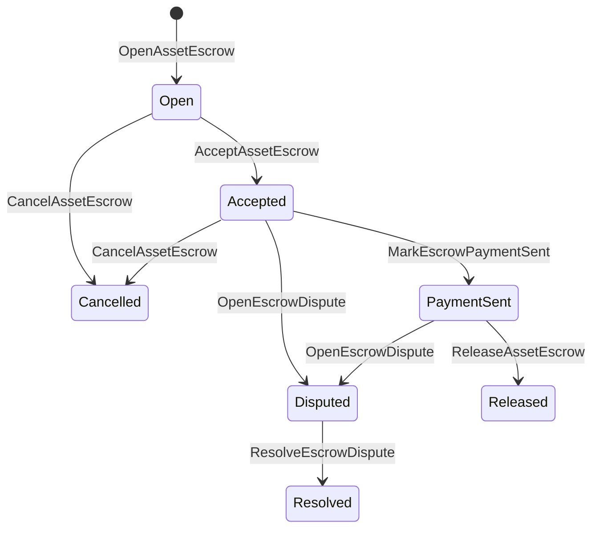

# 預借本地資產 {#native-asset-escrow}

內存保證是數值資產的管理帳號保管機制.
而不是將資產寄送到申請所屬的帳戶,
保護該帳戶的應用程式碼,保證 ISIs 將價值移動到
確定性協議保管帳戶和記錄保證期生周期
世界國家.

使用本土的保證金為市場決済, 艾泰式外鎖支付
需要的協調,里程碑式鎖定和保護保證工作流程
顯示生命周期狀態.

## 概念 {#concepts}

| 概念 | 描述 |
| --- | --- |
| `EscrowId` | 必須在透明和匿名的保證券中獨特. |
| `AssetEscrowRecord` | 透明數字資產保證或鎖定紀錄. |
| `AnonymousAssetEscrowRecord` | 保護保證紀錄, |
| 預留帳戶 | 由連鎖衍生出來的決定性協議帳號 ID, 預約金 ID, 以及資產的定義. |
| 證據的哈希 | 存儲資料或其他非連鎖證據. 證據本身並不存储在保證紀錄中. |

透明的紀錄包含賣家,選擇性買方,資產定義,
總額,保帳戶,生命周期狀態,行為類型,剩餘
數量,可選擇的釋放權限,可選擇到期時間印章,證據
這種方法可以使用,

負債額度必須是正數值的資產量,
預約或鎖定活動中,
一般的資產轉移不能耗費保帳戶;保退出
這些路徑是保證金 ISIs 在下面描述.

## 市場預約 {#marketplace-escrow}

市場托管協調連鎖的資產釋放與連鎖以外的資產
付款或交付工作流程.



| ISI | 請問是誰提出的? | 影響 |
| --- | --- | --- |
| `OpenAssetEscrow` | 賣家 | 鎖定出售商數字資產, `Open` 市場紀錄. |
| `AcceptAssetEscrow` | 購買者 | 記錄買家的行動, `Open` 必須 `Accepted`. 賣家不能接受自己的保證. |
| `MarkEscrowPaymentSent` | 接受的買方 | 移動 `Accepted` 必須 `PaymentSent` 在購買者發送外鎖付款後. |
| `ReleaseAssetEscrow` | 賣家 | 移動 `PaymentSent` 必須 `Released` 並將全額保證金轉移給買方. |
| `CancelAssetEscrow` | 賣家 | 移動 `Open` 或是 `Accepted` 必須 `Cancelled` 在付款標記之前, |
| `OpenEscrowDispute` | 賣家或被接受的買方 | 移動 `Accepted` 或是 `PaymentSent` 必須 `Disputed` 並添加證據. |
| `ResolveEscrowDispute` | 帳號與 `CanResolveEscrowDispute` | 移動 `Disputed` 必須 `Resolved` 並將金額分為買方和賣方. |

解決爭議的金額必須是無負的,
`buyer_amount + seller_amount` 必須等於保證金.
腿可以,但整個分區必須考慮鎖定平衡.

### Rust 舉例 {#rust-example}

這樣的例子假設賣家和買家帳戶已經存在,
數字的定義已註冊,

```rust
use iroha::{
    client::Client,
    data_model::{
        isi::escrow::{
            AcceptAssetEscrow, MarkEscrowPaymentSent, OpenAssetEscrow,
            ReleaseAssetEscrow,
        },
        prelude::*,
    },
};
use iroha_crypto::Hash;

fn release_marketplace_escrow(
    seller_client: &Client,
    buyer_client: &Client,
    asset_definition_id: AssetDefinitionId,
) -> eyre::Result<()> {
    let escrow_id = EscrowId::new(Hash::new("docs-marketplace-escrow-001"));

    seller_client.submit_blocking(OpenAssetEscrow::with_evidence_hashes(
        escrow_id,
        asset_definition_id,
        Numeric::from(40_u64),
        vec![Hash::new("invoice:2026-001")],
    ))?;

    buyer_client.submit_blocking(AcceptAssetEscrow::new(escrow_id))?;
    buyer_client.submit_blocking(MarkEscrowPaymentSent::new(escrow_id))?;
    seller_client.submit_blocking(ReleaseAssetEscrow::new(escrow_id))?;

    let record = seller_client.query_single(FindAssetEscrowById::new(escrow_id))?;
    assert_eq!(record.status, AssetEscrowStatus::Released);
    assert_eq!(record.remaining_amount, Numeric::zero());

    Ok(())
}
```

## 常用資產鎖匙 {#generic-asset-locks}

資產鎖使用相同的保管紀錄類型,但他們不是買賣者
他們會鎖定目的地帳戶的資金,
獨立發放權限提取資金.

| ISI | 請問是誰提出的? | 影響 |
| --- | --- | --- |
| `OpenAssetLock` | 來源帳戶 | 鎖定一個正數值,記錄目的地作為紀錄購買者, `Locked`. |
| `DrawdownAssetLock` | 沒有設置的釋放權限或目的地 | 還是將部分或全部剩餘的監禁物轉移到目的地. |
| `CancelAssetLock` | 鎖匙打開機 | 取消一個活跃的鎖匙, |
| `ExpireAssetLock` | 在截止日期後的任何交易權威 | 結束後, `expires_at_ms` 在過去,並將剩餘的金額還給開機者. |

`DrawdownAssetLock` 保持記錄 `Locked` 還有一些數量.
當剩余數量達到零時, `DrawnDown` 及其他
這份紀錄已結束.

```rust
use iroha::{
    client::Client,
    data_model::{
        isi::escrow::{CancelAssetLock, DrawdownAssetLock, ExpireAssetLock, OpenAssetLock},
        prelude::*,
    },
};
use iroha_crypto::Hash;

fn drawdown_and_close_asset_locks(
    opener_client: &Client,
    destination_client: &Client,
    release_authority_client: &Client,
    asset_definition_id: AssetDefinitionId,
    destination: AccountId,
    release_authority: AccountId,
) -> eyre::Result<()> {
    let trusted_lock_id = EscrowId::new(Hash::new("docs-asset-lock-trusted"));

    opener_client.submit_blocking(OpenAssetLock::with_options(
        trusted_lock_id,
        asset_definition_id.clone(),
        destination.clone(),
        Numeric::from(40_u64),
        Some(release_authority),
        None,
        vec![Hash::new("milestone-plan-v1")],
    ))?;

    release_authority_client.submit_blocking(DrawdownAssetLock::new(
        trusted_lock_id,
        Numeric::from(15_u64),
    ))?;

    let partially_drawn =
        opener_client.query_single(FindAssetEscrowById::new(trusted_lock_id))?;
    assert_eq!(partially_drawn.status, AssetEscrowStatus::Locked);
    assert_eq!(partially_drawn.remaining_amount, Numeric::from(25_u64));

    opener_client.submit_blocking(CancelAssetLock::new(trusted_lock_id))?;
    let cancelled = opener_client.query_single(FindAssetEscrowById::new(trusted_lock_id))?;
    assert_eq!(cancelled.status, AssetEscrowStatus::Cancelled);

    let expiring_lock_id = EscrowId::new(Hash::new("docs-asset-lock-expiring"));
    opener_client.submit_blocking(OpenAssetLock::with_options(
        expiring_lock_id,
        asset_definition_id,
        destination,
        Numeric::from(10_u64),
        None,
        Some(0),
        Vec::new(),
    ))?;

    destination_client.submit_blocking(ExpireAssetLock::new(expiring_lock_id))?;
    let expired = opener_client.query_single(FindAssetEscrowById::new(expiring_lock_id))?;
    assert_eq!(expired.status, AssetEscrowStatus::Expired);

    Ok(())
}
```

Python 目前對一般鎖的高級輔助器暴露:
`open_asset_lock`, `drawdown_asset_lock`, `cancel_asset_lock`, 及其他
`expire_asset_lock`. 市場及匿名的保證金 Python, 使用
公教法典 `InstructionBox` JSON 透過 SDK 沒有任何問題 JSON 逃離門口或降伏
透過一個 SDK 這樣的行為將揭露一流的保證金建設者.

## 爭議 {#disputes}

市場保證人可以從 `Accepted` 或是 `PaymentSent`.
只有註冊的賣家或買主才能開啟爭議.
`CanResolveEscrowDispute`, 或直接向解決戶帳戶提供
或是因為角色而繼承.

```rust
use iroha::{
    client::Client,
    data_model::{
        isi::escrow::{OpenEscrowDispute, ResolveEscrowDispute},
        prelude::*,
    },
};
use iroha_crypto::Hash;
use iroha_executor_data_model::permission::escrow::CanResolveEscrowDispute;

fn resolve_disputed_escrow(
    admin_client: &Client,
    buyer_client: &Client,
    court_client: &Client,
    court: AccountId,
    escrow_id: EscrowId,
) -> eyre::Result<()> {
    admin_client.submit_blocking(Grant::account_permission(
        Permission::from(CanResolveEscrowDispute),
        court,
    ))?;

    buyer_client.submit_blocking(OpenEscrowDispute::with_evidence_hashes(
        escrow_id,
        vec![Hash::new("buyer-payment-receipt")],
    ))?;

    court_client.submit_blocking(ResolveEscrowDispute::with_evidence_hashes(
        escrow_id,
        Numeric::from(30_u64),
        Numeric::from(10_u64),
        vec![Hash::new("court-judgement-001")],
    ))?;

    let record = admin_client.query_single(FindAssetEscrowById::new(escrow_id))?;
    assert_eq!(record.status, AssetEscrowStatus::Resolved);
    assert_eq!(
        record.resolution.as_ref().map(|resolution| resolution.buyer_amount.clone()),
        Some(Numeric::from(30_u64)),
    );

    Ok(())
}
```

## 匿名的保證金 {#anonymous-escrow}

匿名保證使用相同的市場生命周期,
公開紀錄仍存儲賣家,
購買者,狀態,證據的哈希,時間印章和證據相關的移動
在保護票的內面,數量和收件人表示為
沒有任何證據,

| 透明性 ISI | 沒有名稱 ISI |
| --- | --- |
| `OpenAssetEscrow` | `OpenAnonymousAssetEscrow` |
| `AcceptAssetEscrow` | `AcceptAnonymousAssetEscrow` |
| `MarkEscrowPaymentSent` | `MarkAnonymousEscrowPaymentSent` |
| `ReleaseAssetEscrow` | `ReleaseAnonymousAssetEscrow` |
| `CancelAssetEscrow` | `CancelAnonymousAssetEscrow` |
| `OpenEscrowDispute` | `OpenAnonymousEscrowDispute` |
| `ResolveEscrowDispute` | `ResolveAnonymousEscrowDispute` |

財布或檢查工具必須建立證據附件和公共輸入.
解釋,取消和匿名的權利
解決爭議必須支付一個保證承諾,
該行動所需的買方,賣方或分出口承諾.

```rust
use iroha::{
    client::Client,
    data_model::{
        isi::escrow::{
            AcceptAnonymousAssetEscrow, MarkAnonymousEscrowPaymentSent,
            OpenAnonymousAssetEscrow,
        },
        prelude::*,
        proof::ProofAttachment,
    },
};
use iroha_crypto::Hash;

fn open_anonymous_escrow(
    seller_client: &Client,
    buyer_client: &Client,
    escrow_id: EscrowId,
    asset_definition_id: AssetDefinitionId,
    funding_nullifiers: Vec<[u8; 32]>,
    escrow_commitment: [u8; 32],
    proof: ProofAttachment,
    root_hint: Option<[u8; 32]>,
) -> eyre::Result<()> {
    seller_client.submit_blocking(OpenAnonymousAssetEscrow::with_evidence_hashes(
        escrow_id,
        asset_definition_id,
        funding_nullifiers,
        escrow_commitment,
        proof,
        root_hint,
        vec![Hash::new("shielded-invoice")],
    ))?;

    buyer_client.submit_blocking(AcceptAnonymousAssetEscrow::new(escrow_id))?;
    buyer_client.submit_blocking(MarkAnonymousEscrowPaymentSent::new(escrow_id))?;

    Ok(())
}
```

對於底部的保護交易模式,請見
[匿名交易](/zh-hant/blockchain/anonymous-transactions.md).

## SDK 使用方式 {#sdk-usage}

預約支持在各國不同程度上呈現 SDKs. Rust 沒有法典
輸入資料模型. Python 目前暴露於一般的資產鎖定助手.
JavaScript 及其他 TypeScript 使用 Kotodama 預備主機的電話. Kotlin/JVM 及其他 Swift
為市場提供打印式有效載荷施工人員和匿名保證人.

| SDK | 請使用這個表面. | 範圍 |
| --- | --- | --- |
| [Rust](#rust-sdk) | `iroha::data_model::isi::escrow` | 沒有任何相關的資訊, |
| [Python](#python-asset-locks) | `Instruction.open_asset_lock`, `TransactionDraft.open_asset_lock`, 和客戶 `*_and_wait` 助手 | 市場和匿名保證人員並不是一流的 Python 還沒有使用方法. |
| [JavaScript / TypeScript](#javascript-and-typescript-kotodama) | `compileKotodamaProgram` 來自 `@iroha/iroha-js/kotodama-compiler` | 預約主機在內打電話 Kotodama 請問他們是誰? |
| [Kotlin / JVM](#kotlin-and-jvm) | `InstructionTemplate` 在 `org.hyperledger.iroha.sdk.core.model.instructions` | 沒有任何相關資訊, |
| [Swift / iOS](#swift-and-ios) | `NativeEscrowInstructionBuilders` 及其他 `IrohaSDK.build*Escrow*` 助手 | 市場及匿名保證 Norito JSON 指示用載體. |

在下面的例子中,重點是指令建設.
簽名管理和交易提交遵循正常流量,
每個國家 SDK.

### Rust SDK {#rust-sdk}

請使用 Rust SDK 如果您需要全域覆蓋或查詢/事件支持.
上面的例子顯示了市場開放,通用封鎖,爭議
沒有任何可能的解決方案,
`iroha::data_model::isi::escrow`.

```rust
use iroha::{
    client::Client,
    data_model::{isi::escrow::OpenAssetEscrow, prelude::*},
};
use iroha_crypto::Hash;

fn open_and_read(
    client: &Client,
    asset_definition_id: AssetDefinitionId,
) -> eyre::Result<AssetEscrowRecord> {
    let escrow_id = EscrowId::new(Hash::new("docs-rust-sdk-escrow"));

    client.submit_blocking(OpenAssetEscrow::new(
        escrow_id,
        asset_definition_id,
        Numeric::from(10_u64),
    ))?;

    client.query_single(FindAssetEscrowById::new(escrow_id))
}
```

### Python 資產鎖定 {#python-asset-locks}

其他國家 Python SDK 這樣就能讓第一級的輔助員發現一般的資產鎖.
該組織的經營者:
該項目的開幕及期限滿付.

```python
client.open_asset_lock_and_wait(
    chain_id="dev-chain",
    authority="<source-account-id>",
    private_key_hex="<source-private-key-hex>",
    escrow_id="merchant-lock-001",
    asset_definition_id="<asset-definition-base58>",
    destination="<destination-account-id>",
    amount="2500",
    release_authority="<trusted-release-account-id>",
    expires_at_ms=1_704_000_000_000,
)

client.drawdown_asset_lock_and_wait(
    chain_id="dev-chain",
    authority="<trusted-release-account-id>",
    private_key_hex="<trusted-release-private-key-hex>",
    escrow_id="merchant-lock-001",
    amount="1000",
)

client.expire_asset_lock_and_wait(
    chain_id="dev-chain",
    authority="<any-account-id>",
    private_key_hex="<any-private-key-hex>",
    escrow_id="merchant-lock-001",
)
```

沒有任何問題, `release_authority`; 目的地帳戶可以
然後提交 `drawdown_asset_lock`.

### JavaScript 及其他 TypeScript Kotodama {#javascript-and-typescript-kotodama}

其他國家 JavaScript SDK 目前沒有直接的本地保證交易
沒有任何樓主, JavaScript 或是 TypeScript 部署的應用程式 Kotodama
聯絡我們, Kotodama 這裡的圖片,

必須明顯的接入提示, 因為編輯器
不能為不透明的保證所取得更窄的接入集合 ISIs. 請使用牌提示
呼叫的出口入口點 `escrow_*` 這裡有許多建築物.

```js
import { compileKotodamaProgram } from "@iroha/iroha-js/kotodama-compiler";

const source = `
seiyaku MarketplaceEscrow {
  meta { abi_version: 1; }

  #[access(read="*", write="*")]
  kotoage fn run() permission(Admin) {
    let asset = asset_definition("62Fk4FPcMuLvW5QjDGNF2a4jAmjM");
    let offer = name("aitai_offer");
    let evidence = norito_bytes("00");

    call escrow_open_offer(offer, asset, 10, evidence);
    call escrow_accept(offer);
    call escrow_mark_payment_sent(offer);
    call escrow_release(offer);
  }
}
`;

const compiled = compileKotodamaProgram(source, {
  sourceName: "escrow.ko",
});

if (compiled.diagnostics.length > 0) {
  throw new Error(compiled.diagnostics.map((item) => item.message).join("\n"));
}
```

在爭議中,使用 `escrow_open_dispute(offer, evidence)` 及其他
`escrow_resolve_dispute(offer, buyer_amount, seller_amount, evidence)`.
匿名托管主持人接收電話 Norito 要求有效載荷字节,例如
`anonymous_escrow_open_offer(request)`.

### Kotlin 及其他 JVM {#kotlin-and-jvm}

其他國家 Kotlin/JVM SDK 每個國家都在使用本土的保證券.
模板核准所需的字段,并揭示使用的法典論點地圖
經由交易承辦人進行.

```kotlin
import org.hyperledger.iroha.sdk.core.model.escrow.NativeEscrowPermissions
import org.hyperledger.iroha.sdk.core.model.instructions.AcceptAssetEscrowInstruction
import org.hyperledger.iroha.sdk.core.model.instructions.MarkEscrowPaymentSentInstruction
import org.hyperledger.iroha.sdk.core.model.instructions.OpenAssetEscrowInstruction
import org.hyperledger.iroha.sdk.core.model.instructions.ReleaseAssetEscrowInstruction
import org.hyperledger.iroha.sdk.core.model.instructions.ResolveEscrowDisputeInstruction

val open = OpenAssetEscrowInstruction(
    escrowId = "escrow-hash",
    assetDefinition = "xor#wonderland",
    amount = "42.5",
    evidenceHashes = listOf("invoice-hash"),
)
val accept = AcceptAssetEscrowInstruction("escrow-hash")
val paid = MarkEscrowPaymentSentInstruction("escrow-hash")
val release = ReleaseAssetEscrowInstruction("escrow-hash")
val resolve = ResolveEscrowDisputeInstruction(
    escrowId = "escrow-hash",
    buyerAmount = "30",
    sellerAmount = "12.5",
    evidenceHashes = listOf("judgement-hash"),
)

println(open.arguments)
println(NativeEscrowPermissions.CAN_RESOLVE_ESCROW_DISPUTE)
```

匿名模板可提供:
`OpenAnonymousAssetEscrowInstruction`, `AcceptAnonymousAssetEscrowInstruction`,
`MarkAnonymousEscrowPaymentSentInstruction`,
`ReleaseAnonymousAssetEscrowInstruction`,
`CancelAnonymousAssetEscrowInstruction`,
`OpenAnonymousEscrowDisputeInstruction`, 及其他
`ResolveAnonymousEscrowDisputeInstruction`. Android 這種方式可以使用:
匹配 `NativeEscrowInstructions.*` 來自美國的建築師 Android 這是一件藝術品.

### Swift 和iOS {#swift-and-ios}

其他國家 Swift SDK 建立了保證指令, Norito JSON 請使用
`NativeEscrowInstructionBuilders` 直接或呼叫同等
`IrohaSDK.build*Escrow*` 如果您的應用程式已經有 `IrohaSDK`
這種情況.

```swift
import IrohaSwift

let open = try NativeEscrowInstructionBuilders.openAssetEscrow(
    escrowId: "escrow-hash",
    assetDefinition: "xor#wonderland",
    amount: "42.5",
    evidenceHashes: ["invoice-hash"]
)
let accept = try NativeEscrowInstructionBuilders.acceptAssetEscrow(
    escrowId: "escrow-hash"
)
let paid = try NativeEscrowInstructionBuilders.markEscrowPaymentSent(
    escrowId: "escrow-hash"
)
let release = try NativeEscrowInstructionBuilders.releaseAssetEscrow(
    escrowId: "escrow-hash"
)
let resolve = try NativeEscrowInstructionBuilders.resolveEscrowDispute(
    escrowId: "escrow-hash",
    buyerAmount: "30",
    sellerAmount: "12.5",
    evidenceHashes: ["judgement-hash"]
)
```

沒有名稱 Swift 建立者將取消者列表,輸出承諾列表,證明
字典和可選 `rootHint` 爭議解決權限
這個代碼可用為 `NativeEscrowPermissions.canResolveEscrowDispute`.

## 詢問及事件 {#queries-and-events}

使用預約查詢狀況頁面,和解工作和支持工具:

| 詢問問題 | 目的 |
| --- | --- |
| `FindAssetEscrowById` | 讀一張透明的保證書或鎖上 `EscrowId`. |
| `FindAssetEscrows` | 列出透明的保證和鎖定紀錄. |
| `FindAssetEscrowsBySeller` | 列出賣家或鎖匙打開者打開的紀錄. |
| `FindAssetEscrowsByBuyer` | 列出買方接受的市場保證券或針對目的地鎖定. |
| `FindAssetEscrowsByStatus` | 列出這些紀錄 `AssetEscrowStatus`. |
| `FindAnonymousAssetEscrowById` | 讀一篇匿名的保證書 `EscrowId`. |
| `FindAnonymousAssetEscrows*` | 按所有紀錄,賣家,買者或狀態列出匿名保證人. |

`EscrowEventFilter` 可訂閱透明的本地保證和鎖定
預約的事件 ID, 該活動的目的是:
家庭包括 `Opened`, `Accepted`, `PaymentSent`, `Released`,
`Cancelled`, `Expired`, `Disputed`, 及其他 `Resolved`. 匿名保證人
透過匿名的保證人查詢進行檢查.

## 經營記錄 {#operational-notes}

- 存儲大型發票,聊天日志,評估或監控包在網路外
  他們將他們的密碼添加成證據.
- 使用穩定 `EscrowId` 在應用程式中導出,因此重複試驗無法創造
  兩種相同的優惠.
- 提供獎金 `CanResolveEscrowDispute` 只有經營該公司的帳戶或角色
  爭議程序.
- 應對非連鎖支付驗證作為申請政策. Iroha 記錄
  監管和生命周期的轉變;它沒有證實法定或外部
  沒有任何相關資訊.
