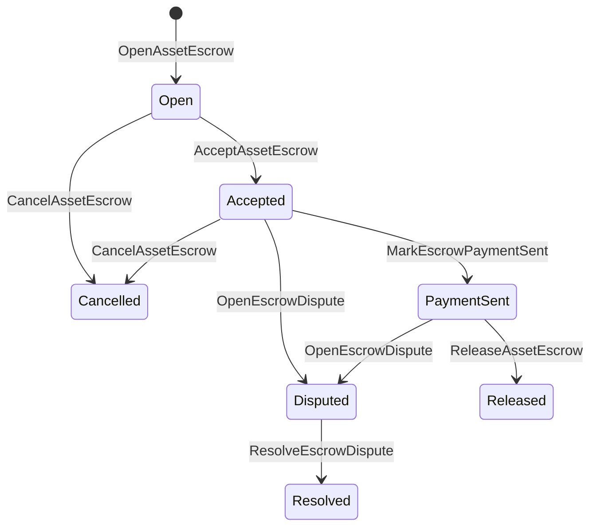

# 產業資產保證 {#native-asset-escrow}

本地保證是對數值資產進行賬本管理的保管機制.而不是將資產發送到應用程序擁有的帳戶,並依賴應用程序代碼來保護該帳戶,託管 ISIs 將價值轉移到確定性協議保管賬戶中,並記錄託管的生命週期在世界狀態.

使用本地保證金用於市場結算,Aitai式的鏈外支付協調,里程碑鎖和需要賬本可見生命週期狀態的保護保證金工作流.

## 概念 {#concepts}

|概念|描述|
| --- | --- |
|`EscrowId`|被調用者選擇的標識符包裹一個哈希. 在透明和匿名的保證券中,它必須是獨特的. |
|`AssetEscrowRecord`|透明的數值資產保證或鎖定記錄.|
|`AnonymousAssetEscrowRecord`|通過無效證書,承諾和證明附件支持的保證記錄.|
|託管賬戶|來自鏈 ID,保證券 ID 和資產定義的確定性協議賬戶. |
|證據的.|證據哈希可以識別賬單,判決,消息,存儲表或其他離鏈的證據.證據的有效載荷本身沒有存儲在保險記錄中. |

透明記錄包含賣方,選購者,資產定義,總額,保管賬戶,生命週期狀況,行爲類型,剩餘金額,選擇性釋放權限,可選的過期時間印,證據哈希,時間印和可選的解決細節.

擔保金額必須是正數資產量,並且必須符合資產定義的數值規範.當擔保金或鎖存活時,通用資產轉讓不能耗盡保管賬戶;以下描述的擔保金 ISIs 是擔保金的退出路徑.

## 市場保證金 {#marketplace-escrow}

市場託管協調鏈上資產釋放與鏈外支付或交貨工作流程.



|ISI|誰提出了?|影響|
| --- | --- | --- |
|`OpenAssetEscrow`|賣家|鎖定賣方數值資產在協議保管中,並創建一個 `Open`市場記錄. |
|`AcceptAssetEscrow`|買家|記錄買方並將 `Open`轉移到 `Accepted`.賣方不能接受自己的保證金. |
|`MarkEscrowPaymentSent`|接受的買家|在買方發送鏈外支付後,轉移`Accepted`到 `PaymentSent`. |
|`ReleaseAssetEscrow`|賣家|轉移`PaymentSent`到 `Released`並將全部保證金轉移給買方. |
|`CancelAssetEscrow`|賣家|轉移 `Open`或 `Accepted`到 `Cancelled`並在支付標記之前退款給賣方. |
|`OpenEscrowDispute`|賣家或被接受的買家|移動 `Accepted`或 `PaymentSent`到 `Disputed`,並添加證據. |
|`ResolveEscrowDispute`|在 `CanResolveEscrowDispute` 中的賬戶|轉移`Disputed`到 `Resolved`,並將金額分爲買方和賣方. |

爭端解決金額必須是非負面的,並且 `buyer_amount + seller_amount`必須等於保證金金額.零價值的腿被允許,但整個分開必須佔鎖定餘額.

### Rust 舉例 {#rust-example}

這種例子假設賣方和買方的賬戶已經存在,資產定義被註冊爲數值,並且賣方有足夠的餘額.

```rust
use iroha::{
    client::Client,
    data_model::{
        isi::escrow::{
            AcceptAssetEscrow, MarkEscrowPaymentSent, OpenAssetEscrow,
            ReleaseAssetEscrow,
        },
        prelude::*,
    },
};
use iroha_crypto::Hash;

fn release_marketplace_escrow(
    seller_client: &Client,
    buyer_client: &Client,
    asset_definition_id: AssetDefinitionId,
) -> eyre::Result<()> {
    let escrow_id = EscrowId::new(Hash::new("docs-marketplace-escrow-001"));

    seller_client.submit_blocking(OpenAssetEscrow::with_evidence_hashes(
        escrow_id,
        asset_definition_id,
        Numeric::from(40_u64),
        vec![Hash::new("invoice:2026-001")],
    ))?;

    buyer_client.submit_blocking(AcceptAssetEscrow::new(escrow_id))?;
    buyer_client.submit_blocking(MarkEscrowPaymentSent::new(escrow_id))?;
    seller_client.submit_blocking(ReleaseAssetEscrow::new(escrow_id))?;

    let record = seller_client.query_single(FindAssetEscrowById::new(escrow_id))?;
    assert_eq!(record.status, AssetEscrowStatus::Released);
    assert_eq!(record.remaining_amount, Numeric::zero());

    Ok(())
}
```

## 一般資產鎖 {#generic-asset-locks}

資產鎖使用相同的保管記錄類型,但它們不是買家-賣家的報價.它們鎖定了目的地賬戶的資金,並需要另一個發放權限部門提取資金.

|ISI|誰提出了?|影響|
| --- | --- | --- |
|`OpenAssetLock`|來源賬戶|鎖定正額,記錄目的地作爲記錄買家,並設置狀態爲 `Locked`. |
|`DrawdownAssetLock`|沒有設置的釋放權限,或目的地|轉移部分或全部剩餘的監護到目的地.|
|`CancelAssetLock`|鎖打開器|取消一個活躍的鎖,並退還剩餘的金額給打開器. |
|`ExpireAssetLock`|經過最後期限後的任何交易權威機構|在過去使用 `expires_at_ms` 的鎖期到期,並將剩餘的金額退還給打開器. |

`DrawdownAssetLock`在 `Locked`中保持記錄,而部分數額仍然存在.當剩餘數量達到零時,狀態將成爲`DrawnDown`,並且記錄會關閉.

```rust
use iroha::{
    client::Client,
    data_model::{
        isi::escrow::{CancelAssetLock, DrawdownAssetLock, ExpireAssetLock, OpenAssetLock},
        prelude::*,
    },
};
use iroha_crypto::Hash;

fn drawdown_and_close_asset_locks(
    opener_client: &Client,
    destination_client: &Client,
    release_authority_client: &Client,
    asset_definition_id: AssetDefinitionId,
    destination: AccountId,
    release_authority: AccountId,
) -> eyre::Result<()> {
    let trusted_lock_id = EscrowId::new(Hash::new("docs-asset-lock-trusted"));

    opener_client.submit_blocking(OpenAssetLock::with_options(
        trusted_lock_id,
        asset_definition_id.clone(),
        destination.clone(),
        Numeric::from(40_u64),
        Some(release_authority),
        None,
        vec![Hash::new("milestone-plan-v1")],
    ))?;

    release_authority_client.submit_blocking(DrawdownAssetLock::new(
        trusted_lock_id,
        Numeric::from(15_u64),
    ))?;

    let partially_drawn =
        opener_client.query_single(FindAssetEscrowById::new(trusted_lock_id))?;
    assert_eq!(partially_drawn.status, AssetEscrowStatus::Locked);
    assert_eq!(partially_drawn.remaining_amount, Numeric::from(25_u64));

    opener_client.submit_blocking(CancelAssetLock::new(
        trusted_lock_id,
        partially_drawn.remaining_amount.clone(),
    ))?;
    let cancelled = opener_client.query_single(FindAssetEscrowById::new(trusted_lock_id))?;
    assert_eq!(cancelled.status, AssetEscrowStatus::Cancelled);

    let expiring_lock_id = EscrowId::new(Hash::new("docs-asset-lock-expiring"));
    opener_client.submit_blocking(OpenAssetLock::with_options(
        expiring_lock_id,
        asset_definition_id,
        destination,
        Numeric::from(10_u64),
        None,
        Some(0),
        Vec::new(),
    ))?;

    destination_client.submit_blocking(ExpireAssetLock::new(expiring_lock_id))?;
    let expired = opener_client.query_single(FindAssetEscrowById::new(expiring_lock_id))?;
    assert_eq!(expired.status, AssetEscrowStatus::Expired);

    Ok(())
}
```

Python 目前暴露了一般鎖的高級輔助器: `open_asset_lock`, `drawdown_asset_lock`, `cancel_asset_lock`, 和 `expire_asset_lock`. 對於市場和匿名的保證金 Python, 使用法典 `InstructionBox` JSON 通過 SDK 現在, JSON 逃離門,或通過一個 SDK 這揭示了一流的保證金製造商.

## 爭議 {#disputes}

一個市場託管可以從 `Accepted`或 `PaymentSent`進入爭端.只有註冊的賣家或買家才能打開爭端.解決需要 `CanResolveEscrowDispute`,無論是直接向解決者賬戶授予,還是通過角色繼承.

```rust
use iroha::{
    client::Client,
    data_model::{
        isi::escrow::{OpenEscrowDispute, ResolveEscrowDispute},
        prelude::*,
    },
};
use iroha_crypto::Hash;
use iroha_executor_data_model::permission::escrow::CanResolveEscrowDispute;

fn resolve_disputed_escrow(
    admin_client: &Client,
    buyer_client: &Client,
    court_client: &Client,
    court: AccountId,
    escrow_id: EscrowId,
) -> eyre::Result<()> {
    admin_client.submit_blocking(Grant::account_permission(
        Permission::from(CanResolveEscrowDispute),
        court,
    ))?;

    buyer_client.submit_blocking(OpenEscrowDispute::with_evidence_hashes(
        escrow_id,
        vec![Hash::new("buyer-payment-receipt")],
    ))?;

    court_client.submit_blocking(ResolveEscrowDispute::with_evidence_hashes(
        escrow_id,
        Numeric::from(30_u64),
        Numeric::from(10_u64),
        vec![Hash::new("court-judgement-001")],
    ))?;

    let record = admin_client.query_single(FindAssetEscrowById::new(escrow_id))?;
    assert_eq!(record.status, AssetEscrowStatus::Resolved);
    assert_eq!(
        record.resolution.as_ref().map(|resolution| resolution.buyer_amount.clone()),
        Some(Numeric::from(30_u64)),
    );

    Ok(())
}
```

## 匿名的保證金 {#anonymous-escrow}

匿名保證券使用相同的市場生命週期,但資金和關閉資產的流動都受到保護.公開記錄仍然存儲賣方,買家,狀態,證據哈希,時刻印章和與證據鏈接的移動記錄.屏蔽筆記中的數額和收件人以承諾,廢除符和證據附件表示.

|透明 ISI |匿名 ISI|
| --- | --- |
|`OpenAssetEscrow`|`OpenAnonymousAssetEscrow`|
|`AcceptAssetEscrow`|`AcceptAnonymousAssetEscrow`|
|`MarkEscrowPaymentSent`|`MarkAnonymousEscrowPaymentSent`|
|`ReleaseAssetEscrow`|`ReleaseAnonymousAssetEscrow`|
|`CancelAssetEscrow`|`CancelAnonymousAssetEscrow`|
|`OpenEscrowDispute`|`OpenAnonymousEscrowDispute`|
|`ResolveEscrowDispute`|`ResolveAnonymousEscrowDispute`|

錢包或證明工具必須構建證據附件和公共輸入.開放創造了一個保險承諾.釋放,取消和匿名糾紛解決必須花費一個保險承諾並創建該行動所需的買方,賣方或分產承諾.

```rust
use iroha::{
    client::Client,
    data_model::{
        isi::escrow::{
            AcceptAnonymousAssetEscrow, MarkAnonymousEscrowPaymentSent,
            OpenAnonymousAssetEscrow,
        },
        prelude::*,
        proof::ProofAttachment,
    },
};
use iroha_crypto::Hash;

fn open_anonymous_escrow(
    seller_client: &Client,
    buyer_client: &Client,
    escrow_id: EscrowId,
    asset_definition_id: AssetDefinitionId,
    funding_nullifiers: Vec<[u8; 32]>,
    escrow_commitment: [u8; 32],
    proof: ProofAttachment,
    root_hint: Option<[u8; 32]>,
) -> eyre::Result<()> {
    seller_client.submit_blocking(OpenAnonymousAssetEscrow::with_evidence_hashes(
        escrow_id,
        asset_definition_id,
        funding_nullifiers,
        escrow_commitment,
        proof,
        root_hint,
        vec![Hash::new("shielded-invoice")],
    ))?;

    buyer_client.submit_blocking(AcceptAnonymousAssetEscrow::new(escrow_id))?;
    buyer_client.submit_blocking(MarkAnonymousEscrowPaymentSent::new(escrow_id))?;

    Ok(())
}
```

對於底層的屏蔽交易模式,見 [匿名交易](/zh-hant/blockchain/anonymous-transactions.md).

## SDK 使用 {#sdk-usage}

在 SDKs 中,保證金支持的曝光方式不同. Rust 具有標準類型的數據模型. Python 目前暴露了通用資產鎖定輔助器.JavaScript 和 TypeScript 使用 Kotodama 託管主機電話. Kotlin/JVM 和 Swift 爲市場和匿名託管提供類型的有效載荷構建者.

|SDK|使用這個表面.|範圍|
| --- | --- | --- |
| [Rust](#rust-sdk) |`iroha::data_model::isi::escrow`|商場託管,通用鎖,匿名託管,查詢和活動.|
| [Python](#python-asset-locks) |`Instruction.open_asset_lock`,`TransactionDraft.open_asset_lock`,和客戶 `*_and_wait`的助手 |市場和匿名保證人還不是一流的 Python 方法. |
| [JavaScript / TypeScript](#javascript-and-typescript-kotodama) |`compileKotodamaProgram`從 `@iroha/iroha-js/kotodama-compiler` |在 Kotodama 合同中收購主機的電話. |
| [Kotlin / JVM](#kotlin-and-jvm) |在 `org.hyperledger.iroha.sdk.core.model.instructions` 中的`InstructionTemplate`類|市場和匿名的託管定製說明模板. |
| [Swift /iOS](#swift-and-ios) |`NativeEscrowInstructionBuilders`和`IrohaSDK.build*Escrow*`的助手 |市場和匿名保證人 Norito JSON 指令有效載荷. |

下面的例子側重於指令構建. 賬戶融資,簽名管理和交易提交遵循每個 SDK 的正常流量.

### Rust SDK {#rust-sdk}

當您需要完整的本地覆蓋或查詢/事件支持時使用 Rust SDK. 上面的例子顯示了市場發佈,通用鎖定拉,爭端解決和匿名保證構建與 `iroha::data_model::isi::escrow`.

```rust
use iroha::{
    client::Client,
    data_model::{isi::escrow::OpenAssetEscrow, prelude::*},
};
use iroha_crypto::Hash;

fn open_and_read(
    client: &Client,
    asset_definition_id: AssetDefinitionId,
) -> eyre::Result<AssetEscrowRecord> {
    let escrow_id = EscrowId::new(Hash::new("docs-rust-sdk-escrow"));

    client.submit_blocking(OpenAssetEscrow::new(
        escrow_id,
        asset_definition_id,
        Numeric::from(10_u64),
    ))?;

    client.query_single(FindAssetEscrowById::new(escrow_id))
}
```

### Python 資產鎖定 {#python-asset-locks}

Python SDK 將一流的輔助者暴露在通用資產鎖中. 使用它們進行里程碑式支付,釋放權威機構的提款,開戶方取消和過期退款.

```python
client.open_asset_lock_and_wait(
    chain_id="dev-chain",
    authority="<source-account-id>",
    private_key_hex="<source-private-key-hex>",
    escrow_id="merchant-lock-001",
    asset_definition_id="<asset-definition-base58>",
    destination="<destination-account-id>",
    amount="2500",
    release_authority="<trusted-release-account-id>",
    expires_at_ms=1_704_000_000_000,
)

client.drawdown_asset_lock_and_wait(
    chain_id="dev-chain",
    authority="<trusted-release-account-id>",
    private_key_hex="<trusted-release-private-key-hex>",
    escrow_id="merchant-lock-001",
    amount="1000",
)

client.expire_asset_lock_and_wait(
    chain_id="dev-chain",
    authority="<any-account-id>",
    private_key_hex="<any-private-key-hex>",
    escrow_id="merchant-lock-001",
)
```

對於雙方鎖,遺漏 `release_authority`;目的地賬戶可以提交 `drawdown_asset_lock`.

### JavaScript 和 TypeScript Kotodama {#javascript-and-typescript-kotodama}

其他 JavaScript SDK 目前沒有曝光直接的本地託管交易構建者. JavaScript 或 TypeScript 部署的應用 Kotodama 合同,編譯託管主機電話 Kotodama 編譯器.

原生託管主機調用需要明確的訪問提示,因爲編譯器無法爲不透明託管 ISIs 獲得更窄的訪問集合.在出口入口點上使用呼叫`escrow_*`內置的野生卡指引.

```js
import { compileKotodamaProgram } from "@iroha/iroha-js/kotodama-compiler";

const source = `
seiyaku MarketplaceEscrow {
  meta { abi_version: 1; }

  #[access(read="*", write="*")]
  kotoage fn run() permission(Admin) {
    let asset = asset_definition("62Fk4FPcMuLvW5QjDGNF2a4jAmjM");
    let offer = name("aitai_offer");
    let evidence = norito_bytes("00");

    call escrow_open_offer(offer, asset, 10, evidence);
    call escrow_accept(offer);
    call escrow_mark_payment_sent(offer);
    call escrow_release(offer);
  }
}
`;

const compiled = compileKotodamaProgram(source, {
  sourceName: "escrow.ko",
});

if (compiled.diagnostics.length > 0) {
  throw new Error(compiled.diagnostics.map((item) => item.message).join("\n"));
}
```

在爭端中,使用 `escrow_open_dispute(offer, evidence)` 和 `escrow_resolve_dispute(offer, buyer_amount, seller_amount, evidence)`.匿名託管主機調用接受 Norito 請求有效載荷字節,例如 `anonymous_escrow_open_offer(request)`.

### Kotlin 和 JVM {#kotlin-and-jvm}

Kotlin/JVM SDK 模型本地託管作爲自定義指令模板.每個模板驗證了所需的字段,並揭示了交易構造商使用的定律參數地圖.

```kotlin
import org.hyperledger.iroha.sdk.core.model.escrow.NativeEscrowPermissions
import org.hyperledger.iroha.sdk.core.model.instructions.AcceptAssetEscrowInstruction
import org.hyperledger.iroha.sdk.core.model.instructions.MarkEscrowPaymentSentInstruction
import org.hyperledger.iroha.sdk.core.model.instructions.OpenAssetEscrowInstruction
import org.hyperledger.iroha.sdk.core.model.instructions.ReleaseAssetEscrowInstruction
import org.hyperledger.iroha.sdk.core.model.instructions.ResolveEscrowDisputeInstruction

val open = OpenAssetEscrowInstruction(
    escrowId = "escrow-hash",
    assetDefinition = "xor#wonderland",
    amount = "42.5",
    evidenceHashes = listOf("invoice-hash"),
)
val accept = AcceptAssetEscrowInstruction("escrow-hash")
val paid = MarkEscrowPaymentSentInstruction("escrow-hash")
val release = ReleaseAssetEscrowInstruction("escrow-hash")
val resolve = ResolveEscrowDisputeInstruction(
    escrowId = "escrow-hash",
    buyerAmount = "30",
    sellerAmount = "12.5",
    evidenceHashes = listOf("judgement-hash"),
)

println(open.arguments)
println(NativeEscrowPermissions.CAN_RESOLVE_ESCROW_DISPUTE)
```

匿名模板可提供: `OpenAnonymousAssetEscrowInstruction`, `AcceptAnonymousAssetEscrowInstruction`, `MarkAnonymousEscrowPaymentSentInstruction`, `ReleaseAnonymousAssetEscrowInstruction`, `CancelAnonymousAssetEscrowInstruction`, `OpenAnonymousEscrowDisputeInstruction`, 和 `ResolveAnonymousEscrowDisputeInstruction`. Android Java調用者可以使用匹配 `NativeEscrowInstructions.*` 建築師從 Android 藝術品.

### Swift 和iOS {#swift-and-ios}

Swift SDK 將保證說明構建爲 Norito JSON 的有效載荷. 直接使用 `NativeEscrowInstructionBuilders`,或者在您的應用程序已經擁有一個 `IrohaSDK`實例時,撥打對等式的 `IrohaSDK.build*Escrow*`輔助器.

```swift
import IrohaSwift

let open = try NativeEscrowInstructionBuilders.openAssetEscrow(
    escrowId: "escrow-hash",
    assetDefinition: "xor#wonderland",
    amount: "42.5",
    evidenceHashes: ["invoice-hash"]
)
let accept = try NativeEscrowInstructionBuilders.acceptAssetEscrow(
    escrowId: "escrow-hash"
)
let paid = try NativeEscrowInstructionBuilders.markEscrowPaymentSent(
    escrowId: "escrow-hash"
)
let release = try NativeEscrowInstructionBuilders.releaseAssetEscrow(
    escrowId: "escrow-hash"
)
let resolve = try NativeEscrowInstructionBuilders.resolveEscrowDispute(
    escrowId: "escrow-hash",
    buyerAmount: "30",
    sellerAmount: "12.5",
    evidenceHashes: ["judgement-hash"]
)
```

匿名的 Swift 構建者採用無效列表,輸出承諾列表,證明詞典和可選的 `rootHint`值.爭端解決權限代幣是`NativeEscrowPermissions.canResolveEscrowDispute`.

## 問題和事件 {#queries-and-events}

使用保證查詢狀態頁面,調整工作和支持工具:

|問題|目的|
| --- | --- |
|`FindAssetEscrowById`|按 `EscrowId`閱讀一個透明的保證金或鎖定.|
|`FindAssetEscrows`|列出透明的託管和鎖定記錄.|
|`FindAssetEscrowsBySeller`|列出賣家或鎖開戶打開的記錄. |
|`FindAssetEscrowsByBuyer`|列出買方接受的市場保證券或針對目的地鎖定. |
|`FindAssetEscrowsByStatus`|在 `AssetEscrowStatus`之前列出記錄. |
|`FindAnonymousAssetEscrowById`|通過 `EscrowId`閱讀一個匿名的保證金.|
|`FindAnonymousAssetEscrows*`|按所有記錄,賣家,買家或身份列出匿名保證金.|

`EscrowEventFilter` 可以訂閱透明的本地託管和按託管鎖定活動 ID, 銷售者,買家,狀態和事件設置面具. `Opened`, `Accepted`, `PaymentSent`, `Released`, `Cancelled`, `Expired`, `Disputed`, 和 `Resolved`. 通過匿名的託管查詢來檢查匿名託管記錄.

## 運營說明 {#operational-notes}

- 存儲大型賬單,聊天日誌,判斷或審計包在保證金記錄之外,並將它們的哈希作爲證據.
- 在申請中使用穩定的 `EscrowId`衍生值,以便重新嘗試不能爲相同的報價創建重複保證金.
- 授予 `CanResolveEscrowDispute`僅爲經營爭端程序的賬戶或角色.
- 視支付鏈外驗證爲應用政策. Iroha 記錄保管和生命週期過渡;它不單獨驗證法定或外部支付軌道.
