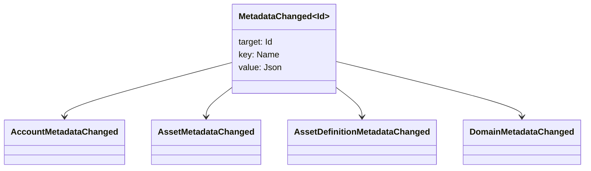

# 數據表 {#metadata}

數據是附加於帳號對象的檢查鍵值地圖.
`Name` 價值和價值是 JSON (`Json`) 提供有效載荷.

以下對象可携带元數據:

- 域名
- 帳戶
- 資產
- 資產的定義
- NFTs
- RWAs
- 引發器
- 交易

使用在帳號中包含的小描述或索引字段的元數據
大量用荷物應在外面存放, WSV 引用的是:
消化, URI, 或是 SoraFS 這樣的路線.

在選擇元數據,資產方面提供指南. NFTs, RWAs, 或是連鎖之外的
存儲,查看
[數據儲存及數字簿存储的選擇](/zh-hant/guide/configure/metadata-and-store-assets.md).

## 試著使用 Taira {#try-it-on-taira}

這項命令列出了 Taira
目前具有元數據的資產定義:

```bash
curl -fsS 'https://taira.sora.org/v1/assets/definitions?limit=100' \
  | jq '.items[]
    | select((.metadata | length) > 0)
    | {id, name, metadata}'
```

使用域和帳戶的模式相同:

```bash
curl -fsS 'https://taira.sora.org/v1/domains?limit=20' \
  | jq '.items[] | select((.metadata // {} | length) > 0)'

curl -fsS 'https://taira.sora.org/v1/accounts?limit=20' \
  | jq '.items[] | select((.metadata // {} | length) > 0)'
```

請將空出口當為有效的結果. Taira
沒有數據, 並不是結束點失敗.

## 更新元數據 {#updating-metadata}

轉換為 Iroha 特別指示:

- [`SetKeyValue`](/zh-hant/blockchain/instructions.md#setkeyvalue-removekeyvalue)
  插入或取代鍵
- [`RemoveKeyValue`](/zh-hant/blockchain/instructions.md#setkeyvalue-removekeyvalue)
  移除一個關鍵

提交交易的權威必須有所要求的許可
按主動運行時間驗證器.
[許可令牌](/zh-hant/reference/permissions.md).

## 事件 {#events}

變化時會發出數據事件.
`MetadataChanged<Id>`:



使用 [數據事件過濾器](/zh-hant/blockchain/filters.md#data-event-filters) 必須
只會註冊對單位類型或對象的元數據事件 ID 這種情況
這樣的情況也很重要.

## 詢問問題 {#queries}

返回為查詢對象的一部分.
[`FindAccountById`](/zh-hant/reference/queries.md#accounts-and-permissions),
[`FindDomainById`](/zh-hant/reference/queries.md#domains-and-peers), 或是
[`FindAssetDefinitionById`](/zh-hant/reference/queries.md#assets-nfts-and-rwas).
使用 [`FindNfts`](/zh-hant/reference/queries.md#assets-nfts-and-rwas) 或是
[`FindNftsByAccountId`](/zh-hant/reference/queries.md#assets-nfts-and-rwas) 關於
NFTs, 及其他 [`FindRwas`](/zh-hant/reference/queries.md#assets-nfts-and-rwas) 關於 RWA
然後讀取對象的元數據欄位. NFT 查詢答案顯示了
NFT `content` 該地圖是紀錄元數據.

因此保持他們穩定,
編碼的應用特定版本在關鍵名稱中轉移, JSON
這種數字可顯示出此版本.
