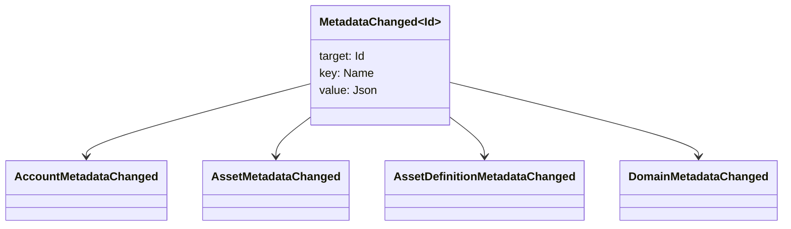

# 後設資料 {#metadata}

後設資料是附加到帳本物件上的、經過檢查的鍵值映射。鍵是 `Name` 值，值是 JSON（`Json`）承載資料。

下列物件可以攜帶後設資料:

- 域名
- 帳戶
- 資產
- 資產定義
- NFTs
- RWAs
- 觸發器
- 交易

使用在賬本狀態下屬於的小型描述或索引欄位的後設資料. 大型有效載荷應儲存在 WSV 外,並由一個摘要, URI 或 SoraFS 路徑引用.

關於選擇後設資料,資產 NFTs,RWAs 或鏈外儲存的指南,請參見 [後設資料和賬本儲存選擇](/zh-hant/guide/configure/metadata-and-store-assets.md).

## 在 Taira 試看. {#try-it-on-taira}

透過正常的資源閱讀,可以看到後設資料.該命令列出目前具有後設資料的 Taira 資產定義:

```bash
curl -fsS 'https://taira.sora.org/v1/assets/definitions?limit=100' \
  | jq '.items[]
    | select((.metadata | length) > 0)
    | {id, name, metadata}'
```

使用域名和帳戶的模式:

```bash
curl -fsS 'https://taira.sora.org/v1/domains?limit=20' \
  | jq '.items[] | select((.metadata // {} | length) > 0)'

curl -fsS 'https://taira.sora.org/v1/accounts?limit=20' \
  | jq '.items[] | select((.metadata // {} | length) > 0)'
```

將空輸出視為有效的結果. 這意味著 Taira 物件的當前頁面沒有後設資料,而不是端點失敗了.

## 更新後設資料 {#updating-metadata}

用 Iroha 特殊指令更改後設資料:

- [`SetKeyValue`](/zh-hant/blockchain/instructions.md#setkeyvalue-removekeyvalue)插入或取代一個鑰匙
- [`RemoveKeyValue`](/zh-hant/blockchain/instructions.md#setkeyvalue-removekeyvalue) 刪除一個鑰匙

提交交易的授權主體必須具備目前執行階段驗證器要求的權限。如需預設權限介面，請參閱[權限權杖](/zh-hant/reference/permissions.md)。

## 事件 {#events}

中繼資料發生變更時會發出資料事件。通用事件有效負載為 `MetadataChanged<Id>`：



使用 [資料事件過濾器](/zh-hant/blockchain/filters.md#data-event-filters),只會訂閱對整合重要的實體型別或物件 ID 的後設資料事件.

## 查詢 {#queries}

後設資料會作為被查詢物件的一部分傳回。例如，可使用 [`FindAccountById`](/zh-hant/reference/queries.md#accounts-and-permissions)、[`FindDomainById`](/zh-hant/reference/queries.md#domains-and-peers) 或 [`FindAssetDefinitionById`](/zh-hant/reference/queries.md#assets-nfts-and-rwas)。對於 NFTs，使用 [`FindNfts`](/zh-hant/reference/queries.md#assets-nfts-and-rwas) 或 [`FindNftsByAccountId`](/zh-hant/reference/queries.md#assets-nfts-and-rwas)；對於 RWA 批次，使用 [`FindRwas`](/zh-hant/reference/queries.md#assets-nfts-and-rwas)。然後讀取物件的後設資料欄位。NFT 查詢回應會將 NFT `content` 映射作為記錄的後設資料公開。

後設資料鍵是帳本狀態的一部分，因此應保持穩定；如果 JSON 值能明確攜帶版本，就不要把應用程式特定的版本編碼到鍵名中。
