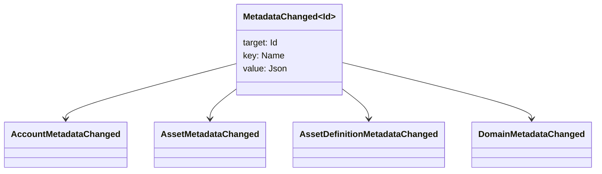

# 超級數據 {#metadata}

密碼數據是連接到賬本對象的檢查關鍵值地圖.關鍵是`Name`值和值是 JSON (`Json`) 實用負載.

下列對象可以攜帶元數據:

- 域名
- 賬戶
- 資產
- 資產定義
- NFTs
- RWAs
- 觸發器
- 交易

使用在賬本狀態下屬於的小型描述或索引字段的元數據. 大型有效載荷應存儲在 WSV 外,並由一個消化, URI 或 SoraFS 路徑引用.

關於選擇元數據,資產 NFTs,RWAs 或鏈外存儲的指南,請參見 [元數據和賬本存儲選擇](/zh-hant/guide/configure/metadata-and-store-assets.md).

## 在 Taira 試看. {#try-it-on-taira}

通過正常的資源閱讀,可以看到元數據.該命令列出目前具有元數據的 Taira 資產定義:

```bash
curl -fsS 'https://taira.sora.org/v1/assets/definitions?limit=100' \
  | jq '.items[]
    | select((.metadata | length) > 0)
    | {id, name, metadata}'
```

使用域名和帳戶的模式:

```bash
curl -fsS 'https://taira.sora.org/v1/domains?limit=20' \
  | jq '.items[] | select((.metadata // {} | length) > 0)'

curl -fsS 'https://taira.sora.org/v1/accounts?limit=20' \
  | jq '.items[] | select((.metadata // {} | length) > 0)'
```

將空輸出視爲有效的結果. 這意味着 Taira 對象的當前頁面沒有元數據,而不是終點失敗了.

## 更新元數據 {#updating-metadata}

用 Iroha 特殊指令更改元數據:

- [`SetKeyValue`](/zh-hant/blockchain/instructions.md#setkeyvalue-removekeyvalue)插入或取代一個鑰匙
- [`RemoveKeyValue`](/zh-hant/blockchain/instructions.md#setkeyvalue-removekeyvalue) 刪除一個鑰匙

提交交易的機構必須有所要求的許可.通過活躍的運行時間驗證器. [許可證代碼](/zh-hant/reference/permissions.md).

## 事件 {#events}

隨着元數據的變化,數據事件發射.通用事件有效載荷爲 `MetadataChanged<Id>`:



使用 [數據事件過器](/zh-hant/blockchain/filters.md#data-event-filters),只會訂閱對集成重要的實體類型或對象 ID 的元數據事件.

## 問題 {#queries}

例如,使用 [`FindAccountById`](/zh-hant/reference/queries.md#accounts-and-permissions),[`FindDomainById`](/zh-hant/reference/queries.md#domains-and-peers),或[`FindAssetDefinitionById`](/zh-hant/reference/queries.md#assets-nfts-and-rwas).使用 [`FindNfts`](/zh-hant/reference/queries.md#assets-nfts-and-rwas)或 [`FindNftsByAccountId`](/zh-hant/reference/queries.md#assets-nfts-and-rwas)爲 NFTs,和 [`FindRwas`](/zh-hant/reference/queries.md#assets-nfts-and-rwas)爲 RWA 批量.然後閱讀對象的元數據領域. NFT 查詢答案將 NFT `content` 地圖作爲記錄元數據.

大數據密鑰是賬本狀態的一部分,因此保持它們穩定,避免在 JSON 值可以明確地攜帶該版本時將應用程序特定版本編碼轉換到關鍵名稱中.
