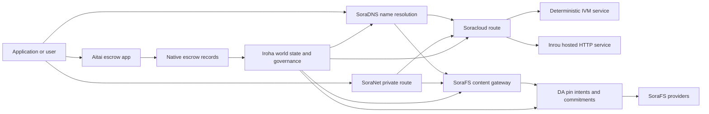

# SORA Nexus 服務 {#sora-nexus-services}

SORA Nexus 在 Iroha 3 周邊增加面向應用程式的服務層。這些服務不是獨立的賬本，而是錨定在 Iroha 世界狀態、Norito 清單、治理記錄和 Torii 路由族之上。

可用性取決於節點構建和網路配置. [`/openapi.json`](/zh-hant/reference/torii-endpoints.md#app-and-sora-route-families) 發現生成的應用程式.API 目標節點的路線. SoraFS CID 而已知路線在生成的檔案之外安裝,所以檢查部署時直接探討這些路線.

## 元件地圖 {#component-map}

|元件|角色|主要表面|
| ---------------------- | ------------------------------------------------------------------------------------------------------------------------------------------- | ---------------------------------------------------------------------------------------- |
|Soracloud|應用部署,託管服務,私人模型/執行階段狀態以及服務生命週期控制. |`/v1/soracloud/*`, `/api/*`,`iroha soracloud service ...` |
|Inrou|Soracloud 託管的 HTTP 執行環境，供需要即時 HTTP 層的服務修訂使用。|Soracloud 執行環境設定、主機能力公告、副本執行環境狀態|
|SoraNet|電路,繼電流, VPN,連線會議和流媒體線路的隱私和運輸覆蓋. |`/v1/connect/*`,`/v1/vpn/*`, SoraNet 的路線後設資料 |
|資料可用性 (DA) |在 Nexus 通道, SoraFS 清單和證據流程中引用的有效載荷的可用性證明,承諾和準意圖層. |`/v1/da/*`, `FindDaPinIntent*`,`[nexus.da]` |
|SoraFS|檔案表, CAR 有效載荷,固定內容,閘道器檢索和可回收性證明流的內容定位儲存布料. |`/v1/sorafs/*`, `/sorafs/*`,`FindSorafsProviderOwner` |
|SoraDNS|對於 SORA 託管的服務和內容,確定性命名和解決器認證層. |`/v1/soradns/*`, `/soradns/*`,解決方程式事件|
|艾塔伊|應用程式級的法定和資產結算走廊,由本地託管記錄支援,而不是單獨的賬本.|`OpenAssetEscrow`, `FindAssetEscrow*`,`EscrowEventFilter`, Kotodama `escrow_*`的建築物|



## 常見流量 {#common-flows}

### 託管的分類應用程式 {#hosted-split-application}

典型的混合層級應用程式會配合使用所有元件：

1. 靜態前端資產被包裝並透過 SoraFS 繫結.
2. 公共主機,例如 `<app>.sora`,透過 SoraDNS 進行註冊.
3. Soracloud 路線 `/api/v1/search`或`/api/v1/stream`到一個 Inrou HTTP 服務.
4. Soracloud 路線 `/api/auth`和 `/api/v1/user`向確定性處理器 IVM.
5. 需要隱私的客戶可以透過 SoraNet 電路達到相同內容或 API 路線.

|路徑|後端層|原因|
| ----------------- | --------------------- | ------------------------------------------------- |
| `/`               |SoraFS 靜態含量|可複製內容的根和閘道器快取|
|`/assets/*`|SoraFS 靜態含量|內容地址的資產和明確證明|
|`/api/auth*`|Soracloud IVM |複製安全的作者和錢包挑戰狀態 |
|`/api/v1/user*`|Soracloud IVM |對於治理敏感的狀態突變|
|`/api/v1/search*`|Soracloud 線上|現場 HTTP 服務,快取, SSE,或收藏狀態|

### 內容出版 {#content-publication}

SoraFS 出版物在名稱指向它們之前,生產了持久的構件:

1. 建立一個有效載荷或目錄.
2. 包裝在一個 CAR 檔案和分片計劃.
3. 建立一個 Norito 清單,包含釘選政策和治理資料.
4. 提交說明書給 Torii.
5. 如果目標配置檔案需要明確的證據,則記錄 DA 釘選意圖或可用性承諾.
6. 繫結表與 SoraDNS 名稱或 Soracloud 靜態前端路線.

### 乘坐私人車或播放路線 {#private-fetch-or-streaming-route}

SoraNet 可以坐在 SoraFS 或 Soracloud 前面:

1. 客戶端解決了名稱或清單.
2. 一個警衛目錄或路線公開選擇入口和出口繼電器.
3. 交通被填充並透過 SoraNet 電路傳送.
4. 輸出繼電器到達 SoraFS 門口, Torii 流或 Soracloud 路線.

## 艾塔伊 {#aitai}

Aitai是市場式結算的 SORA 應用程式走廊,買方和賣方在鏈外協調支付,而 Iroha 則控制了 在鏈上儲存資產.它應使用本地託管指令家族,而不是合同所有的託管帳戶用於新數值資產託管流動.

原生託管將託管資產保留在帳本中。賣方使用 `OpenAssetEscrow` 開立要約，買方使用 `AcceptAssetEscrow` 和 `MarkEscrowPaymentSent` 接受並標記鏈下付款，賣方使用 `ReleaseAssetEscrow` 釋放資產，或在付款被標記前取消要約。如果買賣雙方有分歧，任何一方都可以發起爭議，擁有 `CanResolveEscrowDispute` 的解決者可以拆分鎖定金額。

對於整個生命週期,通用資產鎖定,匿名託管,查詢,事件和 Rust 的例子,請見 [原始資產託管](/zh-hant/blockchain/escrow.md).

|艾塔伊表面|用它來|
| ------------------------------------------------------------------------------------------------------------------------------------------------------------- | ----------------------------------------------------------------------------------------- |
| `OpenAssetEscrow`, `AcceptAssetEscrow`, `MarkEscrowPaymentSent`, `ReleaseAssetEscrow`, `CancelAssetEscrow`                                                    |透明數值資產報價,包括以 XOR 為單位的結算流動. |
| `OpenAnonymousAssetEscrow`, `AcceptAnonymousAssetEscrow`, `MarkAnonymousEscrowPaymentSent`, `ReleaseAnonymousAssetEscrow`, `CancelAnonymousAssetEscrow`       |保護的報價使用證明附件對於資金和關閉活動.|
|`OpenEscrowDispute`, `ResolveEscrowDispute`,`OpenAnonymousEscrowDispute`, `ResolveAnonymousEscrowDispute` |糾紛和法庭方式的解決.|
|`FindAssetEscrowById`, `FindAssetEscrowsBySeller`,`FindAssetEscrowsByBuyer`, `FindAssetEscrowsByStatus` |應用程式狀態頁面,調整工作和支援工具.|
|`EscrowEventFilter`|按託管身份,賣家,買家,狀態或事件型別的透明託管訂閱.|
| Kotodama `escrow_open_offer`, `escrow_accept`, `escrow_mark_payment_sent`, `escrow_release`, `escrow_cancel`, `escrow_open_dispute`, `escrow_resolve_dispute` |Kotodama 合同通話由 V1 託管系統支援. |

對於公開使用的 Taira 或 Minamoto,請將離鏈支付軌道和任何支援或法院工作流程視為應用程式政策. Iroha 記錄保管狀態,生命週期事件,證據雜湊以及最終資產移動;它不會自行驗證法定結算.

## 檢查目標節點 {#check-a-target-node}

在使用本頁面的示例之前,請確認您正在準的節點中存在路線家族:

```bash
export TORII_URL=https://taira.sora.org

curl -fsS "$TORII_URL/openapi.json" \
  | jq '.paths | keys[] | select(test("^/v1/(soracloud|sorafs|soradns|connect|vpn|da)/"))'

curl -fsS -H 'Accept: application/json' "$TORII_URL/status" | jq .
```

`/openapi.json`是規範的 OpenAPI 端點.準確的路線可用性取決於構建功能和網路配置.該檔案不列出公開本地 SoraFS CID 和已知路線;直接檢查這些端點如下描述.

### Taira 僅閱讀煙霧檢查 {#taira-read-only-smoke-checks}

公開 Taira 端點對於閱讀側檢查是有用的,但除非您運營一個授權帳戶,並且打算改變公開測試網狀態,否則不要使用它用於突變例子.

```bash
export TORII_URL=https://taira.sora.org

curl -fsS -H 'Accept: application/json' "$TORII_URL/status" \
  | jq '{version: .build.version, peers, blocks, lanes: (.teu_lane_commit | length)}'

curl -fsS "$TORII_URL/v1/vpn/profile" \
  | jq '{available, relay_endpoint, supported_exit_classes}'

curl -fsS "$TORII_URL/v1/sorafs/storage/peers?limit=4" \
  | jq '{gateway_base_url, pin_torii_urls}'

curl -fsS -H 'Accept: application/json' "$TORII_URL/v1/soracloud/status" \
  | jq '.control_plane | {service_count, services: [.services[] | {service_name, current_version}]}'
```

Taira 可能會公開未列在 OpenAPI 路由圖中的部署專用控制層路由。請將 `/openapi.json` 視為其中所含路由的產生契約；在將部署專用路由和公開的本地 SoraFS 路由記錄為可用之前，應直接驗證這些路由。

## Soracloud {#soracloud}

Soracloud 是 SORA 應用的控制層。它追蹤部署套件、服務修訂、路由、推出狀態、權威設定專案、加密的服務機密、模型登入檔記錄、私有推論工作階段和執行環境回執。

Soracloud 使用兩個執行層：

|執行層|執行環境|用途|
| ---------------------- | ------- | -------------------------------------------------------------------------------------------- |
|`DeterministicService`|`Ivm`|作者,庫存狀態,認證閱讀,訂單郵箱處理器,對治理敏感的突變 |
|`HttpService`|`Inrou`|現場 HTTP APIs,收藏器繁重工作,快取支援的服務, SSE,瀏覽器輔助流動.|

控制層是權威資訊來源。請透過 Torii 提交部署、升級、回復、設定、機密、模型和狀態命令，並讀取已提交的世界狀態；這些命令不依賴單獨的 CLI 本機映像。公共路由採用最長字首比對，因此一個已登入主機可以在託管 HTTP 路由和確定性 API 路由之間分流流量。

### 架一個分開的應用程式 {#scaffold-a-split-app}

分類應用程式模板建立了靜態前端加上一個託管的直播 API 和一個確定性庫/API 服務:

```bash
iroha soracloud app init \
  --template split-app \
  --app-name solswap_indexer \
  --app-version 0.1.0 \
  --public-host solswap-indexer.sora \
  --output-dir ./apps/solswap-indexer

iroha soracloud app plan \
  --manifest ./apps/solswap-indexer/app_manifest.json

iroha soracloud app doctor \
  --manifest ./apps/solswap-indexer/app_manifest.json
```

`plan` 列印路線分割槽,兒童服務清單,工作空間指令碼路徑以及預期的前端釋出模式. `doctor` 在你參與之前,驗證本地釋放合同 Torii.

### 部署和檢查應用程式狀態 {#deploy-and-inspect-app-state}

再利用一個未來 SoraFS 由於分類應用模板包含了Inrou服務,在線上突變之前,在選擇的離線供應商商商店中認證其確切的構件:

```bash
export SORACLOUD_TORII_URL=https://<soracloud-enabled-torii>
export SORAFS_RETENTION_EPOCH=<future-unix-seconds>

iroha soracloud app preseed \
  --manifest ./apps/solswap-indexer/app_manifest.json \
  --sorafs-retention-epoch "$SORAFS_RETENTION_EPOCH" \
  --inrou-preseed-target <validator-account,peer-id,absolute-store-path> \
  --inrou-preseed-max-capacity-bytes <bytes> \
  --inrou-preseed-helper /absolute/path/to/sorafs-node \
  --inrou-preseed-helper-sha256 <lowercase-sha256> \
  --receipt-out /absolute/path/to/solswap-inrou-preseed.json

iroha soracloud app release \
  --manifest ./apps/solswap-indexer/app_manifest.json \
  --sorafs-retention-epoch "$SORAFS_RETENTION_EPOCH" \
  --inrou-preseed-receipt /absolute/path/to/solswap-inrou-preseed.json \
  --torii-url "$SORACLOUD_TORII_URL"

iroha soracloud app status \
  --manifest ./apps/solswap-indexer/app_manifest.json \
  --torii-url "$SORACLOUD_TORII_URL"
```

複製 `--inrou-preseed-target` 根據部署政策所要求的每個供應商商店. `release` 構建和同步清單,執行應用程式醫生,提交一個規範的應用程式基礎設施突變.調整權威地位,並驗證已宣佈的現實目標.在應用程式中包含Inrou構件時,預定收據是不可選的.

對於已部署的服務,使用服務範圍指令:

```bash
iroha soracloud service status \
  --service-name solswap_indexer_live \
  --torii-url "$SORACLOUD_TORII_URL"

iroha soracloud service rollback \
  --service-name solswap_indexer_live \
  --target-version 0.1.0 \
  --torii-url "$SORACLOUD_TORII_URL"
```

### 隱私和秘密材料 {#config-and-secret-material}

Soracloud 設定和秘密專案是權威部署狀態的一部分。當所需設定或秘密繫結缺失或與作用中資訊清單不一致時，部署、升級和復原會採用失敗關閉策略。

```bash
iroha soracloud service config-set \
  --service-name solswap_indexer_live \
  --config-name indexer/public_config \
  --value-file ./config/public-config.json \
  --torii-url "$SORACLOUD_TORII_URL"

iroha soracloud service secret-set \
  --service-name solswap_indexer_live \
  --secret-name indexer/api_key \
  --secret-file ./secrets/api-key.envelope.json \
  --torii-url "$SORACLOUD_TORII_URL"
```

使用 CLI 幫助查詢您的個人資料所需的準確憑證標誌:

```bash
iroha soracloud service config-set --help
iroha soracloud service secret-set --help
```

## 線上 {#inrou}

伊內羅是主機 HTTP 使用的執行階段 Soracloud. 一個 Iroha 嵌入式的節點 Soracloud 執行階段專案被錄取 Soracloud 在本地實現計劃中,將分配的託管服務副本作為迴圈服務啟動,報告複製執行階段狀態回到權威模型中.

使用Inrou用於需要現場 HTTP 表面的工作負載,例如收藏量重的 APIs,SSE 流程,快取支援的處理器或瀏覽器輔助服務.

### 執行階段要求 {#runtime-requirements}

- 集裝箱表執行階段必須為 `Inrou`.
- 服務清單的執行層必須是 `HttpService`。
- `HttpService + Inrou`需要一個確切的 `PersistentRootLeaseVolume`安裝在`/`.
- 複製的Inrou服務還需要共享服務或保密租儲存,如果它們保持可變的共享狀態.
- 產品託管節點應該宣傳真正的Inrou容量,而不是僅僅作為代理.

### 資訊清單片段 {#manifest-fragment}

下面的例子顯示了兩個表現體的形狀. 它是一個片段,而不是一個完整的部署捆綁.

```jsonc
// container_manifest.json
{
  "schema_version": 1,
  "runtime": { "runtime": "Inrou", "value": null },
  "bundle_path": "/bundles/solswap-indexer.inrou",
  "entrypoint": "/app/bin/launch-indexer.sh",
  "args": [],
  "env": {
    "RUST_LOG": "info",
  },
  "inrou": {
    "schema_version": 1,
    "guest_os": { "guest_os": "DebianSlim", "value": null },
    "guest_images": {
      "x86_64": {
        "kernel_image_path": "/inrou/x86_64/vmlinux",
        "rootfs_image_path": "/inrou/x86_64/rootfs.ext4",
        "initrd_image_path": null,
      },
      "aarch64": {
        "kernel_image_path": "/inrou/aarch64/vmlinux",
        "rootfs_image_path": "/inrou/aarch64/rootfs.ext4",
        "initrd_image_path": null,
      },
    },
  },
  "lifecycle": {
    "start_grace_secs": 60,
    "stop_grace_secs": 30,
    "healthcheck_path": "/api/indexer/v1/health",
  },
}
```

```jsonc
// service_manifest.json
{
  "schema_version": 1,
  "service_name": "solswap_indexer_live",
  "service_version": "0.1.0",
  "execution_plane": { "execution_plane": "HttpService", "value": null },
  "replicas": 2,
  "route": {
    "host": "solswap-indexer.sora",
    "path_prefix": "/api/v1/search",
    "service_port": 8080,
    "visibility": { "visibility": "Public", "value": null },
    "tls_mode": { "tls": "Required", "value": null },
  },
  "lease_volumes": [
    {
      "volume_name": "root_disk",
      "kind": {
        "lease_volume": "PersistentRootLeaseVolume",
        "value": null,
      },
      "storage_class": { "storage_class": "Warm", "value": null },
      "mount_path": "/",
      "max_total_bytes": 8589934592,
    },
    {
      "volume_name": "index_state",
      "kind": { "lease_volume": "ServiceLeaseVolume", "value": null },
      "storage_class": { "storage_class": "Warm", "value": null },
      "mount_path": "/var/lib/solswap-indexer",
      "max_total_bytes": 1073741824,
    },
  ],
}
```

在執行時,每個安裝的租量都透過從數量名稱所衍生的環境變數來暴露:

```text
SORACLOUD_LEASE_VOLUME_ROOT_DISK_DIR
SORACLOUD_LEASE_VOLUME_ROOT_DISK_MOUNT_PATH
SORACLOUD_LEASE_VOLUME_INDEX_STATE_DIR
SORACLOUD_LEASE_VOLUME_INDEX_STATE_MOUNT_PATH
```

## SoraNet {#soranet}

SoraNet 是隱私和運輸覆蓋層.它為交通提供了基於繼電的路線,該路線不應直接連線到目標門口或服務.運輸設計採用入口,中部和出口繼電器角色, QUIC 運輸,基於噪音的混合握手,能力談判,繼電器目錄後設資料以及固定尺寸接式細胞.

在 Nexus 部署中,SoraNet 可以攜帶內容獲取,閘道器流量, VPN 或連線會議和 Norito 流媒體路線.目錄入口可標記支援 `norito-stream`的繼電器,這使客戶能夠更好地選擇適合 Torii RPC 或流媒體流量的路線.

### 流媒體配置 {#streaming-configuration}

Nexus 的配置使 SoraNet 為流媒體路線提供:

```toml
[streaming]
feature_bits = 0b11

[streaming.soranet]
enabled = true
exit_multiaddr = "/dns/torii/udp/9443/quic"
padding_budget_ms = 25
access_kind = "authenticated"
provision_spool_dir = "./storage/streaming/soranet_routes"
provision_spool_max_bytes = 0
provision_window_segments = 4
provision_queue_capacity = 256
```

使用 `access_kind = "read-only"`在不需要觀眾身份驗證的內容路線上.使用 `authenticated`當退出繼電器必須在連線到 Torii 或託管服務之前強制執行票或觀眾身份時.

### SoraNet-意識到 SoraFS 帶來 {#soranet-aware-sorafs-fetch}

SoraFS 獲取 CLI 可以產生本機代理清單,併為瀏覽器擴充套件或 SDK 介面卡輸出 SoraNet 路線後設資料.調整器 JSON 必須用 `"emit_browser_manifest": true`定義 `local_proxy`,而 CLI 必須使用 `local-quic-proxy`支援構建.在 Taira 上,檢查公開測試網路根上的被允許供應商目錄,然後填寫為該供應商發行的保護供應商圖普:

```bash
export TAIRA_ROOT=https://taira.sora.org
curl -fsS "$TAIRA_ROOT/v1/sorafs/providers?limit=20" | jq '.providers'

: "${TAIRA_SORAFS_PROVIDER_ID:?set the admitted provider ID from Taira discovery}"
: "${TAIRA_SORAFS_GATEWAY_KEY:?set the provider gateway key}"
: "${TAIRA_SORAFS_PROVIDER_URL:?set the advertised provider base URL}"
: "${TAIRA_SORAFS_STREAM_TOKEN_FILE:?set the issued stream-token file}"

cargo run -p sorafs_orchestrator --features=local-quic-proxy --bin=sorafs_cli -- \
  fetch \
  --plan=artifacts/payload_plan.json \
  --manifest-id=<manifest-digest-hex> \
  --orchestrator-config=artifacts/orchestrator.json \
  --provider=name=taira,provider-id="$TAIRA_SORAFS_PROVIDER_ID",gateway-key="$TAIRA_SORAFS_GATEWAY_KEY",base-url="$TAIRA_SORAFS_PROVIDER_URL",stream-token="$(cat "$TAIRA_SORAFS_STREAM_TOKEN_FILE")" \
  --output=artifacts/payload.bin \
  --json-out=artifacts/fetch_summary.json \
  --local-proxy-manifest-out=artifacts/proxy_manifest.json \
  --local-proxy-mode=bridge \
  --local-proxy-norito-spool=storage/streaming/soranet_routes \
  --local-proxy-kaigi-spool=storage/streaming/soranet_routes \
  --local-proxy-kaigi-policy=authenticated \
  --max-peers=2 \
  --retry-budget=4
```

總結記錄提供商報告,分片收據,本地代理後設資料以及用於採集的有效路線設定.

### 繼電激勵驗證器清單 {#relay-incentive-verifier-roster}

中繼獎勵擷取採用失敗關閉策略。當 `incentives.enable` 為 true 時，`incentives.trusted_verifier_ids` 必須包含至少一個規範帳戶 ID。即使獎勵已停用，名單也絕不能超過 64 項。執行階段會將其儲存為確定性有序集合，並在中繼啟動期間拒絕無效的名單結構。

每個 `RelayBandwidthProofV1`都根據固定框架/分配預算進行解碼,必須使用完整的框架.證明驗證帳戶必須在配置列表中存在,並且`RelayBandwidthProofV1::verify_signature()`必須成功,在繼電器鎖定或更改其效能蓄積器之前.一個不值得信賴的簽署者或簽名無效/改的證明因此沒有做出任何測量,無法產生激勵快照.

## 資料可用性 (DA) {#data-availability-da}

DA 是太大,太敏感於隱私或太特定於服務的有效載荷的可用性證據層,無法直接放置在世界狀態.它記錄了確定性承諾和檢索義務,以便驗證者,閘道器和客戶可以同意哪些位元組被承諾,哪些政策適用,以及哪些證據已經觀察到.

DA 不取代 Kura 或 SoraFS:

- Kura 儲存了最終的區塊流和共識恢復資料.
- SoraFS 儲存並提供內容地址位元組,CAR 實用載荷和公開檔案.
- DA 記錄承諾,證明政策,證明開放,並將這些位元組安排,審計和連結到賬本狀態的標記.

使用 DA 當應用程式或 Nexus 通道需要在賬本中可見的承諾,即鏈外資料仍然可回收.常見例子包括對結算流程的通道實用負載承諾,釋出內容的 SoraFS 釘選意圖;必須儲存以後進行驗證的證明捆綁,以及公共狀態應該是摘要而不是全部有效載荷的應用構件.

### 生命週期 {#lifecycle}

|階段|記錄的內容|
| ---------- | ----------------------------------------------------------------------------------------------------------------------------------------------------- |
|意圖|一張門票,明確引用,號,通道/時代/序列參考,保留政策或複製目標. |
|承諾|摘要材料將清單,通道有效載荷,證明捆綁或內容根連線到帳本可見的記錄.|
|證據|可用性投票,證明開放,供應商認證或其他被目標網路接受的個人資料特定證據. |
|查詢|透過 `FindDaPinIntentByTicket`,`FindDaPinIntentByManifest`, `FindDaPinIntentByAlias`或 `FindDaPinIntentByLaneEpochSequence`進行釘選意圖查詢.|

一個典型的 DA 支援的出版流量是:

1. 在 WSV 之外構建或接收有效載荷,例如一個 SoraFS CAR 檔案或 Nexus 通道有效載荷.
2. 在 Norito 清單或路線特定的承諾記錄中描述有效載荷.
3. 在啟用該路線家族時,透過 `/v1/da/*` 或網路簽署的交易途徑提交明示表,釘選意圖或承諾.
4. 讓驗證者或可用性提供者收集根據活躍證明政策所要求的證據.
5. 在推廣一個姓名,結算證明或關口路線之前,請詢問所產生的針意圖或承諾.

### 演算法模型 {#algorithmic-model}

DA 將一個有效載荷轉化為簽署的,反彈保護的,區塊索引承諾.重要演算法是確定性的,所以驗證器和閘道器可以從相同位元組中重新計算相同的摘要.

1. **規範化提交的有效載荷。** Torii 接受擷取要求，其中包含 `(lane_id, epoch, sequence)`、有效載荷位元組、壓縮中繼資料、分塊大小、糾刪設定、保留策略和提交者簽章。節點會在要求時解壓縮 gzip、deflate 或 Zstandard 有效載荷，然後驗證規範位元組長度等於 `total_size`。
2. **驗證通道和分塊引數。** 通道必須存在於 Nexus 通道目錄中。`chunk_size` 必須是非零的二次冪，至少為兩個位元組，且不得大於設定的最大值。糾刪設定必須包含資料分片和至少兩個同位檢查分片。通道目錄會選擇證明方案，即 `merkle_sha256` 或 `kzg_bls12_381`。
3. **套用網路策略。** 節點對該資料塊類別強制執行設定的複寫和保留基準。公開元資料必須保持明文；僅限治理的元資料在寫入清單之前，會使用節點設定的治理元資料金鑰加密。
4. **分片並提交。** 規範有效載荷按照從 `chunk_size` 衍生的固定大小設定進行分片。Torii 計算有效載荷摘要、可擷取性證明樹根以及每個分片的承諾。資料分片攜帶其位元組的 BLAKE3 承諾。
5. **新增糾刪承諾。** 分塊按 `data_shards` 分組成條帶。最終條帶中缺少的單元以零填充以計算同位檢查。RS(16) 同位檢查會產生列／全域同位檢查分片；可選的 `row_parity_stripes` 會在矩陣中新增欄式條帶同位檢查。同位檢查分片承諾是小端序 `u16` 符號的 BLAKE3 摘要。
6. **建構清單。** `DaManifestV1` 記錄通道、紀元、資料塊類別、編解碼器、有效載荷摘要、分片根、分片大小、糾刪設定、保留策略、租金報價、分片承諾、可選 IPA 承諾、元資料和簽發時間。儲存票據是確定性的：節點先對儲存票據為空的清單範本進行雜湊，再將該指紋寫回最終的 `storage_ticket`。
7. **拒絕重放衝突。** 重放鍵為 `(lane_id, epoch, sequence, manifest_fingerprint)`。具有相同指紋的重複要求具有冪等性。過時的序列，或序列相同但指紋不同的要求，會被拒絕。
8. **產生已簽名構件。** Torii 計算 PDP 承諾、簽署 `DaIngestReceipt`、建構 `DaCommitmentRecord`，並為清單、PDP 承諾、承諾記錄、承諾排程、固定意圖、收據檔案和收據日誌寫入背景佇列構件。收據遊標按每個 `(lane_id, epoch)` 單調遞增。

一個記錄繫結了:

- 路線,時代和序列
- ID 的呼叫器和規範清單雜湊
- 通道防護方案
- 子根
- 對 KZG 通道的可選 KZG 承諾
- PDP/證明摘要
- 儲存類和儲存門票
- Torii DA 確認簽名

在區塊嵌入 DA 記錄之前,區塊組裝路徑驗證了捆綁:

- `(lane_id, epoch, sequence)`必須在捆綁中是唯一的.
- 顯而易見的雜湊必須在捆綁中是非零和獨特的.
- 承諾證明方案必須符合配置的通道政策.
- 梅克爾路線拒絕 KZG 承諾; KZG 路線需要非零的 KZG 承諾.
- 按通道,清單雜湊,儲存票,所有者帳戶和碰規則進行規範化,分類和過.

區塊標題儲存 DA 證明政策,承諾和釘選意圖的雜湊.對於會員身份證明,承諾捆綁還暴露出一個 Merkle根,其葉子 Norito 編碼的規範值 `DaCommitmentRecord` 的雜湊.父母節點對左和右孩子的連線進行了雜湊;一個奇偶葉是不變地推向下一層的.

### 證明驗證 {#proof-verification}

`/v1/da/commitments/prove`可以為區塊中的一個承諾提供證明.該證明包含承諾,區塊高度,捆綁中索引,捆綁雜湊,捆綁長度,默克爾根和兄弟路徑.驗證檢查:

1. 證明捆綁雜湊匹配區塊標題的 DA 承諾雜湊.
2. 證明區塊高度與引用的區塊標題相匹配.
3. 索引在範圍內,承諾等於該索引中的包入.
4. 通道防護政策接受了承諾.
5. 從承諾葉子摺疊的兄弟路徑重建了提供的根.
6. 複製的根與捆綁根等.

這證明,一個特定的區塊有效載荷中包含了具體的可用性承諾;這並不證明每個複製品都目前線上.透過 SoraFS 供應商檢查, PDP/PoTR 檢查或特定配置檔案的可用性證據來單獨檢查現場獲取性.

### 協商一致的互動 {#consensus-interaction}

共識承載的可用性是強制要求，但它不是第二套最終性協定。領導者向完整的 `3f + 1` 委員會廣播已簽署的 `PayloadManifest`。本文和 RS16 分塊首次傳送給集合 A；該集合的 `2f + 1` 個成員包括領導者和代理尾端節點。有界的同檢視重傳會將本文和分塊服務擴充套件到整個委員會。

清單或不完整的分片集不足以進行投票。在 Prepare 之前，每個驗證者都必須認證分塊、重建完整的規範本文、驗證其長度、分塊根和本文雜湊、持久化該本文，並完成確定性區塊驗證。驗證者會保留完全相同的本文，直至套用 CommitQC 或完成經認證的復原。

當對等節點在取得本文前得知憑證時，它會先向憑證簽署者要求經過認證的分塊或規範本文，然後將復原範圍擴充套件到已凍結的委員會。每個回應仍與確切的高度內容、提案輪次、清單和本文主體繫結。只有在本機重建的本文與憑證相符後，才會套用該區塊。

### 運營商筆記 {#operator-notes}

Iroha 3 共識配置檔案總是包括簽署的清單和 RS16 有效載荷傳播,準備前全體驗證, DA 捆綁驗證以及限度恢復遙測.佈局和協議界限在簽署的高度背景中被結;沒有任何可禁或重新定義它們的本地開關或時機配置檔案.節點本地區塊和佇列界限仍然需要符合部署的簽署佈局和工作負載.

對於路線發現,從節點的 OpenAPI 文件開始:

```bash
curl -fsS "$TORII_URL/openapi.json" \
  | jq '.paths | keys[] | select(startswith("/v1/da/"))'
```

使用 [查詢參考](/zh-hant/reference/queries.md#nexus-data-availability-and-packages) 對於當前 DA 查詢名稱,以及 [同等配置模板](/zh-hant/reference/peer-config/) 對於申請級別 `[nexus.da]` 吸收,取樣,審計和恢復限額以及本地 Sumeragi 區塊和排隊限制.

## SoraFS {#sorafs}

SoraFS 是分散的內容地址儲存布料. 它將位元組包裝成決定性塊, CAR 檔案,和 Norito 表達了繫結內容根,分類配置檔案,釘選政策和治理證書. 儲存服務提供商廣告容量和內容可用性,而在提供內容之前,門戶驗證清單和部分承諾.

典型的 SoraFS 用途包括靜態應用資產,文件構建,區域捆綁,模型或構件引用和治理證據捆綁. Iroha 資料模型暴露了 SoraFS 門戶事件和供應商所有權解決方案的[`FindSorafsProviderOwner`](/zh-hant/reference/queries.md#nexus-data-availability-and-packages)查詢.

### Taira 測試網配置檔案 {#taira-testnet-profile}

Taira 是正式的公用 SoraFS 測試網。其簽入的驗證器設定檔使用 chain `fc56984b-2be7-431d-840e-21514d1883f0` 和 chain discriminant `369`。下方的 `NetworkId` 是目前固定之 Taira genesis 的確切識別碼。重設 Taira 時，即使保留 chain label，也可能變更該雜湊；因此請從目前已簽署的部署設定檔重新取得它，切勿從 chain UUID 推導。Taira 實際採用的 SoraFS 設定如下：

- 網路 ID: `hash:82531CE8EAE8BFF6BEECA4698BFD13A3BC8BEC5F0EE0D23D428C97FC17AB0F3B#3E94`
- 門口基 URL: `https://taira.sora.org`
- 標籤: Torii URLs: `https://taira-validator-1.sora.org` 到`https://taira-validator-4.sora.org`
- 發現能力: `torii_gateway`, `chunk_range_fetch`,和 `potr_mldsa`
- 單獨含量來源: `https://{cid}.sorafs.taira.sora.org/{path}`
- 公開標籤政策:無許可和有費用目標,具有 `require_council_signatures = false`

```toml
[sorafs.storage]
enabled = false
max_capacity_bytes = 13743895347

[sorafs.discovery]
discovery_enabled = true
known_capabilities = ["torii_gateway", "chunk_range_fetch", "potr_mldsa"]

[sorafs.discovery.admission]
envelopes_dir = "configs/soranexus/taira/sorafs_admission"
trusted_council_keys = ["REPLACE_WITH_TAIRA_SORAFS_COUNCIL_PUBLIC_KEY"]
signature_threshold = "REPLACE_WITH_TAIRA_SORAFS_COUNCIL_SIGNATURE_THRESHOLD"

[sorafs.discovery.publish]
gateway_base_url = "https://taira.sora.org"
pin_torii_urls = [
  "https://taira-validator-1.sora.org",
  "https://taira-validator-2.sora.org",
  "https://taira-validator-3.sora.org",
  "https://taira-validator-4.sora.org",
]

[sorafs.gateway]
require_manifest_envelope = true
enforce_admission = true
enforce_capabilities = true

[sorafs.gateway.untrusted_hosting]
enabled = true
path_gateway_redirect = true
redirect_html_only = true

[sorafs.gateway.untrusted_hosting.cid_host_suffixes]
live = "sorafs.sora.org"
taira = "sorafs.taira.sora.org"

[sorafs.repair]
enabled = false
claim_ttl_secs = 900
heartbeat_interval_secs = 60
max_attempts = 3
worker_concurrency = 4

[sorafs.gc]
enabled = false
interval_secs = 900
max_deletions_per_run = 500
retention_grace_secs = 86400

[gov.sorafs_pin_policy]
require_council_signatures = false
```

頂層的三個閘道值繼承自失敗時關閉的預設值；此片段中其他所有值都在 Taira 已簽入版本庫的設定檔中明確設定。營運方必須用已簽署的部署材料取代發現准入佔位符。每個對外提供的請求都必須攜帶清單封裝、通過提供者准入檢查，並使用已公告的功能。

Taira 驗證節點已停用內建的 SoraFS 儲存、修復與垃圾回收功能。已設定的容量仍會納入驗證節點的磁碟預算檢查，但這並不表示驗證節點是儲存提供者。測試前，請使用 `GET /v1/sorafs/storage/peers?limit=4` 讀取目前設定的閘道與固定目的地。

Taira 的綱要設定同時接受 `live` 和 `taira` 兩個 CID 主機後綴鍵。公開測試網的清單、來源檢查和瀏覽器測試應使用 `sorafs.taira.sora.org`，以明確顯示其來源與 Taira 繫結；設定接受 `live` 鍵並不表示建議在看似生產環境的來源下發布測試網內容。其他部署必須使用各自的網路身分、治理金鑰、提供者准入材料、固定端點和容量/修復原則。

### 公開本機 CID 與站點閘道 {#public-local-cid-and-site-gateways}

每個啟用 SoraFS 的 Torii 節點都會掛載以下匿名公開路由，即使建置時未包含選用的應用程式 API：

| 方法與端點                         | 用途                                             |
| ---------------------------------- | -------------------------------------------------------------------- |
| `GET /.well-known/sorafs/manifest` | 回傳由規範請求主機選定的清單             |
| `GET /v1/sorafs/cid/{cid}`         | 回傳一個 CID 在本機有界的清單中繼資料與檔案項目 |
| `GET /sorafs/cid/{cid}`            | 提供一個本機內容尋址站點的根文件               |
| `GET /sorafs/cid/{cid}/{*path}`    | 提供該 CID 下的一個規範化路徑或一個有界位元組範圍    |

這些路由從不接受 `x-sorafs-stream-token` 或 `x-sorafs-token-id`。請求中只要出現任一標頭，就會被視為錯誤請求。節點的權威本機儲存中已存在的規範清單本身就構成公開讀取權限；快取未命中不會授權從遠端提供者拉取並回填內容。受保護的提供者 CAR 與分塊路由仍是獨立的已認證協定介面。

在讀取位元組之前，Torii 會驗證本機清單的規範編碼、語意約束、摘要與根 CID。隨後，它還要求存在權威本機提供者身分、治理准入，且清單、CID 與提供者都符合治理規則。閘道的限速/封鎖原則使用用戶端的有效位址，僅當請求通過已設定的可信代理時才接受轉送位址。如果原則、合規狀態、身分或准入狀態缺失，系統將以關閉方式失敗。

每個請求都會佔用一個端到端的公用閘道許可名額；整個行程最多允許 64 個並行讀取，超出限額的請求會回傳 `503 Service Unavailable` 和 `Retry-After: 1`。清單回應上限為 16 MiB；檔案清單預設傳回 50 項，最多傳回 500 項；完整檔案或單一位元範圍的上限為 8 MiB。查詢參數的剖析方式取決於建置。正式釋出的 `app_api` 建置接受解碼後的 32 位元無號整數 `limit`，忽略其他查詢鍵；若 `limit` 重複出現，則以最後一個為準，並將數值限定在 `1..=500` 之內。不含 `app_api` 的最小功能建置只接受一個規範的 `limit=1..500` 參數對，並拒絕未知鍵、重複鍵、百分號編碼或其他非規範形式。為了讓行為在不同建置中都一致可用，請只傳送一個 `limit=<1..500>` 參數對。在兩種建置中，CIDs、主機、路徑和範圍標頭都必須使用規範形式，且只能有一個值。可執行的 HTML、CSS、JavaScript、SVG、XML、PDF 或 Wasm 內容只會從已設定、由 CID 衍生的隔離來源提供（或重新導向至該來源），以防共用的路徑閘道來源執行不受信任的內容。

### 包裝,建立和提交 {#pack-build-and-submit}

下面的變更範例使用目前固定的 Taira `NetworkId`、pin 端點、最低複本數和治理政策。請使用已獲資金的 testnet 帳戶和一次性的僅擁有者可存取金鑰檔案。Taira 無需理事會簽章即可接納無需許可的 pin，但仍會收取治理規定的費用。

```bash
cargo run -p sorafs_orchestrator --bin sorafs_cli -- \
  car pack \
  --input=./dist \
  --car-out=artifacts/site.car \
  --plan-out=artifacts/site.chunk-plan.json \
  --summary-out=artifacts/site.car-summary.json

: "${TAIRA_AUTHORITY:?set a funded Taira I105 account}"
export TAIRA_NETWORK_ID='hash:82531CE8EAE8BFF6BEECA4698BFD13A3BC8BEC5F0EE0D23D428C97FC17AB0F3B#3E94'
export TAIRA_PIN_TORII_URL=https://taira-validator-1.sora.org
export TAIRA_PRIVATE_KEY_FILE="${TAIRA_PRIVATE_KEY_FILE:-./secrets/taira-authority.ed25519}"
export TAIRA_RETENTION_EPOCH=$(( $(date -u +%s) + 86400 ))

cargo run -p sorafs_orchestrator --bin sorafs_cli -- \
  manifest build \
  --summary=artifacts/site.car-summary.json \
  --manifest-out=artifacts/site.manifest.to \
  --manifest-json-out=artifacts/site.manifest.json \
  --pin-min-replicas=1 \
  --pin-storage-class=warm \
  --pin-retention-epoch="$TAIRA_RETENTION_EPOCH"

cargo run -p sorafs_orchestrator --bin sorafs_cli -- \
  manifest submit \
  --manifest=artifacts/site.manifest.to \
  --chunk-plan=artifacts/site.chunk-plan.json \
  --torii-url="$TAIRA_PIN_TORII_URL" \
  --network-id="$TAIRA_NETWORK_ID" \
  --authority="$TAIRA_AUTHORITY" \
  --private-key-file="$TAIRA_PRIVATE_KEY_FILE" \
  --summary-out=artifacts/site.manifest.submit.json \
  --response-out=artifacts/site.manifest.submit.body
```

`manifest submit` 要求 `/v1/sorafs/pin/register`. 如果目標節點不路由它,命令會失敗; CLI 不屬於普通產品. `/transaction` 端點.

### 檢查和帶來 {#verify-and-fetch}

受保護的擷取元組因提供者而異。請從 Taira 的提供者目錄取得其提供者 ID 和公佈的基礎 URL，並透過該提供者的准入流程取得閘道金鑰和串流權杖。這些值不是驗證者儲存設定。簽入儲存庫的 Taira 驗證者已停用內嵌儲存，因此不要以驗證者固定 URL 取代提供者 URL。

```bash
export TAIRA_ROOT=https://taira.sora.org
curl -fsS "$TAIRA_ROOT/v1/sorafs/providers?limit=20" | jq '.providers'

: "${TAIRA_SORAFS_PROVIDER_ID:?set the admitted provider ID from Taira discovery}"
: "${TAIRA_SORAFS_GATEWAY_KEY:?set the provider gateway key}"
: "${TAIRA_SORAFS_PROVIDER_URL:?set the advertised provider base URL}"
: "${TAIRA_SORAFS_STREAM_TOKEN_FILE:?set the issued stream-token file}"

cargo run -p sorafs_orchestrator --bin sorafs_cli -- \
  proof verify \
  --manifest=artifacts/site.manifest.to \
  --car=artifacts/site.car \
  --chunk-plan=artifacts/site.chunk-plan.json \
  --summary-out=artifacts/site.verify.json

cargo run -p sorafs_orchestrator --bin sorafs_cli -- \
  fetch \
  --plan=artifacts/site.chunk-plan.json \
  --manifest-id=<manifest-digest-hex> \
  --provider=name=taira,provider-id="$TAIRA_SORAFS_PROVIDER_ID",gateway-key="$TAIRA_SORAFS_GATEWAY_KEY",base-url="$TAIRA_SORAFS_PROVIDER_URL",stream-token="$(cat "$TAIRA_SORAFS_STREAM_TOKEN_FILE")" \
  --output=artifacts/site.fetch.tar \
  --json-out=artifacts/site.fetch.json
```

### 檢查可回收性證明 {#proof-of-retrievability-checks}

運營商可以檢查,出口和報告可回收性證明結果.網路的證明管道規劃挑戰; CLI 將其結果表現出來.

```bash
cargo run -p sorafs_orchestrator --bin sorafs_cli -- \
  por status \
  --torii-url="$TAIRA_PIN_TORII_URL" \
  --manifest=<manifest-digest-hex> \
  --status=failed \
  --limit=20

cargo run -p sorafs_orchestrator --bin sorafs_cli -- \
  por report \
  --torii-url="$TAIRA_PIN_TORII_URL" \
  --week=<YYYY-Www> \
  --format=json
```

## SoraDNS {#soradns}

SoraDNS 是 SORA 服務和內容的確定性命名層。它會規範化名稱，將解析器目錄更新錨定到 Iroha，並透過 SoraFS 分發已簽署的區域或解析器捆綁包。解析器和閘道在信任探索中繼資料之前會驗證解析器證明檔案。

對於瀏覽器訪問, SoraDNS 從註冊的 FQDN 中匯出閘道器主機. 註冊的虛無性主機仍然是規範應用程式來源,而部署的閘道器配置檔案則暴露了該來源的瀏覽器和 Torii 倒退路線.

### 主機形式 {#host-forms}

|形式|示例| 用途                                                   |
| ---------------------- | ---------------------------------------------- | --------------------------------------------------------- |
|虛榮的起源|`https://<fqdn>/<path>`|URL 記錄在清單和釋出說明中|
|Taira 瀏覽器閘道器|`https://<fqdn>.mon.taira.sora.net/<path>`|公共瀏覽器閘道器為活躍的名|
|Torii 倒車路徑|`https://taira.sora.org/soradns/<fqdn>/<path>`|Torii  active alias 的除錯和迴歸路線|
|佳能式雜湊閘道器|`<base32(blake3(name))>.gw.sora.id`|確定性門口身份和 GAR 驗證 |

`/soradns/<alias>/...` 倒退不是首選的公眾 URL.工具,應用程式清單和前端配置應該更喜歡虛無主機本身.如果在 Taira 上不活躍的別名,瀏覽器閘道器或倒退路徑可以在應用程式路由啟動之前返回`404`或失敗 TLS.

### 匯入閘道器主機 {#derive-gateway-hosts}

```ts
import {
  deriveSoradnsGatewayHosts,
  hostPatternsCoverDerivedHosts,
} from '@iroha/iroha-js'

const derived = deriveSoradnsGatewayHosts('docs.sora')
console.log(derived.canonicalHost)
console.log(derived.prettyHost)

const taira = deriveSoradnsGatewayHosts('solswap-indexer.sora', {
  prettySuffix: 'mon.taira.sora.net',
})
console.log(taira.prettyHost)

const patterns = [
  derived.canonicalHost,
  derived.canonicalWildcard,
  derived.prettyHost,
]
console.log(hostPatternsCoverDerivedHosts(patterns, derived))
```

GAR 有效載荷應該覆蓋規範的雜湊主機,規範的野生卡片和選擇的漂亮的主機.

### 獲取一個分辨器目錄快照 {#fetch-a-resolver-directory-snapshot}

```bash
curl -i "$TORII_URL/v1/soradns/directory/latest"

soradns_resolver directory fetch \
  --record-url "$TORII_URL/v1/soradns/directory/latest" \
  --directory-url https://gateway.example.org/soradns/directory/latest.car \
  --output ./state/soradns-directory

soradns_resolver rad verify \
  --rad ./state/soradns-directory/rad/resolver-a.norito
```

閘道器應拒絕那些在最新的Merkle root目錄中缺失,過期,未簽名或未安裝的解決方案證明檔案. 在尚未釋出任何解決方案目錄的網路上, `/v1/soradns/directory/latest`可以返回 `404` 即使路線已啟用.

### 公共 DNS 代表團 {#public-dns-delegation}

SoraDNS 主機衍生程式不取代普通網際網路 DNS 委託程式.如果一個公共的 DNS 名稱應該指向 SoraDNS 門戶口:

- 為子域,將 CNAME 釋出到所選擇的漂亮主機
- 對於頂點網域名稱，使用指向閘道器任播 IPs 的 ALIAS/ANAME 或 A/AAAA 記錄。
- 在 SoraDNS 閘道器域下儲存可行的雜湊主機,以便進行 GAR 檢查.

## FHE 和 UAID {#fhe-and-uaid}

在 Nexus 服務中可用的與 FHE 有關的表面包括:

- `iroha_crypto::fhe_bfv` 實現確定性 BFV 支援 skalar ciphertext評價.識別器解析度使用 `BfvIdentifierPublicParameters` 和 `BfvIdentifierCiphertext`, 在此,插槽0儲存輸入位元組長度,後來的插槽儲存每一個加密位元組.
- Soracloud 狀態和職位方案模型 FHE 密碼文字工作負載與管理管理引數組,執行政策,密碼文件承諾,查詢封以及披露請求.

BFV 識別器路徑用於保護隱私的註冊. 客戶端可以提交加密識別器到 Torii 解決方案中.根據活躍識別器政策,獲得一個 `OpaqueAccountId`,併發出一個收據. `ClaimIdentifier`然後將該收據繫結到目標帳戶附帶的 UAID.

其他 UAID 而在資料模型中, `UniversalAccountId` 是雜湊支援的,顯示為 `uaid:<hash>`. 解析者接受了兩種 `uaid:<hash>` 或是原始的64 Hex摘要. `Account` 和 `NewAccount` 包含可選 `uaid` 和 `opaque_ids` 執行階段登記執行一個對一個的 UAID 到帳戶索引,拒絕複製或碰撞的不透明識別符號,並且拒絕沒有 UAID. 每當一個 UAID 執行階段重建空間目錄資料空間的繫結. UAID.

空間目錄表達了將功能新增到 UAID.一個 `AssetPermissionManifest` 命名 UAID,資料空間,啟用和可選的過期時代,並按資料空間,程式,方法,資產和 AMX 角色進行排序允許/拒絕輸入.評價是拒絕勝利:第一個匹配拒絕拒絕請求,否則最新匹配允許候選人與任何數額限制進行檢查.釋出,過期和撤銷這些清單由 `CanPublishSpaceDirectoryManifest`保護.

對於 Soracloud FHE 狀態,實施的計劃是:

|方案|它控制了什麼?|
| ----------------------------------------- | --------------------------------------------------------------------------------------------------------------------------- |
|`SoraStateBindingV1`與 `FheCiphertext`|宣告狀態金鑰前置值為 FHE 密碼文字. |
|`FheParamSetV1`|名稱:方案,後端,模組鏈,多項級別,插槽數量,安全目標,生命週期和引數摘要.|
|`FheExecutionPolicyV1`|限制密碼文字大小,純文字的大小,輸入/輸出數量,乘法深度,旋轉,啟動帶和圓形模式. |
|`FheGovernanceBundleV1`|一個引數設定與一個執行政策進行錄取驗證. |
|`FheJobSpecV1`|描述對密碼文字狀態金鑰和承諾的確定性 `Add`, `Multiply`, `RotateLeft`或 `Bootstrap`工作. |
|`CiphertextQuerySpecV1`|查詢僅按服務,繫結,關鍵前置,結果限量,後設資料水平和可選的包含證明.|
|`DecryptionRequestV1`|要求在解密許可權政策下披露一個加密文字承諾. |

`FheJobSpecV1::validate_for_execution` 檢查工作,執行政策和引數設定在錄取前是否一致.它還強制執行特定操作規則:新增和乘法需要至少兩個輸入,旋轉和啟動帶需要一個輸入,要求的深度,旋轉數量,啟動帶數量,輸入數量,有效載荷位元組和確定性輸出尺寸必須保持在政策界限內.密碼文字查詢結果不得返回直文行.

UAID 不是加密文字,也不是 FHE 政策本身.它是用於查詢帳戶,不透明的識別符號索賠和空間目錄繫結的穩定帳戶功能,允許服務或資料空間流程.FHE 方案透過引數集合,執行政策,密碼文字承諾和解密授權主體政策分別管理加密有效載荷的輸入和執行.

相關的 Torii 表面包括:

- `/v1/identifier-policies`
- `/v1/identifiers/resolve`
- `/v1/accounts/{account_id}/identifiers/claim-receipt`
- `/v1/identifiers/receipts/{receipt_hash}`
- `/v1/accounts/{uaid}/portfolio`
- `/v1/space-directory/uaids/{uaid}`
- `/v1/space-directory/uaids/{uaid}/manifests`
- `/v1/soracloud/fhe/job/run`
- `/v1/soracloud/ciphertext/query`
- `/v1/soracloud/decrypt/request`

公開後設資料界限在方案中明確:UAID 繫結,不透明的識別符號記錄,表達生命週期,狀態金鑰摘要,加密文字大小,加密文字承諾,政策名稱,引數設定版本,工作操作,輸出狀態金鑰,識別字型,解密狀態,模型輸入和輸出以及 FHE 秘金鑰匙都在這些公開查詢記錄之外.

## 運營檢查列表 {#operational-checklist}

- 在目標 Torii 節點上使用 `/openapi.json` 確認產生的服務系列，並直接探測公開的本地 SoraFS CID 路由和 well-known 路由。
- 將 Soracloud 部署清單、SoraFS 清單、SoraDNS 解析器目錄記錄、SoraNet 中繼目錄記錄以及 DA 固定意圖或可用性承諾視為治理敏感構件。
- 在同一網路的所有驗證者上始終使用相同的 SORA Nexus 設定檔。
- 將 Inrou 根目錄和共享租約卷保留在清單中，不要依賴臨時的節點本地路徑。
- 在推廣內容別名之前使用 SoraFS 證明驗證。
- 監控 SoraNet 握手失敗、Sumeragi 區塊體狀態和缺失有效載荷恢復、SoraFS 閘道拒絕、SoraDNS RAD 新鮮度以及 Soracloud 發布執行狀況。
- 使用公共測試網時，請使用 Taira 設定檔，並從[連線到 SORA Nexus 資料空間](/zh-hant/get-started/sora-nexus-dataspaces.md)開始。

此外,請參見:

- [Torii 端點](/zh-hant/reference/torii-endpoints.md)
- [資料事件過濾器](/zh-hant/blockchain/filters.md#data-event-filters)
- [查詢參考](/zh-hant/reference/queries.md#nexus-data-availability-and-packages)
- [在固定的 commit](https://github.com/hyperledger-iroha/iroha/blob/0010c5a70039eac101a4846499ba9ceaf43eb65c/configs/soranexus/taira/config.toml)上可尼克式 Taira 驗證器配置
