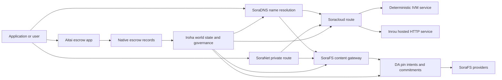

# SORA Nexus 提供服務 {#sora-nexus-services}

SORA Nexus 加入應用程式面向的服務飛機 Iroha 3. 這些服務
沒有分別的帳簿, Iroha 世界國家, Norito
管理紀錄, Torii 這樣的家庭.

可用性取決於節點建構和網絡配置. 使用
[`/openapi`](/zh-hant/reference/torii-endpoints.md#app-and-sora-route-families) 在
目標結線作為啟用路徑的權威列表.

## 組件地圖 {#component-map}

| 組件              | 角色                                                                                                                                        | 主要表面                                                                            |
| ---------------------- | ------------------------------------------------------------------------------------------------------------------------------------------- | ---------------------------------------------------------------------------------------- |
| Soracloud              | 應用程式部署,托管服務,私人模型/運行時間狀態以及服務生命周期控制.                                        | `/v1/soracloud/*`, `/api/*`, `iroha app soracloud ...`                                   |
| 在內地                  | Soracloud 接待者 HTTP 需要直播的服務修改時間 HTTP 飛機.                                                            | Soracloud 執行時間設定,主機功能廣告,複製運行時間狀態                 |
| SoraNet                | 環路的隱私與交通覆蓋, VPN, 聯繫會議,以及流通路線.                                     | `/v1/connect/*`, `/v1/vpn/*`, SoraNet 路線的數據                                     |
| 數據可用性 (DA) | 提供可用性證據,承諾和針對被參考的有效負荷的定意層 Nexus 路線, SoraFS 證據的流動. | `/v1/da/*`, `FindDaPinIntent*`, `[sumeragi.da]`                                          |
| SoraFS                 | 顯示表的存儲布料, CAR 這項指令將會影響其他國家的發展,           | `/v1/sorafs/*`, `/sorafs/*`, `FindSorafsProviderOwner`                                   |
| SoraDNS                | 決定性命名和解決方案認證層 SORA 提供服務及內容.                                                   | `/v1/soradns/*`, `/soradns/*`, 解決目錄事件                                 |
| 艾塔伊                  | 應用程式級的法定和資產清算走廊,                                     | `OpenAssetEscrow`, `FindAssetEscrow*`, `EscrowEventFilter`, Kotodama `escrow_*` 建築物 |



## 常見的流量 {#common-flows}

### 托管的 Split 應用程式 {#hosted-split-application}

這項應用程式將所有零件放在一起:

1. 靜止前端的資產被包裝並固定 SoraFS.
2. 舉例來說, `<app>.sora`, 已註冊於
   SoraDNS.
3. Soracloud 航線 `/api/v1/search` 或是 `/api/v1/stream` 在一間內路 HTTP
   提供服務.
4. Soracloud 航線 `/api/auth` 及其他 `/api/v1/user` 決定性化 IVM
   管理人員.
5. 需要隱私權的客戶可以獲得相同內容或 API 路線
   通過一個 SoraNet 這裡是一個路線.

| 路徑              | 支援機         | 為什麼?                                               |
| ----------------- | --------------------- | ------------------------------------------------- |
| `/`               | SoraFS 靜態含量 | 可複製的內容根和門口預存     |
| `/assets/*`       | SoraFS 靜態含量 | 內容相關的資產和顯示證據      |
| `/api/auth*`      | Soracloud IVM         | 沒有任何問題,       |
| `/api/v1/user*`   | Soracloud IVM         | 對治理敏感的狀態突變              |
| `/api/v1/search*` | Soracloud 在內地       | 活下去 HTTP 服務,預存器, SSE, 或是收藏國家 |

### 內容出版 {#content-publication}

SoraFS 出版物在名稱指向之前,會產生持久的文藝品:

1. 建立一個有效載荷或目錄.
2. 包裝在一個 CAR 這裡有許多資料庫,
3. 建立一個 Norito 顯示了針對政策和治理的資料.
4. 請向 Torii.
5. 記錄一個 DA 目標的目的或可用性承诺
   需要明顯的證據.
6. 請將表記結到 SoraDNS 姓名或 Soracloud 沒有任何變化.

### 提供私人接送或播放方式 {#private-fetch-or-streaming-route}

SoraNet 能坐在前面 SoraFS 或是 Soracloud:

1. 客戶解決了名稱或公告.
2. 警方目錄或路線公明選取入口與出口連接.
3. 交通被填補, SoraNet 這裡是一個路線.
4. 排出接線達到 SoraFS 這裡的門 Torii 流量,或 Soracloud
   這裡是一個路線.

## 艾塔伊 {#aitai}

艾塔伊是 SORA 應用程序走廊,
買家和賣家協調一項連鎖外付款, Iroha 控制了
該使用本土的保證指令家族
而不是合同所有的保證帳戶,
沒有任何問題.

在本地保證人帳簿中保存保管權.
`OpenAssetEscrow`, 購買者接受並標記非連鎖付款,
`AcceptAssetEscrow` 及其他 `MarkEscrowPaymentSent`, 賣家還會釋放
在 `ReleaseAssetEscrow` 或在付款標記之前取消.
任何一方可以開啟爭議,
`CanResolveEscrowDispute` 這項方案可以將封鎖的金額分開.

提供全生命周期的通用資產鎖定,匿名保證,
事件,以及 Rust 參考這些例子
[預借本地資產](/zh-hant/blockchain/escrow.md).

| 艾塔伊表面                                                                                                                                                 | 請使用它                                                                                |
| ------------------------------------------------------------------------------------------------------------------------------------------------------------- | ----------------------------------------------------------------------------------------- |
| `OpenAssetEscrow`, `AcceptAssetEscrow`, `MarkEscrowPaymentSent`, `ReleaseAssetEscrow`, `CancelAssetEscrow`                                                    | 透明數字資產提供,包括 XOR- 定位的決算流量.             |
| `OpenAnonymousAssetEscrow`, `AcceptAnonymousAssetEscrow`, `MarkAnonymousEscrowPaymentSent`, `ReleaseAnonymousAssetEscrow`, `CancelAnonymousAssetEscrow`       | 預約的價格, |
| `OpenEscrowDispute`, `ResolveEscrowDispute`, `OpenAnonymousEscrowDispute`, `ResolveAnonymousEscrowDispute`                                                    | 解決爭議,以法庭的方式.                                                 |
| `FindAssetEscrowById`, `FindAssetEscrowsBySeller`, `FindAssetEscrowsByBuyer`, `FindAssetEscrowsByStatus`                                                      | 應用程式狀況頁面,協調工作和支援工具.                               |
| `EscrowEventFilter`                                                                                                                                           | 按保證身份,賣家,買方,狀態或事件類型的透明保證訂閱. |
| Kotodama `escrow_open_offer`, `escrow_accept`, `escrow_mark_payment_sent`, `escrow_release`, `escrow_cancel`, `escrow_open_dispute`, `escrow_resolve_dispute` | Kotodama 請問有哪些 V1 沒有任何相關信息.                                 |

供公眾使用 Taira 或是 Minamoto 使用,處理連鎖以外的支付轨道和
任何支持或法庭工作流程, Iroha 記錄了
保護狀態,生命周期事件,證據和最終資產流動;
它不單獨驗證法定決済.

## 檢查目標結 {#check-a-target-node}

在使用本頁面的例子之前, 確認路線家族是否存在
在您的目標結節上:

```bash
export TORII_URL=https://taira.sora.org

curl -fsS "$TORII_URL/openapi.json" \
  | jq '.paths | keys[] | select(test("^/v1/(soracloud|sorafs|soradns|connect|vpn|da)/"))'

curl -fsS "$TORII_URL/status" | jq .
```

如果 `/openapi.json` 請試下, `/openapi`. 確實是如此
路線可用性取決於建構功能和網絡配置.

### Taira 僅供閱讀的煙草檢查 {#taira-read-only-smoke-checks}

公眾 Taira 終點對閱讀側檢查有用,但不要使用它
如果您沒有授權帳戶,
我們有意改變生活狀態.

```bash
export TORII_URL=https://taira.sora.org

curl -fsS "$TORII_URL/status" \
  | jq '{version: .build.version, peers, blocks, lanes: (.teu_lane_commit | length)}'

curl -fsS "$TORII_URL/v1/connect/status" | jq '{enabled, sessions_active}'

curl -fsS "$TORII_URL/v1/vpn/profile" \
  | jq '{available, relay_endpoint, supported_exit_classes}'

curl -fsS "$TORII_URL/v1/sorafs/storage/state" \
  | jq '{bytes_capacity, bytes_used, pin_queue_depth, por_inflight}'

curl -fsS -H 'Accept: application/json' "$TORII_URL/v1/soracloud/status" \
  | jq '.control_plane | {service_count, services: [.services[] | {service_name, current_version}]}'
```

Taira 可能會暴露出非部署特定的控制平面路線,
列在 OpenAPI 導航地圖. `/openapi` 作为第一產品
API 請先確認任何部署特定路線,
證明它是實際的.

## Soracloud {#soracloud}

Soracloud 這是 SORA 應用控制平面. 它追蹤部署
包,服務修改,路由,發布狀態,權威配置
密碼化服務秘密,模型登記紀錄,私人
預算時間及運行時收費.

Soracloud 使用兩個執行機:

| 執行機        | 運行時間 | 請使用它                                                                                   |
| ---------------------- | ------- | -------------------------------------------------------------------------------------------- |
| `DeterministicService` | `Ivm`   | 授權使用,保狀態,認證閱讀,訂單的郵箱處理者,對治理敏感突變 |
| `HttpService`          | `Inrou` | 活下去 HTTP APIs, 收藏者繁重工作,存儲支持的服務, SSE, 透過浏览器支援的流量     |

控制機是權威的.
秘密,模型和狀態命令通過 Torii 閱讀已承諾
他們不依賴獨立的國家, CLI- 地方鏡子,公眾
路由是以最長的前為基礎, 因此一個注冊的主機可以分開流量
接待者之間 HTTP 路線與決定性 API 這裡有許多路線.

### 建立一個分開的應用程式 {#scaffold-a-split-app}

該分別應用程式模板創造了靜態前端加上一個主機直播 API
還有一個決定性.API 服務:

```bash
iroha app soracloud app init \
  --template split-app \
  --app-name solswap_indexer \
  --app-version 0.1.0 \
  --public-host solswap-indexer.sora \
  --output-dir ./apps/solswap-indexer

iroha app soracloud app local-plan \
  --manifest ./apps/solswap-indexer/app_manifest.json

iroha app soracloud app doctor \
  --manifest ./apps/solswap-indexer/app_manifest.json
```

`local-plan` 打印路線分區,兒童服務公告,工作空間
預期的前端出版模式. `doctor`
在您涉及之前, 核准本地釋放合同 Torii.

### 部署和檢查應用程式狀態 {#deploy-and-inspect-app-state}

```bash
export SORACLOUD_TORII_URL=https://<soracloud-enabled-torii>

iroha app soracloud app deploy \
  --manifest ./apps/solswap-indexer/app_manifest.json \
  --torii-url "$SORACLOUD_TORII_URL"

iroha app soracloud app status \
  --manifest ./apps/solswap-indexer/app_manifest.json \
  --torii-url "$SORACLOUD_TORII_URL"
```

使用已部署的服務:

```bash
iroha app soracloud status \
  --service-name solswap_indexer_live \
  --torii-url "$SORACLOUD_TORII_URL"

iroha app soracloud rollback \
  --service-name solswap_indexer_live \
  --target-version 0.1.0 \
  --torii-url "$SORACLOUD_TORII_URL"
```

### 隱私及秘密資料 {#config-and-secret-material}

Soracloud 配置和秘密輸入是授權部署的一部分
在需要配置或重建時, 部署,升級和反彈無法關閉
沒有或與活性表達相矛盾的秘密結合.

```bash
iroha app soracloud config-set \
  --service-name solswap_indexer_live \
  --config-name indexer/public_config \
  --value-file ./config/public-config.json \
  --torii-url "$SORACLOUD_TORII_URL"

iroha app soracloud secret-set \
  --service-name solswap_indexer_live \
  --secret-name indexer/api_key \
  --secret-file ./secrets/api-key.envelope.json \
  --torii-url "$SORACLOUD_TORII_URL"
```

請使用 CLI 提供您的個人資料所需的精確認證標籤:

```bash
iroha app soracloud config-set --help
iroha app soracloud secret-set --help
```

## 在內地 {#inrou}

內魯是主持人. HTTP 使用的時間 Soracloud. 其他國家 Iroha 接觸到
嵌入式 Soracloud 已被允許的運行時間項目 Soracloud 州成本地
實現計畫,開始分配的托管服務複製作為回路
該報告將回歸於官方的
這樣的模型.

使用 Inrou 在需要直播的工作負載中 HTTP 表面,例如:
收藏量重 APIs, SSE 流量,預存支持的處理器,或
提供由浏览器支援的服務.

### 運行時間要求 {#runtime-requirements}

- 容器明顯運行時間必須是 `Inrou`.
- 必須是: `HttpService`.
- `HttpService + Inrou` 需要一個. `PersistentRootLeaseVolume`
  裝在 `/`.
- 複製的Inrou服務也需要共享服務或保密租賃
  存儲時保持可變的共享狀態.
- 而不是在網路上使用的產品.
  只有作為代理人.

### 顯示的碎片 {#manifest-fragment}

這兩種表達式的形狀,
沒有完整的部署包.

```jsonc
// container_manifest.json
{
  "schema_version": 1,
  "runtime": { "runtime": "Inrou", "value": null },
  "bundle_path": "/bundles/solswap-indexer.inrou",
  "entrypoint": "/app/bin/launch-indexer.sh",
  "args": [],
  "env": {
    "RUST_LOG": "info",
  },
  "inrou": {
    "schema_version": 1,
    "guest_os": { "guest_os": "DebianSlim", "value": null },
    "guest_images": {
      "x86_64": {
        "kernel_image_path": "/inrou/x86_64/vmlinux",
        "rootfs_image_path": "/inrou/x86_64/rootfs.ext4",
        "initrd_image_path": null,
      },
      "aarch64": {
        "kernel_image_path": "/inrou/aarch64/vmlinux",
        "rootfs_image_path": "/inrou/aarch64/rootfs.ext4",
        "initrd_image_path": null,
      },
    },
  },
  "lifecycle": {
    "start_grace_secs": 60,
    "stop_grace_secs": 30,
    "healthcheck_path": "/api/indexer/v1/health",
  },
}
```

```jsonc
// service_manifest.json
{
  "schema_version": 1,
  "service_name": "solswap_indexer_live",
  "service_version": "0.1.0",
  "execution_plane": { "execution_plane": "HttpService", "value": null },
  "replicas": 2,
  "route": {
    "host": "solswap-indexer.sora",
    "path_prefix": "/api/v1/search",
    "service_port": 8080,
    "visibility": { "visibility": "Public", "value": null },
    "tls_mode": { "tls": "Required", "value": null },
  },
  "lease_volumes": [
    {
      "volume_name": "root_disk",
      "kind": {
        "lease_volume": "PersistentRootLeaseVolume",
        "value": null,
      },
      "storage_class": { "storage_class": "Warm", "value": null },
      "mount_path": "/",
      "max_total_bytes": 8589934592,
    },
    {
      "volume_name": "index_state",
      "kind": { "lease_volume": "ServiceLeaseVolume", "value": null },
      "storage_class": { "storage_class": "Warm", "value": null },
      "mount_path": "/var/lib/solswap-indexer",
      "max_total_bytes": 1073741824,
    },
  ],
}
```

在運行時間,每個安裝的租量都透過環境暴露
來自卷名字的變量:

```text
SORACLOUD_LEASE_VOLUME_ROOT_DISK_DIR
SORACLOUD_LEASE_VOLUME_ROOT_DISK_MOUNT_PATH
SORACLOUD_LEASE_VOLUME_INDEX_STATE_DIR
SORACLOUD_LEASE_VOLUME_INDEX_STATE_MOUNT_PATH
```

## SoraNet {#soranet}

SoraNet 提供以接觸為基礎的
沒有直接連接到目標門口的交通路線
或服務. 交通設計使用入口,中部和出口連接角色,
QUIC 交通,以噪音為基礎的混合式握手,能力談判,
接觸目錄的數據,以及固定尺寸的式細胞.

在 Nexus 部署, SoraNet 能運送內容,門口流量,
VPN 或連接會議, Norito 導覽表入口可以使用
標籤將該支傳輸 `norito-stream`, 這讓客戶更喜歡路線
适用于 Torii RPC 或是流量流量.

### 流動配置 {#streaming-configuration}

其他國家 Nexus 顯示功能 SoraNet 提供流通路線的供應:

```toml
[streaming]
feature_bits = 0b11

[streaming.soranet]
enabled = true
exit_multiaddr = "/dns/torii/udp/9443/quic"
padding_budget_ms = 25
access_kind = "authenticated"
provision_spool_dir = "./storage/streaming/soranet_routes"
provision_spool_max_bytes = 0
provision_window_segments = 4
provision_queue_capacity = 256
```

使用 `access_kind = "read-only"` 沒有要求的內容路線
檢視者認證. `authenticated` 當出口連接必須執行時
預訂票或觀眾身份, Torii 或是提供主機服務.

### SoraNet- 知道的 SoraFS 請帶來 {#soranet-aware-sorafs-fetch}

其他國家 SoraFS 收取 CLI 能發出本地代理表格和卷 SoraNet
導覽器擴展的路徑元數據或 SDK 适配器:

```bash
sorafs_cli fetch \
  --plan artifacts/payload_plan.json \
  --manifest-id 7bb2...9d31 \
  --provider name=alpha,provider-id=9f5c...73aa,base-url=https://gw-alpha.example.org/,stream-token="$(cat alpha.token)" \
  --output artifacts/payload.bin \
  --json-out artifacts/fetch_summary.json \
  --local-proxy-manifest-out artifacts/proxy_manifest.json \
  --local-proxy-mode bridge \
  --local-proxy-norito-spool storage/streaming/soranet_routes \
  --local-proxy-kaigi-spool storage/streaming/soranet_routes \
  --local-proxy-kaigi-policy authenticated \
  --max-peers=2 \
  --retry-budget=4
```

總結紀錄提供者報告,
並使用的有效路線設定.

## 數據可用性 (DA) {#data-availability-da}

DA 也是對太大的有效載荷的可用性證據層.
或是太多服務特色,
這項報告將會記錄決定性承諾和回收义务,
核准者,門口和客戶可以同意哪些字节被應許,
該政策是什麼,以及有何證據.

DA 沒有取代 Kura 或是 SoraFS:

- Kura 存儲已完成的區塊流和共識恢復數據.
- SoraFS 存儲和服務內容地址的字節, CAR 使用載荷,以及
  顯示.
- DA 記錄承諾,證據政策,證據開啟和筆記意圖
  讓這些字節可安排,監控和連結到帳號
  國家.

使用 DA 在申請或 Nexus Lane需要一個可見的帳號承諾
這項計畫的目標是:
對決流程的有效負荷承諾, SoraFS 發表的筆記意圖
內容,必須保留以后核實的證據捆綁;
應用器件的公共狀態應該是消化而不是
完全有效載荷.

### 生命周期 {#lifecycle}

| 階段      | 記錄的內容                                                                                                                                      |
| ---------- | ----------------------------------------------------------------------------------------------------------------------------------------------------- |
| 意圖     | 標籤,顯示參考資料,名稱,行徑/時代/序列參考資料或保留政策或複製目標                                          |
| 承諾 | 取資料,將表格,行徑用量,證據捆綁或內容根連接到可見的帳號記錄.                                    |
| 證據   | 提供者認證或其他目標網所接受的專利特定證據.                         |
| 詢問問題      | 檢查了這些問題. `FindDaPinIntentByTicket`, `FindDaPinIntentByManifest`, `FindDaPinIntentByAlias`, 或是 `FindDaPinIntentByLaneEpochSequence`. |

典型的情況 DA-支持的出版流量是:

1. 建成或接收在外的使用負荷 WSV, 例如: SoraFS CAR
   文件或 Nexus 這裡的車道是用車路.
2. 按 Hash,並描述用荷物 Norito 顯示或路線特定
   承諾紀錄.
3. 提交明示書,印意圖或承諾 `/v1/da/*` 什麼時候
   該路線家族已啟用,或透過網路的簽名
   交易之路.
4. 讓驗證者或可用性提供者收集所需的證據
   通過積極證明政策.
5. 在推廣一個假名之前,
   還是取決於使用負荷的入口路線.

### 算法模型 {#algorithmic-model}

DA 轉換一個有效負荷成簽署的,反彈保護的,區塊索引的承諾.
這種數據是非常重要的.
在同一字節中重新計算相同的字段.

1. **我們必須要將這些訊息傳達到其他國家.** Torii 接受使用要求,
   `(lane_id, epoch, sequence)`, 使用量字节,壓縮元數據,部分
   顯示了使用者簽名,
   在要求時將 gzip,deflate或Zstandard的有效負荷解壓縮,
   檢查可行字節長度是否等於 `total_size`.
2. **檢查行徑和部分參數.** 這條車道必須在 Nexus
   這裡的路線目錄. `chunk_size` 必須是不為零的功率,至少有2
   字節,並不超過設定的最大值.
   包含數據片段和至少兩張平率片段.
   證明方案, `merkle_sha256` 或是 `kzg_bls12_381`.
3. **應用網路政策.** 這種方式可以使用.
   點類的儲存基線. 公眾元數據必須保持直文;
   只有管理的元數據是用節点配置的管理加密
   在它被寫入表格之前,
4. **這樣做,** 卡的使用量是固定尺寸的
   由於 `chunk_size`. Torii 計算使用負荷的消化,
   證明可回收性樹根,以及每塊的承諾.
   運行 BLAKE3 在他們對字節的承諾上.
5. **加入取消承諾.** 子被組成條紋
   `data_shards`. 在最後一條線上, 缺失的細胞為平衡而填滿零
   計算方式 RS(16) 均性創造了排列/全球均性分片;
   `row_parity_stripes` 在矩陣上加列式條紋平率.
   該項目的目標是: BLAKE3 小的消化物 `u16` 這種標誌,
6. **建立該表格.** `DaManifestV1` 記錄行徑,時代,點類別,
   代克,使用負荷消化,零件根,零件尺寸,擦除配置文件,保留
   租金政策,租金價格,部分承諾,任選 IPA 承諾,元數據
   存儲票是決定性的:結號首先將一個
   顯示模板,然後將指紋寫回為
   總決賽 `storage_ticket`.
7. **拒絕重播衝突.** 這裡的重播鍵是
   `(lane_id, epoch, sequence, manifest_fingerprint)`. 兩本與
   這種指紋是無效的.
   不同的指紋被拒絕.
8. **發出簽名的文物.** Torii 計算一個 PDP 承諾,簽署一項
   `DaIngestReceipt`, 建立一個 `DaCommitmentRecord`, 他寫著一些子藝術品.
   對於明顯的, PDP 承諾,承諾紀錄,承諾時間表;
   接收標記,收件檔案和收件日志.
   單一地按每個 `(lane_id, epoch)`.

這項紀錄是 blocks 的承載.

- 路線,時代和序列
- 呼叫點滴 ID 及法典明顯的哈希
- 路線防範方案
- 碎片根
- 選擇性 KZG 承諾 KZG 路線
- PDP/證據消化
- 儲存類別和儲存票
- Torii DA 确认的簽名

在一個積木嵌入之前 DA 列表,區塊組裝路徑驗證捆綁:

- `(lane_id, epoch, sequence)` 在包裹內必須獨特.
- 顯示的哈希必須在束內是非零且獨特的.
- 承諾證明方案必須符合設定的行徑政策.
- 默克爾路線拒絕 KZG 承諾; KZG 路線需要非零 KZG
  我們的承諾.
- 按行徑,顯示哈希,
  存儲票,所有者帳戶和密碼衝突規則.

區塊標籤儲存 hash DA 證明政策,承諾和針
預約包內也顯示了 Merkle 的相關貼子:
根,其葉是法典的合 Norito- 已加密
`DaCommitmentRecord` 關鍵字是左邊和右邊的連鎖.
沒有變化的葉子被提升到下一層.

### 證據驗證 {#proof-verification}

`/v1/da/commitments/prove` 在一個區塊中,
證明包含承諾,積木高度,包內索引,包
檢查檢查:

1. 這項證據包的哈希與區塊標題相匹配 DA 這種方式,
2. 檢測區塊的高度與參考區塊標題相匹配.
3. 這項指數是限量,
   該指數.
4. 這項承諾,
5. 透過從承諾葉子上折兄弟之路,
   根源.
6. 復元的根與束根等.

這證明了特定的可用性承諾在特定的
沒有任何證據證明每個複製都在線.
檢查可回收性, SoraFS 提供商收取, PDP/PoTR
檢查或特定的可用性證據.

### 協調的互動 {#consensus-interaction}

DA 附加在 Sumeragi 透過可靠的廣播 (RBC),但它不是
這項協議是第二次完成的. RBC 傳播和回收提案的有效負荷:
提議人宣布會議 `(height, view, payload_hash)`, 同級人
交換零件,以及 `READY`/`DELIVER` 訊號追蹤是否有足夠的驗證機
檢測到相同的有效負荷.

在 Iroha 3, 一位同行將待定的積木用量視為可用的,當:

- 預期的有效負荷哈希,或
- RBC 已找到與區塊哈希,高度,視野和值相匹配的有效負荷
  這樣做是很好的.

如果沒有任何條件, `missing_local_data`, 繼續努力
通過的有效載荷 RBC 或阻擋同步, DA 進入的門
在目前的實施中, DA 這些訊號是
決定性通知:從承諾證書中仍在完成一塊,
適合的本地有效載荷,而不是從別途的 DA 沒有任何證據.

DA 這項計畫的目標是: DA 數量時間限期取出
在設定的區塊中和提交時間,
`sumeragi.advanced.da.quorum_timeout_multiplier`. 提供時間是:
`max(quorum_timeout, availability_timeout_floor_ms) * availability_timeout_multiplier`.
在可用性截止日期到期之前,
避免提前重新安排;
改變視覺的路徑可以進行.

### 運營商註冊 {#operator-notes}

Iroha 3 共識的概率包括 RBC- 支持有效載荷的傳播,表
警衛, DA 檢測和復元的遠隔測量.
模板曝光 `[sumeragi.da]` 預約和證據開啟的限制
區塊,加上 `[sumeragi.advanced.da]` 暫停時間的乘法,
保持這些設定在一個驗證器中一致
網頁配置文件.

開始從節點的位置. OpenAPI 文件:

```bash
curl -fsS "$TORII_URL/openapi.json" \
  | jq '.paths | keys[] | select(startswith("/v1/da/"))'
```

請使用
[查詢參考](/zh-hant/reference/queries.md#nexus-data-availability-and-packages)
在目前的情況下 DA 查詢名稱,
[同級配置模板](/zh-hant/reference/peer-config/) 在當地地區
`[sumeragi.da]` 這種子是因為你打造的.

## SoraFS {#sorafs}

SoraFS 這種裝置是由數位數量為數,
字节分成決定性部分, CAR 檔案,以及 Norito 顯示了
聯繫內容根源,分斷配置文件,引政策和治理
存儲提供商宣傳容量和內容
提供可用性,而入口通道在此之前檢查表格和部分承諾
提供內容.

典型的 SoraFS 使用包括靜態應用資產,文獻
建立,區域捆綁,模型或文物參考以及治理證明
這裡有許多人. Iroha 數據模型的曝光 SoraFS 關鍵事件和一
[`FindSorafsProviderOwner`](/zh-hant/reference/queries.md#nexus-data-availability-and-packages)
詢問提供商所有權解決方案.

### 包裝,表達,簽名,並提交 {#pack-manifest-sign-and-submit}

```bash
cargo run -p sorafs_car --features cli --bin sorafs_cli -- \
  car pack \
  --input ./dist \
  --car-out artifacts/site.car \
  --plan-out artifacts/site.chunk-plan.json \
  --summary-out artifacts/site.car-summary.json

cargo run -p sorafs_car --features cli --bin sorafs_cli -- \
  manifest build \
  --summary artifacts/site.car-summary.json \
  --manifest-out artifacts/site.manifest.to \
  --manifest-json-out artifacts/site.manifest.json \
  --pin-min-replicas=3 \
  --pin-storage-class=warm \
  --pin-retention-epoch=42

SIGSTORE_ID_TOKEN=$(oidc-client fetch-token) \
cargo run -p sorafs_car --features cli --bin sorafs_cli -- \
  manifest sign \
  --manifest artifacts/site.manifest.to \
  --bundle-out artifacts/site.manifest.bundle.json \
  --signature-out artifacts/site.manifest.sig

cargo run -p sorafs_car --features cli --bin sorafs_cli -- \
  manifest submit \
  --manifest artifacts/site.manifest.to \
  --chunk-plan artifacts/site.chunk-plan.json \
  --torii-url "$TORII_URL" \
  --resolve-submitted-epoch=true \
  --authority=<i105-account-id> \
  --private-key-file ./secrets/authority.ed25519 \
  --summary-out artifacts/site.manifest.submit.json \
  --response-out artifacts/site.manifest.submit.body
```

如果 `/v1/sorafs/pin/register` 在目標結線上沒有路由, CLI 可使用
還是要回去簽名的 `/transaction` 預覽 請問有什麼問題,
管道狀況.

### 檢查並將它帶來 {#verify-and-fetch}

```bash
cargo run -p sorafs_car --features cli --bin sorafs_cli -- \
  proof verify \
  --manifest artifacts/site.manifest.to \
  --car artifacts/site.car \
  --chunk-plan artifacts/site.chunk-plan.json \
  --summary-out artifacts/site.verify.json

sorafs_cli fetch \
  --plan artifacts/site.chunk-plan.json \
  --manifest-id <manifest-digest-hex> \
  --provider name=primary,provider-id=<provider-id-hex>,base-url=https://gateway.example.org/,stream-token="$(cat provider.token)" \
  --output artifacts/site.fetch.tar \
  --json-out artifacts/site.fetch.json
```

### 檢查可回收性的證據 {#proof-of-retrievability-checks}

運營商可以檢查及啟動存儲供應商的證據檢查:

```bash
sorafs_cli por status \
  --torii-url "$TORII_URL" \
  --manifest <manifest-digest-hex> \
  --status=failed \
  --limit=20

sorafs_cli por trigger \
  --torii-url "$TORII_URL" \
  --manifest <manifest-digest-hex> \
  --provider <provider-id-hex> \
  --reason=latency_probe \
  --samples=48 \
  --auth-token artifacts/challenge_token.to
```

## SoraDNS {#soradns}

SoraDNS 是為 SORA 提供服務與內容.
標準化名稱,結解決目錄更新 Iroha, 及其他
透過簽名區域或解析器捆綁 SoraFS. 解決器和
在信任發現之前, gateways 檢查解決者認證文件
沒有任何相關資料.

透過網路覽器, SoraDNS 取出已註冊的入口主機 FQDN.
註冊的虛空主機仍然是法典應用程序來源,
部署的門口配置文件將顯示浏览器和 Torii 這項目的回歸路線
國家的起源

### 主持人表格 {#host-forms}

| 填表 | 舉例 | 目的 |
| --- | --- | --- |
| 虛空的起源 | `https://<fqdn>/<path>` | 網路使用者 URL 記錄在表格和發布紀要中 |
| Taira 浏览器入口 | `https://<fqdn>.mon.taira.sora.net/<path>` | 公開浏览器入口,使用活跃的密碼 |
| Torii 倒退路線 | `https://taira.sora.org/soradns/<fqdn>/<path>` | Torii 檢測和回落路線, |
| 傳統的哈希通道 | `<base32(blake3(name))>.gw.sora.id` | 決定性門口的身份和 GAR 核查 |

其他國家 `/soradns/<alias>/...` 沒有人喜歡倒. URL.
工具,應用程式顯示和前端配置應該更喜歡虛空
如果一個名稱不活跃在 Taira, 浏览器入口或
倒退路線可以返回 `404` 或是失敗 TLS 在應用程序路由之前
開始了.

### 導向入口主機 {#derive-gateway-hosts}

```ts
import {
  deriveSoradnsGatewayHosts,
  hostPatternsCoverDerivedHosts,
} from '@iroha/iroha-js'

const derived = deriveSoradnsGatewayHosts('docs.sora')
console.log(derived.canonicalHost)
console.log(derived.prettyHost)

const taira = deriveSoradnsGatewayHosts('solswap-indexer.sora', {
  prettySuffix: 'mon.taira.sora.net',
})
console.log(taira.prettyHost)

const patterns = [
  derived.canonicalHost,
  derived.canonicalWildcard,
  derived.prettyHost,
]
console.log(hostPatternsCoverDerivedHosts(patterns, derived))
```

GAR 該用品應覆蓋法典的哈希主機,法典的野生卡片,
並選出一位漂亮的主持人.

### 拿出一個分辨器目錄快照 {#fetch-a-resolver-directory-snapshot}

```bash
curl -i "$TORII_URL/v1/soradns/directory/latest"

soradns_resolver directory fetch \
  --record-url "$TORII_URL/v1/soradns/directory/latest" \
  --directory-url https://gateway.example.org/soradns/directory/latest.car \
  --output ./state/soradns-directory

soradns_resolver rad verify \
  --rad ./state/soradns-directory/rad/resolver-a.norito
```

關鍵字應拒絕具有解決器認證文件的解析器
缺失,已過期,未簽名或沒有在 Merkle 最新目錄中固定
在一個尚未發布的解決程式目錄上,
`/v1/soradns/directory/latest` 可以回來 `404` 雖然路線是
已啟動.

### 公眾 DNS 代表團 {#public-dns-delegation}

SoraDNS 主機衍生程式並不取代普通網路 DNS 代表團.
如果公眾 DNS 這個名字應該指向一個 SoraDNS 門口:

- 該網站上, CNAME 給我們挑選的漂亮的主人
- 標籤名稱,使用 ALIAS/ANAME 或 A/AAAA 任何投放的入口
  IPs
- 請將法式哈希主機置於 SoraDNS 關鍵字域名 GAR
  檢查

## FHE 及其他 UAID {#fhe-and-uaid}

FHE-可供使用的相關表面 Nexus 服務包括:

- `iroha_crypto::fhe_bfv` 實現決定性 BFV 支持可
  密碼文本評估.
  `BfvIdentifierPublicParameters` 及其他 `BfvIdentifierCiphertext`, 在哪裡的插槽
  0 儲存輸入字節長度,後期插槽儲存一個加密字節
  沒有任何問題.
- Soracloud 國家和就業方案模型 FHE 密碼文本工作負載
  管理參數組,執行策略,加密文字
  提供其他資訊,

其他國家 BFV 客戶的個人隱私保護.
能向該公司提交加密識別碼 Torii 解決方案.
在"活跃識別者政策"下,
`OpaqueAccountId`, 並發出收據. `ClaimIdentifier` 接著結束了這個
收到的票 UAID 附加到目標帳戶.

其他國家 UAID 在這個流動中,
數據模型, `UniversalAccountId` 顯示為:
`uaid:<hash>`. 解析者接受了兩種情況 `uaid:<hash>` 或是原始的64hex
消化. `Account` 及其他 `NewAccount` 包含選擇性 `uaid` 及其他 `opaque_ids`
執行時間登記實施一對一 UAID- 帳戶指數,
拒絕複製或碰撞的不透明識別子,並拒絕不透明
沒有識別碼 UAID. 每當一個 UAID 帳戶的變化,
執行時間重建空間目錄數據區域結合 UAID.

空間目錄顯示將功能連接到一個 UAID. 其他國家
`AssetPermissionManifest` 這些名字 UAID, 數據空間,啟動和
選擇性到期期期,並按數據空間排序允許/拒絕輸入,
該方案,方法,資產,以及 AMX 評估是拒絕贏得的:
否則最新的匹配允許
申請人是否有任何額度限制.
取消這些明示令是受到保護的 `CanPublishSpaceDirectoryManifest`.

於 Soracloud FHE 該國家的實施方案是:

| 方案                                    | 該組織控制的是什麼?                                                                                                            |
| ----------------------------------------- | --------------------------------------------------------------------------------------------------------------------------- |
| `SoraStateBindingV1` 在 `FheCiphertext` | 表示狀態鍵前下的值是 FHE 密碼文本.                                                          |
| `FheParamSetV1`                           | 稱為方案,後端,模組連鎖,多項式度,插槽數量,安全目標,生命周期和參數消化.  |
| `FheExecutionPolicyV1`                    | 限制密碼文本大小,簡體文字大小,輸入/輸出數量,乘法深度,旋轉,開啟帶和圓形模式. |
| `FheGovernanceBundleV1`                   | 配合一個參數與一項執行政策,                                               |
| `FheJobSpecV1`                            | 描述決定性 `Add`, `Multiply`, `RotateLeft`, 或是 `Bootstrap` 在加密文字狀態鍵和承諾方面工作.    |
| `CiphertextQuerySpecV1`                   | 查詢只需加密文本,按服務,绑定,關鍵前音符,結果限制,元數據水平和可選的包含證明.  |
| `DecryptionRequestV1`                     | 在解密權利政策下, 要求披露一個加密文本承诺.                                      |

`FheJobSpecV1::validate_for_execution` 檢查工作,執行
這項政策,並在接受之前同意設定的參數.
操作特定規則:加和乘以至少需要兩種輸入,旋轉
需要一個輸入,深度要求,旋轉數量,
開始線數量,輸入數量,有效載荷字節和決定性輸出尺寸
必須保持在政策範圍內.
單字排行.

UAID 是不是加密文字, FHE 這項政策本身.
使用於查找帳戶的帳號能力,不透明識別碼
要求,以及許可服務或數據空間的空間目錄結合
這樣的流量. FHE 系統管理加密有效載荷的接入和執行
透過參數組,執行策略,加密文字
該項目的目標是:

有關性 Torii 表面包括:

- `/v1/identifier-policies`
- `/v1/identifiers/resolve`
- `/v1/accounts/{account_id}/identifiers/claim-receipt`
- `/v1/identifiers/receipts/{receipt_hash}`
- `/v1/accounts/{uaid}/portfolio`
- `/v1/space-directory/uaids/{uaid}`
- `/v1/space-directory/uaids/{uaid}/manifests`
- `/v1/soracloud/model/run-private`
- `/v1/soracloud/model/run-private/finalize`
- `/v1/soracloud/model/decrypt-output`

公共數據的界限在方案中明顯: UAID 聯繫,
不透明的識別碼記錄,顯示生命周期,國家鍵消化,
密碼文字大小,密碼文字承諾,政策名稱,參數組
版本,工作操作,輸出狀態關鍵和披露要求
顯示資料可能是可見的.
輸入和輸出,以及 FHE 這些秘密密碼在公開查詢之外.
其他國家.

## 運營檢查名單 {#operational-checklist}

- 確認有能力的服務家庭 `/openapi` 在目標上 Torii
  沒有任何問題.
- 治療 Soracloud 部署表, SoraFS 顯示表, SoraDNS 解決器
  註冊帳號, SoraNet 傳輸目錄記錄, DA 針的意圖或
  提供可用性承諾,
- 使用相同的方法 SORA Nexus 在一個證實器中,
  網路的使用.
- 請將 Inrou 的根和共享租量放在表格中,而不是依靠
  在特定的節點-本地路徑上.
- 使用 SoraFS 在宣傳內容名稱之前進行驗證.
- 監控器 SoraNet 握手失效, DA 數量或可用性時間,
  SoraFS 拒絕入口, SoraDNS RAD 鮮度,以及 Soracloud 推出
  醫療問題
- 供公眾使用 Taira 或是 Minamoto 使用,從
  [接觸到 SORA Nexus 數據空間](/zh-hant/get-started/sora-nexus-dataspaces.md).

查看以下內容:

- [Torii 終點點](/zh-hant/reference/torii-endpoints.md)
- [資料事件過濾器](/zh-hant/blockchain/filters.md#data-event-filters)
- [查詢參考資料](/zh-hant/reference/queries.md#nexus-data-availability-and-packages)
