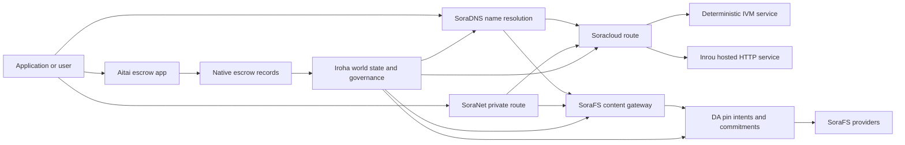

# SORA Nexus 服務 {#sora-nexus-services}


SORA Nexus 在 Iroha 3 周圍添加了應用程序面向的服務飛機. 這些服務不是單獨的賬本.它們由 Iroha 世界狀態,Norito 公開表,治理記錄和 Torii 路線家族固定.

可用性取決於節點構建和網絡配置. [`/openapi`](/zh-hant/reference/torii-endpoints.md#app-and-sora-route-families) 發現生成的應用程序.API 目標節點的路線. SoraFS CID 而已知路線在生成的文件之外安裝,所以檢查部署時直接探討這些路線.

## 組件地圖 {#component-map}

|組件|角色|主要表面|
| ---------------------- | ------------------------------------------------------------------------------------------------------------------------------------------- | ---------------------------------------------------------------------------------------- |
|Soracloud|應用部署,託管服務,私人模型/運行時間狀態以及服務生命週期控制. |`/v1/soracloud/`, `/api/`,`iroha app soracloud ...` |
|在裏面|Soracloud 爲需要直播 HTTP 飛機的服務修改運行時間託管 HTTP. |Soracloud 運行時間配置,主機功能廣告,複製運行時間狀態.|
|SoraNet|電路,繼電流, VPN,連接會議和流媒體線路的隱私和運輸覆蓋.|`/v1/connect/`,`/v1/vpn/`, SoraNet 的路線元數據 |
|數據可用性 (DA) |在 Nexus 車道, SoraFS 表格和證明流程中引用的有效載荷的可用性證據,承諾和準意圖層. |`/v1/da/`, `FindDaPinIntent`,`[sumeragi.da]` |
|SoraFS|文件表, CAR 有效載荷,固定內容,網關檢索和可回收性證明流的內容定位存儲布料. |`/v1/sorafs/`, `/sorafs/`,`FindSorafsProviderOwner` |
|SoraDNS|對於 SORA 託管的服務和內容,確定性命名和解決器認證層. |`/v1/soradns/`, `/soradns/`,解決方程式事件|
|艾塔伊|應用程序級的法定和資產結算走廊,由本地託管記錄支持,而不是單獨的賬本.|`OpenAssetEscrow`, `FindAssetEscrow*`,`EscrowEventFilter`, Kotodama `escrow_*`的建築物|



## 常見流量 {#common-flows}

### 託管的分類應用程序 {#hosted-split-application}

一個典型的混合平面應用程序使用了所有零件:

1. 靜態前端資產被包裝並通過 SoraFS 綁定.
2. 公共主機,例如 `<app>.sora`,通過 SoraDNS 進行註冊.
3. Soracloud 路線 `/api/v1/search`或`/api/v1/stream`到一個 Inrou HTTP 服務.
4. Soracloud 路線 `/api/auth`和 `/api/v1/user`向確定性處理器 IVM.
5. 需要隱私的客戶可以通過 SoraNet 電路達到相同內容或 API 路線.

|路徑|後備飛機|爲什麼?|
| ----------------- | --------------------- | ------------------------------------------------- |
| `/`               |SoraFS 靜態含量|可複製的內容根和網關緩存 |
|`/assets/*`|SoraFS 靜態含量|內容地址的資產和表現證據|
|`/api/auth*`|Soracloud IVM |複製安全的作者和錢包挑戰狀態 |
|`/api/v1/user*`|Soracloud IVM |對於治理敏感的狀態突變|
|`/api/v1/search*`|Soracloud 在線 |現場 HTTP 服務,緩存, SSE,或收藏狀態|

### 內容出版 {#content-publication}

SoraFS 出版物在名稱指向它們之前,生產了持久的文物:

1. 建立一個有效載荷或目錄.
2. 包裝在一個 CAR 檔案和零件計劃.
3. 建立一個 Norito 表格,包含針政策和治理數據.
4. 提交說明書給 Torii.
5. 如果目標配置文件需要明確的證據,請記錄 DA 筆意圖或可用性承諾.
6. 綁定表與 SoraDNS 名稱或 Soracloud 靜態前端路線.

### 乘坐私人車輛或流通路線 {#private-fetch-or-streaming-route}

SoraNet 可以坐在 SoraFS 或 Soracloud 前面:

1. 客戶端解決了名稱或表格.
2. 一個警衛目錄或路線公開選擇入口和出口繼電器.
3. 交通被填充並通過 SoraNet 電路發送.
4. 輸出繼電器到達 SoraFS 門口, Torii 流或 Soracloud 路線.

## 艾塔伊 {#aitai}

Aitai是市場式結算的 SORA 應用程序走廊,買方和賣方在鏈外協調支付,而 Iroha 則控制了 在鏈上存儲資產.它應使用本地託管指令家族,而不是合同所有的託管賬戶用於新數值資產託管流動.

在本地保證人賬戶中保留保管權.賣方開設了 `OpenAssetEscrow`, 買方接受並標記鏈外支付: `AcceptAssetEscrow` 和 `MarkEscrowPaymentSent`, 賣家將與 `ReleaseAssetEscrow` 如果買方和賣方不同意,雙方可以開啓爭端,並通過 `CanResolveEscrowDispute` 可以把鎖定的金額劃分.

對於整個生命週期,通用資產鎖定,匿名保證金,查詢,事件和 Rust 的例子,請見 [原始資產保證金](/zh-hant/blockchain/escrow.md).

|艾塔伊表面|用它來|
| ------------------------------------------------------------------------------------------------------------------------------------------------------------- | ----------------------------------------------------------------------------------------- |
| `OpenAssetEscrow`, `AcceptAssetEscrow`, `MarkEscrowPaymentSent`, `ReleaseAssetEscrow`, `CancelAssetEscrow`                                                    |透明數值資產報價,包括以 XOR 計定的結算流. |
| `OpenAnonymousAssetEscrow`, `AcceptAnonymousAssetEscrow`, `MarkAnonymousEscrowPaymentSent`, `ReleaseAnonymousAssetEscrow`, `CancelAnonymousAssetEscrow`       |保護的報價使用證明附件對於資金和關閉活動.|
|`OpenEscrowDispute`, `ResolveEscrowDispute`,`OpenAnonymousEscrowDispute`, `ResolveAnonymousEscrowDispute` |糾紛和法庭方式的解決.|
|`FindAssetEscrowById`, `FindAssetEscrowsBySeller`,`FindAssetEscrowsByBuyer`, `FindAssetEscrowsByStatus` |應用程序狀態頁面,調整工作和支持工具.|
|`EscrowEventFilter`|按保證人身份,賣家,買家,狀態或事件類型的透明保證人訂閱.|
| Kotodama `escrow_open_offer`, `escrow_accept`, `escrow_mark_payment_sent`, `escrow_release`, `escrow_cancel`, `escrow_open_dispute`, `escrow_resolve_dispute` |Kotodama 合同通話由 V1 保證金系統支持. |

對於公開使用的 Taira 或 Minamoto,請將離鏈支付軌道和任何支持或法院工作流程視爲應用程序政策. Iroha 記錄保管狀態,生命週期事件,證據哈希以及最終資產移動;它不會自行驗證法定結算.

## 檢查目標節點 {#check-a-target-node}

在使用本頁面的示例之前,請確認您正在準的節點上存在路線家族:

```bash
export TORII_URL=https://taira.sora.org

curl -fsS "$TORII_URL/openapi.json" \
  | jq '.paths | keys[] | select(test("^/v1/(soracloud|sorafs|soradns|connect|vpn|da)/"))'

curl -fsS -H 'Accept: application/json' "$TORII_URL/status" | jq .
```

如果 `/openapi.json` 沒有被個人資料所暴露,試着 `/openapi`. 確切的路線可用性取決於構建特性和網絡配置. SoraFS CID 和已知路線;如下所述,直接檢查這些終點.

### Taira 僅閱讀煙霧檢查 {#taira-read-only-smoke-checks}

公開的 Taira 終端點對於閱讀側檢查是有用的,但除非您運營一個授權帳戶,並且打算改變公開測試網狀態,否則不要使用它用於突變例子.

```bash
export TORII_URL=https://taira.sora.org

curl -fsS -H 'Accept: application/json' "$TORII_URL/status" \
  | jq '{version: .build.version, peers, blocks, lanes: (.teu_lane_commit | length)}'

curl -fsS "$TORII_URL/v1/connect/status" | jq '{enabled, sessions_active}'

curl -fsS "$TORII_URL/v1/vpn/profile" \
  | jq '{available, relay_endpoint, supported_exit_classes}'

curl -fsS "$TORII_URL/v1/sorafs/storage/peers?limit=4" \
  | jq '{gateway_base_url, pin_torii_urls}'

curl -fsS -H 'Accept: application/json' "$TORII_URL/v1/soracloud/status" \
  | jq '.control_plane | {service_count, services: [.services[] | {service_name, current_version}]}'
```

Taira 可能會暴露出未列在 OpenAPI 路徑地圖中的部署特定控制平面路線.將 `/openapi`視爲其包含的路線的生成合同,然後直接確認部署特定和公開的本地 SoraFS 路線之前就能記錄它們作爲可用的.

## Soracloud {#soracloud}

Soracloud 是 SORA 應用控制平面.它跟蹤部署捆綁,服務修訂,路由,推出狀態,權威配置輸入,加密服務機密,模型註冊表記錄,私人推斷會議和運行時間收據 .

Soracloud 使用兩個執行飛機:

|執行飛機|運行時間|用它來|
| ---------------------- | ------- | -------------------------------------------------------------------------------------------- |
|`DeterministicService`|`Ivm`|作者,庫存狀態,認證閱讀,訂單郵箱處理器,對治理敏感的突變 |
|`HttpService`|`Inrou`|現場 HTTP APIs,收藏器繁重工作,緩存支持的服務, SSE,瀏覽器輔助流動.|

控制平面是權威的.部署,升級,反彈,配置,祕密,模型和狀態命令通過 Torii 提交併閱讀承諾世界狀態;它們不依賴單獨的 CLI 本地鏡子.公共路由基於最長的前,因此一個註冊主機可以在託管的 HTTP 路線和確定性的 API 路線之間分開流量.

### 架一個分開的應用程序 {#scaffold-a-split-app}

分類應用程序模板創建了靜態前端加上一個託管的直播 API 和一個確定性庫/API 服務:

```bash
iroha app soracloud app init \
  --template split-app \
  --app-name solswap_indexer \
  --app-version 0.1.0 \
  --public-host solswap-indexer.sora \
  --output-dir ./apps/solswap-indexer

iroha app soracloud app local-plan \
  --manifest ./apps/solswap-indexer/app_manifest.json

iroha app soracloud app doctor \
  --manifest ./apps/solswap-indexer/app_manifest.json
```

`local-plan` 打印路線分區,兒童服務表格,工作空間腳本路徑以及預期的前端發佈模式. `doctor` 在你參與之前,驗證本地釋放合同 Torii.

### 部署和檢查應用程序狀態 {#deploy-and-inspect-app-state}

```bash
export SORACLOUD_TORII_URL=https://<soracloud-enabled-torii>

iroha app soracloud app deploy \
  --manifest ./apps/solswap-indexer/app_manifest.json \
  --torii-url "$SORACLOUD_TORII_URL"

iroha app soracloud app status \
  --manifest ./apps/solswap-indexer/app_manifest.json \
  --torii-url "$SORACLOUD_TORII_URL"
```

對於已部署的服務,使用服務範圍指令:

```bash
iroha app soracloud status \
  --service-name solswap_indexer_live \
  --torii-url "$SORACLOUD_TORII_URL"

iroha app soracloud rollback \
  --service-name solswap_indexer_live \
  --target-version 0.1.0 \
  --torii-url "$SORACLOUD_TORII_URL"
```

### 隱私和祕密材料 {#config-and-secret-material}

Soracloud 配置和祕密輸入是權威部署狀態的一部分.當需要的配置或祕密綁定缺失或與活躍表格不一致時,部署,升級和反彈無法關閉.

```bash
iroha app soracloud config-set \
  --service-name solswap_indexer_live \
  --config-name indexer/public_config \
  --value-file ./config/public-config.json \
  --torii-url "$SORACLOUD_TORII_URL"

iroha app soracloud secret-set \
  --service-name solswap_indexer_live \
  --secret-name indexer/api_key \
  --secret-file ./secrets/api-key.envelope.json \
  --torii-url "$SORACLOUD_TORII_URL"
```

使用 CLI 幫助查詢您的個人資料所需的準確憑證標誌:

```bash
iroha app soracloud config-set --help
iroha app soracloud secret-set --help
```

## 在線 {#inrou}

伊內羅是主機 HTTP 使用的運行時間 Soracloud. 一個 Iroha 嵌入式的節點 Soracloud 運行時間項目被錄取 Soracloud 在本地實現計劃中,將分配的託管服務副本作爲循環服務啓動,報告複製運行時間狀態回到權威模型中.

使用Inrou用於需要現場 HTTP 表面的工作負載,例如收藏量重的 APIs,SSE 流程,緩存支持的處理器或瀏覽器輔助服務.

### 運行時間要求 {#runtime-requirements}

- 集裝箱表運行時間必須爲 `Inrou`.
- 服務表執行平面必須是 `HttpService`.
- `HttpService + Inrou`需要一個確切的 `PersistentRootLeaseVolume`安裝在`/`.
- 複製的Inrou服務還需要共享服務或保密租存儲,如果它們保持可變的共享狀態.
- 產品託管節點應該宣傳真正的Inrou容量,而不是僅僅作爲代理.

### 顯而易見的部分 {#manifest-fragment}

下面的例子顯示了兩個表現體的形狀. 它是一個碎片,而不是一個完整的部署捆綁.

```jsonc
// container_manifest.json
{
  "schema_version": 1,
  "runtime": { "runtime": "Inrou", "value": null },
  "bundle_path": "/bundles/solswap-indexer.inrou",
  "entrypoint": "/app/bin/launch-indexer.sh",
  "args": [],
  "env": {
    "RUST_LOG": "info",
  },
  "inrou": {
    "schema_version": 1,
    "guest_os": { "guest_os": "DebianSlim", "value": null },
    "guest_images": {
      "x86_64": {
        "kernel_image_path": "/inrou/x86_64/vmlinux",
        "rootfs_image_path": "/inrou/x86_64/rootfs.ext4",
        "initrd_image_path": null,
      },
      "aarch64": {
        "kernel_image_path": "/inrou/aarch64/vmlinux",
        "rootfs_image_path": "/inrou/aarch64/rootfs.ext4",
        "initrd_image_path": null,
      },
    },
  },
  "lifecycle": {
    "start_grace_secs": 60,
    "stop_grace_secs": 30,
    "healthcheck_path": "/api/indexer/v1/health",
  },
}
```

```jsonc
// service_manifest.json
{
  "schema_version": 1,
  "service_name": "solswap_indexer_live",
  "service_version": "0.1.0",
  "execution_plane": { "execution_plane": "HttpService", "value": null },
  "replicas": 2,
  "route": {
    "host": "solswap-indexer.sora",
    "path_prefix": "/api/v1/search",
    "service_port": 8080,
    "visibility": { "visibility": "Public", "value": null },
    "tls_mode": { "tls": "Required", "value": null },
  },
  "lease_volumes": [
    {
      "volume_name": "root_disk",
      "kind": {
        "lease_volume": "PersistentRootLeaseVolume",
        "value": null,
      },
      "storage_class": { "storage_class": "Warm", "value": null },
      "mount_path": "/",
      "max_total_bytes": 8589934592,
    },
    {
      "volume_name": "index_state",
      "kind": { "lease_volume": "ServiceLeaseVolume", "value": null },
      "storage_class": { "storage_class": "Warm", "value": null },
      "mount_path": "/var/lib/solswap-indexer",
      "max_total_bytes": 1073741824,
    },
  ],
}
```

在運行時,每個安裝的租量都通過從數量名稱所衍生的環境變量來暴露:

```text
SORACLOUD_LEASE_VOLUME_ROOT_DISK_DIR
SORACLOUD_LEASE_VOLUME_ROOT_DISK_MOUNT_PATH
SORACLOUD_LEASE_VOLUME_INDEX_STATE_DIR
SORACLOUD_LEASE_VOLUME_INDEX_STATE_MOUNT_PATH
```

## SoraNet {#soranet}

SoraNet 是隱私和運輸覆蓋層.它爲交通提供了基於繼電的路線,該路線不應直接連接到目標門口或服務.運輸設計採用入口,中部和出口繼電器角色, QUIC 運輸,基於噪音的混合握手,能力談判,繼電器目錄元數據以及固定尺寸接式細胞.

在 Nexus 部署中,SoraNet 可以攜帶內容獲取,網關流量, VPN 或連接會議和 Norito 流媒體路線.目錄入口可標記支持 `norito-stream`的繼電器,這使客戶能夠更好地選擇適合 Torii RPC 或流媒體流量的路線.

### 流媒體配置 {#streaming-configuration}

Nexus 的配置使 SoraNet 爲流媒體路線提供:

```toml
[streaming]
feature_bits = 0b11

[streaming.soranet]
enabled = true
exit_multiaddr = "/dns/torii/udp/9443/quic"
padding_budget_ms = 25
access_kind = "authenticated"
provision_spool_dir = "./storage/streaming/soranet_routes"
provision_spool_max_bytes = 0
provision_window_segments = 4
provision_queue_capacity = 256
```

使用 `access_kind = "read-only"`在不需要觀衆身份驗證的內容路線上.使用 `authenticated`當退出繼電器必須在連接到 Torii 或託管服務之前強制執行票或觀衆身份時.

### SoraNet-意識到 SoraFS 帶來 {#soranet-aware-sorafs-fetch}

SoraFS 獲取 CLI 可以發射一個本地代理表格,併爲瀏覽器擴展或 SDK 適配器輸出 SoraNet 路線元數據.調整器 JSON 必須用 `"emit_browser_manifest": true`定義 `local_proxy`,而 CLI 必須使用 `local-quic-proxy`支持構建.在 Taira 上,檢查公開測試網絡根上的被允許供應商目錄,然後填寫爲該供應商發行的保護供應商圖普:

```bash
export TAIRA_ROOT=https://taira.sora.org
curl -fsS "$TAIRA_ROOT/v1/sorafs/providers?limit=20" | jq '.providers'

: "${TAIRA_SORAFS_PROVIDER_ID:?set the admitted provider ID from Taira discovery}"
: "${TAIRA_SORAFS_GATEWAY_KEY:?set the provider gateway key}"
: "${TAIRA_SORAFS_PROVIDER_URL:?set the advertised provider base URL}"
: "${TAIRA_SORAFS_STREAM_TOKEN_FILE:?set the issued stream-token file}"

cargo run -p sorafs_orchestrator --features=local-quic-proxy --bin=sorafs_cli -- \
  fetch \
  --plan=artifacts/payload_plan.json \
  --manifest-id=<manifest-digest-hex> \
  --orchestrator-config=artifacts/orchestrator.json \
  --provider=name=taira,provider-id="$TAIRA_SORAFS_PROVIDER_ID",gateway-key="$TAIRA_SORAFS_GATEWAY_KEY",base-url="$TAIRA_SORAFS_PROVIDER_URL",stream-token="$(cat "$TAIRA_SORAFS_STREAM_TOKEN_FILE")" \
  --output=artifacts/payload.bin \
  --json-out=artifacts/fetch_summary.json \
  --local-proxy-manifest-out=artifacts/proxy_manifest.json \
  --local-proxy-mode=bridge \
  --local-proxy-norito-spool=storage/streaming/soranet_routes \
  --local-proxy-kaigi-spool=storage/streaming/soranet_routes \
  --local-proxy-kaigi-policy=authenticated \
  --max-peers=2 \
  --retry-budget=4
```

總結記錄提供商報告,零件收據,本地代理元數據以及用於採集的有效路線設置.

### 繼電激勵驗證器清單 {#relay-incentive-verifier-roster}

如果`incentives.enable`是正確的, `incentives.trusted_verifier_ids`必須包含至少一個法典賬戶 ID.運行時間將其存儲爲確定性順序集合,並在繼電器啓動期間拒絕無效的列表幾何.

每個 `RelayBandwidthProofV1` 都根據固定的框架/分配預算進行解碼,並且必須消耗完整的框架.在繼電器鎖定或更改其性能蓄積器之前,證明驗證器帳戶必須存在於配置列表中,並且`RelayBandwidthProofV1::verify_signature()`必須成功. 繼電器忽略了不值得信賴的簽名者或無效/改的簽名證明. 這種證據沒有添加任何測量,不能產生激勵性快照.

## 數據可用性 (DA) {#data-availability-da}

DA 是太大,太敏感於隱私或太特定於服務的有效載荷的可用性證據層,無法直接放置在世界狀態.它記錄了確定性承諾和檢索義務,以便驗證者,網關和客戶可以同意哪些字節被承諾,哪些政策適用,以及哪些證據已經觀察到.

DA 不取代 Kura 或 SoraFS:

- Kura 存儲了最終的區塊流和共識恢復數據.
- SoraFS 存儲並提供內容地址字節,CAR 實用載荷和公開文件.
- DA 記錄承諾,證據政策,證據開放,並將這些字節安排,審計和鏈接到賬本狀態的標記.

使用 DA 當應用程序或 Nexus 車道需要在賬本中可見的承諾,即鏈外數據仍然可回收.常見例子包括對結算流程的車道實用負載承諾,發佈內容的 SoraFS 筆意圖;必須保存以後進行驗證的證據捆綁,以及公共狀態應該是消化品而不是全部有效載荷的應用文物.

### 生命週期 {#lifecycle}

|階段|記錄的內容|
| ---------- | ----------------------------------------------------------------------------------------------------------------------------------------------------- |
|意圖|一張門票,明確引用,號,車道/時代/序列引用,保留政策或複製目標. |
|承諾|消化材料將表格,車道有效載荷,證據捆綁或內容根連接到本書可見的記錄.|
|證據|可用性投票,證據開放,供應商認證或其他被目標網絡接受的個人資料特定證據. |
|問題|通過 `FindDaPinIntentByTicket`,`FindDaPinIntentByManifest`, `FindDaPinIntentByAlias`或 `FindDaPinIntentByLaneEpochSequence`進行印意圖查詢.|

一個典型的 DA 支持的出版流量是:

1. 在 WSV 之外構建或接收有效載荷,例如一個 SoraFS CAR 文件或 Nexus 車道有效載荷.
2. 在 Norito 宣言或路線特定的承諾記錄中描述有效載荷.
3. 在啓用該路線家族時,通過 `/v1/da/*` 或網絡簽署的交易途徑提交明示表,印意圖或承諾.
4. 讓驗證者或可用性提供者收集根據活躍證明政策所要求的證據.
5. 在推廣一個姓名,結算證明或關口路線之前,請詢問所產生的針意圖或承諾.

### 算法模型 {#algorithmic-model}

DA 將一個有效載荷轉化爲簽署的,反彈保護的,區塊索引承諾.重要算法是確定性的,所以驗證器和網關可以從相同字節中重新計算相同的消化.

1. Torii 接受一個用量請求,包含`(lane_id, epoch, sequence)`,用量字節,壓縮元數據,零件大小,刪除配置文件,節點在要求時將gzip,delate或Zstandard的有效載荷解壓縮,然後驗證標準字節長度等於 `total_size`.
2. 驗證車道和零件參數.該車道必須存在於 Nexus 車道目錄中. `chunk_size`必須具有兩個,至少兩個字節的非零功率.不大於配置的最大值.刪除資料必須包括數據片段和至少兩個平率片段.車道目錄選擇證明方案,無論是 `merkle_sha256`還是 `kzg_bls12_381`.
3. 應用網絡政策.節點強制對類的配置複製和保留基線.公共元數據必須保持純文本;只使用統治方式的元數據在被寫入表格之前,由節點的配置統治性元數據密鑰加密.
4. 常規的有效載荷是通過固體尺寸的配置文件進行的 `chunk_size`. Torii 計算有效載荷消化,可檢索性證明樹根和每塊的承諾. 數據分量 BLAKE3 對於其字節的承諾.
5. 添加刪除承諾.切片被組分爲 `data_shards` 的條紋.最後條紋中缺失的細胞是零填充的,用於平衡計算. RS(16) 平衡創造排/全球平衡分片;可選的 `row_parity_stripes`在矩陣中添加列式條紋平衡. 平衡分片承諾是 BLAKE3 少數符號的消化`u16`.
6. 建立表格. `DaManifestV1`記錄了車道,時代,斑點類別,編碼器,有效載荷消化,零件根,零件大小,刪除配置文件,保留政策,租金報價,零件承諾,可選的 IPA 承諾,元數據和發佈時間.存儲門票是確定性的:節點首先將一個表格模板與空格門票哈希,然後把指紋寫回爲最後的 `storage_ticket`.
7. 拒絕重播衝突.重播鍵是 `(lane_id, epoch, sequence, manifest_fingerprint)`.具有相同指紋的複製件是無效的.已過時的序列或具有不同的指紋的同一序列被拒絕.
8. 發行簽署的文物. Torii 計算 PDP 承諾,簽署`DaIngestReceipt`,構建`DaCommitmentRecord`,併爲公開文件編寫卷文物;PDP 承諾,承諾記錄,承諾時間表,筆意圖,收件文件和收件日誌.收件緩衝器每次`(lane_id, epoch)`均地推進.

一個記錄結合了:

- 路線,時代和序列
- ID 的調用器和法典表格哈希
- 車道防護方案
- 子根
- 對 KZG 車道的可選 KZG 承諾
- PDP/證據消化
- 存儲類和存儲門票
- Torii DA 確認簽名

在區塊嵌入 DA 記錄之前,區塊組合路徑驗證了捆綁:

- `(lane_id, epoch, sequence)`必須在捆綁中是唯一的.
- 顯而易見的哈希必須在捆綁中是非零和獨特的.
- 承諾證明方案必須符合配置的車道政策.
- 梅克爾路線拒絕 KZG 承諾; KZG 路線需要非零的 KZG 承諾.
- 按行徑,表格哈希,存儲票,所有者賬戶和碰規則進行加нони化,分類和過.

區塊標題存儲 DA 證明政策,承諾和筆意圖的哈希.對於會員身份證明,承諾捆綁還暴露出一個 Merkle根,其葉子 Norito 編碼的常規值 `DaCommitmentRecord` 的哈希.父母節點對左和右孩子的連接進行了哈希;一個奇偶葉是不變地推向下一層的.

### 證據驗證 {#proof-verification}

`/v1/da/commitments/prove`可以爲區塊中的一個承諾提供證明.該證明包含承諾,區塊高度,捆綁中的索引,捆綁哈希,捆綁長度,默克爾根和兄弟路徑.驗證檢查:

1. 證據捆綁哈希匹配區塊標題的 DA 承諾哈希.
2. 證明區塊高度與引用的區塊標題相匹配.
3. 指數是限額的,承諾等於該指數中的包入.
4. 道防護政策接受了承諾.
5. 從承諾葉子摺疊的兄弟路徑重建了提供的根.
6. 複製的根相當於捆綁根.

這證明,一個特定的區塊有效載荷中包含了具體的可用性承諾;這並不證明每個複製品都目前在線.通過 SoraFS 供應商檢查, PDP/PoTR 檢查或特定配置文件的可用性證據來單獨檢查現場獲取性.

### 協商一致的互動 {#consensus-interaction}

DA 通過可靠的廣播 (RBC) 連接到 Sumeragi,但它不是第二個最終協議. RBC 傳播和恢復提案有效載荷:提議者宣佈爲 `(height, view, payload_hash)`,同行交換部分和 `READY`/`DELIVER`信號進行會議,追蹤是否有足夠的驗證者觀察到相同的有效負載.

在 Iroha 3 中,一個同行將懸而未決的區塊有效載荷視爲可用的,當:

- 當地懸而未決區塊對預期有效載荷的哈希字節進行值,或
- RBC 已經恢復了一個符合區塊哈希,高度,視圖和有效載荷哈希的實用負載.

如果任何條件都不符合,同行記錄 `missing_local_data`,通過 RBC 或區塊同步繼續試圖恢復有效載荷,並報告狀態和遠程測量中 DA 門口.在目前的實施中,這些 DA 信號是最終性的建議:一個區塊仍然從承諾證書加上相匹配的本地有效載荷來完成,而不是從單獨的 DA 定製證書.

DA 時間擴大恢復窗口.有效的 DA 定製時限從配置的區塊中提取,然後乘以`sumeragi.advanced.da.quorum_timeout_multiplier`.可用性時限爲 `max(quorum_timeout, availability_timeout_floor_ms) * availability_timeout_multiplier`.在可用性截止日期到期之前,節點有利於有效載荷恢復並避免過早重新安排;在截止日後,正常恢復和視圖更改路徑可以繼續進行.

### 運營商筆記 {#operator-notes}

Iroha 3 共識配置文件包括 RBC 支持的有效載荷傳播,表格保護,DA 捆綁驗證和恢復遠程測量.同行模板暴露`[sumeragi.da]`限制 對於每個區塊的承諾和證據開放,再加上對數量和可用性行爲的時間延期乘法 `[sumeragi.advanced.da]`.保持這些設置在一個網絡配置文件中的驗證器中一致.

對於路線發現,從節點的 OpenAPI 文檔開始:

```bash
curl -fsS "$TORII_URL/openapi.json" \
  | jq '.paths | keys[] | select(startswith("/v1/da/"))'
```

對於當前的 DA 查詢名稱,使用[查詢參考](/zh-hant/reference/queries.md#nexus-data-availability-and-packages),以及您的構建暴露的本地 `[sumeragi.da]`按的](/zh-hant/reference/peer-config/)同行配置模板[.

## SoraFS {#sorafs}

SoraFS 是分散的內容地址存儲布料. 它將字節包裝成決定性塊, CAR 檔案,和 Norito 表達了綁定內容根,分類配置文件,針政策和治理證書. 存儲服務提供商廣告容量和內容可用性,而在提供內容之前,門戶驗證表格和部分承諾.

典型的 SoraFS 用途包括靜態應用資產,文檔構建,區域捆綁,模型或文物引用和治理證據捆綁. Iroha 數據模型暴露了 SoraFS 門戶事件和供應商所有權解決方案的[`FindSorafsProviderOwner`](/zh-hant/reference/queries.md#nexus-data-availability-and-packages)查詢.

### Taira 測試網配置文件 {#taira-testnet-profile}

Taira 是公開測試網 SoraFS.其註冊驗證器配置文件使用鏈 `fc56984b-2be7-431d-840e-21514d1883f0`和鏈分辨劑 `369`.其發佈的 SoraFS 設置爲:

- 網絡 ID: `hash:82531CE8EAE8BFF6BEECA4698BFD13A3BC8BEC5F0EE0D23D428C97FC17AB0F3B#3E94`
- 門口基 URL: `https://taira.sora.org`
- 標籤: Torii URLs: `https://taira-validator-1.sora.org` 到`https://taira-validator-4.sora.org`
- 發現能力: `torii_gateway`, `chunk_range_fetch`,和 `potr_mldsa`
- 單獨含量來源: `https://{cid}.sorafs.taira.sora.org/{path}`
- 公開標籤政策:無許可和有費用目標,具有 `require_council_signatures = false`

```toml
[sorafs.storage]
enabled = false
max_capacity_bytes = 13743895347

[sorafs.discovery]
discovery_enabled = true
known_capabilities = ["torii_gateway", "chunk_range_fetch", "potr_mldsa"]

[sorafs.discovery.publish]
gateway_base_url = "https://taira.sora.org"
pin_torii_urls = [
  "https://taira-validator-1.sora.org",
  "https://taira-validator-2.sora.org",
  "https://taira-validator-3.sora.org",
  "https://taira-validator-4.sora.org",
]

[sorafs.gateway.untrusted_hosting]
enabled = true
path_gateway_redirect = true
redirect_html_only = true

[sorafs.gateway.untrusted_hosting.cid_host_suffixes]
taira = "sorafs.taira.sora.org"

[sorafs.repair]
enabled = false

[sorafs.gc]
enabled = false

[gov.sorafs_pin_policy]
require_council_signatures = false
```

Taira 驗證器已經嵌入了 SoraFS 存儲,維修和垃圾收集禁用.它們的配置容量仍然是驗證器的一部分檢查磁盤預算;這並不意味着驗證器是存儲提供商. 在測試之前,使用 `GET /v1/sorafs/storage/peers?limit=4` 來閱讀當前配置的門口和接點目的地.

`sorafs.sora.org` CID 後是現場/製作資料,而不是 Taira.不要將其放入 Taira 表格中,來源檢查或瀏覽器測試中.生產部署必須使用其自己的網絡身份,管理密鑰,供應商錄取材料,結點和能力/維修政策;永遠不要將 Taira 憑證或終端點假設複製到生產配置中.

### 公共局域 CID 和站點門口 {#public-local-cid-and-site-gateways}

每一個 SoraFS- 啓用了 Torii 節點安裝這些匿名的公共路線,即使是可選應用程序 API 沒有建造:

|方法和終點| 用途                                                              |
| ---------------------------------- | -------------------------------------------------------------------- |
|`GET /.well-known/sorafs/manifest`|返回由常規請求主機選擇的表格.|
|`GET /v1/sorafs/cid/{cid}`|返回一個 CID 的局部公佈元數據和文件輸入|
|`GET /sorafs/cid/{cid}`|服務一個本地內容地址的網站的根文件|
|`GET /sorafs/cid/{cid}/{*path}`|在 CID 底下提供一個正常化路徑,或一個有限的字節範圍.|

這些路線從來沒有接受 `x-sorafs-stream-token`或 `x-sorafs-token-id`.任何一個標題的存在是一個糟糕的請求. 已經在節點的權威本地存儲中存在的正規宣言是 公開閱讀能力;緩存錯誤不允許遠程提供商化. 保護的提供商 CAR 和零件路線仍然是單獨的認證協議表面.

在閱讀字節之前, Torii 驗證本地公佈的法規編碼,語義約束,消化和根 CID.然後需要授權本地供應商身份,管理認可以及對公佈 CID 和提供商進行規範合規.門口關稅/禁令政策使用有效客戶端地址,僅通過配置的可信任代理來尊重轉發的地址.如果 missing policy, compliance, identity或 admission state, Torii 將拒絕請求.

一個請求持有端到端公開門口許可;整個過程的限制爲64次同時閱讀,返回過剩的請求 `503 Service Unavailable` 和 `Retry-After: 1`. 顯而易見的答案限於16個 MiB, 文件列表默認爲50個輸入,返回最多500個,並且一個完整的文件或單字節範圍限制在8個. MiB. 查詢分析取決於構建. `app_api` 構建接受解碼的未簽名32位 `limit`, 忽略了其他查詢鍵,讓最後一個重複 `limit` 獲勝,並將價值扣入 `1..=500`. 沒有特徵最小的構建 `app_api` 接受只有一個法典 `limit=1..500` 兩對並拒絕未知的,重複的,百分比編碼的或非正規形式. `limit=<1..500>` 對於跨構建的行爲來說, CIDs, 在兩個構建中,主機,路徑和範圍標題仍然是正規的,並且具有單重值. HTML, CSS, JavaScript, SVG, XML, PDF, 或是僅從配置的 CID- 衍生的孤立來源 (或轉向到那裏),防止共享路徑-門戶源執行不可信賴的內容.

### 包裝,建立和提交 {#pack-build-and-submit}

下面的突變例子使用已註冊的 Taira `NetworkId`,pin終端點,複製地板和治理政策. 使用資助的測試網絡帳戶和一次性所有者密鑰文件. Taira 允許沒有許可的腳無需委員會簽名,但仍然收取受規定的費用.

```bash
cargo run -p sorafs_orchestrator --bin sorafs_cli -- \
  car pack \
  --input=./dist \
  --car-out=artifacts/site.car \
  --plan-out=artifacts/site.chunk-plan.json \
  --summary-out=artifacts/site.car-summary.json

: "${TAIRA_AUTHORITY:?set a funded Taira I105 account}"
export TAIRA_NETWORK_ID='hash:82531CE8EAE8BFF6BEECA4698BFD13A3BC8BEC5F0EE0D23D428C97FC17AB0F3B#3E94'
export TAIRA_PIN_TORII_URL=https://taira-validator-1.sora.org
export TAIRA_PRIVATE_KEY_FILE="${TAIRA_PRIVATE_KEY_FILE:-./secrets/taira-authority.ed25519}"
export TAIRA_RETENTION_EPOCH=$(( $(date -u +%s) + 86400 ))

cargo run -p sorafs_orchestrator --bin sorafs_cli -- \
  manifest build \
  --summary=artifacts/site.car-summary.json \
  --manifest-out=artifacts/site.manifest.to \
  --manifest-json-out=artifacts/site.manifest.json \
  --pin-min-replicas=1 \
  --pin-storage-class=warm \
  --pin-retention-epoch="$TAIRA_RETENTION_EPOCH"

cargo run -p sorafs_orchestrator --bin sorafs_cli -- \
  manifest submit \
  --manifest=artifacts/site.manifest.to \
  --chunk-plan=artifacts/site.chunk-plan.json \
  --torii-url="$TAIRA_PIN_TORII_URL" \
  --network-id="$TAIRA_NETWORK_ID" \
  --authority="$TAIRA_AUTHORITY" \
  --private-key-file="$TAIRA_PRIVATE_KEY_FILE" \
  --summary-out=artifacts/site.manifest.submit.json \
  --response-out=artifacts/site.manifest.submit.body
```

`manifest submit` 要求 `/v1/sorafs/pin/register`. 如果目標節點不路由它,命令會失敗; CLI 不屬於普通產品. `/transaction` 終點.

### 檢查和帶來 {#verify-and-fetch}

獲取其提供商. ID 和廣告的基礎 URL 來自 Taira 通過該供應商的錄取流,獲取門口鑰匙和流通令牌.這些值不是驗證器存儲設置. Taira 驗證器有嵌入式存儲功能被禁用,因此不要替換驗證器針 URL 供應商 URL.

```bash
export TAIRA_ROOT=https://taira.sora.org
curl -fsS "$TAIRA_ROOT/v1/sorafs/providers?limit=20" | jq '.providers'

: "${TAIRA_SORAFS_PROVIDER_ID:?set the admitted provider ID from Taira discovery}"
: "${TAIRA_SORAFS_GATEWAY_KEY:?set the provider gateway key}"
: "${TAIRA_SORAFS_PROVIDER_URL:?set the advertised provider base URL}"
: "${TAIRA_SORAFS_STREAM_TOKEN_FILE:?set the issued stream-token file}"

cargo run -p sorafs_orchestrator --bin sorafs_cli -- \
  proof verify \
  --manifest=artifacts/site.manifest.to \
  --car=artifacts/site.car \
  --chunk-plan=artifacts/site.chunk-plan.json \
  --summary-out=artifacts/site.verify.json

cargo run -p sorafs_orchestrator --bin sorafs_cli -- \
  fetch \
  --plan=artifacts/site.chunk-plan.json \
  --manifest-id=<manifest-digest-hex> \
  --provider=name=taira,provider-id="$TAIRA_SORAFS_PROVIDER_ID",gateway-key="$TAIRA_SORAFS_GATEWAY_KEY",base-url="$TAIRA_SORAFS_PROVIDER_URL",stream-token="$(cat "$TAIRA_SORAFS_STREAM_TOKEN_FILE")" \
  --output=artifacts/site.fetch.tar \
  --json-out=artifacts/site.fetch.json
```

### 檢查可回收性證明 {#proof-of-retrievability-checks}

運營商可以檢查,出口和報告可回收性證明結果.網絡的證據管道規劃挑戰; CLI 將其結果表現出來.

```bash
cargo run -p sorafs_orchestrator --bin sorafs_cli -- \
  por status \
  --torii-url="$TAIRA_PIN_TORII_URL" \
  --manifest=<manifest-digest-hex> \
  --status=failed \
  --limit=20

cargo run -p sorafs_orchestrator --bin sorafs_cli -- \
  por report \
  --torii-url="$TAIRA_PIN_TORII_URL" \
  --week=<YYYY-Www> \
  --format=json
```

## SoraDNS {#soradns}

SoraDNS 是 SORA 服務和內容的確定性命名層.它將名稱正常化,在 Iroha 中關聯解決方案目錄更新,和通過 SoraFS 分發簽署的區域或解決器捆綁.

對於瀏覽器訪問, SoraDNS 從註冊的 FQDN 中導出網關主機. 註冊的虛無性主機仍然是常規應用程序來源,而部署的網關配置文件則暴露了該來源的瀏覽器和 Torii 倒退路線.

### 接待者表格 {#host-forms}

|表格|示例| 用途 |
| --- | --- | --- |
|虛榮的起源|`https://<fqdn>/<path>`|URL 記錄在表格和公告中|
|Taira 瀏覽器網關|`https://<fqdn>.mon.taira.sora.net/<path>`|公共瀏覽器入口爲活躍的名|
|Torii 倒車路徑|`https://taira.sora.org/soradns/<fqdn>/<path>`|Torii  active alias 的調試和迴歸路線|
|佳能式哈希網關|`<base32(blake3(name))>.gw.sora.id`|確定性門口身份和 GAR 驗證 |

`/soradns/<alias>/...` 倒退不是首選的公衆 URL.工具,應用程序表格和前端配置應該更喜歡虛無主機本身.如果在 Taira 上不活躍的姓氏,瀏覽器網關或倒退路徑可以在應用程序路由啓動之前返回`404`或失敗 TLS.

### 導入網關主機 {#derive-gateway-hosts}

```ts
import {
  deriveSoradnsGatewayHosts,
  hostPatternsCoverDerivedHosts,
} from '@iroha/iroha-js'

const derived = deriveSoradnsGatewayHosts('docs.sora')
console.log(derived.canonicalHost)
console.log(derived.prettyHost)

const taira = deriveSoradnsGatewayHosts('solswap-indexer.sora', {
  prettySuffix: 'mon.taira.sora.net',
})
console.log(taira.prettyHost)

const patterns = [
  derived.canonicalHost,
  derived.canonicalWildcard,
  derived.prettyHost,
]
console.log(hostPatternsCoverDerivedHosts(patterns, derived))
```

GAR 有效載荷應該覆蓋正規的哈希主機,正規的野生卡片和選擇的漂亮的主機.

### 獲取一個Resolver目錄快照 {#fetch-a-resolver-directory-snapshot}

```bash
curl -i "$TORII_URL/v1/soradns/directory/latest"

soradns_resolver directory fetch \
  --record-url "$TORII_URL/v1/soradns/directory/latest" \
  --directory-url https://gateway.example.org/soradns/directory/latest.car \
  --output ./state/soradns-directory

soradns_resolver rad verify \
  --rad ./state/soradns-directory/rad/resolver-a.norito
```

網關應拒絕那些在最新的Merkle root目錄中缺失,過期,未簽名或未安裝的解決方案證明文件. 在尚未發佈任何解決方案目錄的網絡上, `/v1/soradns/directory/latest`可以返回 `404` 即使路線已啓用.

### 公共 DNS 代表團 {#public-dns-delegation}

SoraDNS 主機衍生程序不取代常規互聯網 DNS 委託程序.如果一個公共的 DNS 名稱應該指向 SoraDNS 門戶口:

- 爲子域,將 CNAME 發佈到所選擇的漂亮主機
- 對於頂點名稱,在任何cast IPs 門口使用 ALIAS/ANAME 或A/AAAA 記錄.
- 在 SoraDNS 網關域下保存可行的哈希主機,以便進行 GAR 檢查.

## FHE 和 UAID {#fhe-and-uaid}

在 Nexus 服務中可用的與 FHE 有關的表面包括:

- `iroha_crypto::fhe_bfv` 實現確定性 BFV 支持 skalar ciphertext評價.識別器分辨率使用 `BfvIdentifierPublicParameters` 和 `BfvIdentifierCiphertext`, 在此,插槽0存儲輸入字節長度,後來的插槽存儲每一個加密字節.
- Soracloud 狀態和職位方案模型 FHE 密碼文本工作負載與管理管理參數組,執行政策,密碼文檔承諾,查詢封和披露請求.

BFV 識別器路徑用於保護隱私的註冊. 客戶端可以提交加密識別器到 Torii 解決方案中.根據活躍識別器政策,獲得一個 `OpaqueAccountId`,併發出一個收據. `ClaimIdentifier`然後將該收據綁定到目標賬戶附帶的 UAID.

其他 UAID 而在數據模型中, `UniversalAccountId` 是哈希支持的,顯示爲 `uaid:<hash>`. 解析者接受了兩種 `uaid:<hash>` 或是原始的64 Hex消化. `Account` 和 `NewAccount` 包含可選 `uaid` 和 `opaque_ids` 運行時間登記執行一個對一個的 UAID-對賬戶指數,拒絕複製或碰撞的不透明標識符,並且拒絕沒有 UAID. 每當一個 UAID 運行時間重建空間目錄數據庫的綁定. UAID.

空間目錄表達了將功能添加到 UAID.一個 `AssetPermissionManifest` 命名 UAID,數據空間,激活和可選的過期時代,並按數據空間,程序,方法,資產和 AMX 角色進行排序允許/拒絕輸入.評價是拒絕勝利:第一個匹配拒絕拒絕請求,否則最新匹配允許候選人與任何數額限制進行檢查.發佈,過期和撤銷這些表格由 `CanPublishSpaceDirectoryManifest`保護.

對於 Soracloud FHE 狀態,實施的計劃是:

|方案|它所控制的東西|
| ----------------------------------------- | --------------------------------------------------------------------------------------------------------------------------- |
|`SoraStateBindingV1`與 `FheCiphertext`|聲明狀態密鑰前置值爲 FHE 密碼文本. |
|`FheParamSetV1`|名稱:方案,後端,模塊鏈,多項級別,插槽數量,安全目標,生命週期和參數消化.|
|`FheExecutionPolicyV1`|限制密碼文本大小,純文本的大小,輸入/輸出數量,乘法深度,旋轉,啓動帶和圓形模式. |
|`FheGovernanceBundleV1`|一個參數設置與一個執行政策進行錄取驗證. |
|`FheJobSpecV1`|描述對密碼文本狀態密鑰和承諾的確定性 `Add`, `Multiply`, `RotateLeft`或 `Bootstrap`工作. |
|`CiphertextQuerySpecV1`|查詢僅按服務,綁定,關鍵前置,結果限量,元數據水平和可選的包含證明.|
|`DecryptionRequestV1`|要求在解密權限政策下披露一個加密文本承諾. |

`FheJobSpecV1::validate_for_execution` 檢查工作,執行政策和參數設置在錄取前是否一致.它還強制執行特定操作規則:添加和乘法需要至少兩個輸入,旋轉和啓動帶需要一個輸入,要求的深度,旋轉數量,啓動帶數量,輸入數量,有效載荷字節和確定性輸出尺寸必須保持在政策界限內.密碼文字查詢結果不得返回直文行.

UAID 不是加密文本,也不是 FHE 政策本身.它是用於查找帳戶,不透明的標識符索賠和空間目錄綁定的穩定賬戶功能,允許服務或數據空間流程.FHE 方案通過參數集,執行政策,密碼文本承諾和解密權威政策分別管理加密有效載荷的輸入和執行.

相關的 Torii 表面包括:

- `/v1/identifier-policies`
- `/v1/identifiers/resolve`
- `/v1/accounts/{account_id}/identifiers/claim-receipt`
- `/v1/identifiers/receipts/{receipt_hash}`
- `/v1/accounts/{uaid}/portfolio`
- `/v1/space-directory/uaids/{uaid}`
- `/v1/space-directory/uaids/{uaid}/manifests`
- `/v1/soracloud/model/run-private`
- `/v1/soracloud/model/run-private/finalize`
- `/v1/soracloud/model/decrypt-output`

公開元數據界限在方案中明確:UAID 綁定,不透明的標識符記錄,表達生命週期,狀態密鑰消化,加密文本大小,加密文字承諾,政策名稱,參數設置版本,工作操作,輸出狀態密鑰,識別字體,解密狀態,模型輸入和輸出以及 FHE 祕密鑰匙都在這些公開查詢記錄之外.

## 運營檢查列表 {#operational-checklist}

- 確認產生的服務家庭 `/openapi` 在目標上 Torii 節點,探測公共局部 SoraFS CID 直接使用已知路線.
- 處理 Soracloud 部署表格, SoraFS 表格,SoraDNS 解決器目錄記錄, SoraNet 繼電目錄記錄和 DA 筆意圖或可用性承諾作爲對治理敏感的文具.
- 在一個網絡中的驗證器中,使用相同的 SORA Nexus 配置文件.
- 保持Inrou根和共享租數量在表格中,而不是依賴於臨時節點本地路徑.
- 在推廣內容別名之前使用 SoraFS 證據驗證.
- 監視器 SoraNet 握手失敗, DA 定製或可用性時間, SoraFS 網關拒絕, SoraDNS RAD 新鮮性,以及 Soracloud 部署健康.
- 爲了使用公共測試網絡,請使用 Taira 的配置文件,從 [開始連接到 SORA Nexus 數據庫](/zh-hant/get-started/sora-nexus-dataspaces.md).

此外,請參見:

- [Torii 終端點](/zh-hant/reference/torii-endpoints.md)
- [數據事件過器](/zh-hant/blockchain/filters.md#data-event-filters)
- [查詢參考](/zh-hant/reference/queries.md#nexus-data-availability-and-packages)
- [在固定的 commit](https://github.com/hyperledger-iroha/iroha/blob/0010c5a70039eac101a4846499ba9ceaf43eb65c/configs/soranexus/taira/config.toml)上可尼克式 Taira 驗證器配置
