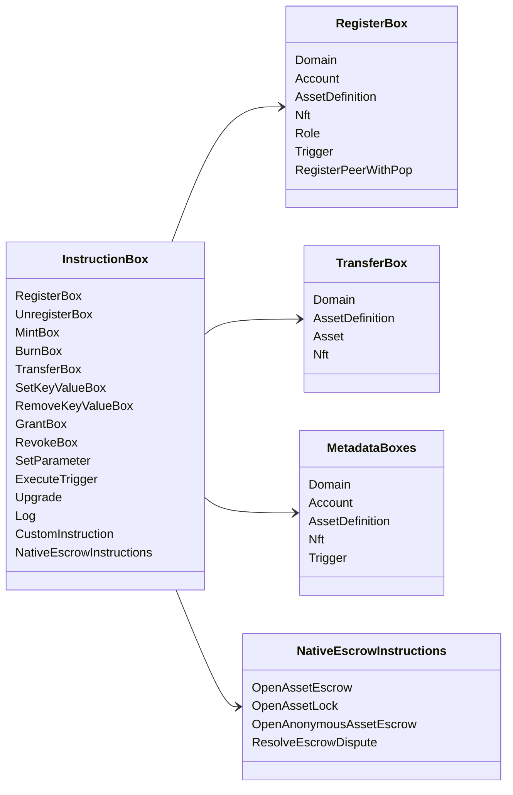

# Iroha 特別指示 {#iroha-special-instructions}

該資料模型揭示了這些內建的指令家庭:

| 指示時間 | 變體 |
| --- | --- |
| [`RegisterBox`](/zh-hant/blockchain/instructions.md#un-register) | `Domain`, `Account`, `AssetDefinition`, `Nft`, `Role`, `Trigger`, `RegisterPeerWithPop` |
| [`UnregisterBox`](/zh-hant/blockchain/instructions.md#un-register) | `Peer`, `Domain`, `Account`, `AssetDefinition`, `Nft`, `Role`, `Trigger` |
| [`MintBox`](/zh-hant/blockchain/instructions.md#mint-burn) | 數字化 `Asset`, 導致重複 |
| [`BurnBox`](/zh-hant/blockchain/instructions.md#mint-burn) | 數字化 `Asset`, 導致重複 |
| [`TransferBox`](/zh-hant/blockchain/instructions.md#transfer) | `Domain`, `AssetDefinition`, 數字化 `Asset`, `Nft` |
| [`SetKeyValueBox`](/zh-hant/blockchain/instructions.md#setkeyvalue-removekeyvalue) | `Domain`, `Account`, `AssetDefinition`, `Nft`, `Trigger` 數據 |
| [`RemoveKeyValueBox`](/zh-hant/blockchain/instructions.md#setkeyvalue-removekeyvalue) | `Domain`, `Account`, `AssetDefinition`, `Nft`, `Trigger` 數據 |
| [`GrantBox`](/zh-hant/blockchain/instructions.md#grant-revoke) | 帳號的許可,角色的許可 |
| [`RevokeBox`](/zh-hant/blockchain/instructions.md#grant-revoke) | 帳戶中的許可,帳戶中的角色,角色中的許可 |
| [`SetParameter`](/zh-hant/blockchain/instructions.md#setparameter) | 連鎖參數更新 |
| [`ExecuteTrigger`](/zh-hant/blockchain/instructions.md#executetrigger) | 導致執行 |
| [`Upgrade`](/zh-hant/blockchain/instructions.md#other-instructions) | 執行器升級 |
| [`Log`](/zh-hant/blockchain/instructions.md#other-instructions) | 執行程序日志入口 |
| [`CustomInstruction`](/zh-hant/blockchain/instructions.md#other-instructions) | 執行人特定 JSON 實用負荷 |
| [國家產品的保證](/zh-hant/blockchain/escrow.md) | `OpenAssetEscrow`, `AcceptAssetEscrow`, `MarkEscrowPaymentSent`, `ReleaseAssetEscrow`, `CancelAssetEscrow`, `OpenEscrowDispute`, `ResolveEscrowDispute` |
| [一般的資產鎖匙](/zh-hant/blockchain/escrow.md#generic-asset-locks) | `OpenAssetLock`, `DrawdownAssetLock`, `CancelAssetLock`, `ExpireAssetLock` |
| [匿名的資產保證](/zh-hant/blockchain/escrow.md#anonymous-escrow) | `OpenAnonymousAssetEscrow`, `AcceptAnonymousAssetEscrow`, `MarkAnonymousEscrowPaymentSent`, `ReleaseAnonymousAssetEscrow`, `CancelAnonymousAssetEscrow`, `OpenAnonymousEscrowDispute`, `ResolveAnonymousEscrowDispute` |

其他 Iroha 3 模組可能會記錄特定領域的指示類型
透過指令帳號.
目前的源樹,查看 [數據模型方案](./data-model-schema.md).

::: details 圖片:家庭基本教學

:::
