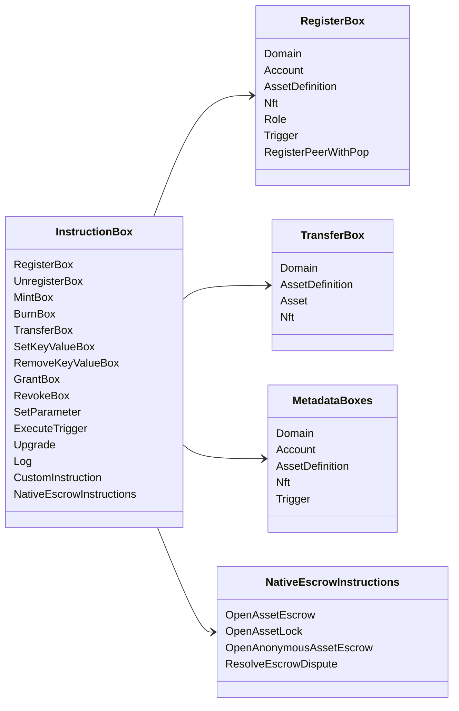

# Iroha 特殊指令 {#iroha-special-instructions}

目前的資料模型公開下列內建指令族群：

| 指令 | 變體 |
| --- | --- |
| [`RegisterBox`](/zh-hant/blockchain/instructions.md#un-register) | `Domain`, `Account`, `AssetDefinition`, `Nft`, `Role`, `Trigger`, `RegisterPeerWithPop` |
| [`UnregisterBox`](/zh-hant/blockchain/instructions.md#un-register) | `Peer`, `Domain`, `Account`, `AssetDefinition`, `Nft`, `Role`, `Trigger` |
| [`MintBox`](/zh-hant/blockchain/instructions.md#mint-burn) | 數值型 `Asset`、觸發器重複次數 |
| [`BurnBox`](/zh-hant/blockchain/instructions.md#mint-burn) | 數值型 `Asset`、觸發器重複次數 |
| [`TransferBox`](/zh-hant/blockchain/instructions.md#transfer) | `Domain`、`AssetDefinition`、數值型 `Asset`、`Nft` |
| [`SetKeyValueBox`](/zh-hant/blockchain/instructions.md#setkeyvalue-removekeyvalue) | `Domain`、`Account`、`AssetDefinition`、`Nft`、`Trigger` 中繼資料 |
| [`RemoveKeyValueBox`](/zh-hant/blockchain/instructions.md#setkeyvalue-removekeyvalue) | `Domain`、`Account`、`AssetDefinition`、`Nft`、`Trigger` 中繼資料 |
| [`GrantBox`](/zh-hant/blockchain/instructions.md#grant-revoke) | `Permission` (`Grant<Permission, Account>`), `Role` (`Grant<RoleId, Account>`), `RolePermission` (`Grant<Permission, Role>`) |
| [`RevokeBox`](/zh-hant/blockchain/instructions.md#grant-revoke) | `Permission` (`Revoke<Permission, Account>`), `Role` (`Revoke<RoleId, Account>`), `RolePermission` (`Revoke<Permission, Role>`) |
| [`SetParameter`](/zh-hant/blockchain/instructions.md#setparameter) | 更新鏈上引數 |
| [`ExecuteTrigger`](/zh-hant/blockchain/instructions.md#executetrigger) | 執行觸發器 |
| [`Upgrade`](/zh-hant/blockchain/instructions.md#other-instructions) | 升級執行器 |
| [`Log`](/zh-hant/blockchain/instructions.md#other-instructions) | 執行器日誌專案 |
| [`CustomInstruction`](/zh-hant/blockchain/instructions.md#other-instructions) | 執行器專用的 JSON 承載 |
| [原生資產託管](/zh-hant/blockchain/escrow.md) | `OpenAssetEscrow`, `AcceptAssetEscrow`, `MarkEscrowPaymentSent`, `ReleaseAssetEscrow`, `CancelAssetEscrow`, `OpenEscrowDispute`, `ResolveEscrowDispute` |
| [通用資產鎖定](/zh-hant/blockchain/escrow.md#generic-asset-locks) | `OpenAssetLock`, `DrawdownAssetLock`, `CancelAssetLock`, `ExpireAssetLock` |
| [匿名資產託管](/zh-hant/blockchain/escrow.md#anonymous-escrow) | `OpenAnonymousAssetEscrow`, `AcceptAnonymousAssetEscrow`, `MarkAnonymousEscrowPaymentSent`, `ReleaseAnonymousAssetEscrow`, `CancelAnonymousAssetEscrow`, `OpenAnonymousEscrowDispute`, `ResolveAnonymousEscrowDispute` |
| [原子私密結算](/zh-hant/blockchain/instructions.md#atomic-private-settlement) | `ActivatePrivateSettlementPoolV1`, `RotatePrivateSettlementPoolPolicyV1`, `FinalizeAtomicPrivateSettlementV1`, `AbortAtomicPrivateSettlementV1` |

其他 Iroha 3 模組可透過指令登入檔註冊特定領域的指令型別。 如需節點提供的結構描述及用於儲存它的命令，請參閱[資料模型結構描述](./data-model-schema.md)。

::: details 圖表：核心指令族群

:::
